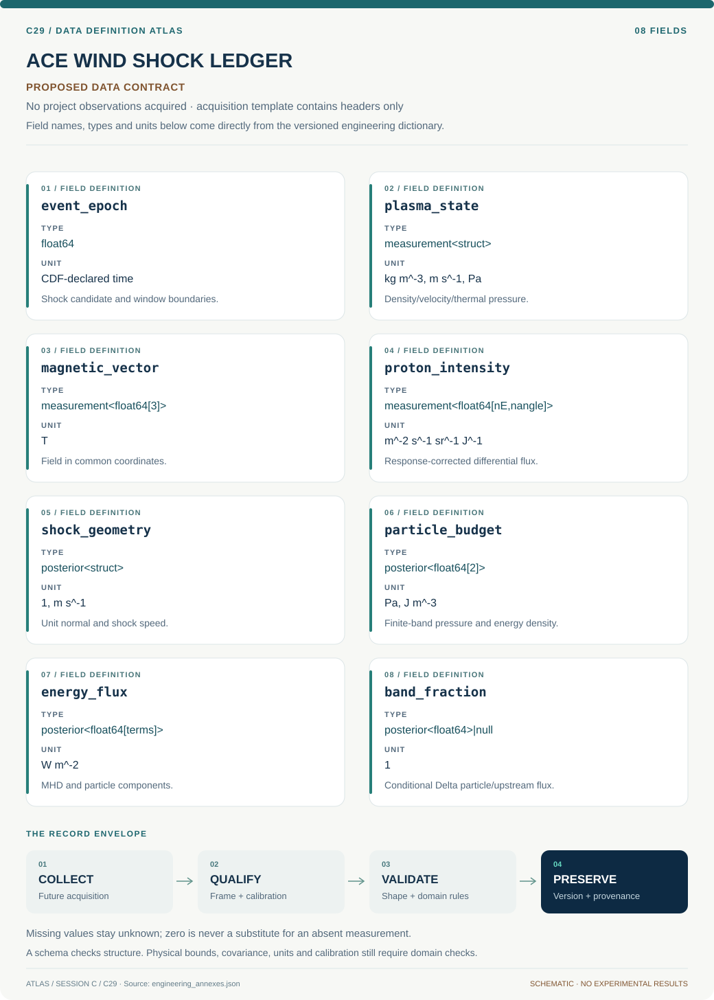

# C29 · Figure gallery

[ACE WIND SHOCK LEDGER](../README.md) · [Data blueprint](../data/README.md) · [Data diagnostic gallery](../../../../data/figures/README.md)

## Engineering architecture

Response-aware partial particle integrals enter a common shock-frame ledger with explicit unknown transport and residual energy terms.

[SVG](architecture.svg) · [Editable Mermaid source](architecture.mmd)

## Data blueprint

**Proposed contract · observations pending.** Every field, type, unit and meaning comes from the controlled dictionary. [Open SVG](data-map.svg) · [Download dictionary](../data/dictionary.csv)

## Planned scientific result

Upstream/downstream flux-budget bars with unresolved bands, particle spectra and integration limits, and uncertainty-aware Mach/obliquity comparisons.

This final scientific result remains an execution deliverable; the design diagrams do not establish an empirical finding.
