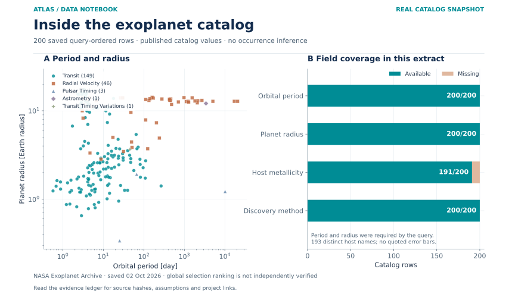

# Session C · Astronomy & Space Physics

[Continuous handbook](../../handbooks/SESSION_C.md) · [All sessions](../README.md) · [Data atlas](../../data/README.md)

**30 projects · 229 defined fields · 153 proposed requirements · 120 specified cases.** All projects retain their supplied order. Data maps describe proposed acquisition, while included numerical plots carry their own evidence labels.

| ID | Mission profile & engineering record | Original investigation | Explore |
| --- | --- | --- | --- |
| C01 | [APOLLO WINDWATCH](C01-apollo-windwatch/README.md) | The Characterization of EZ CMa | [Profile](C01-apollo-windwatch/figures/mission-profile.svg) · [Data](C01-apollo-windwatch/data/README.md) · [Figures](C01-apollo-windwatch/figures/README.md) |
| C02 | [HUBBLE NIGHTFALL LAB](C02-hubble-nightfall-lab/README.md) | Image Simulations for Testing the Fidelity of SKYSURF Background Measurement Algorithms | [Profile](C02-hubble-nightfall-lab/figures/mission-profile.svg) · [Data](C02-hubble-nightfall-lab/data/README.md) · [Figures](C02-hubble-nightfall-lab/figures/README.md) |
| C03 | [TAURUS MOLECULE TRAIL](C03-taurus-molecule-trail/README.md) | HCN Mapping of the Taurus Molecular Cloud | [Profile](C03-taurus-molecule-trail/figures/mission-profile.svg) · [Data](C03-taurus-molecule-trail/data/README.md) · [Figures](C03-taurus-molecule-trail/figures/README.md) |
| C04 | [HORIZON TIDAL ECHO](C04-horizon-tidal-echo/README.md) | A Deep Look at the Nature of Black Holes: Using Tidal Disruption Events to See the Unseeable | [Profile](C04-horizon-tidal-echo/figures/mission-profile.svg) · [Data](C04-horizon-tidal-echo/data/README.md) · [Figures](C04-horizon-tidal-echo/figures/README.md) |
| C05 | [KEPLER WORLDFORGE](C05-kepler-worldforge/README.md) | Exoplanet Classification using Data Mining | [Profile](C05-kepler-worldforge/figures/mission-profile.svg) · [Data](C05-kepler-worldforge/data/README.md) · [Figures](C05-kepler-worldforge/figures/README.md) |
| C06 | [PULSAR GEMINI WATCH](C06-pulsar-gemini-watch/README.md) | The First Magnetar in a Binary System? | [Profile](C06-pulsar-gemini-watch/figures/mission-profile.svg) · [Data](C06-pulsar-gemini-watch/data/README.md) · [Figures](C06-pulsar-gemini-watch/figures/README.md) |
| C07 | [ARTEMIS MEMORY BRIDGE](C07-artemis-memory-bridge/README.md) | Taperings and Analytic Continuations of Supernova Gravitational Waves with Memory | [Profile](C07-artemis-memory-bridge/figures/mission-profile.svg) · [Data](C07-artemis-memory-bridge/data/README.md) · [Figures](C07-artemis-memory-bridge/figures/README.md) |
| C08 | [MARS NILI SPECTRAL VAULT](C08-mars-nili-spectral-vault/README.md) | Laboratory Analysis of olivine-carbonate mixtures as observed on Mars | [Profile](C08-mars-nili-spectral-vault/figures/mission-profile.svg) · [Data](C08-mars-nili-spectral-vault/data/README.md) · [Figures](C08-mars-nili-spectral-vault/figures/README.md) |
| C09 | [EAGLESAT COSMIC PIXEL](C09-eaglesat-cosmic-pixel/README.md) | EagleSat Team: Determining Particle Energy Using CMOS Sensors | [Profile](C09-eaglesat-cosmic-pixel/figures/mission-profile.svg) · [Data](C09-eaglesat-cosmic-pixel/data/README.md) · [Figures](C09-eaglesat-cosmic-pixel/figures/README.md) |
| C10 | [VOYAGER LOCAL GROUP HALOS](C10-voyager-local-group-halos/README.md) | MW-Andromeda Dark Matter Halo Velocity Dispersion Profiles | [Profile](C10-voyager-local-group-halos/figures/mission-profile.svg) · [Data](C10-voyager-local-group-halos/data/README.md) · [Figures](C10-voyager-local-group-halos/figures/README.md) |
| C11 | [ORION CORE INFERENCE](C11-orion-core-inference/README.md) | Evaluation of Supernovae Astrophysical Parameters by Using Machine Learning on Laser Interferometric Data | [Profile](C11-orion-core-inference/figures/mission-profile.svg) · [Data](C11-orion-core-inference/data/README.md) · [Figures](C11-orion-core-inference/figures/README.md) |
| C12 | [HUBBLE COSMIC GLOW](C12-hubble-cosmic-glow/README.md) | SKYSURF: Measuring the Brightness of the Sky | [Profile](C12-hubble-cosmic-glow/figures/mission-profile.svg) · [Data](C12-hubble-cosmic-glow/data/README.md) · [Figures](C12-hubble-cosmic-glow/figures/README.md) |
| C13 | [HORIZON RING ATLAS](C13-horizon-ring-atlas/README.md) | Characterizing the Images of Black Hole Shadows | [Profile](C13-horizon-ring-atlas/figures/mission-profile.svg) · [Data](C13-horizon-ring-atlas/data/README.md) · [Figures](C13-horizon-ring-atlas/figures/README.md) |
| C14 | [ROMAN DARKHOLE ACADEMY](C14-roman-darkhole-academy/README.md) | Controlling the Unseen: GIG Undergraduate Optical Research | [Profile](C14-roman-darkhole-academy/figures/mission-profile.svg) · [Data](C14-roman-darkhole-academy/data/README.md) · [Figures](C14-roman-darkhole-academy/figures/README.md) |
| C15 | [WEBB PHOTON TRUTH](C15-webb-photon-truth/README.md) | Assessing the Performance of the JWST/NIRCam Image Simulator PhoSim-NIRCam | [Profile](C15-webb-photon-truth/figures/mission-profile.svg) · [Data](C15-webb-photon-truth/data/README.md) · [Figures](C15-webb-photon-truth/figures/README.md) |
| C16 | [ORION STRAIN METROLOGY](C16-orion-strain-metrology/README.md) | Gravitational Wave Calibration Error for Supernovae Core Collapse | [Profile](C16-orion-strain-metrology/figures/mission-profile.svg) · [Data](C16-orion-strain-metrology/data/README.md) · [Figures](C16-orion-strain-metrology/figures/README.md) |
| C17 | [GEMINI DISK SENTINEL](C17-gemini-disk-sentinel/README.md) | Investigating the Planet Detection Limit in Debris Disk Images from the Gemini Planet Imager | [Profile](C17-gemini-disk-sentinel/figures/mission-profile.svg) · [Data](C17-gemini-disk-sentinel/data/README.md) · [Figures](C17-gemini-disk-sentinel/figures/README.md) |
| C18 | [REIONIZATION OXYGEN BEACON](C18-reionization-oxygen-beacon/README.md) | Characterizing High [OIII]/[OII] and High [OIII] Galaxies to Further LyC Study | [Profile](C18-reionization-oxygen-beacon/figures/mission-profile.svg) · [Data](C18-reionization-oxygen-beacon/data/README.md) · [Figures](C18-reionization-oxygen-beacon/figures/README.md) |
| C19 | [WEBB YOUNG STAR ATMOSPHERES](C19-webb-young-star-atmospheres/README.md) | Characterizing the Atmospheres of Low Surface Gravity M-dwarfs | [Profile](C19-webb-young-star-atmospheres/figures/mission-profile.svg) · [Data](C19-webb-young-star-atmospheres/data/README.md) · [Figures](C19-webb-young-star-atmospheres/figures/README.md) |
| C20 | [TRINITY ACCRETION ECHO](C20-trinity-accretion-echo/README.md) | Predictions for the Observable Autocorrelations of Accreting Black Holes from the Trinity Theoretical Model | [Profile](C20-trinity-accretion-echo/figures/mission-profile.svg) · [Data](C20-trinity-accretion-echo/data/README.md) · [Figures](C20-trinity-accretion-echo/figures/README.md) |
| C21 | [PARKER MAGNETIC TRAIL](C21-parker-magnetic-trail/README.md) | Identification of Switchback Intervals in Parker Space Probe Data | [Profile](C21-parker-magnetic-trail/figures/mission-profile.svg) · [Data](C21-parker-magnetic-trail/data/README.md) · [Figures](C21-parker-magnetic-trail/figures/README.md) |
| C22 | [HUBBLE GALACTIC EXHALE](C22-hubble-galactic-exhale/README.md) | Measuring Galactic Wind Frequency and Strength as a Function of Environment | [Profile](C22-hubble-galactic-exhale/figures/mission-profile.svg) · [Data](C22-hubble-galactic-exhale/data/README.md) · [Figures](C22-hubble-galactic-exhale/figures/README.md) |
| C23 | [KEPLER METAL WORLDS](C23-kepler-metal-worlds/README.md) | Investigating the Relationship Between Exoplanet Occurrence & Host Star Metallicity | [Profile](C23-kepler-metal-worlds/figures/mission-profile.svg) · [Data](C23-kepler-metal-worlds/data/README.md) · [Figures](C23-kepler-metal-worlds/figures/README.md) |
| C24 | [APOLLO DUST CLOCK](C24-apollo-dust-clock/README.md) | The long-period orbit of the dust-producing Wolf-Rayet binary WR 125 | [Profile](C24-apollo-dust-clock/figures/mission-profile.svg) · [Data](C24-apollo-dust-clock/data/README.md) · [Figures](C24-apollo-dust-clock/figures/README.md) |
| C25 | [ORION BURST SENTINEL](C25-orion-burst-sentinel/README.md) | Improving the Detection of Core-Collapse Supernova Through Experimentation | [Profile](C25-orion-burst-sentinel/figures/mission-profile.svg) · [Data](C25-orion-burst-sentinel/data/README.md) · [Figures](C25-orion-burst-sentinel/figures/README.md) |
| C26 | [LISA PENDULUM PATHFINDER](C26-lisa-pendulum-pathfinder/README.md) | Low Frequency Prototype of Laser Interferometer Suspensions for Gravitational Wave Detection | [Profile](C26-lisa-pendulum-pathfinder/figures/mission-profile.svg) · [Data](C26-lisa-pendulum-pathfinder/data/README.md) · [Figures](C26-lisa-pendulum-pathfinder/figures/README.md) |
| C27 | [SPHEREX COSMIC PRISM](C27-spherex-cosmic-prism/README.md) | SPHEREx: The Future of Satellite Astronomy | [Profile](C27-spherex-cosmic-prism/figures/mission-profile.svg) · [Data](C27-spherex-cosmic-prism/data/README.md) · [Figures](C27-spherex-cosmic-prism/figures/README.md) |
| C28 | [LOWELL LUNAR LANTERN](C28-lowell-lunar-lantern/README.md) | Narrow-band Filter Photometry Calibration for the Lowell 20'' | [Profile](C28-lowell-lunar-lantern/figures/mission-profile.svg) · [Data](C28-lowell-lunar-lantern/data/README.md) · [Figures](C28-lowell-lunar-lantern/figures/README.md) |
| C29 | [ACE WIND SHOCK LEDGER](C29-ace-wind-shock-ledger/README.md) | Energy Balance at Interplanetary Shocks: In-situ Measurement of the Fraction in Energetic Protons with ACE and Wind | [Profile](C29-ace-wind-shock-ledger/figures/mission-profile.svg) · [Data](C29-ace-wind-shock-ledger/data/README.md) · [Figures](C29-ace-wind-shock-ledger/figures/README.md) |
| C30 | [ARTEMIS FIRST HORIZONS](C30-artemis-first-horizons/README.md) | The Origins of Supermassive Black Holes | [Profile](C30-artemis-first-horizons/figures/mission-profile.svg) · [Data](C30-artemis-first-horizons/data/README.md) · [Figures](C30-artemis-first-horizons/figures/README.md) |

## Visual field guide

### C05 · KEPLER WORLDFORGE

Real NASA Exoplanet Archive 200-row saved, query-ordered extract of rows with period and radius. The recorded request uses TOP 200 and ORDER BY pl_name; global first-200 ranking was not independently verified. Panel A preserves discovery-method categories and logarithmic scales; panel B makes the selected fields and nine missing host-metallicity values visible. This extract is not representative and cannot establish occurrence rates or physical class labels.

### C08 · MARS NILI SPECTRAL VAULT

Synthetic spectral-mixture estimator distributions under the same known band-noise level. Separated endmembers give narrow noise-driven fraction estimates; near-identical endmembers give a broad unconstrained distribution with unphysical values preserved as an identifiability diagnostic. Central 95% noise-realization intervals are descriptive simulation intervals, not posteriors or uncertainty bounds for measured Mars mineral abundance.

### C23 · KEPLER METAL WORLDS

Real NASA Exoplanet Archive 200-row saved, query-ordered extract of rows with period and radius. The recorded request uses TOP 200 and ORDER BY pl_name; global first-200 ranking was not independently verified. Panel A preserves discovery-method categories and logarithmic scales; panel B makes the selected fields and nine missing host-metallicity values visible. This extract is not representative and cannot establish occurrence rates or physical class labels.

## Mission profile spotlight

[Enter C01 engineering dossier](C01-apollo-windwatch/README.md) · [Mission control: every profile and reading path](../../MISSION_CONTROL.md)
