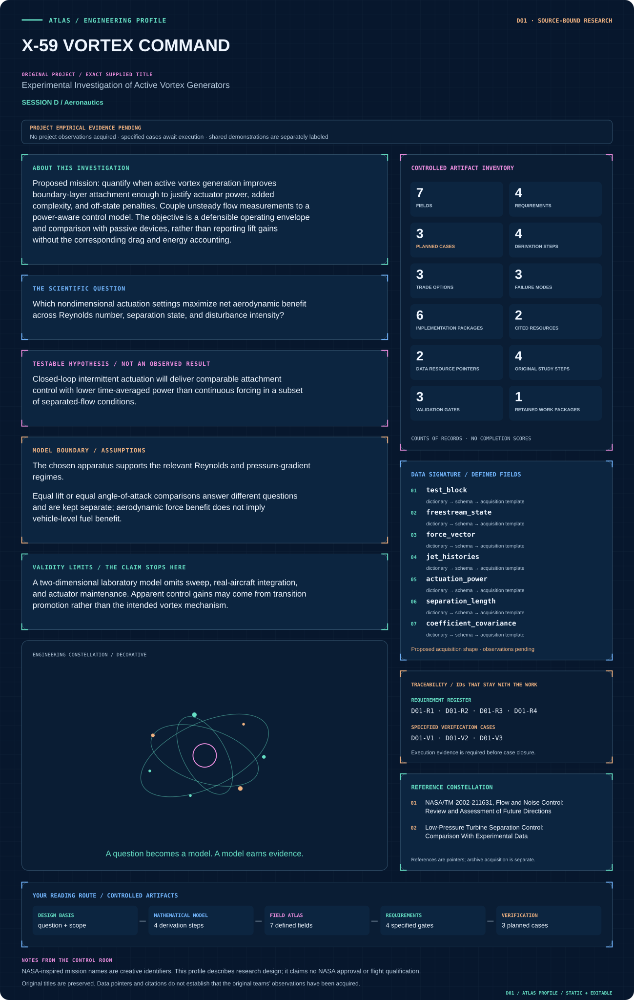

# D01 · X-59 VORTEX COMMAND

**Original project:** Experimental Investigation of Active Vortex Generators

**Session D:** Aeronautics

**Document class:** engineering research design and analysis record · **Revision:** 4 · **Date:** 2026-10-02

**Evidence state:** design basis, mathematical formulation and verification plan documented. Project-specific empirical results remain to be acquired; executable shared model demonstrations have their own recorded checks.

[Session D](../README.md) · [All projects](../../../ENGINEERING_DOCUMENTATION.md) · [Session handbook](../../../handbooks/SESSION_D.md) · [← C30](../../C/C30-artemis-first-horizons/README.md) · [D02 →](../D02-langley-stall-memory/README.md)

| Proposed requirements | Specified verification cases | Defined data fields | Cited resources |
| ---: | ---: | ---: | ---: |
| 4 | 3 | 7 | 2 |

[Explore the data blueprint](data/README.md) · [Open the figure gallery](figures/README.md) · [Download acquisition template](data/acquisition.csv) · [Browse the data atlas](../../../data/README.md)

---

## Mission profile



| Profile panel | Engineering signal | Open the evidence |
| --- | --- | --- |
| Mission identity | Experimental Investigation of Active Vortex Generators | [Scientific objective](#purpose-and-scientific-objective) |
| Model cockpit | 4 governing expressions; 4 derivation steps; declared assumptions and validity envelope | [Mathematical formulation](#4-mathematical-model-and-derivation) |
| Data blueprint | 7 proposed fields with types, units and quality rules | [Field map & downloads](data/README.md) |
| Verification queue | 4 proposed requirements; 3 specified cases; project execution evidence pending | [Case definitions](#8-verification-and-validation-cases) |
| Figure wall | Architecture, field map, planned result description | [Open full gallery](figures/README.md) |
| Resource library | 2 cited primary resources with support statements | [Cited resources](#12-cited-technical-and-scientific-resources) |

### Model cockpit

**Analysis method:** Establish a repeated no-control baseline and matched passive-vortex-generator comparison. Use a randomized, blocked design to separate actuation settings from tunnel drift. Measure forces, pressure distributions, and velocity/vorticity fields, then fit a reduced-order response model with uncertainty. Develop a simple attachment-state controller on the validated operating region and assess sensitivity to sensor noise and delayed response.

**Operating envelope:** A two-dimensional laboratory model omits sweep, real-aircraft integration, and actuator maintenance. Apparent control gains may come from transition promotion rather than the intended vortex mechanism.

**Variables and conventions**

- Actuation frequency, duty cycle, amplitude, jet orientation, sensor latency, and separation location.
- Freestream speed, density, viscosity, turbulence intensity, force-balance uncertainty, pressure, and actuator electrical/pneumatic power.

### Artifact wall


Momentum, aerodynamic diagnostics and supply power join only at matched operating conditions. The control branch carries delay explicitly; vehicle fuel savings are beyond this laboratory ledger.

**Scientific result to produce:** Velocity/vorticity snapshots show baseline and controlled attachment; a frequency–duty-cycle map overlays net power gain with measurement uncertainty.

### Investigation feed · planned work

The feed records proposed work packages. A row becomes executed evidence only with versioned inputs, outputs and a reviewed result.

| Sequence | Evidence state | Engineering work package |
| --- | --- | --- |
| 01 | Planned | Create tunnel_condition.yaml and force_axes.json. |
| 02 | Planned | Build pulse_momentum.py with constant/duty-cycle fixtures. |
| 03 | Planned | Implement force_power_ledger.py with paired covariance. |
| 04 | Planned | Create separation_diagnostics.py and blocked_response_model.py. |
| 05 | Planned | Build controller_replay.py with delay, noise and saturation. |
| 06 | Planned | Publish net_trade.parquet and a configuration-specific validation matrix. |

### Mission connections

Connections are reading routes based on actual shared resources, supplied sessions or included illustrations. They do not establish physical dependencies, team collaborations or validated results.

| Connected mission | Original investigation | Recorded connection basis |
| --- | --- | --- |
| [D02 · LANGLEY STALL MEMORY](../D02-langley-stall-memory/README.md) | Stall Hysteresis: Why the reattachment angle is less than the separation stall angle | Session D |
| [D03 · INGENUITY DESCENT & BUBBLE LAB](../D03-ingenuity-descent-bubble-lab/README.md) | Optimizing Autorotating Sensor Probe Design for Space Exploration- Low Frequency Unsteadiness in Laminar Separation Bubbles | Session D |
| [D04 · GLENN SPHERE STANDARD](../D04-glenn-sphere-standard/README.md) | Validating a New CFD Algorithm by Finding the Drag Coefficient of a Sphere | Session D |
| [D05 · APOLLO CYBER FLIGHT DECK](../D05-apollo-cyber-flight-deck/README.md) | CIS Aviation-ISAC | Session D |
| [D06 · LANGLEY MACH ATLAS](../D06-langley-mach-atlas/README.md) | Characterization of a Hypersonic Wind Tunnel Nozzle | Session D |
| [D07 · ARES DUAL-WORLD SCOUT](../D07-ares-dual-world-scout/README.md) | Suborbital Uncrewed Aerial Vehicles for Earth Surveillance and Mars Exploration | Session D |

[Machine-readable connection register and ranking rule](../../../registry/mission_connections.json)

### Reading playlist

| Route | Start here | Continue to |
| --- | --- | --- |
| Understand the idea | [Scientific objective](#purpose-and-scientific-objective) | [Design boundary](#1-design-basis-and-analysis-boundary) → [Mathematics](#4-mathematical-model-and-derivation) |
| Inspect the data | [Visual blueprint](data/README.md) | [Provenance](#5-data-specifications-and-provenance) → [Uncertainty](#6-uncertainty-sensitivity-and-identifiability) |
| Make a design decision | [Trade study](#7-engineering-trade-study) | [Failure modes](#10-failure-modes-and-interpretation-controls) → [Required outputs](#11-required-engineering-outputs) |
| Prepare execution | [Requirements](#2-requirements-and-verification-traceability) | [Verification](#8-verification-and-validation-cases) → [Implementation](#9-implementation-and-reproducible-work-packages) |

## Complete engineering dossier

The profile above is a browsing layer. The full design basis, equations, derivations, data contract, uncertainty, trades and controlled case definitions follow.

## Purpose and scientific objective

Proposed mission: quantify when active vortex generation improves boundary-layer attachment enough to justify actuator power, added complexity, and off-state penalties. Couple unsteady flow measurements to a power-aware control model. The objective is a defensible operating envelope and comparison with passive devices, rather than reporting lift gains without the corresponding drag and energy accounting.

**Question:** Which nondimensional actuation settings maximize net aerodynamic benefit across Reynolds number, separation state, and disturbance intensity?

**Testable hypothesis:** Closed-loop intermittent actuation will deliver comparable attachment control with lower time-averaged power than continuous forcing in a subset of separated-flow conditions.

## 1. Design basis and analysis boundary

The test system compares baseline, passive vortex generators and active actuation at a declared useful aerodynamic condition. Its boundary includes tunnel inflow, airfoil/model surface, actuation supply, force/pressure measurements and control latency. Net benefit includes measured auxiliary power; force reduction alone is not a vehicle fuel-savings result.

Begin with repeated unactuated baselines and randomized blocked settings. A reduced response surface is calibrated only within the measured Reynolds number, turbulence and separation range. Add a closed-loop attachment controller after open-loop mechanism evidence, because transition promotion, jet momentum and vortex transport can produce different apparent gains.

## 2. Requirements and verification traceability

These are project design requirements or proposed analysis gates. A numerical target is not a NASA requirement unless its controlling source is explicitly identified. “TBD” identifies evidence required before a decision; it is not permission to assume a value. Verification evidence listed here is planned, unless a linked result explicitly records execution.

| ID | Requirement / gate | Engineering rationale | Verification method | Basis / required evidence |
| --- | --- | --- | --- | --- |
| D01-R1 | Report equal-lift and equal-angle comparisons separately with native force uncertainty. | Different operating constraints change drag benefit. | Check matched-condition ledgers and interpolate only within supported range. | Aerodynamic comparison contract. |
| D01-R2 | Jet momentum shall be time-averaged over the actual pulse cycle. | Duty cycle changes C_mu even at equal peak speed. | Integrate measured mass flow times jet velocity. | Dimensionless momentum definition. |
| D01-R3 | Proposed net-benefit gate: lower uncertainty bound of U Delta D minus actuation/auxiliary power exceeds zero. | Control may spend more power than it saves. | Joint force/power propagation at a declared condition. | Proposed engineering criterion; no gain claimed. |
| D01-R4 | Controller evaluation shall include sensor delay and withheld disturbance conditions. | A response surface optimum is not a robust controller. | Replay logged delay/noise and held-out blocks. | Proposed closed-loop verification gate. |

## 3. Architecture and controlled interfaces

The tunnel-state interface supplies density, viscosity, speed and turbulence metadata. A pulse adapter records mass-flow and velocity histories, electrical/pneumatic power and time alignment. Forces use wind axes, with positive drag resisting flow and lift normal to it; balance tare and model reference area are configuration controlled.

Pressure/velocity diagnostics estimate separation and vorticity separately from integrated forces. A blocked statistical model predicts coefficients and actuation power. The controller consumes a validated attachment indicator and emits bounded actuation requests to a simulator or authorized apparatus interface; out-of-domain conditions bypass optimization and preserve raw measurements.


Momentum, aerodynamic diagnostics and supply power join only at matched operating conditions. The control branch carries delay explicitly; vehicle fuel savings are beyond this laboratory ledger.

[Editable engineering diagram source](figures/architecture.mmd)

## 4. Mathematical model and derivation

### Governing equations

```text
Re_c=rho U_inf c/mu; C_L=L/(0.5 rho U_inf^2 S); C_D=D/(0.5 rho U_inf^2 S).
```

```text
C_mu=dot(m)_jet U_jet/(0.5 rho U_inf^2 S), with pulsed mass flow explicitly time-averaged.
```

```text
F_plus=f_act L_sep/U_inf, using a declared separation-length definition.
```

```text
Delta P_net=U_inf(D_baseline-D_control)-P_act-P_aux for a drag-reduction comparison at equal useful condition.
```

### Variables, units and conventions

- Actuation frequency, duty cycle, amplitude, jet orientation, sensor latency, and separation location.
- Freestream speed, density, viscosity, turbulence intensity, force-balance uncertainty, pressure, and actuator electrical/pneumatic power.

### Assumptions and boundary conditions

- The chosen apparatus supports the relevant Reynolds and pressure-gradient regimes.
- Equal lift or equal angle-of-attack comparisons answer different questions and are kept separate; aerodynamic force benefit does not imply vehicle-level fuel benefit.

### Derivation step 1

$$
q_\infty=\rho U^2/2;\quad C_D=D/(q_\infty S)
$$

Dynamic pressure is Pa and qS is N. Reynolds number rho U c/mu and lift coefficient use the same declared chord and reference area.

### Derivation step 2

$$
C_\mu=\langle\dot m_jU_j\rangle/(q_\infty S)
$$

The numerator is N. For pulsed jets average the product, not the product of separately averaged flow and speed; include multiple ports consistently.

### Derivation step 3

```text
F^+=f_{act}L_{sep}/U
```

Choose whether L_sep is baseline or controlled separation length and retain that choice. Frequency nondimensionalization does not establish identical mechanisms across different geometries.

### Derivation step 4

$$
\Delta P=U(D_0-D_c)-P_{act}-P_{aux}
$$

At equal useful condition the drag power reduction has W units. Propagate covariance of paired baseline/control forces and shared U before applying the positive-benefit criterion.

### Inference or simulation procedure

Establish a repeated no-control baseline and matched passive-vortex-generator comparison. Use a randomized, blocked design to separate actuation settings from tunnel drift. Measure forces, pressure distributions, and velocity/vorticity fields, then fit a reduced-order response model with uncertainty. Develop a simple attachment-state controller on the validated operating region and assess sensitivity to sensor noise and delayed response.

### Validity domain and fidelity limits

A two-dimensional laboratory model omits sweep, real-aircraft integration, and actuator maintenance. Apparent control gains may come from transition promotion rather than the intended vortex mechanism.

## 5. Data specifications and provenance


**Proposed data contract · observations pending.** This visual inventory shows the record fields to acquire or derive. It contains no project measurements. [Open the data blueprint and downloads](data/README.md).

| Field | Type | Unit | Physical / statistical meaning | Quality and missing-data rule |
| --- | --- | --- | --- | --- |
| test_block | string | 1 | Randomized run block and condition. | Baseline repeats and sequence retained. |
| freestream_state | record | kg/m^3,m/s,Pa s | Density, speed and viscosity. | Calibration covariance and timestamps required. |
| force_vector | vector<float64> | N | Tared wind-axis loads. | Axis convention and reference area required. |
| jet_histories | array<time,flow,speed> | s,kg/s,m/s | Pulse-resolved momentum inputs. | Synchronized; missing pulse sample flagged. |
| actuation_power | nullable<float64> | W | Electrical/pneumatic equivalent input. | Boundary and conversion efficiency declared. |
| separation_length | nullable<float64> | m | Diagnostic bubble/separation extent. | Observable definition and error required. |
| coefficient_covariance | matrix<float64> | 1 | Joint lift/drag uncertainty. | Shared tare/inflow terms retained. |

[Machine-readable record schema](data/schema.json) · [Empty acquisition CSV](data/acquisition.csv) · [Field dictionary CSV](data/dictionary.csv)

The CSV above contains column headers only. Its schema defines future records and does not establish that original-team data or a particular archive product have been acquired. Frame, timing, calibration, covariance, selection and provenance details must accompany populated records.

### NASA active-vortex/separation-control report

[Product, archive or reference](https://ntrs.nasa.gov/api/citations/20020045525/downloads/20020045525.pdf)

**Fields:** Active vortex-generator concepts and pulsed streamwise-vortex mechanisms.

**Access:** Public PDF located through NASA search; citation-page fetch was blocked, so use document provenance and PDF metadata.

**Role:** Physical mechanism and comparison taxonomy.

### NASA low-pressure turbine separation-control research

[Product, archive or reference](https://ntrs.nasa.gov/archive/nasa/casi.ntrs.nasa.gov/20020070525.pdf)

**Fields:** VGJ computational/experimental comparison and low-Reynolds separated-flow response.

**Access:** Public research PDF; original field data may not be machine readable.

**Role:** Benchmark for boundary-layer response.

## 6. Uncertainty, sensitivity and identifiability

Balance calibration, tunnel drift, inflow turbulence, jet momentum and power conversion can correlate across paired runs. Pressure integration and balance force estimates are complementary but not fully independent. Unmodeled transition changes or three-dimensional end effects create discrepancy between a laboratory coefficient and aircraft-scale performance.

Use blocked randomization and paired covariance to prevent tunnel drift from becoming an actuation effect. Compare force gains to separation/vorticity evidence and test withheld Reynolds/turbulence conditions. Sensitivity to delay and actuator saturation determines whether a controller stays within the calibrated envelope; an out-of-domain gain remains an unvalidated prediction.

## 7. Engineering trade study

| Alternative | Benefit | Cost / limitation | Decision rule |
| --- | --- | --- | --- |
| Passive generators | Simple and low auxiliary power. | Fixed drag penalty off design. | Baseline at identical useful condition. |
| Open-loop pulsed jets | Controlled frequency/amplitude. | Power and parameter sensitivity. | Use if net-benefit gate holds over supported conditions. |
| Attachment-state feedback | Adapts to disturbances. | Sensor delay and controller faults. | Add after indicator and replay validation. |

## 8. Verification and validation cases

| Case ID | Stimulus / condition | Expected result / criterion | Method | Evidence artifact |
| --- | --- | --- | --- | --- |
| D01-V1 | Actuation-off limit | C_mu=0 and zero auxiliary input reproduce baseline configuration. | Disable actuator and compare repeated blocked runs. | Boundary-condition identity. |
| D01-V2 | Constant jet fixture | Constant flow/speed gives analytic C_mu; pulsed product averaging matches quadrature. | Synthetic pulse trace test. | Momentum units and integration. |
| D01-V3 | Net-power ledger | Equal drag with positive actuator power gives negative net benefit. | Analytic fixture plus paired uncertainty calculation. | Power accounting; actual sign TBD. |

**Execution status:** these cases are specified, not claimed as executed. Close a case only with the versioned inputs, output, uncertainty, reviewer and pass/fail rationale.

### Additional scientific validation gates

- Calibrate force and pressure sensors and estimate blockage, wall, and zero-drift corrections.
- Require repeated baseline recovery and statistically resolved differences under matched lift/flow conditions.
- Check whether velocity fields exhibit the hypothesized streamwise vortices and near-wall momentum transfer; quantify spectral response and control latency.

## 9. Implementation and reproducible work packages

1. Create tunnel_condition.yaml and force_axes.json.
2. Build pulse_momentum.py with constant/duty-cycle fixtures.
3. Implement force_power_ledger.py with paired covariance.
4. Create separation_diagnostics.py and blocked_response_model.py.
5. Build controller_replay.py with delay, noise and saturation.
6. Publish net_trade.parquet and a configuration-specific validation matrix.

### Investigation sequence

1. Define proposed attachment, drag, actuator-power, and off-state requirements.
2. Design a factor matrix covering separation intensity, forcing frequency, amplitude, and duty cycle with repeats.
3. Measure independent aerodynamic and actuator power channels under synchronized timestamps.
4. Compare open-loop and feedback policies on held-out conditions; publish the cases with no net benefit.

### Resources and interfaces to expertise

- Wind tunnel, qualified flow-control laboratory, force/pressure instrumentation, velocity-field metrology, and actuator power logging.

## 10. Failure modes and interpretation controls

| Failure mode | Effect on result | Detection / evidence | Design response |
| --- | --- | --- | --- |
| Peak flow used as mean | Overstated actuation strength. | Pulse integral discrepancy. | Record resolved momentum product. |
| Tunnel drift confounded | False drag reduction. | Baseline sequence dependence. | Randomized blocked comparisons. |
| Latency destabilizes feedback | Intermittent separation/control oscillation. | Delay-aware replay and state spectra. | Bound controller bandwidth and retain safe bypass. |

- Ignoring supply-power efficiency can make ineffective actuation appear beneficial.
- Tunnel drift, transition sensitivity, and wall effects can dominate small force differences.

## 11. Required engineering outputs

- Control-response dataset, net-power trade map, uncertainty budget, controller specification, and synchronized flow visualizations.

### Scientific result figures to produce during execution

Velocity/vorticity snapshots show baseline and controlled attachment; a frequency–duty-cycle map overlays net power gain with measurement uncertainty.

## 12. Cited technical and scientific resources

- [NASA/TM-2002-211631, Flow and Noise Control: Review and Assessment of Future Directions](https://ntrs.nasa.gov/api/citations/20020045525/downloads/20020045525.pdf) — NASA research discussion of active/pulsed vortex generation.
- [Low-Pressure Turbine Separation Control: Comparison With Experimental Data](https://ntrs.nasa.gov/archive/nasa/casi.ntrs.nasa.gov/20020070525.pdf) — Original computational treatment of vortex-generator jets in separated low-Reynolds flow.

Framework and evidence rules: [engineering documentation standard](../../../engineering/ENGINEERING_STANDARD.md), [model assurance](../../../engineering/MODEL_ASSURANCE.md), [uncertainty procedure](../../../engineering/UNCERTAINTY_AND_DECISION_RULES.md), [data management](../../../engineering/DATA_MANAGEMENT.md). NASA-inspired names are creative identifiers; requirements and results are not NASA certification.
