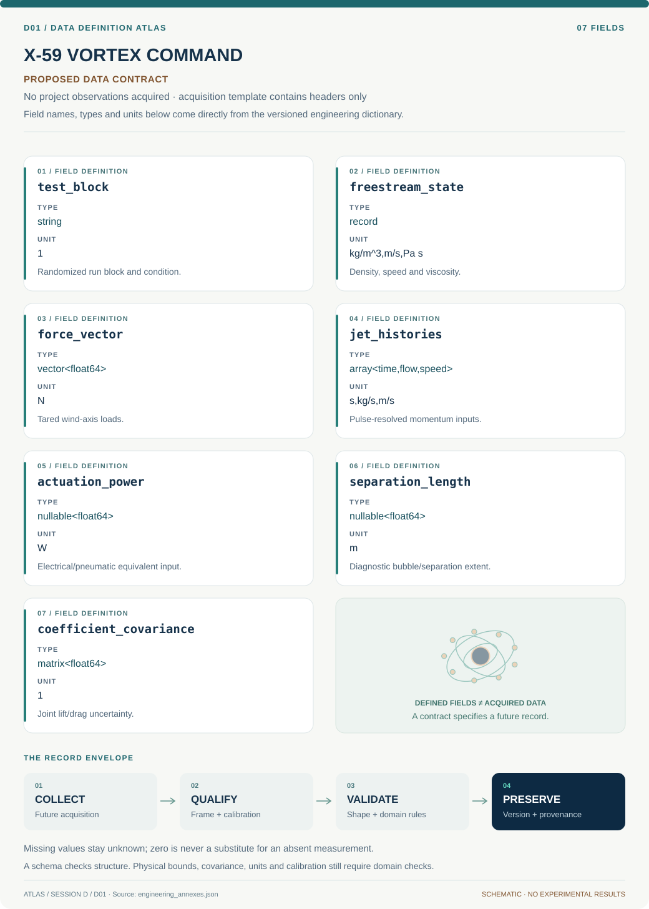

# D01 · Data blueprint

[X-59 VORTEX COMMAND](../README.md) · [Figure gallery](../figures/README.md) · [Data atlas](../../../../data/README.md)

**PROPOSED CONTRACT · 7 fields · no project observations acquired.** The acquisition CSV contains column headers only. The diagram is a visual record specification, not measured data.

| Download | What it contains |
| --- | --- |
| [Acquisition CSV](acquisition.csv) | Empty columns ready for controlled acquisition |
| [Field dictionary](dictionary.csv) | Names, source types, units, meanings and quality rules |
| [JSON Schema](schema.json) | Nullable record structure with unit and quality metadata |

## Field reference

| Field | Type | Unit | Meaning | Quality / missingness |
| --- | --- | --- | --- | --- |
| test_block | string | 1 | Randomized run block and condition. | Baseline repeats and sequence retained. |
| freestream_state | record | kg/m^3,m/s,Pa s | Density, speed and viscosity. | Calibration covariance and timestamps required. |
| force_vector | vector<float64> | N | Tared wind-axis loads. | Axis convention and reference area required. |
| jet_histories | array<time,flow,speed> | s,kg/s,m/s | Pulse-resolved momentum inputs. | Synchronized; missing pulse sample flagged. |
| actuation_power | nullable<float64> | W | Electrical/pneumatic equivalent input. | Boundary and conversion efficiency declared. |
| separation_length | nullable<float64> | m | Diagnostic bubble/separation extent. | Observable definition and error required. |
| coefficient_covariance | matrix<float64> | 1 | Joint lift/drag uncertainty. | Shared tare/inflow terms retained. |

## Acquisition and provenance

Null means missing or unknown; record its cause. Preserve product identifier, retrieval timestamp, source hash, calibration, coordinate and time frame, covariance basis, selection rules and every transformation. JSON Schema checks structure; physical bounds and the quality rules above require domain validation.

- [NASA active-vortex/separation-control report](https://ntrs.nasa.gov/api/citations/20020045525/downloads/20020045525.pdf) — archive or acquisition resource; inclusion here does not assert that its data have been retrieved.
- [NASA low-pressure turbine separation-control research](https://ntrs.nasa.gov/archive/nasa/casi.ntrs.nasa.gov/20020070525.pdf) — archive or acquisition resource; inclusion here does not assert that its data have been retrieved.

[Controlled data-management procedure](../../../../engineering/DATA_MANAGEMENT.md)
