# D01 · Figure gallery

[X-59 VORTEX COMMAND](../README.md) · [Data blueprint](../data/README.md) · [Data diagnostic gallery](../../../../data/figures/README.md)

## Engineering architecture

Momentum, aerodynamic diagnostics and supply power join only at matched operating conditions. The control branch carries delay explicitly; vehicle fuel savings are beyond this laboratory ledger.

[SVG](architecture.svg) · [Editable Mermaid source](architecture.mmd)

## Data blueprint

**Proposed contract · observations pending.** Every field, type, unit and meaning comes from the controlled dictionary. [Open SVG](data-map.svg) · [Download dictionary](../data/dictionary.csv)

## Planned scientific result

Velocity/vorticity snapshots show baseline and controlled attachment; a frequency–duty-cycle map overlays net power gain with measurement uncertainty.

This final scientific result remains an execution deliverable; the design diagrams do not establish an empirical finding.
