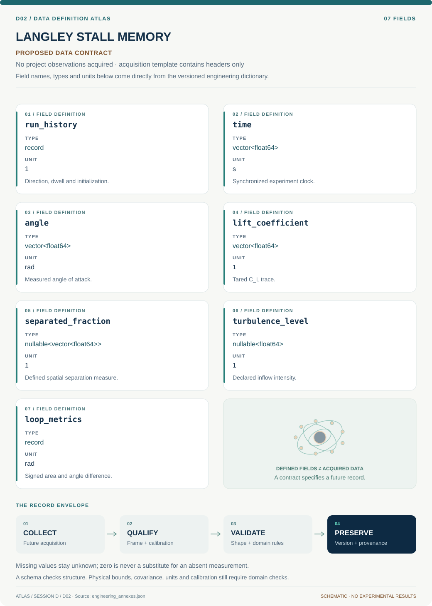
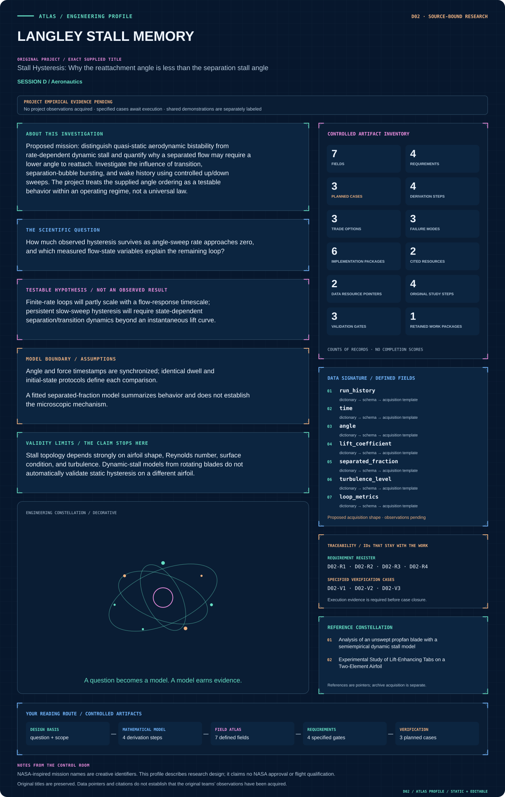

# D02 · Figure gallery

[LANGLEY STALL MEMORY](../README.md) · [Data blueprint](../data/README.md) · [Data diagnostic gallery](../../../../data/figures/README.md)

## Engineering architecture

History, synchronization and flow state constrain competing memory models. A measured loop enters a discrimination process; it is not itself proof of static bistability or a particular separation mechanism.

[SVG](architecture.svg) · [Editable Mermaid source](architecture.mmd)

## Data blueprint

**Proposed contract · observations pending.** Every field, type, unit and meaning comes from the controlled dictionary. [Open SVG](data-map.svg) · [Download dictionary](../data/dictionary.csv)

## Mission profile

The scientific question, hypothesis, model boundary and document metadata are drawn from controlled sources. Proposed work remains distinguished from acquired evidence. [Open SVG](mission-profile.svg)

## Planned scientific result

Lift–angle loops are colored by sweep rate and annotated with measured flow topology; dwell-state plots separate static branches from finite-rate delay.

This final scientific result remains an execution deliverable; the design diagrams do not establish an empirical finding.
