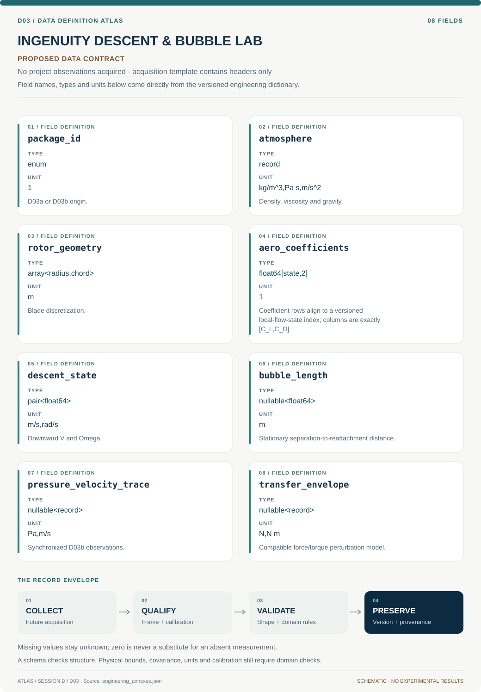

# D03 · Figure gallery

[INGENUITY DESCENT & BUBBLE LAB](../README.md) · [Data blueprint](../data/README.md) · [Data diagnostic gallery](../../../../data/figures/README.md)

## Engineering architecture

D03a and D03b retain separate physics and acceptance paths. Only a reviewed aerodynamic uncertainty envelope connects them; stationary bubble spectra do not directly establish autorotating-probe performance.

[SVG](architecture.svg) · [Editable Mermaid source](architecture.mmd)

## Data blueprint

**Proposed contract · observations pending.** Every field, type, unit and meaning comes from the controlled dictionary. [Open SVG](data-map.svg) · [Download dictionary](../data/dictionary.csv)

## Planned scientific result

Left: descent speed/rotation stability and feasible payload region. Right: bubble time series, spectra, and flow modes. A clearly labeled transferability link shows which aerodynamic statistics enter the probe model.

This final scientific result remains an execution deliverable; the design diagrams do not establish an empirical finding.
