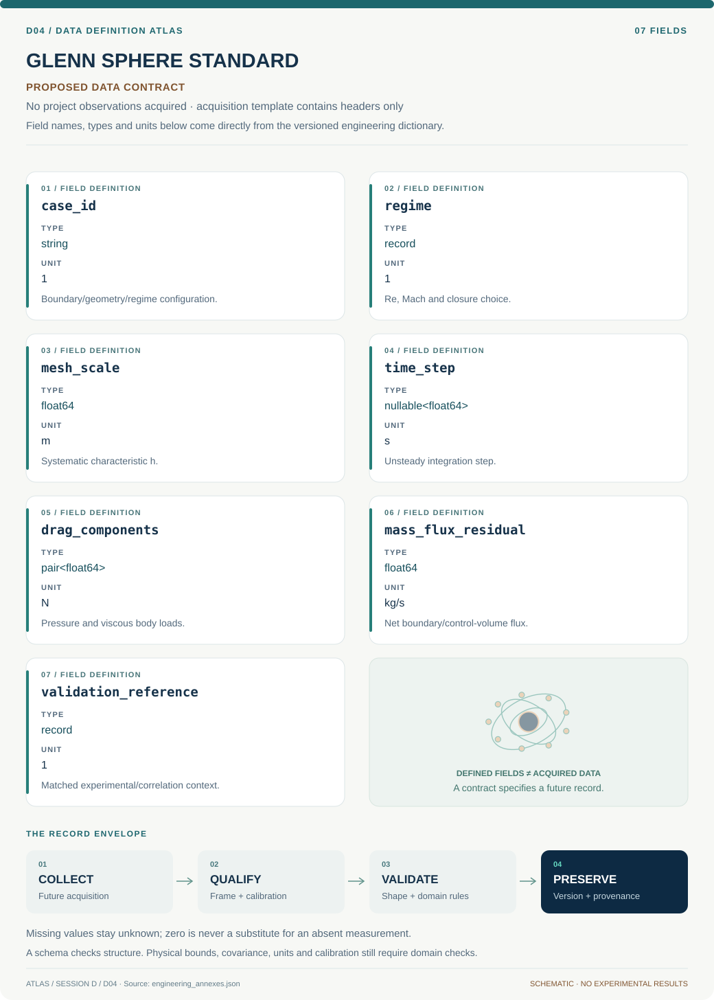
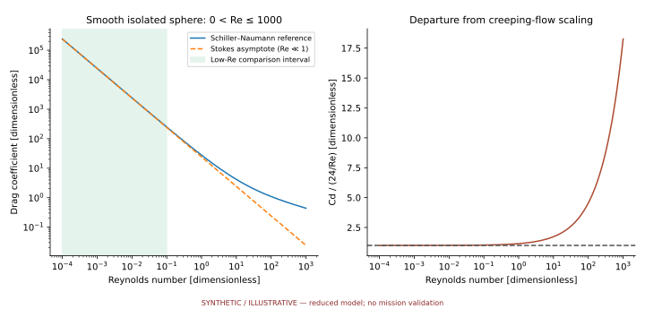
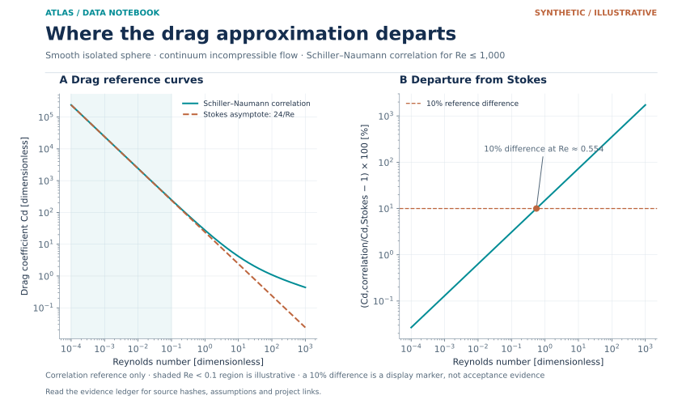

# D04 · GLENN SPHERE STANDARD

**Original project:** Validating a New CFD Algorithm by Finding the Drag Coefficient of a Sphere

**Session D:** Aeronautics

**Document class:** engineering research design and analysis record · **Revision:** 3 · **Date:** 2026-10-02

**Evidence state:** design basis, mathematical formulation and verification plan documented. Project-specific empirical results remain to be acquired; executable shared model demonstrations have their own recorded checks.

[Session D](../README.md) · [All projects](../../../ENGINEERING_DOCUMENTATION.md) · [Session handbook](../../../handbooks/SESSION_D.md) · [← D03](../D03-ingenuity-descent-bubble-lab/README.md) · [D05 →](../D05-apollo-cyber-flight-deck/README.md)

| Proposed requirements | Specified verification cases | Defined data fields | Cited resources |
| ---: | ---: | ---: | ---: |
| 4 | 3 | 7 | 3 |

[Explore the data blueprint](data/README.md) · [Open the figure gallery](figures/README.md) · [Download acquisition template](data/acquisition.csv) · [Browse the data atlas](../../../data/README.md)

---

## Purpose and scientific objective

Proposed mission: use sphere flow as one stage of a CFD verification and validation ladder. Separate whether the new algorithm solves its stated equations accurately from whether those equations describe the measured flow. Compare pressure and viscous drag independently and expand from creeping flow to steady separated and unsteady wakes without silently changing turbulence assumptions.

**Question:** Does the new solver converge at its claimed order and reproduce sphere drag and wake observables within combined numerical and experimental uncertainty?

**Testable hypothesis:** The solver will recover the Stokes limit and show stable grid/time convergence; discrepancies at higher Reynolds number will reveal whether numerical error, domain effects, or physical closure dominates.

## 1. Design basis and analysis boundary

The solver benchmark boundary is a smooth, fixed, nonrotating sphere in continuum low-Mach flow, with declared domain, inflow and wall boundary conditions. It evaluates discretization, force integration, conservation and physical-model agreement separately. A sphere drag match alone cannot validate arbitrary flows, and empirical correlations are comparisons with finite validity domains.

Start with manufactured and creeping-flow limits, then mesh/time/domain studies before steady or unsteady experimental validation. Pressure and viscous drag remain separate outputs. Transition, roughness and turbulence closures are added as distinct cases, particularly near drag crisis where physical scatter can exceed numerical error.

## 2. Requirements and verification traceability

These are project design requirements or proposed analysis gates. A numerical target is not a NASA requirement unless its controlling source is explicitly identified. “TBD” identifies evidence required before a decision; it is not permission to assume a value. Verification evidence listed here is planned, unless a linked result explicitly records execution.

| ID | Requirement / gate | Engineering rationale | Verification method | Basis / required evidence |
| --- | --- | --- | --- | --- |
| D04-R1 | Every C_D shall identify D, rho, U, reference area, domain and force integration convention. | Normalization or surface-normal mistakes can mimic agreement. | Independent force reconstruction and dimensional audit. | Sphere force definition. |
| D04-R2 | Use at least three systematic mesh levels, with time-step and domain refinements separated. | Combined refinement hides the source of error. | Estimate observed order only in an asymptotic sequence. | NASA V&V guidance; proposed study structure. |
| D04-R3 | Proposed conservation gate: normalized mass imbalance below 10^-6 in steady benchmark cases. | A converged residual alone does not prove conservation. | Boundary flux and control-volume ledgers. | Proposed numerical target. |
| D04-R4 | Report validation discrepancy against combined experimental/numerical uncertainty. | Correlation agreement is not exact truth. | Compare matched Reynolds/Mach/roughness cases. | Validation requirement; new solver results pending. |

## 3. Architecture and controlled interfaces

A case builder supplies sphere geometry, nondimensional regime and boundary metadata. Mesh generation records refinement ratios and wall-resolution measures; the solver adapter returns fields, residual histories and boundary fluxes without redefining them. Surface traction integration uses a declared body-outward normal and records pressure/viscous terms separately.

A numerical-analysis module computes convergence, time statistics and domain sensitivity. An experimental adapter retains roughness, turbulence, blockage and reference uncertainty. The comparison engine joins only physically compatible cases and publishes unresolved discrepancy by source instead of a single passing drag number.



Numerical gates precede physical comparison, with separate surface-load and flux ledgers. A drag correlation or isolated sphere result cannot establish unrestricted solver validity.

[Editable engineering diagram source](figures/architecture.mmd)

## 4. Mathematical model and derivation

### Governing equations

```text
Re=rho U D/mu; C_D=F_D/(0.5 rho U^2 pi D^2/4).
```

```text
C_D=24/Re in the creeping-flow, unbounded no-slip limit.
```

```text
C_D=(24/Re)(1+0.15 Re^0.687), a Schiller–Naumann empirical comparison within its stated range.
```

```text
F_D=integral_surface[-p n_x+(tau dot n)_x]dA; track pressure and viscous contributions separately.
```

### Variables, units and conventions

- Sphere diameter D, freestream U, density, viscosity, Mach number, mesh scale, time step, and computational-domain extent.
- Residual, conservation error, wake recirculation length, shedding frequency, wall resolution, and turbulence/transition assumptions.

### Assumptions and boundary conditions

- The initial benchmark is an unconfined smooth nonrotating sphere in continuum low-Mach flow.
- Correlations are comparison references with validity ranges; they are not exact truth and should not replace experimental data near drag crisis.

### Derivation step 1

$$
Re=\rho UD/\mu;\quad A=\pi D^2/4;\quad C_D=F_D/(\rho U^2A/2)
$$

All quantities use the same diameter. Drag force is positive downstream load on the body; normalized pressure and shear contributions sum to total C_D.

### Derivation step 2

$$
F_D=3\pi\mu UD\Rightarrow C_D=24/Re
$$

Insert the unbounded creeping-flow Stokes force into the coefficient definition. Finite-domain blockage and nonzero inertia explain departures from this analytic limit.

### Derivation step 3

$$
p_{obs}=\ln[(\phi_3-\phi_2)/(\phi_2-\phi_1)]/\ln r
$$

For equal refinement ratio r and monotone asymptotic errors, derive the order from phi=phi_exact+Ch^p. Oscillatory/nonasymptotic sequences require another assessment, not forced logarithms.

### Derivation step 4

$$
\phi_{ext}=\phi_1+(\phi_1-\phi_2)/(r^p-1)
$$

Richardson extrapolation estimates a limit using fine and medium grids. It does not remove modeling or experimental discrepancy; wake/time observables need separate convergence.

### Inference or simulation procedure

First apply manufactured solutions and analytic creeping-flow tests to the discretization. Run at least three systematically refined meshes and time steps, with independent domain-size sweeps. Compare integrated forces, wake profiles, and symmetry, then move to unsteady regimes with sampling long enough for stable statistics. Introduce turbulence or transition closures as explicitly separate model choices and maintain identical boundary conditions for cross-solver comparisons.

### Validity domain and fidelity limits

A sphere benchmark cannot establish general solver validity for arbitrary geometries or compressible reacting flows. At transition and drag crisis, roughness and freestream turbulence can produce strong physical variation.

## 5. Data specifications and provenance



**Proposed data contract · observations pending.** This visual inventory shows the record fields to acquire or derive. It contains no project measurements. [Open the data blueprint and downloads](data/README.md).

| Field | Type | Unit | Physical / statistical meaning | Quality and missing-data rule |
| --- | --- | --- | --- | --- |
| case_id | string | 1 | Boundary/geometry/regime configuration. | Hash and solver version required. |
| regime | record | 1 | Re, Mach and closure choice. | Continuum/slip status explicit. |
| mesh_scale | float64 | m | Systematic characteristic h. | Refinement ratio and wall measures retained. |
| time_step | nullable<float64> | s | Unsteady integration step. | Steady case null; not zero. |
| drag_components | pair<float64> | N | Pressure and viscous body loads. | Normals/quadrature and sign specified. |
| mass_flux_residual | float64 | kg/s | Net boundary/control-volume flux. | Normalization denominator recorded. |
| validation_reference | record | 1 | Matched experimental/correlation context. | Uncertainty and validity range required. |

[Machine-readable record schema](data/schema.json) · [Empty acquisition CSV](data/acquisition.csv) · [Field dictionary CSV](data/dictionary.csv)

The CSV above contains column headers only. Its schema defines future records and does not establish that original-team data or a particular archive product have been acquired. Frame, timing, calibration, covariance, selection and provenance details must accompany populated records.

### NASA Glenn sphere-drag reference

[Product, archive or reference](https://www1.grc.nasa.gov/beginners-guide-to-aeronautics/drag-of-a-sphere/)

**Fields:** Drag equation, Reynolds/Mach similarity, and regime-dependent drag behavior.

**Access:** Official explanatory page; plotted reference curve is not a complete uncertainty-qualified experimental dataset.

**Role:** Definitions and regime context.

### Sphere no-slip/slip CFD research

[Product, archive or reference](https://link.springer.com/article/10.1007/s00162-022-00627-w)

**Fields:** Unbounded-sphere comparisons, Stokes and empirical correlation limits.

**Access:** Research article; full data availability must be checked.

**Role:** Independent benchmark design.

## 6. Uncertainty, sensitivity and identifiability

Mesh, iteration, time sampling and boundary placement are numerical uncertainty sources. They are distinct from roughness, inflow turbulence, experimental blockage and turbulence/transition discrepancy. Force contributions can share cancellation error, so pressure/shear covariance matters when total drag appears fortuitously correct.

Refine one numerical source at a time, monitor wake length and shedding spectra as well as forces, and retain nonmonotone sequences. Compare alternate closures only after discretization is controlled. Near transition, use a physical envelope rather than pretending one empirical curve is exact; report cases where the experimental metadata do not permit a meaningful match.

## 7. Engineering trade study

| Alternative | Benefit | Cost / limitation | Decision rule |
| --- | --- | --- | --- |
| Stokes limit | Exact analytic force. | Restricted Re and unbounded continuum flow. | Required sign/normalization benchmark. |
| Empirical drag correlations | Broad screening comparison. | Finite regimes and physical scatter. | Use within stated range, never as exact truth. |
| Matched experimental wake/drag | Tests multiple physical observables. | Requires detailed facility metadata. | Primary validation after numerical convergence. |

## 8. Verification and validation cases

| Case ID | Stimulus / condition | Expected result / criterion | Method | Evidence artifact |
| --- | --- | --- | --- | --- |
| D04-V1 | Creeping-flow force | C_D tends to 24/Re as inertia and boundary effects vanish. | Re/domain sequence plus analytic force integration. | Stokes derivation. |
| D04-V2 | Manufactured field | Solver residual/source recovers prescribed solution at claimed order. | Independent forcing and refined grids. | Discretization verification; outcome TBD. |
| D04-V3 | Uniform inflow conservation | Boundary mass ledger satisfies R3; time averages stabilize for unsteady case. | Flux integration and sampling-window extension. | Conservation and proposed tolerance. |

**Execution status:** these cases are specified, not claimed as executed. Close a case only with the versioned inputs, output, uncertainty, reviewer and pass/fail rationale.

### Additional scientific validation gates

- Confirm global mass/momentum conservation and expected observed convergence order where the solution is smooth.
- Estimate grid/time/domain errors; residual reduction alone does not establish discretization accuracy.
- Proposed gate: benchmark discrepancies are explained within a combined uncertainty budget; failures remain documented and bounded by regime.

## 9. Implementation and reproducible work packages

1. Create sphere_cases.yaml with matched regimes and boundaries.
2. Build mesh_sequence_manifest.json and independent domain sweeps.
3. Implement traction_integral.py and Stokes fixtures.
4. Create conservation_ledger.py and manufactured_solution.py.
5. Build convergence_report.py with nonasymptotic flags.
6. Publish drag_wake_validation.parquet and uncertainty-separated comparison notebooks.

### Investigation sequence

1. Publish solver equations, discretization, claimed order, boundary conditions, and convergence definitions.
2. Execute verification tests before using drag agreement as evidence.
3. Design a Reynolds-number ladder spanning analytic, steady separated, and unsteady regimes with explicit stopping gates.
4. Assemble comparisons with trusted solutions/measurements and show drag decomposition, wake structure, and uncertainty together.

### Resources and interfaces to expertise

- CFD solver access, automated mesh refinement, reproducible job manifests, flow-physics expertise, and suitable experimental reference data.

## 10. Failure modes and interpretation controls

| Failure mode | Effect on result | Detection / evidence | Design response |
| --- | --- | --- | --- |
| Normal sign reversed | Negative or canceled drag. | Known traction fixture. | Body-normal convention test. |
| Residual-only convergence | Force remains grid/domain dependent. | Independent refinement plots. | Require observable convergence. |
| Correlation outside regime | False validation pass. | Re/Mach/roughness compatibility audit. | Reject invalid comparison. |

- Using a correlation outside its regime can create false solver failures or false success.
- Compensating numerical and turbulence-model errors can match drag while producing the wrong wake.

## 11. Required engineering outputs

- Solver verification matrix, sphere-flow benchmark suite, drag/wake atlas, and a domain-of-validity report.

### Scientific result figures to produce during execution

Drag-versus-Reynolds reference and simulation curves sit beside mesh-convergence plots, pressure/viscous decomposition, and wake snapshots; validation regimes are color-coded.

### Included shared numerical starting point



[Executable formulation, parameters, tabular outputs, provenance and verification](../../../models/README.md). This shared demonstration has a narrower domain than the project model above. Its own caption and methods identify synthetic parameters or the separately retrieved public catalog; it is not a completed result of the original project.

### Data diagnostic



Synthetic reference values from the Schiller–Naumann sphere-drag correlation and Stokes creeping-flow asymptote. The percent-departure panel makes the approximation difference explicit, with a descriptive 10% reference crossing computed from the same formula. Neither curve is an observed drag dataset or a CFD solver result; the crossing is not a physical validation tolerance.

[Inputs, downloadable figure and provenance](../../../data/figures/README.md)

## 12. Cited technical and scientific resources

- [NASA Glenn: Drag of a Sphere](https://www1.grc.nasa.gov/beginners-guide-to-aeronautics/drag-of-a-sphere/) — Official force definitions and Reynolds/Mach-dependent interpretation.
- [NASA NPARC Tutorial on CFD Verification and Validation](https://www.grc.nasa.gov/www/wind/valid/tutorial/tutorial.html) — Official guidance separating numerical verification, physical validation, and convergence assessments.
- [A specific slip length model for Maxwell slip boundary conditions](https://link.springer.com/article/10.1007/s00162-022-00627-w) — Original sphere-flow verification comparisons and continuum/slip validity distinctions.

Framework and evidence rules: [engineering documentation standard](../../../engineering/ENGINEERING_STANDARD.md), [model assurance](../../../engineering/MODEL_ASSURANCE.md), [uncertainty procedure](../../../engineering/UNCERTAINTY_AND_DECISION_RULES.md), [data management](../../../engineering/DATA_MANAGEMENT.md). NASA-inspired names are creative identifiers; requirements and results are not NASA certification.
