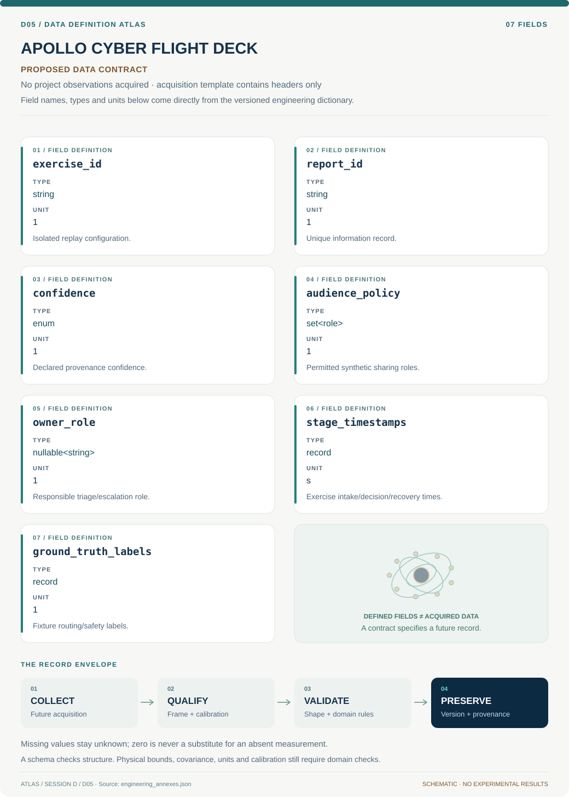

# D05 · APOLLO CYBER FLIGHT DECK

**Original project:** CIS Aviation-ISAC

**Session D:** Aeronautics

**Document class:** engineering research design and analysis record · **Revision:** 3 · **Date:** 2026-10-02

**Evidence state:** design basis, mathematical formulation and verification plan documented. Project-specific empirical results remain to be acquired; executable shared model demonstrations have their own recorded checks.

[Session D](../README.md) · [All projects](../../../ENGINEERING_DOCUMENTATION.md) · [Session handbook](../../../handbooks/SESSION_D.md) · [← D04](../D04-glenn-sphere-standard/README.md) · [D06 →](../D06-langley-mach-atlas/README.md)

| Proposed requirements | Specified verification cases | Defined data fields | Cited resources |
| ---: | ---: | ---: | ---: |
| 4 | 3 | 7 | 2 |

[Explore the data blueprint](data/README.md) · [Open the figure gallery](figures/README.md) · [Download acquisition template](data/acquisition.csv) · [Browse the data atlas](../../../data/README.md)

---

## Purpose and scientific objective

Proposed mission: develop a defensive aviation information-sharing and risk-governance study organized around trusted reporting, accountable decisions, and operational continuity. CIS is retained verbatim because its intended expansion is unspecified. The project evaluates governance and resilience with synthetic tabletop scenarios; it does not perform exploitation, offensive testing, or automated actions against aviation systems.

**Question:** Which information-sharing and decision practices most improve timely, accurate defensive response while preserving confidentiality and flight-safety escalation paths?

**Testable hypothesis:** A structured confidence/provenance schema and clear ownership will reduce triage delay and inconsistent escalation compared with unstructured bulletins, subject to controlled tabletop evaluation.

## 1. Design basis and analysis boundary

The system is an authorized defensive information-sharing workflow evaluated with fictitious aviation organizations, synthetic advisories and service-outage records. Its boundary includes provenance, permitted audience, triage, safety escalation and recovery decision evidence. It contains no live vulnerabilities, exploitation, member intelligence or flight-system access.

Map current and proposed governance to NIST CSF 2.0 outcomes, then compare benign tabletop workflows under controlled replay. The framework is outcome-based and does not prescribe one implementation. The engineering decision is whether clearer ownership, audience controls and escalation evidence improve response quality without treating ordinal risk labels as measured financial loss.

## 2. Requirements and verification traceability

These are project design requirements or proposed analysis gates. A numerical target is not a NASA requirement unless its controlling source is explicitly identified. “TBD” identifies evidence required before a decision; it is not permission to assume a value. Verification evidence listed here is planned, unless a linked result explicitly records execution.

| ID | Requirement / gate | Engineering rationale | Verification method | Basis / required evidence |
| --- | --- | --- | --- | --- |
| D05-R1 | Every synthetic report shall include source confidence, owner, permitted audience and expiry/review status. | Incomplete reports invite misrouting or unreviewed sharing. | Schema validation and audience-policy fixtures. | Public ISAC purpose and proposed information contract. |
| D05-R2 | Exercise events shall remain isolated synthetic records with no live endpoint or credential fields. | Governance evaluation needs no operational target. | Inspect fixture manifest and reject endpoint/secret fields. | Authorized defensive scope. |
| D05-R3 | Safety-relevant cases shall record escalation decision, responsible role and rationale. | Fast triage can still route to the wrong authority. | Compare labeled role decisions against preregistered tabletop truth. | Proposed decision-quality requirement. |
| D05-R4 | Proposed comparison gate: response-time improvement without lower escalation recall or audience compliance. | Speed alone can reward unsafe shortcuts. | Paired scenarios and uncertainty intervals for quality/timing. | Proposed gate; exercise results pending. |

## 3. Architecture and controlled interfaces

A fixture registry defines synthetic scenario truth and dependencies. Reports enter a typed intake queue with confidence and audience tags; an ownership mapper routes them to triage roles. A review stage records decisions, permitted sanitized summaries and simulated acknowledgments, all within the local exercise.

A safety-escalation branch keeps operational and flight-safety authority explicit. Timestamped event logs use one exercise clock and append-only IDs. The scorer compares analyst labels, routing and timing to fixture truth; censored unfinished cases remain incomplete rather than receiving invented recovery times. Confidential real member material is outside the data contract.



The isolated workflow evaluates ownership, permitted sharing and safety escalation through synthetic replay. It supports defensive governance comparison without contacting systems or reproducing vulnerabilities.

[Editable engineering diagram source](figures/architecture.mmd)

## 4. Mathematical model and derivation

### Governing equations

```text
R_s=p_s*I_s is a transparent scenario-risk score, with probability and impact ranges rather than unjustified precision.
```

```text
T_response=T_report+T_triage+T_decision+T_recovery; record distributions and censor incomplete exercises.
```

```text
Precision=TP/(TP+FP); Recall=TP/(TP+FN) for analyst-classification labels in benign synthetic cases.
```

```text
Availability=uptime/(uptime+downtime), with mission-specific service boundaries and scheduled maintenance defined.
```

### Variables, units and conventions

- Report confidence, provenance, permitted sharing audience, owner, acknowledgment time, triage time, escalation correctness, and recovery time.
- Scenario impact category, dependencies, supplier criticality, exercise ground truth, and participant experience.

### Assumptions and boundary conditions

- Synthetic scenarios represent governance challenges, not live vulnerabilities or attack paths.
- Risk categories are decision aids; ordinal impacts must not be treated as measured monetary losses without evidence.

### Derivation step 1

```text
T_{response}=T_{report}+T_{triage}+T_{decision}+T_{recovery}
```

Intervals share nonoverlapping stage definitions and an exercise clock. Parallel work needs critical-path timing, not summing overlapping durations.

### Derivation step 2

$$
Precision=TP/(TP+FP);\quad Recall=TP/(TP+FN)
$$

The positive class is a preregistered escalation/routing decision in benign fixtures. Empty denominators yield undefined values, not perfect scores.

### Derivation step 3

```text
A=U/(U+D)
```

Availability uses service-boundary uptime/downtime and declared maintenance policy. A tabletop outage is simulated evidence, not a measured operator availability claim.

### Derivation step 4

$$
E[L]=\sum_sp_sL_s
$$

Expected loss requires probabilities and quantitatively comparable impacts. If impacts are ordinal, retain a scenario matrix and ranges rather than multiplying labels into pseudo-money.

### Inference or simulation procedure

Map a representative aviation organization's current and proposed practices to NIST CSF 2.0 outcomes and the public Aviation ISAC mission. Define a minimum information record, escalation roles, and reviewable evidence trail. Conduct benign tabletop comparisons using fictitious organizations, synthetic service outages, and simulated advisories. Analyze response quality and timing while protecting participants' and member organizations' confidential information.

### Validity domain and fidelity limits

Public ISAC pages describe purpose and community, not member intelligence. Tabletop performance may differ from real incidents, and no particular operator's security posture can be inferred without authorized evidence.

## 5. Data specifications and provenance



**Proposed data contract · observations pending.** This visual inventory shows the record fields to acquire or derive. It contains no project measurements. [Open the data blueprint and downloads](data/README.md).

| Field | Type | Unit | Physical / statistical meaning | Quality and missing-data rule |
| --- | --- | --- | --- | --- |
| exercise_id | string | 1 | Isolated replay configuration. | Synthetic-only flag and fixture hash required. |
| report_id | string | 1 | Unique information record. | Append-only; edits create revisions. |
| confidence | enum | 1 | Declared provenance confidence. | Unknown explicit; never inferred from urgency. |
| audience_policy | set<role> | 1 | Permitted synthetic sharing roles. | Empty or missing blocks onward sharing. |
| owner_role | nullable<string> | 1 | Responsible triage/escalation role. | Unassigned remains null and flagged. |
| stage_timestamps | record | s | Exercise intake/decision/recovery times. | Clock/version and censoring required. |
| ground_truth_labels | record | 1 | Fixture routing/safety labels. | Locked before exercise; scorer separated. |

[Machine-readable record schema](data/schema.json) · [Empty acquisition CSV](data/acquisition.csv) · [Field dictionary CSV](data/dictionary.csv)

The CSV above contains column headers only. Its schema defines future records and does not establish that original-team data or a particular archive product have been acquired. Frame, timing, calibration, covariance, selection and provenance details must accompany populated records.

### Aviation ISAC public information

[Product, archive or reference](https://www.a-isac.com/)

**Fields:** Public mission, aviation community categories, and information-sharing purpose.

**Access:** Public website; membership feeds and confidential incident reports are unavailable unless separately authorized.

**Role:** Sector context.

### NIST Cybersecurity Framework 2.0

[Product, archive or reference](https://www.nist.gov/publications/nist-cybersecurity-framework-csf-20)

**Fields:** Govern, Identify, Protect, Detect, Respond, Recover outcomes and profile concepts.

**Access:** Public official publication; framework is nonprescriptive.

**Role:** Governance/evaluation structure.

## 6. Uncertainty, sensitivity and identifiability

Participant experience, scenario difficulty and learning across repeated exercises affect timings and classification. Paired scenarios share these effects, so interval estimates should block by scenario and participant group. Right-censored recovery times need survival summaries or explicit censoring rather than deletion.

Vary confidence, audience restrictions and dependency ambiguity while preserving benign scope. Check whether improvements survive harder fixtures and whether analyst disagreement reflects ambiguous ground truth. CSF mapping provides traceability, not empirical proof; tabletop transfer to real incidents remains a documented limitation.

## 7. Engineering trade study

| Alternative | Benefit | Cost / limitation | Decision rule |
| --- | --- | --- | --- |
| Free-form intake | Low setup effort. | Missing fields and routing ambiguity. | Baseline only; measure completeness. |
| Structured role/audience record | Clear accountability and confidentiality. | More intake effort. | Select if quality gate improves without unacceptable delay. |
| Automated local policy checks | Consistent schema/audience validation. | Cannot replace safety judgment. | Use as decision support with recorded human rationale. |

## 8. Verification and validation cases

| Case ID | Stimulus / condition | Expected result / criterion | Method | Evidence artifact |
| --- | --- | --- | --- | --- |
| D05-V1 | Audience restriction | A report allowed only for role A never appears in role B's simulated view. | Policy matrix fixtures and log audit. | Data-contract constraint. |
| D05-V2 | Censored exercise | Incomplete recovery remains censored; no fabricated duration. | Stop replay mid-case and recompute metrics. | Missing-data rule. |
| D05-V3 | Scorer endpoints | Perfect synthetic labels give precision/recall one; no positives yields undefined relevant metric. | Confusion-matrix fixtures. | Metric algebra; live efficacy not claimed. |

**Execution status:** these cases are specified, not claimed as executed. Close a case only with the versioned inputs, output, uncertainty, reviewer and pass/fail rationale.

### Additional scientific validation gates

- Use independent reviewer labels for scenario outcomes and measure inter-rater agreement.
- Evaluate triage precision, missed escalations, acknowledgment/decision latency, and continuity outcomes with uncertainty.
- Proposed gate: improvements persist across unfamiliar scenarios and less experienced participants; human review remains required for operational decisions.

## 9. Implementation and reproducible work packages

1. Create synthetic_scenarios.yaml with locked truth and no operational targets.
2. Build report_schema.json and role_audience_policy.json.
3. Implement local_tabletop_replay.py with append-only exercise events.
4. Create csf_outcome_mapping.csv and safety_escalation_matrix.csv.
5. Build scoring.py with censoring/undefined-denominator fixtures.
6. Publish paired_workflow_review.ipynb and sanitized governance evidence records.

### Investigation sequence

1. Document project scope and unresolved CIS meaning without inventing an institutional affiliation.
2. Create a defensive evidence schema with provenance, confidence, sharing restrictions, review state, and accountable owner.
3. Develop synthetic tabletop scenarios and preregister timing/quality comparisons.
4. Prepare current/target profiles and a prioritized improvement roadmap based on observed exercise gaps.

### Resources and interfaces to expertise

- Aviation safety and cybersecurity governance expertise, tabletop facilitators, privacy/legal review where applicable, and secure controlled evidence storage.

## 10. Failure modes and interpretation controls

| Failure mode | Effect on result | Detection / evidence | Design response |
| --- | --- | --- | --- |
| Urgency overrides audience | Confidentiality breach in workflow. | Policy violation log. | Mandatory audience gate and review. |
| Unowned report | Triage stalls. | Null-owner queue age. | Explicit assignment and escalation role. |
| Speed optimized alone | Missed safety escalation. | Recall/rationale disagreement. | Joint timing and decision-quality gate. |

- Over-sharing confidential information can undermine trust and create operational exposure.
- An impressive dashboard can hide missing evidence; unknown states and untested controls must stay visible.

## 11. Required engineering outputs

- Defensive information-sharing specification, CSF profile, synthetic scenario library, exercise evaluation, and accountable improvement roadmap.

### Scientific result figures to produce during execution

A report-to-recovery swimlane shows human decision owners and evidence handoffs; a CSF profile heatmap distinguishes documented, exercised, and unverified outcomes without exposing real-system details.

## 12. Cited technical and scientific resources

- [Aviation ISAC](https://www.a-isac.com/) — Official aviation information-sharing community and defensive collaboration purpose.
- [The NIST Cybersecurity Framework 2.0](https://www.nist.gov/publications/nist-cybersecurity-framework-csf-20) — Official outcome-based cybersecurity risk/governance framework.

Framework and evidence rules: [engineering documentation standard](../../../engineering/ENGINEERING_STANDARD.md), [model assurance](../../../engineering/MODEL_ASSURANCE.md), [uncertainty procedure](../../../engineering/UNCERTAINTY_AND_DECISION_RULES.md), [data management](../../../engineering/DATA_MANAGEMENT.md). NASA-inspired names are creative identifiers; requirements and results are not NASA certification.
