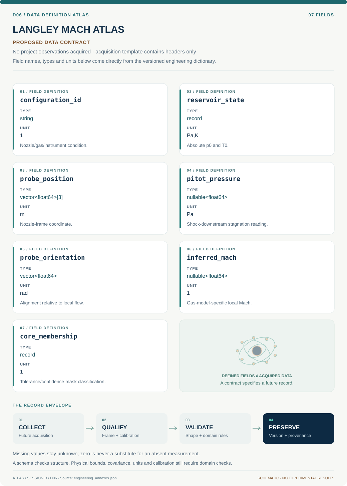
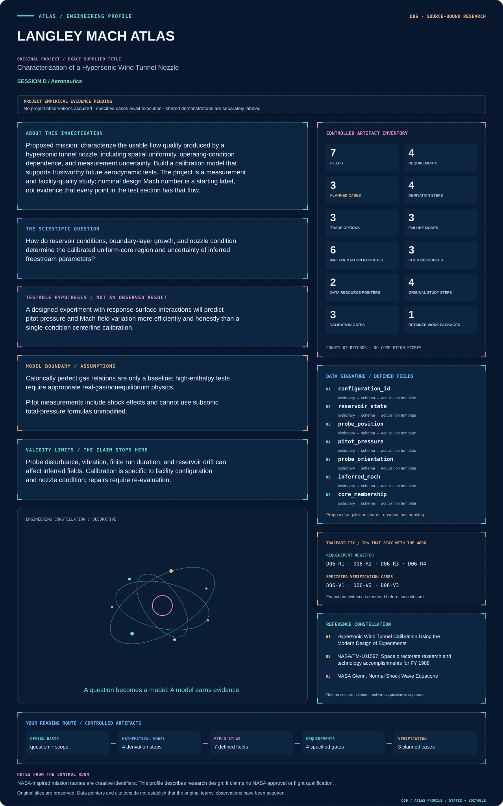

# D06 · Figure gallery

[LANGLEY MACH ATLAS](../README.md) · [Data blueprint](../data/README.md) · [Data diagnostic gallery](../../../../data/figures/README.md)

## Engineering architecture

Shock-aware inference and time/spatial alignment precede a confidence-based core mask. The mask is tied to one nozzle configuration and gas domain; no facility Mach capability is assumed.

[SVG](architecture.svg) · [Editable Mermaid source](architecture.mmd)

## Data blueprint

**Proposed contract · observations pending.** Every field, type, unit and meaning comes from the controlled dictionary. [Open SVG](data-map.svg) · [Download dictionary](../data/dictionary.csv)

## Mission profile

The scientific question, hypothesis, model boundary and document metadata are drawn from controlled sources. Proposed work remains distinguished from acquired evidence. [Open SVG](mission-profile.svg)

## Planned scientific result

Test-section cross-plane Mach/pitot contours, longitudinal profiles, operating-condition response surfaces, and the uncertainty-qualified uniform-core mask.

This final scientific result remains an execution deliverable; the design diagrams do not establish an empirical finding.
