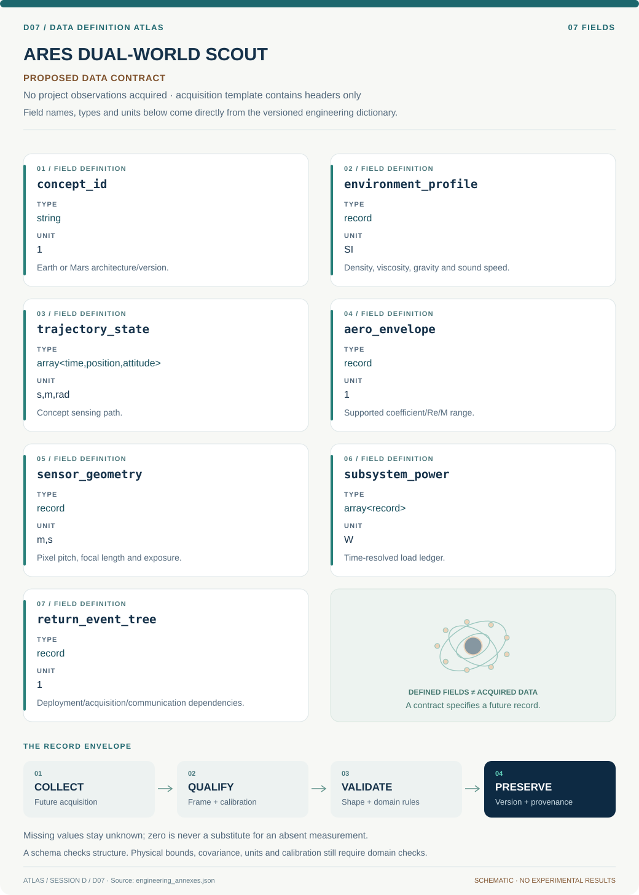
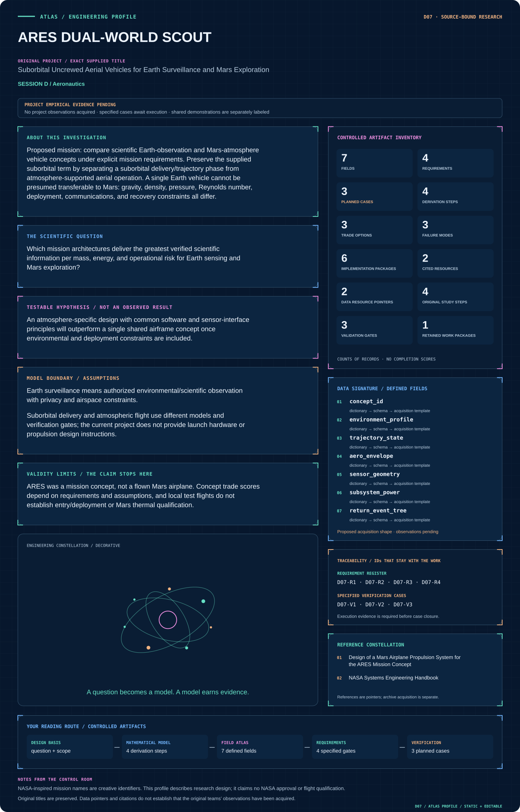

# D07 · Figure gallery

[ARES DUAL-WORLD SCOUT](../README.md) · [Data blueprint](../data/README.md) · [Data diagnostic gallery](../../../../data/figures/README.md)

## Engineering architecture

Environment-specific trajectory and sensing branches feed a dependent data-return model. The diagram separates concept delivery assumptions from usable science and does not transfer Earth validation into Mars qualification.

[SVG](architecture.svg) · [Editable Mermaid source](architecture.mmd)

## Data blueprint

**Proposed contract · observations pending.** Every field, type, unit and meaning comes from the controlled dictionary. [Open SVG](data-map.svg) · [Download dictionary](../data/dictionary.csv)

## Mission profile

The scientific question, hypothesis, model boundary and document metadata are drawn from controlled sources. Proposed work remains distinguished from acquired evidence. [Open SVG](mission-profile.svg)

## Planned scientific result

Separate Earth and Mars mission timelines show delivery and aerial sensing phases; a mass–energy–science-return Pareto plot displays uncertainty and shared interface opportunities.

This final scientific result remains an execution deliverable; the design diagrams do not establish an empirical finding.
