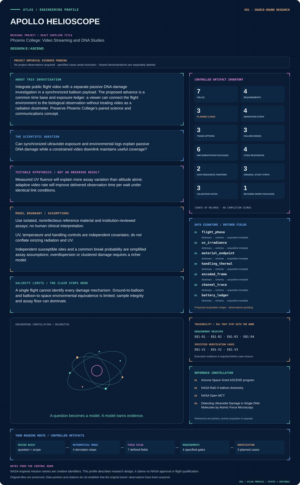
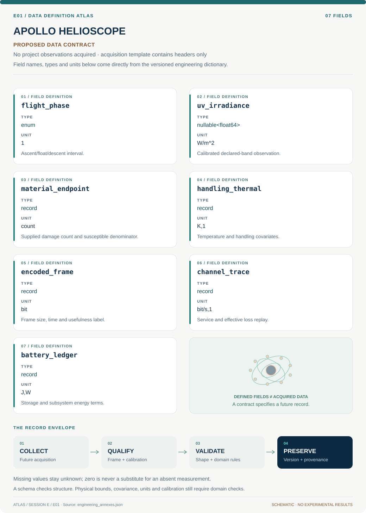

# E01 · APOLLO HELIOSCOPE

**Original project:** Phoenix College: Video Streaming and DNA Studies

**Session E:** ASCEND

**Document class:** engineering research design and analysis record · **Revision:** 4 · **Date:** 2026-10-02

**Evidence state:** design basis, mathematical formulation and verification plan documented. Project-specific empirical results remain to be acquired; executable shared model demonstrations have their own recorded checks.

[Session E](../README.md) · [All projects](../../../ENGINEERING_DOCUMENTATION.md) · [Session handbook](../../../handbooks/SESSION_E.md) · [← D07](../../D/D07-ares-dual-world-scout/README.md) · [E02 →](../E02-gemini-helix/README.md)

| Proposed requirements | Specified verification cases | Defined data fields | Cited resources |
| ---: | ---: | ---: | ---: |
| 4 | 3 | 7 | 4 |

[Explore the data blueprint](data/README.md) · [Open the figure gallery](figures/README.md) · [Download acquisition template](data/acquisition.csv) · [Browse the data atlas](../../../data/README.md)

---

## Mission profile



| Profile panel | Engineering signal | Open the evidence |
| --- | --- | --- |
| Mission identity | Phoenix College: Video Streaming and DNA Studies | [Scientific objective](#purpose-and-scientific-objective) |
| Model cockpit | 4 governing expressions; 4 derivation steps; declared assumptions and validity envelope | [Mathematical formulation](#4-mathematical-model-and-derivation) |
| Data blueprint | 7 proposed fields with types, units and quality rules | [Field map & downloads](data/README.md) |
| Verification queue | 4 proposed requirements; 3 specified cases; project execution evidence pending | [Case definitions](#8-verification-and-validation-cases) |
| Figure wall | Architecture, field map, planned result description | [Open full gallery](figures/README.md) |
| Resource library | 4 cited primary resources with support statements | [Cited resources](#12-cited-technical-and-scientific-resources) |

### Model cockpit

**Analysis method:** Fit an exposure-response model with dark/handling controls and thermal covariates, while a replayed communication channel measures rate adaptation. Partition flight time into ascent, float if present, and descent; retain sensor lag and clock uncertainty. Trade image usefulness against energy rather than maximizing nominal resolution.

**Operating envelope:** A single flight cannot identify every damage mechanism. Ground-to-balloon and balloon-to-space environmental equivalence is limited; sample integrity and assay floor can dominate.

**Variables and conventions**

- H_UV: UV fluence J/m^2; E_UV: irradiance W/m^2
- k: damage response m^2/J, fitted independently; N_target: susceptible sites
- R: bit/s; p_loss dimensionless; E_bat J

### Artifact wall



The biological and video packages share timing but preserve separate causal and calibration boundaries. Finite-site saturation, energy balance and delivered usefulness are testable without new biological procedures or original flight claims.

**Scientific result to produce:** Linked altitude/UV/temperature profiles, DNA-response intervals and delivered bitrate versus energy; biological points remain prospective until measured.

### Investigation feed · planned work

The feed records proposed work packages. A row becomes executed evidence only with versioned inputs, outputs and a reviewed result.

| Sequence | Evidence state | Engineering work package |
| --- | --- | --- |
| 01 | Planned | Create synchronized_payload_schema.json and flight_phase_manifest.yaml. |
| 02 | Planned | Build uv_fluence.py with calibration/lag propagation. |
| 03 | Planned | Implement finite_site_damage.py and control/censoring likelihood. |
| 04 | Planned | Create video_channel_replay.py and useful_frame_rubric.json. |
| 05 | Planned | Build battery_energy.py and adaptive_stream_scheduler.py. |
| 06 | Planned | Publish exposure_response.ipynb and equal_energy_stream_trade.parquet with original telemetry unavailable flags. |

### Mission connections

Connections are reading routes based on actual shared resources, supplied sessions or included illustrations. They do not establish physical dependencies, team collaborations or validated results.

| Connected mission | Original investigation | Recorded connection basis |
| --- | --- | --- |
| [E02 · GEMINI HELIX](../E02-gemini-helix/README.md) | Project Helix | Session E; [Arizona Space Grant ASCEND program](https://spacegrant.arizona.edu/research/ascend) |
| [E03 · ARTEMIS STRATODOSE](../E03-artemis-stratodose/README.md) | UArizona ASCEND: Profiling High-Altitude Radiation with a General Data Logger | Session E; [NASA RaD-X balloon dosimetry](https://www.nasa.gov/science-research/heliophysics/nasa-studies-cosmic-radiation-to-protect-high-altitude-travelers/) |
| [E07 · DISCOVERY TRIDENT](../E07-discovery-trident/README.md) | Glendale Community College (GCC) ASCEND Team | Session E; [Arizona Space Grant ASCEND program](https://spacegrant.arizona.edu/research/ascend) |
| [I07 · GATEWAY CATSAT CONSOLE](../../I/I07-gateway-catsat-console/README.md) | CatSat Groundstation Command and Control | [NASA Open MCT](https://ammos.nasa.gov/openmct/) |
| [E04 · AURA VERTICAL](../E04-aura-vertical/README.md) | A Measurement of the Concentration of Greenhouse Gases as Altitude Increases | Session E |
| [E05 · ORION TRUSS](../E05-orion-truss/README.md) | EagleSat Team: Design and Refinement of 3U CubeSat Structure | Session E |

[Machine-readable connection register and ranking rule](../../../registry/mission_connections.json)

### Reading playlist

| Route | Start here | Continue to |
| --- | --- | --- |
| Understand the idea | [Scientific objective](#purpose-and-scientific-objective) | [Design boundary](#1-design-basis-and-analysis-boundary) → [Mathematics](#4-mathematical-model-and-derivation) |
| Inspect the data | [Visual blueprint](data/README.md) | [Provenance](#5-data-specifications-and-provenance) → [Uncertainty](#6-uncertainty-sensitivity-and-identifiability) |
| Make a design decision | [Trade study](#7-engineering-trade-study) | [Failure modes](#10-failure-modes-and-interpretation-controls) → [Required outputs](#11-required-engineering-outputs) |
| Prepare execution | [Requirements](#2-requirements-and-verification-traceability) | [Verification](#8-verification-and-validation-cases) → [Implementation](#9-implementation-and-reproducible-work-packages) |

## Complete engineering dossier

The profile above is a browsing layer. The full design basis, equations, derivations, data contract, uncertainty, trades and controlled case definitions follow.

## Purpose and scientific objective

Integrate public flight video with a separate passive DNA-damage investigation in a synchronized balloon payload. The proposed advance is a common time base and exposure ledger: a viewer can connect the flight environment to the biological observation without treating video as a radiation dosimeter. Preserve Phoenix College’s paired science and communications concept.

**Question:** Can synchronized ultraviolet exposure and environmental logs explain passive DNA damage while a constrained video downlink maintains useful coverage?

**Testable hypothesis:** Measured UV fluence will explain more assay variation than altitude alone; adaptive video rate will improve delivered observation time per watt under identical link conditions.

## 1. Design basis and analysis boundary

The payload analysis has two coordinated packages: passive noninfectious reference-material damage assessment and constrained video/telemetry delivery. Its boundary includes UV irradiance, temperature/handling covariates, clocks, battery energy and replayed channel loss. The biological output is an institution-supplied assay endpoint; no exposure, genetic or assay procedure is specified, and ionizing dose is not substituted for UV fluence.

Start with synchronized exposure and energy ledgers, then fit a finite-site damage model with independent controls. Compare video adaptation against delivered coverage/usefulness, not nominal resolution. Flight phase and sensor lag remain covariates. A published UV-damage measurement supports endpoint specificity, while its fitted response is not transferred automatically to this material or flight.

## 2. Requirements and verification traceability

These are project design requirements or proposed analysis gates. A numerical target is not a NASA requirement unless its controlling source is explicitly identified. “TBD” identifies evidence required before a decision; it is not permission to assume a value. Verification evidence listed here is planned, unless a linked result explicitly records execution.

| ID | Requirement / gate | Engineering rationale | Verification method | Basis / required evidence |
| --- | --- | --- | --- | --- |
| E01-R1 | Damage counts shall remain between zero and declared N_target, with the endpoint and denominator defined. | The finite-site model saturates; unlimited Poisson counts are inappropriate outside rare damage. | Boundary/likelihood checks and assay-definition audit. | Corrected Binomial model. |
| E01-R2 | UV fluence shall use calibrated UV-band irradiance with timestamp/lag uncertainty. | A generic radiation counter cannot measure this exposure. | Integrate calibrated stream and inspect spectral response. | UV metrology requirement. |
| E01-R3 | Proposed energy-ledger closure target: residual below 0.1% of cumulative supplied energy. | Streaming trade can hide missing loads. | Compare solar, load and battery-storage terms. | Proposed numerical tolerance. |
| E01-R4 | Proposed replay target: useful delivered-frame coverage at least 90% of a preregistered baseline at equal energy. | Higher encoding rate may worsen losses. | Compare coverage/quality under the same synthetic channel. | Proposed target; no original-flight result. |

## 3. Architecture and controlled interfaces

A common clock maps irradiance, temperature and handling metadata to material observation windows. The damage module receives susceptible-site count and endpoint-specific k in m^2/J, outputting probabilities with covariance. Assay records retain detection limits and source provenance rather than operational instructions.

A separate communication replay consumes encoded frame sizes, channel service and loss traces. Its battery ledger uses J and W with charge/storage conventions. A scheduler selects bitrate/cadence under energy and buffering constraints. The shared flight registry labels ascent/float/descent and location; it synchronizes packages without implying that video loss causes DNA damage.


The biological and video packages share timing but preserve separate causal and calibration boundaries. Finite-site saturation, energy balance and delivered usefulness are testable without new biological procedures or original flight claims.

[Editable engineering diagram source](figures/architecture.mmd)

## 4. Mathematical model and derivation

### Governing equations

```text
H_UV=integral E_UV(t) dt
```

```text
N_break ~ Binomial(N_target, 1-exp(-k*H_UV)); Poisson(N_target*k*H_UV) is only the rare-break approximation when k*H_UV << 1.
```

```text
E_bat(t)=E0+integral(P_solar-P_load)dt
```

```text
R_delivered=R_encoded*(1-p_loss)
```

### Variables, units and conventions

- H_UV: UV fluence J/m^2; E_UV: irradiance W/m^2
- k: damage response m^2/J, fitted independently; N_target: susceptible sites
- R: bit/s; p_loss dimensionless; E_bat J

### Assumptions and boundary conditions

- Use isolated, noninfectious reference material and institution-reviewed assays; no human clinical interpretation.
- UV, temperature and handling controls are independent covariates; do not conflate ionizing radiation and UV.
- Independent susceptible sites and a common break probability are simplified assay assumptions; overdispersion or clustered damage requires a richer model.

### Derivation step 1

$$
H_{UV}=\int E_{UV}(t)dt
$$

Irradiance W/m^2 integrated over seconds gives J/m^2. Lag and clock errors change the appropriate material exposure window; band weighting is declared.

### Derivation step 2

$$
p=1-e^{-kH};\quad N_{break}\sim Binomial(N_{target},p)
$$

A common independent-site hazard gives finite probability and saturation. Mean is Np and variance Np(1-p); k is endpoint/material specific.

### Derivation step 3

$$
kH\ll1\Rightarrow p\approx kH;\quad N_{break}\approx Poisson(N_{target}kH)
$$

The rare-event approximation requires small site probability, with its accuracy checked rather than used globally. Clustering requires overdispersion or dependent-site alternatives.

### Derivation step 4

$$
E_b(t)=E_0+\int(P_{solar}-P_{load})dt;\quad R_d\le R_e(1-p_{loss})
$$

Energy storage closes with loss terms separately. The delivered-rate expression is a simple effective-loss ceiling; packet overhead, buffering and retransmission are modeled explicitly in replay.

### Inference or simulation procedure

Fit an exposure-response model with dark/handling controls and thermal covariates, while a replayed communication channel measures rate adaptation. Partition flight time into ascent, float if present, and descent; retain sensor lag and clock uncertainty. Trade image usefulness against energy rather than maximizing nominal resolution.

### Validity domain and fidelity limits

A single flight cannot identify every damage mechanism. Ground-to-balloon and balloon-to-space environmental equivalence is limited; sample integrity and assay floor can dominate.

## 5. Data specifications and provenance



**Proposed data contract · observations pending.** This visual inventory shows the record fields to acquire or derive. It contains no project measurements. [Open the data blueprint and downloads](data/README.md).

| Field | Type | Unit | Physical / statistical meaning | Quality and missing-data rule |
| --- | --- | --- | --- | --- |
| flight_phase | enum | 1 | Ascent/float/descent interval. | Boundary times and missing phase explicit. |
| uv_irradiance | nullable<float64> | W/m^2 | Calibrated declared-band observation. | Spectral response/lag/covariance required. |
| material_endpoint | record | count | Supplied damage count and susceptible denominator. | Noninfectious source, endpoint and detection limit. |
| handling_thermal | record | K,1 | Temperature and handling covariates. | Missing null; no procedure inferred. |
| encoded_frame | record | bit | Frame size, time and usefulness label. | Encoding and rubric version required. |
| channel_trace | record | bit/s,1 | Service and effective loss replay. | Synthetic/observed provenance required. |
| battery_ledger | record | J,W | Storage and subsystem energy terms. | Efficiency/loss boundary and covariance. |

[Machine-readable record schema](data/schema.json) · [Empty acquisition CSV](data/acquisition.csv) · [Field dictionary CSV](data/dictionary.csv)

The CSV above contains column headers only. Its schema defines future records and does not establish that original-team data or a particular archive product have been acquired. Frame, timing, calibration, covariance, selection and provenance details must accompany populated records.

### Arizona Space Grant ASCEND program

[Product, archive or reference](https://spacegrant.arizona.edu/research/ascend)

**Fields:** UTC, altitude m, calibrated UV W/m^2, temperature K, sample control identifier, assay endpoint, packet sequence, bitrate and bus power W

**Access:** Public reference or archive pointer. Original team measurements are not supplied. Confirm product-level access, version and license; a linked paper does not imply its raw data are downloadable.

**Role:** Comparison/model context; prospective measurement schema is listed separately.

### NASA RaD-X balloon dosimetry

[Product, archive or reference](https://www.nasa.gov/science-research/heliophysics/nasa-studies-cosmic-radiation-to-protect-high-altitude-travelers/)

**Fields:** Independent benchmark metadata, reference assumptions and calibration context; select actual products before execution.

**Access:** Public reference or archive pointer. Original team measurements are not supplied. Confirm product-level access, version and license; a linked paper does not imply its raw data are downloadable.

**Role:** Comparison/model context; prospective measurement schema is listed separately.

## 6. Uncertainty, sensitivity and identifiability

UV calibration, shielding/orientation, temperature, handling and assay floor correlate with damage. Independent susceptible sites and common k are simplifying assumptions; clustered lesions or heterogeneous accessibility produce discrepancy. The AFM literature's lesion endpoints are not automatically identical to a supplied strand-break count.

Profile k against controls and site denominator, test overdispersion and retain censored assay readings. Streaming uncertainty includes channel bursts, encoding overhead and energy estimation. Compare independently varied exposure and communication scenarios; do not attribute a one-flight correlation to a damage mechanism without controls.

## 7. Engineering trade study

| Alternative | Benefit | Cost / limitation | Decision rule |
| --- | --- | --- | --- |
| Fixed video bitrate | Predictable encoding. | Burst losses and energy waste. | Baseline for equal-energy replay. |
| Adaptive cadence/bitrate | Can preserve useful coverage. | Controller/buffer complexity. | Choose only if R4 holds under burst losses. |
| Finite-site hierarchical damage | Respects saturation and heterogeneity. | More endpoint/replicate information needed. | Prefer when common-site Binomial fit fails predictive checks. |

## 8. Verification and validation cases

| Case ID | Stimulus / condition | Expected result / criterion | Method | Evidence artifact |
| --- | --- | --- | --- | --- |
| E01-V1 | Damage endpoints | H=0 gives p=0; H tending infinity gives p=1 and count bounded by N. | Analytic likelihood fixture with separate background/control term. | Binomial definition. |
| E01-V2 | Rare-event approximation | Poisson and Binomial means approach one another as kH tends zero. | Compare exact probabilities over declared small-probability grid. | Taylor limit; approximation gate. |
| E01-V3 | No service/zero load | No channel service delivers no frames; zero net energy flux keeps storage constant. | Replay and energy integration fixtures. | Boundary conservation; measured results pending. |

**Execution status:** these cases are specified, not claimed as executed. Close a case only with the versioned inputs, output, uncertainty, reviewer and pass/fail rationale.

### Additional scientific validation gates

- Proposed gate: recover >=95% of planned local environmental records and report uncertainty in UV fluence; freeze gate before flight.
- Compare fitted damage model to temperature-only and altitude-only baselines with held-out exposure groups.
- Compare rate adaptation against a constant-rate replay at identical channel trace and total energy.

## 9. Implementation and reproducible work packages

1. Create synchronized_payload_schema.json and flight_phase_manifest.yaml.
2. Build uv_fluence.py with calibration/lag propagation.
3. Implement finite_site_damage.py and control/censoring likelihood.
4. Create video_channel_replay.py and useful_frame_rubric.json.
5. Build battery_energy.py and adaptive_stream_scheduler.py.
6. Publish exposure_response.ipynb and equal_energy_stream_trade.parquet with original telemetry unavailable flags.

### Investigation sequence

1. Define science endpoints, clock budget and mass/power requirements; produce a separate video and sample interface contract.
2. Characterize sensors and replay link fading with stored video; keep biological work at supervised analysis-design level.
3. Analyze a flight only after calibration and recovery records are complete; publish exposure and video-efficiency uncertainties.

### Resources and interfaces to expertise

- Embedded telemetry engineer, radiation/UV metrologist and supervised molecular-assay collaborator.
- Camera, calibrated UV sensor, environmental logger, shielded reference compartments, independent energy meter and analysis workstation.

## 10. Failure modes and interpretation controls

| Failure mode | Effect on result | Detection / evidence | Design response |
| --- | --- | --- | --- |
| UV confused with ionizing counts | Invalid damage exposure. | Unit/source audit. | Separate calibrated exposure fields. |
| Poisson used at saturation | Impossible counts/biased fit. | Probability-limit check. | Exact Binomial or heterogeneity model. |
| Overhead omitted | Inflated delivered video. | Bit/buffer ledger mismatch. | Packet-aware replay. |

- Telemetry loss can be repaired from local storage only if time synchronization survives.
- Contamination, sensor spectral mismatch and thermal confounding can produce false attribution.

## 11. Required engineering outputs

- Versioned analysis configuration, raw-to-derived provenance and uncertainty report.
- Project-specific model comparison, a publication figure with units, and an explicit outcome including inconclusive findings.

### Scientific result figures to produce during execution

Linked altitude/UV/temperature profiles, DNA-response intervals and delivered bitrate versus energy; biological points remain prospective until measured.

## 12. Cited technical and scientific resources

- [Arizona Space Grant ASCEND program](https://spacegrant.arizona.edu/research/ascend) — Program context and flight records, not original team telemetry.
- [NASA RaD-X balloon dosimetry](https://www.nasa.gov/science-research/heliophysics/nasa-studies-cosmic-radiation-to-protect-high-altitude-travelers/) — Balloon radiation measurement precedent.
- [NASA Open MCT](https://ammos.nasa.gov/openmct/) — Telemetry visualization platform; operational interfaces still require design.
- [Detecting Ultraviolet Damage in Single DNA Molecules by Atomic Force Microscopy](https://pmc.ncbi.nlm.nih.gov/articles/PMC1948057/) — Primary study verified by search in this revision supports measurement-specific UV damage/lesion interpretation. It does not validate this finite-site endpoint, k, flight exposure or provide an operational procedure here.

Framework and evidence rules: [engineering documentation standard](../../../engineering/ENGINEERING_STANDARD.md), [model assurance](../../../engineering/MODEL_ASSURANCE.md), [uncertainty procedure](../../../engineering/UNCERTAINTY_AND_DECISION_RULES.md), [data management](../../../engineering/DATA_MANAGEMENT.md). NASA-inspired names are creative identifiers; requirements and results are not NASA certification.
