# E02 · GEMINI HELIX

**Original project:** Project Helix

**Session E:** ASCEND

**Document class:** engineering research design and analysis record · **Revision:** 3 · **Date:** 2026-10-02

**Evidence state:** design basis, mathematical formulation and verification plan documented. Project-specific empirical results remain to be acquired; executable shared model demonstrations have their own recorded checks.

[Session E](../README.md) · [All projects](../../../ENGINEERING_DOCUMENTATION.md) · [Session handbook](../../../handbooks/SESSION_E.md) · [← E01](../E01-apollo-helioscope/README.md) · [E03 →](../E03-artemis-stratodose/README.md)

| Proposed requirements | Specified verification cases | Defined data fields | Cited resources |
| ---: | ---: | ---: | ---: |
| 4 | 3 | 7 | 4 |

[Explore the data blueprint](data/README.md) · [Open the figure gallery](figures/README.md) · [Download acquisition template](data/acquisition.csv) · [Browse the data atlas](../../../data/README.md)

---

## Purpose and scientific objective

Turn Project Helix into a multimodal balloon reconstruction and passive radiation-response study. Its original insect-related question remains a named supervised biological work package; the engineering package develops attitude, environmental and acoustic metrology. The ambitious result is an uncertainty-aware flight reconstruction rather than uncorrected double integration of inexpensive inertial readings.

**Question:** Which combination of inertial, location and atmospheric observations supports defensible attitude and acoustic estimates, and what exposure information is sufficient for a supervised biological comparison?

**Testable hypothesis:** Sensor fusion will reduce orientation drift relative to gyroscope-only integration; acoustic residuals will track temperature after pressure-dependent detection failures are modeled.

## 1. Design basis and analysis boundary

Project Helix combines attitude estimation, qualified acoustic observations and a separately governed exposure/biological endpoint comparison. The analysis boundary includes inertial bias, external location constraints, pressure/temperature validity and traceable radiation calibration. Commodity IMU integration alone cannot determine dependable absolute position, and invalid low-pressure echoes cannot establish ambient sound speed.

Begin with quaternion/error-state simulation and calibrated acoustic timing, then add compatible external observations and quality gating. Supplied approved biological endpoints join only through an exposure/handling ledger; no insect rearing, genetic or exposure procedure is described. Counts remain counts unless a validated response supports absorbed dose.

## 2. Requirements and verification traceability

These are project design requirements or proposed analysis gates. A numerical target is not a NASA requirement unless its controlling source is explicitly identified. “TBD” identifies evidence required before a decision; it is not permission to assume a value. Verification evidence listed here is planned, unless a linked result explicitly records execution.

| ID | Requirement / gate | Engineering rationale | Verification method | Basis / required evidence |
| --- | --- | --- | --- | --- |
| E02-R1 | Quaternion state shall retain multiplication order, frame direction and unit-norm constraint. | Different conventions can invert attitude. | Known-axis rotation and normalization tests; proposed norm error target 10^-10. | Proposed numerical target; Solà primary kinematics. |
| E02-R2 | Position output shall require external constraints or carry an unbounded-drift warning. | Accelerometer bias integrates into large position errors. | Bias-only inertial fixture and missing-location replay. | Observability requirement. |
| E02-R3 | Acoustic speed shall be reported only when echo quality, path geometry and delay calibration pass. | Pressure-dependent signal loss can mimic a temperature change. | Quality-gate fixtures and independent thermal comparison. | Measurement validity requirement. |
| E02-R4 | Biological comparisons shall retain calibrated exposure, controls and endpoint provenance; uncalibrated counters yield no Gy. | Response assumptions determine dose. | Dose-interface and missing-calibration audit. | Corrected exposure boundary; no biological result claimed. |

## 3. Architecture and controlled interfaces

The inertial adapter returns body-frame angular rates/accelerations and timestamps. A nominal quaternion plus small-angle/bias error state feeds external-location or attitude measurements with covariance. Missing aiding observations grow uncertainty; they do not trigger fabricated position fixes.

The acoustic adapter stores path length, timing and echo-quality flags, alongside pressure/temperature. A separate exposure registry preserves radiation calibration and approved endpoint metadata. The common clock permits association while keeping acoustic, inertial and biological validity gates distinct. Output records include frames, time scales and nulls for unavailable observables.



Attitude, acoustics and approved endpoints share timing but retain distinct validity gates. External aiding constrains position, and acoustic/dose outputs remain unavailable when calibration or observation quality is absent.

[Editable engineering diagram source](figures/architecture.mmd)

## 4. Mathematical model and derivation

### Governing equations

```text
q_dot=0.5*Omega(omega-b_g)*q
```

```text
x[k+1]=f(x[k],u[k])+w[k]; z[k]=h(x[k])+v[k]
```

```text
c=sqrt(gamma*R_specific*T)
```

```text
H_rad=integral dose_rate(t)dt
```

### Variables, units and conventions

- q unit quaternion; omega and b_g rad/s
- T K; R_specific J/(kg K); c m/s
- H_rad calibrated absorbed dose Gy; uncalibrated counts cannot supply Gy

### Assumptions and boundary conditions

- Insect/DNA observations require institutional animal and biosafety oversight; no rearing, exposure or genetic procedures are specified.
- Low-pressure acoustic measurements must pass signal-quality gates; ambient sound speed is not inferred from invalid echoes.

### Derivation step 1

$$
\dot q={1\over2}q\otimes[0,\omega-b_g]
$$

For the chosen body-to-world Hamilton convention, body angular rate right-multiplies the quaternion. Another convention changes the order; use one registry throughout.

### Derivation step 2

$$
\delta x_{k+1}=F_k\delta x_k+w_k;\quad P_{k+1}=F_kP_kF_k^T+Q_k
$$

Small-angle and bias covariance propagate around the nominal state. Measurement updates use compatible residual frames and a covariance reset after error injection.

### Derivation step 3

$$
c=L/t_{flight}\quad\hbox{or}\quad c=2L/t_{echo};\quad c_{ideal}=\sqrt{\gamma R_sT}
$$

One-way versus round-trip geometry differs by two. Gamma R_s T has m^2/s^2; gas composition and invalid echoes limit the comparison.

### Derivation step 4

$$
\Delta p\simeq\tfrac12b_at^2;\quad H_{rad}=\int\dot Ddt
$$

Uncorrected acceleration bias produces quadratic position drift. Dose-rate Gy/s integrated over seconds gives Gy only under a validated detector-to-dose response.

### Inference or simulation procedure

Use an error-state estimator with gyro bias, quaternion normalization and measurement quality flags. Establish acoustic calibration at independently measured temperatures; handle missing echoes as censored observations. The biological package compares supplied approved endpoints against a traceable exposure ledger with handling/thermal controls.

### Validity domain and fidelity limits

A Geiger count alone cannot distinguish radiation species or biological dose. Commodity inertial sensors without external position cannot reliably reconstruct absolute position.

## 5. Data specifications and provenance


**Proposed data contract · observations pending.** This visual inventory shows the record fields to acquire or derive. It contains no project measurements. [Open the data blueprint and downloads](data/README.md).

| Field | Type | Unit | Physical / statistical meaning | Quality and missing-data rule |
| --- | --- | --- | --- | --- |
| sensor_time | float64 | s | Common synchronized acquisition epoch. | Clock offset/skew uncertainty required. |
| gyro | vector<float64>[3] | rad/s | Body angular rate. | Axes/signs and bias covariance retained. |
| quaternion | vector<float64>[4] | 1 | Body-to-world Hamilton attitude. | Scalar ordering and normalization required. |
| external_location | nullable<vector<float64>> | m | Independent aiding position. | Reference frame and measurement covariance. |
| acoustic_record | nullable<record> | m,s,1 | Path, time of flight and echo quality. | One/round-trip and delay calibration explicit. |
| exposure_ledger | nullable<record> | Gy or count | Calibrated dose or native detector counts. | Units reflect calibration status; no implicit conversion. |
| approved_endpoint | nullable<record> | declared | Supplied biological comparison observation. | Approval/source and handling controls; missing null. |

[Machine-readable record schema](data/schema.json) · [Empty acquisition CSV](data/acquisition.csv) · [Field dictionary CSV](data/dictionary.csv)

The CSV above contains column headers only. Its schema defines future records and does not establish that original-team data or a particular archive product have been acquired. Frame, timing, calibration, covariance, selection and provenance details must accompany populated records.

### Arizona Space Grant ASCEND program

[Product, archive or reference](https://spacegrant.arizona.edu/research/ascend)

**Fields:** UTC, raw IMU, quality flags, GNSS position, pressure Pa, temperature K, acoustic arrival time s, radiation counts and calibrated detector response

**Access:** Public reference or archive pointer. Original team measurements are not supplied. Confirm product-level access, version and license; a linked paper does not imply its raw data are downloadable.

**Role:** Comparison/model context; prospective measurement schema is listed separately.

### NASA NAIRAS 3.0 model and RaD-X resources

[Product, archive or reference](https://ccmc.gsfc.nasa.gov/models/NAIRAS~3.0/)

**Fields:** Independent benchmark metadata, reference assumptions and calibration context; select actual products before execution.

**Access:** Public reference or archive pointer. Original team measurements are not supplied. Confirm product-level access, version and license; a linked paper does not imply its raw data are downloadable.

**Role:** Comparison/model context; prospective measurement schema is listed separately.

## 6. Uncertainty, sensitivity and identifiability

Gyro/accelerometer biases, clock skew and aiding errors correlate with attitude/position. Acoustic path motion, electronic delay and low-pressure signal quality affect time-of-flight separately from gas temperature. Radiation-response and biological endpoint uncertainties add a distinct layer that cannot be inferred from IMU performance.

Use synthetic constant-rate and bias trajectories plus held-out external observations to check covariance consistency. Profile sound speed against timing offset and path uncertainty; quality failures produce missing observations. Endpoint comparisons propagate exposure/handling uncertainty and remain nonclinical, with unresolved calibration preventing dose-response interpretation.

## 7. Engineering trade study

| Alternative | Benefit | Cost / limitation | Decision rule |
| --- | --- | --- | --- |
| IMU-only propagation | Works through missing aid. | Yaw/position drift and bias ambiguity. | Short-term relative attitude only with explicit uncertainty. |
| Aided error-state filter | Improves observable modes. | External data/frame dependence. | Use when aiding covariance and timing are verified. |
| Acoustic/exposure quality-gated fusion | Retains useful independent channels. | Many missing-data/oversight gates. | Join only validated observations; preserve separate endpoints. |

## 8. Verification and validation cases

| Case ID | Stimulus / condition | Expected result / criterion | Method | Evidence artifact |
| --- | --- | --- | --- | --- |
| E02-V1 | Zero angular rate | Identity attitude remains fixed; covariance still evolves under noise. | Nominal/filter fixture. | Quaternion kinematics. |
| E02-V2 | Constant axis rotation | Quaternion matches analytic sine/cosine half-angle solution. | Compare integration and sign conventions. | Solà-supported rotation model. |
| E02-V3 | Invalid echo/dose calibration | Missing echo yields no speed; count-only record yields no Gy. | Integration fixtures with absent calibration. | Information-sufficiency contract. |

**Execution status:** these cases are specified, not claimed as executed. Close a case only with the versioned inputs, output, uncertainty, reviewer and pass/fail rationale.

### Additional scientific validation gates

- Proposed gate: orientation error <=5 degrees on withheld laboratory trajectories; report bias over the full mission duration.
- Check predicted acoustic velocity against independent temperature-based estimates and declare the pressure interval where returns fail.
- Require traceable dose response before interpreting any biological dose dependence.

## 9. Implementation and reproducible work packages

1. Create frame_clock_manifest.json and IMU_noise.yaml.
2. Build quaternion_nominal.py and error_state_filter.py with reset covariance.
3. Implement aiding_adapter.py and drift fixtures.
4. Create acoustic_timeflight.py with path/delay/quality gates.
5. Build exposure_endpoint_registry.csv with approved supplied data only.
6. Publish covariance_consistency.ipynb and qualified_multichannel_outputs.parquet.

### Investigation sequence

1. Freeze sensor reference frames, timestamps and biological endpoint definitions.
2. Validate orientation against a turntable/reference camera; compare acoustic response only in calibrated pressure regimes.
3. Release fused orientation and exposure posterior with explicit gaps, plus a separate reviewed biological analysis.

### Resources and interfaces to expertise

- Sensor-fusion engineer, acoustics collaborator and qualified insect biology supervisor.
- IMU/GNSS logger, reference rotation fixture, passive dosimeter and independent temperature reference.

## 10. Failure modes and interpretation controls

| Failure mode | Effect on result | Detection / evidence | Design response |
| --- | --- | --- | --- |
| Quaternion order mixed | Wrong rotation. | Known-axis vector transform. | Central convention adapter. |
| Echo dropout coded short travel | False high sound speed. | Quality/missing audit. | Censored/missing observation gate. |
| Counts labeled Gy | Unsupported exposure response. | Unit/calibration mismatch. | Native count record until qualified conversion. |

- Pressure-induced acoustic loss and gyro drift can mimic atmospheric structure.
- An observed biological difference cannot be assigned to radiation without control of temperature and handling.

## 11. Required engineering outputs

- Versioned analysis configuration, raw-to-derived provenance and uncertainty report.
- Project-specific model comparison, a publication figure with units, and an explicit outcome including inconclusive findings.

### Scientific result figures to produce during execution

Quaternion orientation trajectory with uncertainty; speed of sound versus temperature and pressure; dose-ledger completeness by altitude.

## 12. Cited technical and scientific resources

- [Arizona Space Grant ASCEND program](https://spacegrant.arizona.edu/research/ascend) — Program context and flight records, not original team telemetry.
- [NASA NAIRAS 3.0 model and RaD-X resources](https://ccmc.gsfc.nasa.gov/models/NAIRAS~3.0/) — Radiation environment model and independent comparison resources.
- [NASA Small Spacecraft Guidance Navigation and Control](https://www.nasa.gov/smallsat-institute/sst-soa/guidance-navigation-and-control/) — Attitude sensing and actuator context.
- [Joan Solà, Quaternion kinematics for the error-state Kalman filter](https://arxiv.org/abs/1711.02508) — Author primary technical paper verified in this revision supports explicit quaternion/rotation conventions, perturbations and IMU error-state estimation; it supplies no sensor capability or biological dose conversion.

Framework and evidence rules: [engineering documentation standard](../../../engineering/ENGINEERING_STANDARD.md), [model assurance](../../../engineering/MODEL_ASSURANCE.md), [uncertainty procedure](../../../engineering/UNCERTAINTY_AND_DECISION_RULES.md), [data management](../../../engineering/DATA_MANAGEMENT.md). NASA-inspired names are creative identifiers; requirements and results are not NASA certification.
