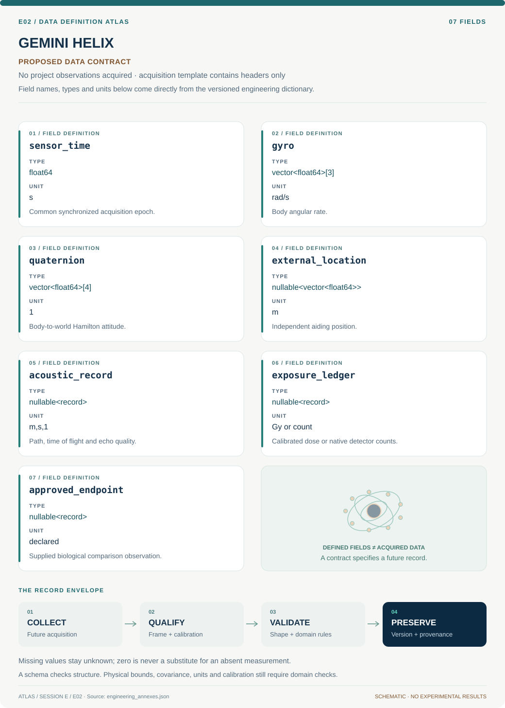

# E02 · Data blueprint

[GEMINI HELIX](../README.md) · [Figure gallery](../figures/README.md) · [Data atlas](../../../../data/README.md)

**PROPOSED CONTRACT · 7 fields · no project observations acquired.** The acquisition CSV contains column headers only. The diagram is a visual record specification, not measured data.

| Download | What it contains |
| --- | --- |
| [Acquisition CSV](acquisition.csv) | Empty columns ready for controlled acquisition |
| [Field dictionary](dictionary.csv) | Names, source types, units, meanings and quality rules |
| [JSON Schema](schema.json) | Nullable record structure with unit and quality metadata |

## Field reference

| Field | Type | Unit | Meaning | Quality / missingness |
| --- | --- | --- | --- | --- |
| sensor_time | float64 | s | Common synchronized acquisition epoch. | Clock offset/skew uncertainty required. |
| gyro | vector<float64>[3] | rad/s | Body angular rate. | Axes/signs and bias covariance retained. |
| quaternion | vector<float64>[4] | 1 | Body-to-world Hamilton attitude. | Scalar ordering and normalization required. |
| external_location | nullable<vector<float64>> | m | Independent aiding position. | Reference frame and measurement covariance. |
| acoustic_record | nullable<record> | m,s,1 | Path, time of flight and echo quality. | One/round-trip and delay calibration explicit. |
| exposure_ledger | nullable<record> | Gy or count | Calibrated dose or native detector counts. | Units reflect calibration status; no implicit conversion. |
| approved_endpoint | nullable<record> | declared | Supplied biological comparison observation. | Approval/source and handling controls; missing null. |

## Acquisition and provenance

Null means missing or unknown; record its cause. Preserve product identifier, retrieval timestamp, source hash, calibration, coordinate and time frame, covariance basis, selection rules and every transformation. JSON Schema checks structure; physical bounds and the quality rules above require domain validation.

- [Arizona Space Grant ASCEND program](https://spacegrant.arizona.edu/research/ascend) — archive or acquisition resource; inclusion here does not assert that its data have been retrieved.
- [NASA NAIRAS 3.0 model and RaD-X resources](https://ccmc.gsfc.nasa.gov/models/NAIRAS~3.0/) — archive or acquisition resource; inclusion here does not assert that its data have been retrieved.

[Controlled data-management procedure](../../../../engineering/DATA_MANAGEMENT.md)
