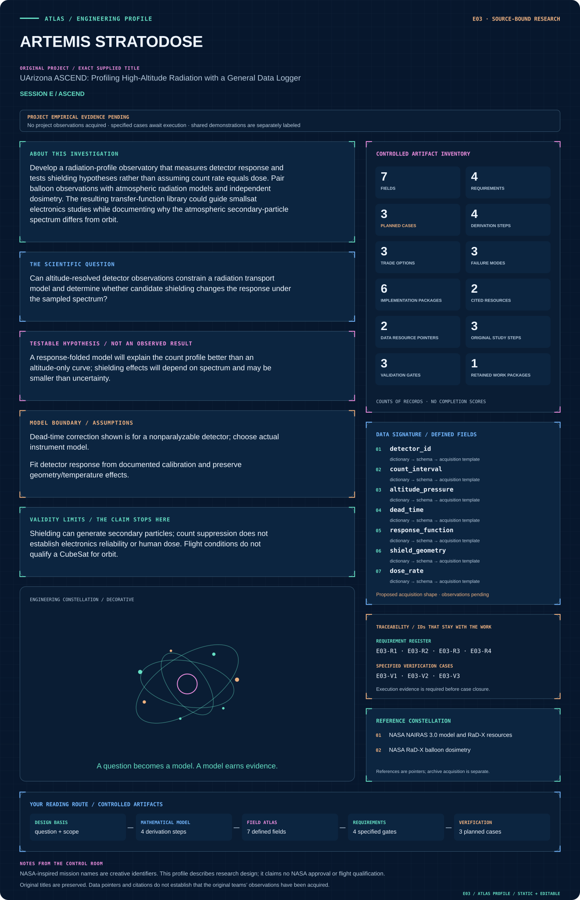

# E03 · ARTEMIS STRATODOSE

**Original project:** UArizona ASCEND: Profiling High-Altitude Radiation with a General Data Logger

**Session E:** ASCEND

**Document class:** engineering research design and analysis record · **Revision:** 4 · **Date:** 2026-10-02

**Evidence state:** design basis, mathematical formulation and verification plan documented. Project-specific empirical results remain to be acquired; executable shared model demonstrations have their own recorded checks.

[Session E](../README.md) · [All projects](../../../ENGINEERING_DOCUMENTATION.md) · [Session handbook](../../../handbooks/SESSION_E.md) · [← E02](../E02-gemini-helix/README.md) · [E04 →](../E04-aura-vertical/README.md)

| Proposed requirements | Specified verification cases | Defined data fields | Cited resources |
| ---: | ---: | ---: | ---: |
| 4 | 3 | 7 | 2 |

[Explore the data blueprint](data/README.md) · [Open the figure gallery](figures/README.md) · [Download acquisition template](data/acquisition.csv) · [Browse the data atlas](../../../data/README.md)

---

## Mission profile



| Profile panel | Engineering signal | Open the evidence |
| --- | --- | --- |
| Mission identity | UArizona ASCEND: Profiling High-Altitude Radiation with a General Data Logger | [Scientific objective](#purpose-and-scientific-objective) |
| Model cockpit | 3 governing expressions; 4 derivation steps; declared assumptions and validity envelope | [Mathematical formulation](#4-mathematical-model-and-derivation) |
| Data blueprint | 7 proposed fields with types, units and quality rules | [Field map & downloads](data/README.md) |
| Verification queue | 4 proposed requirements; 3 specified cases; project execution evidence pending | [Case definitions](#8-verification-and-validation-cases) |
| Figure wall | Architecture, field map, planned result description; included shared illustration | [Open full gallery](figures/README.md) |
| Resource library | 2 cited primary resources with support statements | [Cited resources](#12-cited-technical-and-scientific-resources) |

### Model cockpit

**Analysis method:** Fit Poisson observations in pressure/altitude bins, folding NAIRAS predictions through detector response. Compare paired shield configurations with matched geometry and exposure duration, and include overdispersion tests. Avoid extrapolation beyond measured energy sensitivity.

**Operating envelope:** Shielding can generate secondary particles; count suppression does not establish electronics reliability or human dose. Flight conditions do not qualify a CubeSat for orbit.

**Variables and conventions**

- Phi differential particle flux; R detector effective response
- tau detector dead time s; n count rate 1/s; h altitude m
- D dose rate Gy/s only for a validated response S

### Artifact wall


Shared illustration with a narrower domain than the project model. [Read its parameters, evidence class and checks](../../../models/README.md).

**Scientific result to produce:** Altitude-count posterior and response-folded model band; shielding effect forest plot with no assumed benefit.

### Investigation feed · planned work

The feed records proposed work packages. A row becomes executed evidence only with versioned inputs, outputs and a reviewed result.

| Sequence | Evidence state | Engineering work package |
| --- | --- | --- |
| 01 | Planned | Create detector_calibration_manifest.json and time_basis_schema.json. |
| 02 | Planned | Implement altitude_bin_adapter.py and response_fold.py. |
| 03 | Planned | Build count_likelihood.py with background/overdispersion options. |
| 04 | Planned | Create nonparalyzable_deadtime.py with inverse-domain fixtures. |
| 05 | Planned | Implement shield_comparison.py and optional qualified_dose.py. |
| 06 | Planned | Publish count_profile_holdout.ipynb and outputs with null dose when unsupported. |

### Mission connections

Connections are reading routes based on actual shared resources, supplied sessions or included illustrations. They do not establish physical dependencies, team collaborations or validated results.

| Connected mission | Original investigation | Recorded connection basis |
| --- | --- | --- |
| [E06 · APOLLO THERMALIS](../E06-apollo-thermalis/README.md) | Study of Thermal Heat Transfer Within a High-Altitude Balloon Payload | Session E; Included illustration: 03_balloon_thermal |
| [E02 · GEMINI HELIX](../E02-gemini-helix/README.md) | Project Helix | Session E; [NASA NAIRAS 3.0 model and RaD-X resources](https://ccmc.gsfc.nasa.gov/models/NAIRAS~3.0/) |
| [E01 · APOLLO HELIOSCOPE](../E01-apollo-helioscope/README.md) | Phoenix College: Video Streaming and DNA Studies | Session E; [NASA RaD-X balloon dosimetry](https://www.nasa.gov/science-research/heliophysics/nasa-studies-cosmic-radiation-to-protect-high-altitude-travelers/) |
| [I05 · PIONEER AERODRIFT](../../I/I05-pioneer-aerodrift/README.md) | Pico Balloon Platform for Atmospheric Exploration | Included illustration: 03_balloon_thermal |
| [E04 · AURA VERTICAL](../E04-aura-vertical/README.md) | A Measurement of the Concentration of Greenhouse Gases as Altitude Increases | Session E |
| [E05 · ORION TRUSS](../E05-orion-truss/README.md) | EagleSat Team: Design and Refinement of 3U CubeSat Structure | Session E |

[Machine-readable connection register and ranking rule](../../../registry/mission_connections.json)

### Reading playlist

| Route | Start here | Continue to |
| --- | --- | --- |
| Understand the idea | [Scientific objective](#purpose-and-scientific-objective) | [Design boundary](#1-design-basis-and-analysis-boundary) → [Mathematics](#4-mathematical-model-and-derivation) |
| Inspect the data | [Visual blueprint](data/README.md) | [Provenance](#5-data-specifications-and-provenance) → [Uncertainty](#6-uncertainty-sensitivity-and-identifiability) |
| Make a design decision | [Trade study](#7-engineering-trade-study) | [Failure modes](#10-failure-modes-and-interpretation-controls) → [Required outputs](#11-required-engineering-outputs) |
| Prepare execution | [Requirements](#2-requirements-and-verification-traceability) | [Verification](#8-verification-and-validation-cases) → [Implementation](#9-implementation-and-reproducible-work-packages) |

## Complete engineering dossier

The profile above is a browsing layer. The full design basis, equations, derivations, data contract, uncertainty, trades and controlled case definitions follow.

## Purpose and scientific objective

Develop a radiation-profile observatory that measures detector response and tests shielding hypotheses rather than assuming count rate equals dose. Pair balloon observations with atmospheric radiation models and independent dosimetry. The resulting transfer-function library could guide smallsat electronics studies while documenting why the atmospheric secondary-particle spectrum differs from orbit.

**Question:** Can altitude-resolved detector observations constrain a radiation transport model and determine whether candidate shielding changes the response under the sampled spectrum?

**Testable hypothesis:** A response-folded model will explain the count profile better than an altitude-only curve; shielding effects will depend on spectrum and may be smaller than uncertainty.

## 1. Design basis and analysis boundary

The radiation profiling system models native detector counts versus altitude/pressure and compares response-folded environmental predictions. Its boundary includes detector geometry, energy/angular sensitivity, dead time, background and flight timestamps. Shield comparisons measure detector-response changes under sampled spectra; count suppression is not equivalent to reduced human dose or orbital electronics qualification.

Begin with Poisson count likelihood and instrument-specific dead-time/background calibration, then add overdispersion and paired shield effects. NAIRAS predictions are folded through the detector rather than compared directly with counts in incompatible units. Absorbed-dose output is optional and requires an independently validated response function.

## 2. Requirements and verification traceability

These are project design requirements or proposed analysis gates. A numerical target is not a NASA requirement unless its controlling source is explicitly identified. “TBD” identifies evidence required before a decision; it is not permission to assume a value. Verification evidence listed here is planned, unless a linked result explicitly records execution.

| ID | Requirement / gate | Engineering rationale | Verification method | Basis / required evidence |
| --- | --- | --- | --- | --- |
| E03-R1 | Count observations shall preserve elapsed/live time, background and dead-time model. | Rate and correction depend on acquisition convention. | Replay nonparalyzable analytic fixtures and timing ledger. | Corrected instrument-response contract. |
| E03-R2 | No Gy or Gy/s output shall be generated without validated energy/angular dose response. | A generic count cannot establish absorbed dose. | Schema rejects missing conversion/calibration. | Count-versus-dose requirement. |
| E03-R3 | Shield comparisons shall match geometry, exposure time and environmental conditions or model their differences. | Changing placement can imitate shielding benefit. | Paired-bin/geometry audit and nuisance sensitivity. | Detector comparison requirement. |
| E03-R4 | Proposed profile gate: predicted count intervals cover held-out altitude bins at nominal 95% with uncertainty in coverage. | A good fitted profile needs external check. | Block holdout by flight/altitude segment. | Proposed calibration criterion; no new profile result. |

## 3. Architecture and controlled interfaces

Detector records retain raw counts and acquisition intervals with temperature, geometry and shield ID. A clock/altitude adapter maps GPS/pressure to exposure bins while preserving horizontal drift. A radiation-model adapter supplies differential species/energy/angular flux and source version.

The response-folding module predicts expected counts and background; the observation likelihood includes the selected dead-time convention. Shield changes alter response and secondary-particle uncertainty, not merely multiply a universal attenuation factor. A separate dose branch is enabled only by calibrated energy deposition sensitivity. Outputs distinguish count rate, model residual and qualified dose.



Environmental spectra are folded through detector response before count comparison. The dose branch requires its own validated sensitivity; shield response changes cannot automatically establish human-dose or orbital reliability benefits.

[Editable engineering diagram source](figures/architecture.mmd)

## 4. Mathematical model and derivation

### Governing equations

```text
N_i ~ Poisson(dt_i*integral R_i(E,Omega)*Phi(E,Omega,h,t)dE dOmega + B_i)
```

```text
n_true=n_obs/(1-n_obs*tau)
```

```text
D=integral Phi(E)*S(E)dE
```

### Variables, units and conventions

- Phi differential particle flux; R detector effective response
- tau detector dead time s; n count rate 1/s; h altitude m
- D dose rate Gy/s only for a validated response S

### Assumptions and boundary conditions

- Dead-time correction shown is for a nonparalyzable detector; choose actual instrument model.
- Fit detector response from documented calibration and preserve geometry/temperature effects.

### Derivation step 1

$$
\lambda_i=\Delta t_i\int R_i(E,\Omega)\Phi(E,\Omega,h,t)dEd\Omega+B_i
$$

Response R includes effective area/efficiency so folded flux is counts/s; B is expected background counts, not an unconverted rate. Time-varying bins may require integration over t.

### Derivation step 2

$$
N_i\sim Poisson(\lambda_i);\quad Var(N_i)=\lambda_i
$$

The likelihood follows independent arrivals under its assumptions. Extra variance from environment or detector clustering requires a tested alternative, not inflated confidence.

### Derivation step 3

$$
n_{obs}=n_{true}/(1+n_{true}\tau);\quad n_{true}=n_{obs}/(1-n_{obs}\tau)
$$

Nonparalyzable dead time loses fraction of elapsed time to blocked arrivals. The inverse becomes unstable near n_obs tau=1; paralyzable detectors need another equation.

### Derivation step 4

$$
\dot D=\int S_D(E,\Omega)\Phi(E,\Omega)dEd\Omega
$$

S_D must map fluence rate to Gy/s for the declared material/geometry. Dose is time integral of this rate, and cannot be substituted by detector R without calibration.

### Inference or simulation procedure

Fit Poisson observations in pressure/altitude bins, folding NAIRAS predictions through detector response. Compare paired shield configurations with matched geometry and exposure duration, and include overdispersion tests. Avoid extrapolation beyond measured energy sensitivity.

### Validity domain and fidelity limits

Shielding can generate secondary particles; count suppression does not establish electronics reliability or human dose. Flight conditions do not qualify a CubeSat for orbit.

## 5. Data specifications and provenance


**Proposed data contract · observations pending.** This visual inventory shows the record fields to acquire or derive. It contains no project measurements. [Open the data blueprint and downloads](data/README.md).

| Field | Type | Unit | Physical / statistical meaning | Quality and missing-data rule |
| --- | --- | --- | --- | --- |
| detector_id | string | 1 | Instrument/response configuration. | Geometry, species sensitivity and version required. |
| count_interval | record | count,s | Raw count and elapsed/live acquisition time. | Time basis explicit; zero count is valid. |
| altitude_pressure | record | m,Pa | Flight environmental bin. | Time/geolocation covariance retained. |
| dead_time | nullable<float64> | s | Calibrated detector tau. | Model type/domain required; unknown null. |
| response_function | nullable<table> | effective area | Detector energy/angular response. | Missing energy domain flagged, not extrapolated. |
| shield_geometry | record | m,kg | Material placement and configuration. | Matched reference geometry required. |
| dose_rate | nullable<float64> | Gy/s | Qualified absorbed-dose prediction. | Only populated with validated S_D and material basis. |

[Machine-readable record schema](data/schema.json) · [Empty acquisition CSV](data/acquisition.csv) · [Field dictionary CSV](data/dictionary.csv)

The CSV above contains column headers only. Its schema defines future records and does not establish that original-team data or a particular archive product have been acquired. Frame, timing, calibration, covariance, selection and provenance details must accompany populated records.

### NASA NAIRAS 3.0 model and RaD-X resources

[Product, archive or reference](https://ccmc.gsfc.nasa.gov/models/NAIRAS~3.0/)

**Fields:** UTC, geolocation, pressure, altitude, counts, integration time, dead time, detector temperature, shielding configuration and calibration matrix

**Access:** Public reference or archive pointer. Original team measurements are not supplied. Confirm product-level access, version and license; a linked paper does not imply its raw data are downloadable.

**Role:** Comparison/model context; prospective measurement schema is listed separately.

### NASA RaD-X balloon dosimetry

[Product, archive or reference](https://www.nasa.gov/science-research/heliophysics/nasa-studies-cosmic-radiation-to-protect-high-altitude-travelers/)

**Fields:** Independent benchmark metadata, reference assumptions and calibration context; select actual products before execution.

**Access:** Public reference or archive pointer. Original team measurements are not supplied. Confirm product-level access, version and license; a linked paper does not imply its raw data are downloadable.

**Role:** Comparison/model context; prospective measurement schema is listed separately.

## 6. Uncertainty, sensitivity and identifiability

At appreciable dead-time occupancy, observed arrivals are not an exact Poisson process; use a calibrated renewal likelihood or restrict the Poisson branch to low occupancy. Counting noise, background, dead-time uncertainty, temperature response and altitude timing affect the native profile. Environmental spectrum and detector angular response share directional uncertainty. Shielding can create secondaries, leaving different instruments with different count changes under the same physical field.

Propagate response/calibration ensembles through flux folding and profile tau near its valid rate range. Test overdispersion with residuals clustered by flight interval. Hold out altitude/trajectory blocks and compare shield effects under spectral alternatives. Publish count changes separately when dose response or spectrum is too uncertain for energy-deposition inference.

## 7. Engineering trade study

| Alternative | Benefit | Cost / limitation | Decision rule |
| --- | --- | --- | --- |
| Native count profile | Direct auditable observation. | Instrument-specific physical meaning. | Primary output without dose calibration. |
| Response-folded model comparison | Connects spectrum to observations. | Response/environment uncertainty. | Use with documented sensitivity domain. |
| Qualified dose reconstruction | More relevant deposition quantity. | Requires calibrated material response. | Enable only after independent conversion evidence. |

## 8. Verification and validation cases

| Case ID | Stimulus / condition | Expected result / criterion | Method | Evidence artifact |
| --- | --- | --- | --- | --- |
| E03-V1 | No dead time | As tau tends zero, corrected rate equals observed rate. | Analytic inversion fixture. | Detector model limit. |
| E03-V2 | Zero flux/background | Expected count lambda zero; positive observed count is incompatible with that exact model. | Likelihood endpoint fixture. | Poisson definition. |
| E03-V3 | Missing dose sensitivity | Count profile remains available while dose output is null. | Integration test with R present and S_D absent. | Information boundary; measured results pending. |

**Execution status:** these cases are specified, not claimed as executed. Close a case only with the versioned inputs, output, uncertainty, reviewer and pass/fail rationale.

### Additional scientific validation gates

- Check Poisson coverage using simulated counts before any science fit.
- Proposed gate: model uncertainty intervals include independently calibrated count rate across >=90% of valid profile bins.
- Require paired-shield inference to remain stable under background, spectral and dead-time sensitivity analysis.

## 9. Implementation and reproducible work packages

1. Create detector_calibration_manifest.json and time_basis_schema.json.
2. Implement altitude_bin_adapter.py and response_fold.py.
3. Build count_likelihood.py with background/overdispersion options.
4. Create nonparalyzable_deadtime.py with inverse-domain fixtures.
5. Implement shield_comparison.py and optional qualified_dose.py.
6. Publish count_profile_holdout.ipynb and outputs with null dose when unsupported.

### Investigation sequence

1. Write detector response and background requirements; obtain calibration records and NAIRAS run metadata.
2. Run synthetic injection/recovery with known backgrounds and missed samples.
3. Compare flight data against independent dosimeter/model output and publish null shielding results if uncertainties dominate.

### Resources and interfaces to expertise

- Radiation instrumentation scientist, embedded programmer and transport-model analyst.
- Characterized detector, passive/reference dosimeter, environmental recorder and archival model access.

## 10. Failure modes and interpretation controls

| Failure mode | Effect on result | Detection / evidence | Design response |
| --- | --- | --- | --- |
| Paralyzable mismatch | Wrong high-rate correction. | Calibration-model inconsistency. | Actual instrument dead-time model. |
| Count decrease called dose benefit | Unsupported shielding claim. | Unit/response audit. | Separate response and qualified dose. |
| Geometry changes ignored | False shield effect. | Paired configuration mismatch. | Matched placement or explicit response model. |

- Background and detector temperature can imitate an altitude trend.
- Uncalibrated detector response prevents dose claims.

## 11. Required engineering outputs

- Versioned analysis configuration, raw-to-derived provenance and uncertainty report.
- Project-specific model comparison, a publication figure with units, and an explicit outcome including inconclusive findings.

### Scientific result figures to produce during execution

Altitude-count posterior and response-folded model band; shielding effect forest plot with no assumed benefit.

### Included shared numerical starting point


[Executable formulation, parameters, tabular outputs, provenance and verification](../../../models/README.md). This shared demonstration has a narrower domain than the project model above. Its own caption and methods identify synthetic parameters or the separately retrieved public catalog; it is not a completed result of the original project.

## 12. Cited technical and scientific resources

- [NASA NAIRAS 3.0 model and RaD-X resources](https://ccmc.gsfc.nasa.gov/models/NAIRAS~3.0/) — Radiation environment model and independent comparison resources.
- [NASA RaD-X balloon dosimetry](https://www.nasa.gov/science-research/heliophysics/nasa-studies-cosmic-radiation-to-protect-high-altitude-travelers/) — Balloon radiation measurement precedent.

Framework and evidence rules: [engineering documentation standard](../../../engineering/ENGINEERING_STANDARD.md), [model assurance](../../../engineering/MODEL_ASSURANCE.md), [uncertainty procedure](../../../engineering/UNCERTAINTY_AND_DECISION_RULES.md), [data management](../../../engineering/DATA_MANAGEMENT.md). NASA-inspired names are creative identifiers; requirements and results are not NASA certification.
