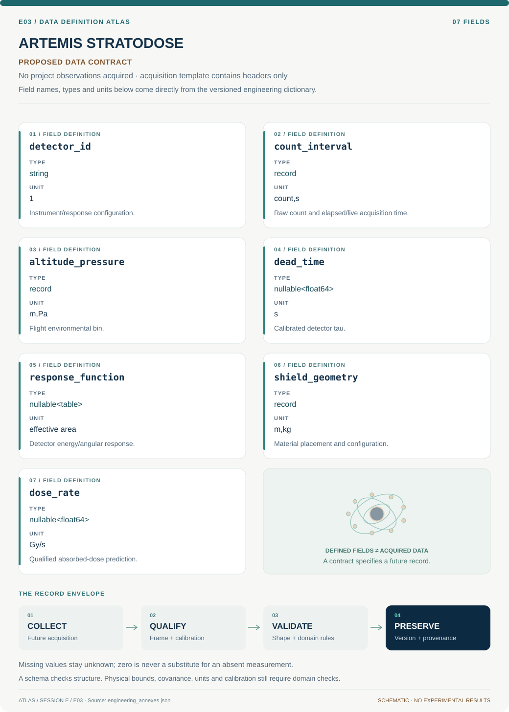

# E03 · Data blueprint

[ARTEMIS STRATODOSE](../README.md) · [Figure gallery](../figures/README.md) · [Data atlas](../../../../data/README.md)

**PROPOSED CONTRACT · 7 fields · no project observations acquired.** The acquisition CSV contains column headers only. The diagram is a visual record specification, not measured data.

| Download | What it contains |
| --- | --- |
| [Acquisition CSV](acquisition.csv) | Empty columns ready for controlled acquisition |
| [Field dictionary](dictionary.csv) | Names, source types, units, meanings and quality rules |
| [JSON Schema](schema.json) | Nullable record structure with unit and quality metadata |

## Field reference

| Field | Type | Unit | Meaning | Quality / missingness |
| --- | --- | --- | --- | --- |
| detector_id | string | 1 | Instrument/response configuration. | Geometry, species sensitivity and version required. |
| count_interval | record | count,s | Raw count and elapsed/live acquisition time. | Time basis explicit; zero count is valid. |
| altitude_pressure | record | m,Pa | Flight environmental bin. | Time/geolocation covariance retained. |
| dead_time | nullable<float64> | s | Calibrated detector tau. | Model type/domain required; unknown null. |
| response_function | nullable<table> | effective area | Detector energy/angular response. | Missing energy domain flagged, not extrapolated. |
| shield_geometry | record | m,kg | Material placement and configuration. | Matched reference geometry required. |
| dose_rate | nullable<float64> | Gy/s | Qualified absorbed-dose prediction. | Only populated with validated S_D and material basis. |

## Acquisition and provenance

Null means missing or unknown; record its cause. Preserve product identifier, retrieval timestamp, source hash, calibration, coordinate and time frame, covariance basis, selection rules and every transformation. JSON Schema checks structure; physical bounds and the quality rules above require domain validation.

- [NASA NAIRAS 3.0 model and RaD-X resources](https://ccmc.gsfc.nasa.gov/models/NAIRAS~3.0/) — archive or acquisition resource; inclusion here does not assert that its data have been retrieved.
- [NASA RaD-X balloon dosimetry](https://www.nasa.gov/science-research/heliophysics/nasa-studies-cosmic-radiation-to-protect-high-altitude-travelers/) — archive or acquisition resource; inclusion here does not assert that its data have been retrieved.

[Controlled data-management procedure](../../../../engineering/DATA_MANAGEMENT.md)

## Included evidence to explore

[Data atlas: tables, model definitions and provenance](../../../../data/README.md). Shared reduced-model evidence has a narrower domain than this project contract.
