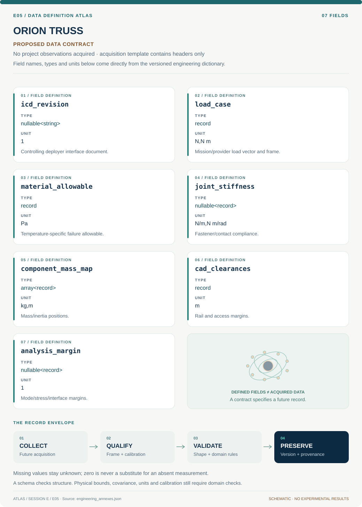
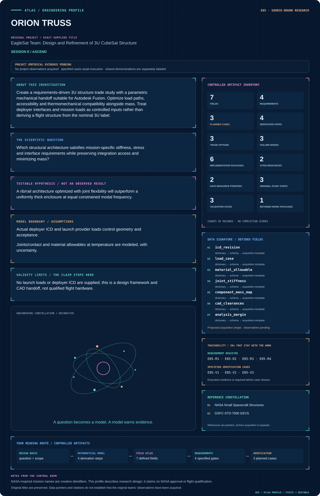

# E05 · Figure gallery

[ORION TRUSS](../README.md) · [Data blueprint](../data/README.md) · [Data diagnostic gallery](../../../../data/figures/README.md)

## Engineering architecture

Controlled interfaces and loads feed independent structural branches and an integration checker. The candidate trade retains missing-input gates and cannot be rendered as qualified CubeSat hardware.

[SVG](architecture.svg) · [Editable Mermaid source](architecture.mmd)

## Data blueprint

**Proposed contract · observations pending.** Every field, type, unit and meaning comes from the controlled dictionary. [Open SVG](data-map.svg) · [Download dictionary](../data/dictionary.csv)

## Mission profile

The scientific question, hypothesis, model boundary and document metadata are drawn from controlled sources. Proposed work remains distinguished from acquired evidence. [Open SVG](mission-profile.svg)

## Planned scientific result

Pareto plot of mass versus first mode plus load-path/keep-out assembly diagram; all CAD geometry is conceptual until ICD-controlled.

This final scientific result remains an execution deliverable; the design diagrams do not establish an empirical finding.
