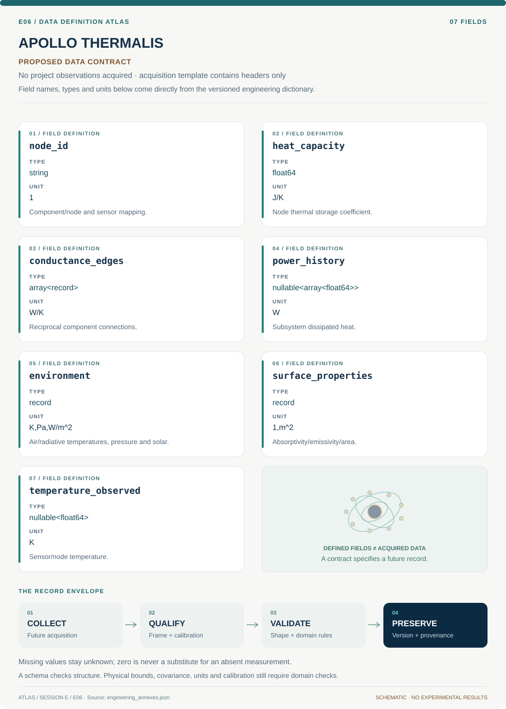
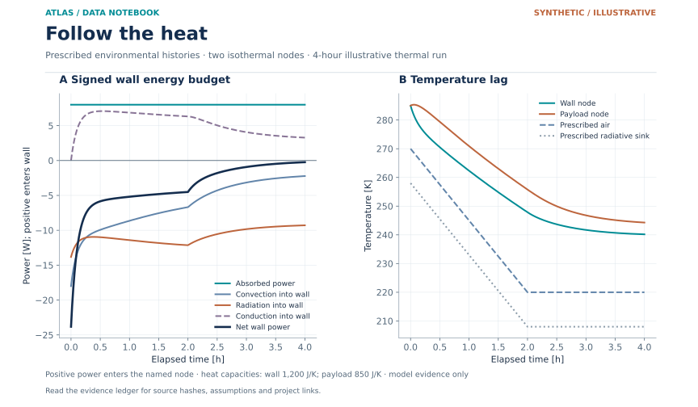

# E06 · APOLLO THERMALIS

**Original project:** Study of Thermal Heat Transfer Within a High-Altitude Balloon Payload

**Session E:** ASCEND

**Document class:** engineering research design and analysis record · **Revision:** 3 · **Date:** 2026-10-02

**Evidence state:** design basis, mathematical formulation and verification plan documented. Project-specific empirical results remain to be acquired; executable shared model demonstrations have their own recorded checks.

[Session E](../README.md) · [All projects](../../../ENGINEERING_DOCUMENTATION.md) · [Session handbook](../../../handbooks/SESSION_E.md) · [← E05](../E05-orion-truss/README.md) · [E07 →](../E07-discovery-trident/README.md)

| Proposed requirements | Specified verification cases | Defined data fields | Cited resources |
| ---: | ---: | ---: | ---: |
| 4 | 3 | 7 | 2 |

[Explore the data blueprint](data/README.md) · [Open the figure gallery](figures/README.md) · [Download acquisition template](data/acquisition.csv) · [Browse the data atlas](../../../data/README.md)

---

## Purpose and scientific objective

Develop a balloon thermal digital model that explains component temperatures under sunlight, changing air density and internal power. Connect a lumped network to measured surface properties and weather trajectories. The proposed decision tool predicts time spent outside component limits and identifies which uncertainty most deserves a new measurement.

**Question:** Can a calibrated thermal network predict payload hotspots through ascent and descent without relying on a single ambient-temperature curve?

**Testable hypothesis:** Solar absorptivity, electronics dissipation and reduced convection will explain temperature differences between otherwise similar payloads.

## 1. Design basis and analysis boundary

The payload thermal model separates component storage, conduction, solar/radiative exchange and residual convection throughout ascent and descent. Its boundary includes electrical power, orientation, surrounding radiative temperature and atmospheric state. A single ambient-temperature curve cannot determine internal hotspots, and spacecraft vacuum assumptions cannot simply replace balloon convection.

Begin with identifiable lumped nodes and independent transients. Add spatial conduction where internal gradients exceed the justified lumped envelope. Radiation view factors and convective coefficients vary with flight state; fitting them all from one temperature trace is generally nonidentifying. Hotspot predictions remain tied to component-specific limits supplied by actual requirements.

## 2. Requirements and verification traceability

These are project design requirements or proposed analysis gates. A numerical target is not a NASA requirement unless its controlling source is explicitly identified. “TBD” identifies evidence required before a decision; it is not permission to assume a value. Verification evidence listed here is planned, unless a linked result explicitly records execution.

| ID | Requirement / gate | Engineering rationale | Verification method | Basis / required evidence |
| --- | --- | --- | --- | --- |
| E06-R1 | Every thermal node shall record heat capacity, connection conductance, power and exposed-area/view-factor basis. | Fitted temperature alone can conceal missing pathways. | Inspect network topology and energy-term ledger. | Thermal-model contract. |
| E06-R2 | Proposed lumped screening gate: Bi_eff below 0.1 using the effective surface-transfer coefficient, or independently validated negligible internal gradients; failed nodes use spatial or bounded-gradient models. | Internal gradients undermine a single-node temperature. | Compute h_eff L_c/k with convection, local linearized radiative exchange/view factors and parameter uncertainty, or measure spatial gradients independently. | Proposed screening choice, not universal validity. |
| E06-R3 | Proposed closed-network energy residual target is 10^-6 of injected energy. | Internal conduction must not create heat. | Integrate storage and boundary terms. | Proposed numerical gate. |
| E06-R4 | Hotspot predictions shall include withheld transient/flight validation and supplied component limits. | Nominal mean temperature is insufficient. | Compare prediction intervals and requirement-source limits. | Validation contract; temperatures/limits TBD. |

## 3. Architecture and controlled interfaces

A node registry assigns component coordinates, C in J/K and internal power in W. Conductance edges G in W/K are symmetric where representing reciprocal conduction. Environmental adapters supply air temperature/pressure, solar flux and radiative surroundings plus orientation-dependent projected area.

The time integrator evaluates fourth-power radiation in K and convection from declared h. A measurement adapter maps sensor locations to node or spatial temperatures with lag/bias. An identifiability module distinguishes fitted conductance from unknown view factor; outputs include each energy term and missing-load flags so that unexplained heating cannot disappear into one effective coefficient.



Storage, reciprocal conduction and external radiation/convection remain distinct. The Bi/gradient gate determines when spatial fidelity is needed, while the ledger exposes missing power or view-factor assumptions.

[Editable engineering diagram source](figures/architecture.mmd)

## 4. Mathematical model and derivation

### Governing equations

```text
C_i*dT_i/dt=Q_i+sum G_ij*(T_j-T_i)+alpha_i*S*A_proj-epsilon_i*sigma*A_i*(T_i^4-T_rad^4)-h_i*A_i*(T_i-T_air)
```

```text
Bi_eff=h_eff*L_c/k; h_eff includes convection and locally linearized radiation/view-factor coupling. Bi_conv=h_conv*L_c/k alone cannot establish lumped validity under dominant radiation.
```

### Variables, units and conventions

- C J/K; G W/K; Q W; temperatures K
- sigma Stefan-Boltzmann constant W/(m^2 K^4)
- h_conv and h_eff W/(m^2 K); Bi dimensionless. Use effective transfer or independently validate internal gradients.

### Assumptions and boundary conditions

- A lumped component is appropriate only when internal gradients are small; use spatial models otherwise.
- Radiation view factors and convection vary with flight state and orientation.

### Derivation step 1

$$
C_i\dot T_i=Q_i+\sum_jG_{ij}(T_j-T_i)+Q_{solar,i}-Q_{rad,i}-Q_{conv,i}
$$

Each term is W. Positive external flux heats; symmetric internal conductance cancels when summing node energy equations.

### Derivation step 2

$$
Q_{rad}=\epsilon\sigma A(T^4-T_{rad}^4);\quad Q_{conv}=hA(T-T_{air})
$$

Kelvin is mandatory in radiation. Effective surrounding temperature/view factors must represent Earth/sky/other surfaces; convection changes with density/flow.

### Derivation step 3

$$
Bi_{\rm eff}=h_{\rm eff}L_c/k;\quad h_{\rm eff}=h_{\rm conv}+h_{\rm rad};\quad h_{\rm rad}\approx4\epsilon\sigma T_{\rm ref}^3;\quad \tau_{node}\sim C/G_{eff}
$$

This local screening form assumes the radiative view-factor/surrounding-surface model has been included in h_rad; multiple surfaces need the corresponding conductance sum. Dominant radiation cannot be ignored when assessing internal gradients. C/G has seconds and is a local linearized timescale, not a global nonlinear-radiation solution.

### Derivation step 4

$$
\sum_iC_i\Delta T_i=\int\sum_i(Q_i+Q_{solar,i}-Q_{rad,i}-Q_{conv,i})dt
$$

Internal conductive edges cancel from the total ledger. Temperature-dependent capacities require integrating C(T)dT rather than using constant C Delta T.

### Inference or simulation procedure

Estimate identifiable network conductances using separate thermal transients, then propagate environmental and material uncertainty through a time-domain solver. Maintain distinct radiation, conduction and convection terms. Use measured orientation and power to explain heating asymmetry.

### Validity domain and fidelity limits

Small-satellite vacuum context is useful but not identical to a balloon atmosphere. Unknown attitude and view factors can dominate model error.

## 5. Data specifications and provenance



**Proposed data contract · observations pending.** This visual inventory shows the record fields to acquire or derive. It contains no project measurements. [Open the data blueprint and downloads](data/README.md).

| Field | Type | Unit | Physical / statistical meaning | Quality and missing-data rule |
| --- | --- | --- | --- | --- |
| node_id | string | 1 | Component/node and sensor mapping. | Location and lumped/spatial status required. |
| heat_capacity | float64 | J/K | Node thermal storage coefficient. | Positive; temperature dependence/source retained. |
| conductance_edges | array<record> | W/K | Reciprocal component connections. | Nonnegative; symmetry and uncertainty checked. |
| power_history | nullable<array<float64>> | W | Subsystem dissipated heat. | Clock/source required; missing not zero. |
| environment | record | K,Pa,W/m^2 | Air/radiative temperatures, pressure and solar. | Orientation/view-factor context retained. |
| surface_properties | record | 1,m^2 | Absorptivity/emissivity/area. | Spectral distinction and covariance required. |
| temperature_observed | nullable<float64> | K | Sensor/node temperature. | Sensor lag, bias and position uncertainty. |

[Machine-readable record schema](data/schema.json) · [Empty acquisition CSV](data/acquisition.csv) · [Field dictionary CSV](data/dictionary.csv)

The CSV above contains column headers only. Its schema defines future records and does not establish that original-team data or a particular archive product have been acquired. Frame, timing, calibration, covariance, selection and provenance details must accompany populated records.

### NASA balloon thermal environment

[Product, archive or reference](https://lambda.gsfc.nasa.gov/product/websites/TOPHAT/topweb.gsfc.nasa.gov/balloon/inside.html)

**Fields:** UTC, component/surface/air temperatures K, pressure, orientation, irradiance, electrical dissipation, surface absorptivity/emissivity and conductance records

**Access:** Public reference or archive pointer. Original team measurements are not supplied. Confirm product-level access, version and license; a linked paper does not imply its raw data are downloadable.

**Role:** Comparison/model context; prospective measurement schema is listed separately.

### NASA Small Spacecraft Thermal Control

[Product, archive or reference](https://www.nasa.gov/smallsat-institute/sst-soa/thermal-control/)

**Fields:** Independent benchmark metadata, reference assumptions and calibration context; select actual products before execution.

**Access:** Public reference or archive pointer. Original team measurements are not supplied. Confirm product-level access, version and license; a linked paper does not imply its raw data are downloadable.

**Role:** Comparison/model context; prospective measurement schema is listed separately.

## 6. Uncertainty, sensitivity and identifiability

Contact conductance, heat capacity, power dissipation and surface optical properties can correlate. Orientation and view factors affect solar and Earth/sky exchange, while convection uncertainty grows as atmospheric conditions change. Sensor placement and internal gradients create discrepancy distinct from calibration noise.

Fit conductances from independent transients, then profile absorptivity/view factor and h against flight temperature data. Use measured power/orientation as inputs rather than unconstrained fit terms. Block holdout by ascent/descent segment and assess hotspots against prediction envelopes; unresolved thermal pathways remain explicit in energy residuals.

## 7. Engineering trade study

| Alternative | Benefit | Cost / limitation | Decision rule |
| --- | --- | --- | --- |
| Lumped RC network | Fast and interpretable. | Invalid for significant internal gradients. | Use when Bi/gradient checks support it. |
| Spatial conduction model | Resolves sensor/hotspot separation. | More geometry/material requirements. | Apply to failed lumped nodes. |
| Effective fitted thermal coefficient | Simple empirical prediction. | Confounds radiation/convection/conduction. | Use only as labeled baseline within calibrated environment. |

## 8. Verification and validation cases

| Case ID | Stimulus / condition | Expected result / criterion | Method | Evidence artifact |
| --- | --- | --- | --- | --- |
| E06-V1 | Two isolated nodes | Temperatures approach energy-weighted equilibrium; total heat conserved. | Compare symmetric-edge ODE with analytic decay. | Conduction conservation. |
| E06-V2 | Equal environment temperature | With T=T_air=T_rad and zero solar/internal heat, net flux is zero. | Full model endpoint fixture. | Radiation/convection identities. |
| E06-V3 | Radiation unit fault | Celsius input rejected or converted before fourth power. | Typed temperature integration test. | Kelvin requirement; actual flight fit pending. |

**Execution status:** these cases are specified, not claimed as executed. Close a case only with the versioned inputs, output, uncertainty, reviewer and pass/fail rationale.

### Additional scientific validation gates

- Proposed gate: held-out component predictions within 5 K and peak timing within one sensor-response interval; adapt limits to science need.
- Verify zero-source cooling and steady energy-balance limits in the solver.
- Compare model residuals across sun/shade and ascent/descent to diagnose missing physics.

## 9. Implementation and reproducible work packages

1. Create thermal_nodes_edges.yaml with sensor geometry and reciprocal conductance.
2. Build environment_orientation_adapter.py and radiative_view_factors.json.
3. Implement thermal_network.py with analytic two-node fixtures.
4. Create energy_ledger.py and Bi_gradient_checker.py.
5. Build calibration_identifiability.ipynb and optional spatial_node_model.json.
6. Publish hotspot_predictions.parquet and withheld-flight validation with supplied limits pending.

### Investigation sequence

1. Define component limits, sensor placement and thermal-node boundaries.
2. Fit conductances on calibration transients with independent power measurement.
3. Predict a held-out trajectory and evaluate peak-temperature and limit-duration errors.

### Resources and interfaces to expertise

- Thermal engineer and embedded instrumentation collaborator.
- Temperature references, power meter, surface-property records and network solver.

## 10. Failure modes and interpretation controls

| Failure mode | Effect on result | Detection / evidence | Design response |
| --- | --- | --- | --- |
| Celsius fourth power | Large radiation error. | Unit validator. | Kelvin-only solver interface. |
| Asymmetric internal edge | Artificial heat creation. | Global ledger residual. | Reciprocal conductance or explicit active transfer. |
| Unknown power absorbed into h | False predictive transfer. | Power/load sensitivity. | Measured load contract and identifiability report. |

- Unmodeled sunlight or poor sensor bonding biases hotspot estimates.
- A numerically accurate model can still use the wrong environmental boundary.

## 11. Required engineering outputs

- Versioned analysis configuration, raw-to-derived provenance and uncertainty report.
- Project-specific model comparison, a publication figure with units, and an explicit outcome including inconclusive findings.

### Scientific result figures to produce during execution

Component temperature trajectories with prediction bands and heat-flow contribution panels; included executable reduced thermal example is synthetic.

### Included shared numerical starting point


[Executable formulation, parameters, tabular outputs, provenance and verification](../../../models/README.md). This shared demonstration has a narrower domain than the project model above. Its own caption and methods identify synthetic parameters or the separately retrieved public catalog; it is not a completed result of the original project.

### Data diagnostic



Synthetic two-node balloon thermal model. Signed component powers sum to net wall power, with wall-to-payload conduction reversed for the wall balance. The payload has a prescribed 3 W internal source. Temperatures show the model response to imposed boundary histories; they are not balloon-flight measurements or qualification limits.

[Inputs, downloadable figure and provenance](../../../data/figures/README.md)

## 12. Cited technical and scientific resources

- [NASA balloon thermal environment](https://lambda.gsfc.nasa.gov/product/websites/TOPHAT/topweb.gsfc.nasa.gov/balloon/inside.html) — Radiation and reduced atmospheric cooling context.
- [NASA Small Spacecraft Thermal Control](https://www.nasa.gov/smallsat-institute/sst-soa/thermal-control/) — Thermal-control architecture context.

Framework and evidence rules: [engineering documentation standard](../../../engineering/ENGINEERING_STANDARD.md), [model assurance](../../../engineering/MODEL_ASSURANCE.md), [uncertainty procedure](../../../engineering/UNCERTAINTY_AND_DECISION_RULES.md), [data management](../../../engineering/DATA_MANAGEMENT.md). NASA-inspired names are creative identifiers; requirements and results are not NASA certification.
