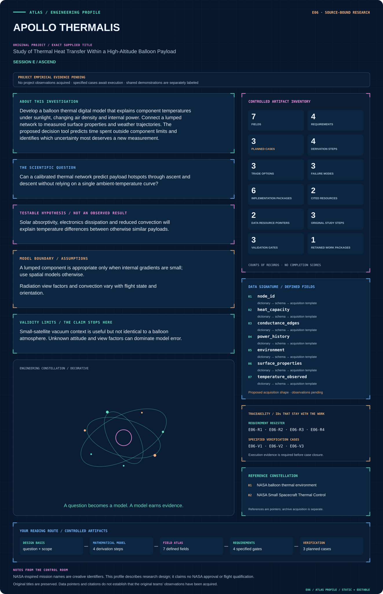

# E06 · Figure gallery

[APOLLO THERMALIS](../README.md) · [Data blueprint](../data/README.md) · [Data diagnostic gallery](../../../../data/figures/README.md)

## Engineering architecture

Storage, reciprocal conduction and external radiation/convection remain distinct. The Bi/gradient gate determines when spatial fidelity is needed, while the ledger exposes missing power or view-factor assumptions.

[SVG](architecture.svg) · [Editable Mermaid source](architecture.mmd)

## Data blueprint

**Proposed contract · observations pending.** Every field, type, unit and meaning comes from the controlled dictionary. [Open SVG](data-map.svg) · [Download dictionary](../data/dictionary.csv)

## Mission profile

The scientific question, hypothesis, model boundary and document metadata are drawn from controlled sources. Proposed work remains distinguished from acquired evidence. [Open SVG](mission-profile.svg)

## Data diagnostic

Synthetic two-node balloon thermal model. Signed component powers sum to net wall power, with wall-to-payload conduction reversed for the wall balance. The payload has a prescribed 3 W internal source. Temperatures show the model response to imposed boundary histories; they are not balloon-flight measurements or qualification limits.

[SVG](../../../../data/figures/11_thermal_power_and_response.svg) · [PNG](../../../../data/figures/11_thermal_power_and_response.png) · [Figure provenance](../../../../data/figures/11_thermal_power_and_response.provenance.json)

## Original numerical view

[Model formulation, data, assumptions and executed numerical checks](../../../../models/README.md)

## Planned scientific result

Component temperature trajectories with prediction bands and heat-flow contribution panels; included executable reduced thermal example is synthetic.

This final scientific result remains an execution deliverable; the design diagrams do not establish an empirical finding.
