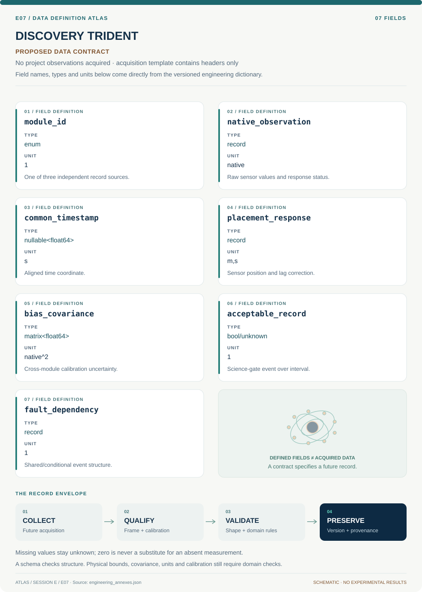

# E07 · Figure gallery

[DISCOVERY TRIDENT](../README.md) · [Data blueprint](../data/README.md) · [Data diagnostic gallery](../../../../data/figures/README.md)

## Engineering architecture

Science availability is conditioned on record comparability and two surviving acceptable records. A separate dependency branch preserves shared faults; pairwise agreement remains distinct from absolute calibration accuracy.

[SVG](architecture.svg) · [Editable Mermaid source](architecture.mmd)

## Data blueprint

**Proposed contract · observations pending.** Every field, type, unit and meaning comes from the controlled dictionary. [Open SVG](data-map.svg) · [Download dictionary](../data/dictionary.csv)

## Planned scientific result

Three-lane timeline showing measured fields, missing data and clock corrections; interface graph shows shared dependencies.

This final scientific result remains an execution deliverable; the design diagrams do not establish an empirical finding.
