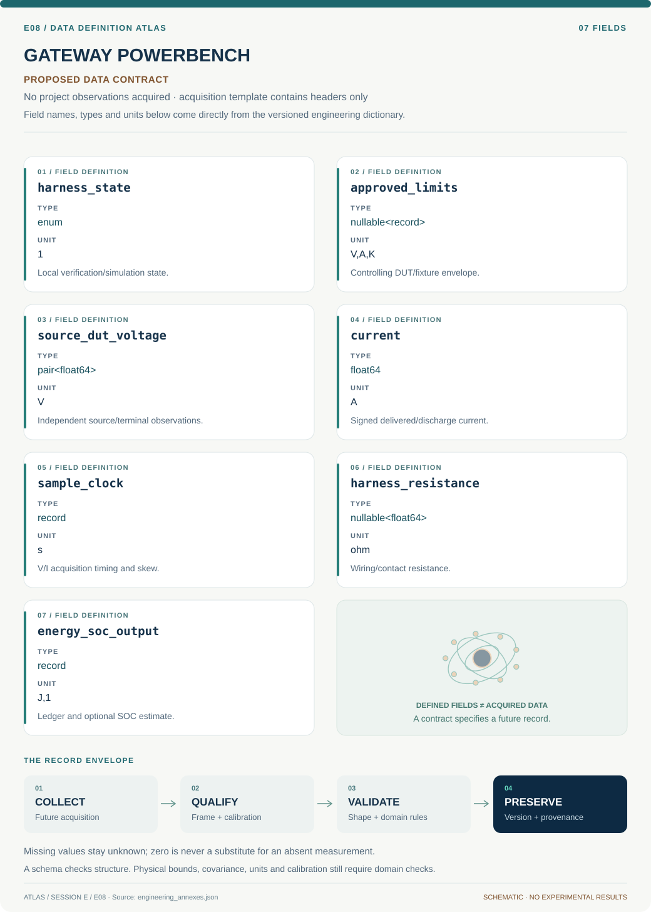
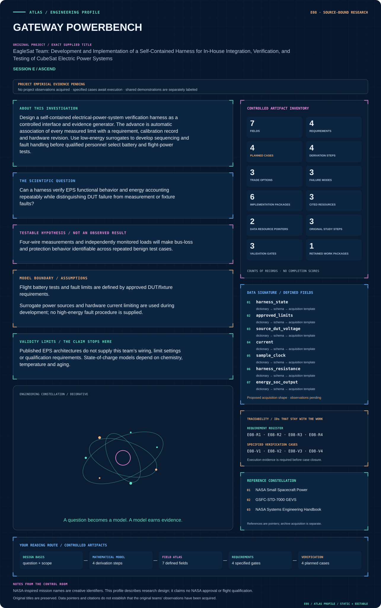

# E08 · Figure gallery

[GATEWAY POWERBENCH](../README.md) · [Data blueprint](../data/README.md) · [Data diagnostic gallery](../../../../data/figures/README.md)

## Engineering architecture

The isolated state machine gates stimulus on controlled limits and separates wiring, sensing and DUT boundaries. Surrogate replay supports reproducibility without high-energy fault procedures or flight qualification claims.

[SVG](architecture.svg) · [Editable Mermaid source](architecture.mmd)

## Data blueprint

**Proposed contract · observations pending.** Every field, type, unit and meaning comes from the controlled dictionary. [Open SVG](data-map.svg) · [Download dictionary](../data/dictionary.csv)

## Mission profile

The scientific question, hypothesis, model boundary and document metadata are drawn from controlled sources. Proposed work remains distinguished from acquired evidence. [Open SVG](mission-profile.svg)

## Planned scientific result

EPS/harness interface schematic and energy balance Sankey using measured data only after acquisition; prospective traceability matrix.

This final scientific result remains an execution deliverable; the design diagrams do not establish an empirical finding.
