# G01 · ARTEMIS BONE WATCH

**Original project:** Ex Vivo Analysis of Multi-Sensory Device for Bone Strain Monitoring

**Session G:** Exploration Systems Engineering

**Document class:** engineering research design and analysis record · **Revision:** 3 · **Date:** 2026-10-02

**Evidence state:** design basis, mathematical formulation and verification plan documented. Project-specific empirical results remain to be acquired; executable shared model demonstrations have their own recorded checks.

[Session G](../README.md) · [All projects](../../../ENGINEERING_DOCUMENTATION.md) · [Session handbook](../../../handbooks/SESSION_G.md) · [← F02](../../F/F02-discovery-quill/README.md) · [G02 →](../G02-deep-space-quietline/README.md)

| Proposed requirements | Specified verification cases | Defined data fields | Cited resources |
| ---: | ---: | ---: | ---: |
| 4 | 3 | 7 | 2 |

[Explore the data blueprint](data/README.md) · [Open the figure gallery](figures/README.md) · [Download acquisition template](data/acquisition.csv) · [Browse the data atlas](../../../data/README.md)

---

## Purpose and scientific objective

Proposed mission: validate a multimodal bone-strain monitoring concept against independent mechanical references before any clinical interpretation. The supplied title does not define its sensors, so the dossier proposes a flexible architecture combining strain-sensitive readout, temperature compensation, and load/motion context. Begin with synthetic or previously collected specimens and data; any ex vivo tissue work requires appropriate institutional oversight.

**Question:** Does sensor fusion improve strain accuracy and distinguish true load changes from temperature drift, attachment changes, and device noise?

**Testable hypothesis:** A calibrated fusion model with explicit cross-sensitivity will reduce held-out strain error relative to a single sensor, but anatomical heterogeneity and attachment transfer may set an irreducible limit.

## 1. Design basis and analysis boundary

The measurement system estimates local bone or synthetic-structure strain from candidate sensor modalities and an independent mechanical/optical reference. Its boundary includes geometry, attachment transfer, orientation, temperature and acquisition clocks. Fusion is a proposed architecture, not an identified original instrument, and ex vivo accuracy does not establish healing outcomes or in vivo utility.

Begin with a small-strain forward model and separately identified thermal coefficients. Use synthetic structures or archived authorized ex vivo records to examine observability, then add geometry-dependent transfer only when held-out specimens require it. The design decision is whether extra modalities improve independent-reference error after attachment and thermal uncertainty are propagated.

## 2. Requirements and verification traceability

These are project design requirements or proposed analysis gates. A numerical target is not a NASA requirement unless its controlling source is explicitly identified. “TBD” identifies evidence required before a decision; it is not permission to assume a value. Verification evidence listed here is planned, unless a linked result explicitly records execution.

| ID | Requirement / gate | Engineering rationale | Verification method | Basis / required evidence |
| --- | --- | --- | --- | --- |
| G01-R1 | Every strain estimate shall declare tensor basis, sensor orientation and observable rank. | A few channels cannot recover arbitrary six-component strain. | Rank-check H and constrain only justified components. | Measurement-model requirement. |
| G01-R2 | Temperature and attachment coefficients shall be independently characterized or reported unidentifiable. | Fusion can misinterpret thermal/adhesive drift as load. | Profile thermal/transfer terms and holdout reference cases. | Proposed decomposition; no device calibration claimed. |
| G01-R3 | Proposed accuracy target: fused held-out RMSE at most 80% of the best single modality at equal bandwidth. | Extra channels should provide measurable value. | Leave-one-specimen-out comparison with reference uncertainty. | Proposed relative target, not clinical threshold. |
| G01-R4 | All raw/reference streams shall retain sampling, timing and covariance metadata. | Unsynchronized sensors give false transient strain. | Timestamp fixtures and joint residual analysis. | Reproducible acquisition contract. |

## 3. Architecture and controlled interfaces

A specimen registry defines coordinate axes and geometry. Sensor adapters return wavelength, resistance or other native observables without prematurely converting each to strain. Orientation maps transform local projected strain into a common Voigt tensor convention; shear components specify engineering or tensor strain explicitly.

The forward model includes attachment transfer H, temperature coefficients and bias. An estimator returns only identifiable strain components with covariance and regularization metadata. Independent reference data enter validation rather than training/test leakage. A specimen-heldout scorer reports native residuals and strain error separately; device stiffness effects remain a model-discrepancy term.



Native observations enter a rank-aware inverse with explicit orientation, attachment and temperature pathways. Independent reference holdout tests fusion value; unobservable components and nonclinical limitations remain visible.

[Editable engineering diagram source](figures/architecture.mmd)

## 4. Mathematical model and derivation

### Governing equations

```text
epsilon=(l-l_0)/l_0; sigma=C:epsilon for an initial small-strain elastic tissue model.
```

```text
Delta lambda_B/lambda_B=(1-p_e)epsilon+(alpha_f+xi)Delta T for a fiber-Bragg-grating candidate.
```

```text
y=H epsilon_vec+K_T Delta T+b+eta, with an experimentally identified transfer matrix H.
```

```text
epsilon_hat=argmin_epsilon ||y-H epsilon-K_T Delta T||^2_(Sigma^-1)+lambda||L epsilon||^2.
```

### Variables, units and conventions

- Local strain tensor, loading direction, force, temperature, sensor orientation, adhesive/attachment transfer, bias, and noise covariance.
- Specimen geometry, material anisotropy, moisture state, device stiffness, sensor bandwidth, and reference uncertainty.

### Assumptions and boundary conditions

- Sensor fusion is a proposed architecture, not an identified original device.
- Small-strain linearity and fixed attachment are initial hypotheses; bone is heterogeneous and anisotropic, and sensors may alter local deformation.

### Derivation step 1

$$
\epsilon=(l-l_0)/l_0;\quad\epsilon_n=n^T\boldsymbol\epsilon n
$$

Strain is dimensionless and sensor direction n is a unit vector. Expand the projection into the declared tensor basis before assembling H; shear convention changes factors of two.

### Derivation step 2

$$
\Delta\lambda_B/\lambda_B=(1-p_e)\epsilon_n+(\alpha_f+\xi)\Delta T
$$

Wavelength ratio is dimensionless; thermo-optic and expansion coefficients are K^-1. A separate temperature observation is needed to avoid ambiguity.

### Derivation step 3

$$
y=H\epsilon+K_T\Delta T+b+\eta
$$

H includes orientation and attachment transfer, not merely ideal sensitivity. Its column rank determines which strain combinations can be estimated from available channels.

### Derivation step 4

$$
\hat\epsilon=(H^T\Sigma^{-1}H+\lambda L^TL)^{-1}H^T\Sigma^{-1}(y-K_T\Delta T-b)
$$

Regularization makes inversion stable but introduces bias. Report resolution matrix and identifiable subspace; invertibility caused by lambda does not create measured information.

### Inference or simulation procedure

Build a calibration and forward-error model on synthetic structures or archived load/strain data. Compare candidate modalities under identical mechanical/thermal variation and use independent optical or mechanical references. Fit attachment transfer and temperature coefficients separately from load-induced strain. Use leave-one-specimen-out validation and test whether fusion gains survive geometry, orientation, and material variation. Report measurement accuracy without converting it into fracture-healing or treatment advice.

### Validity domain and fidelity limits

Synthetic femur and ex vivo data do not establish in vivo biocompatibility, infection risk, long-term drift, or clinical utility. Regularization can make estimates look smooth while hiding missing spatial information.

## 5. Data specifications and provenance


**Proposed data contract · observations pending.** This visual inventory shows the record fields to acquire or derive. It contains no project measurements. [Open the data blueprint and downloads](data/README.md).

| Field | Type | Unit | Physical / statistical meaning | Quality and missing-data rule |
| --- | --- | --- | --- | --- |
| specimen_id | string | 1 | Geometry/material context and source. | Synthetic/ex vivo category required. |
| sensor_direction | vector<float64>[3] | 1 | Unit vector in specimen axes. | Norm and orientation uncertainty checked. |
| raw_observable | record | native | Wavelength/resistance/native readout. | Units/channel calibration required; missing null. |
| temperature | nullable<float64> | K | Local sensor temperature. | Reference and covariance retained. |
| attachment_transfer | matrix<float64> | native/strain | Identified H coefficients. | Calibration provenance and rank required. |
| strain_reference | nullable<vector<float64>> | 1 | Independent reference tensor/projections. | Coordinate/shear basis and uncertainty recorded. |
| strain_estimate | record | 1 | Identifiable components and covariance. | Unobserved components null; regularization flag required. |

[Machine-readable record schema](data/schema.json) · [Empty acquisition CSV](data/acquisition.csv) · [Field dictionary CSV](data/dictionary.csv)

The CSV above contains column headers only. Its schema defines future records and does not establish that original-team data or a particular archive product have been acquired. Frame, timing, calibration, covariance, selection and provenance details must accompany populated records.

### FBG femur strain study

[Product, archive or reference](https://pmc.ncbi.nlm.nih.gov/articles/PMC7552668/)

**Fields:** Synthetic-femur load/strain response, sensor orientations, and reported sensitivity.

**Access:** Public article; raw strain time series and instrument calibration require supplements/authors.

**Role:** Nonclinical measurement precedent.

### Interfacial load monitoring using impedance tomography

[Product, archive or reference](https://arxiv.org/abs/1912.04723)

**Fields:** Alternative electrical sensing concept, inverse reconstruction, and failure-detection motivation.

**Access:** Public manuscript; reproduce only supported numerical/experimental details.

**Role:** Independent sensing modality for concept comparison.

## 6. Uncertainty, sensitivity and identifiability

Sensor gains, orientation, adhesive transfer, temperature coefficients and reference calibration can be correlated. Bone anisotropy and local heterogeneity create specimen-dependent discrepancy; the sensor itself can alter deformation. Treating reference strain as exact exaggerates sensor error certainty and fusion improvement.

Propagate orientation and thermal uncertainty jointly, assess H singular values, and vary regularization against held-out references. Block validation by specimen and loading session. Compare fusion with single-modality baselines using paired error intervals, and report when apparent gains disappear outside a calibrated attachment or geometry context.

## 7. Engineering trade study

| Alternative | Benefit | Cost / limitation | Decision rule |
| --- | --- | --- | --- |
| Single projected sensor | Simple interpretable channel. | Temperature/orientation ambiguity. | Use if required component is directly observable. |
| Multimodal fusion | Potential drift discrimination and redundancy. | Cross-calibration and covariance burden. | Select only after R3 and observability gates. |
| Spatial regularized inversion | Can reconstruct smooth fields. | Smoothness can hide missing information. | Use with resolution maps and independent spatial reference. |

## 8. Verification and validation cases

| Case ID | Stimulus / condition | Expected result / criterion | Method | Evidence artifact |
| --- | --- | --- | --- | --- |
| G01-V1 | Uniaxial projection | For strain diag(e,0,0), a sensor at angle theta reads e cos^2 theta. | Analytic orientation fixture. | Tensor projection. |
| G01-V2 | Temperature-only FBG | With mechanical strain zero, wavelength shift equals thermal coefficient times Delta T. | Forward-model synthetic fixture. | Readout identity. |
| G01-V3 | Rank-deficient array | Repeated collinear channels cannot identify transverse strain; output flags/nulls persist despite regularization. | Duplicate-channel inversion fixture. | Linear algebra; measured accuracy pending. |

**Execution status:** these cases are specified, not claimed as executed. Close a case only with the versioned inputs, output, uncertainty, reviewer and pass/fail rationale.

### Additional scientific validation gates

- Test zero-load drift, thermal cross-sensitivity, loading/unloading hysteresis, and synchronization.
- Compare estimated strain against an independent reference using bias, RMSE, Bland–Altman limits, and uncertainty coverage.
- Proposed gate: fusion improvement persists on unseen specimens and is not merely explained by training leakage or extra smoothing.

## 9. Implementation and reproducible work packages

1. Create specimen_sensor_manifest.json with axes and modality identities.
2. Implement strain_projection.py and orientation fixtures.
3. Build native_readout_adapters.py and thermal_transfer.py.
4. Create fusion_inverse.py with rank/resolution diagnostics.
5. Produce leave_specimen_out.ipynb with independent-reference uncertainty.
6. Publish strain_predictions.parquet and configuration-specific limitations, without clinical interpretation.

### Investigation sequence

1. Define the proposed sensing range, bandwidth, spatial coverage, and drift tolerances with biomechanical investigators.
2. Develop a specimen/device finite-element model and identify which sensor locations provide distinguishable information.
3. Use independently calibrated mechanical/thermal data for model fitting and held-out specimens for verification.
4. Prepare an institutional research specification for any future tissue work, with ethics, provenance, and clinically unsupported claims clearly identified.

### Resources and interfaces to expertise

- Biomechanics expertise, synthetic bone models, finite-element software, strain/temperature metrology, and approved institutional access for any future ex vivo specimens.

## 10. Failure modes and interpretation controls

| Failure mode | Effect on result | Detection / evidence | Design response |
| --- | --- | --- | --- |
| Adhesive drift ignored | Biased load interpretation. | Session-dependent transfer residual. | Recalibration or bounded transfer uncertainty. |
| Shear convention mixed | Factor-two strain error. | Rotated-tensor fixture. | Explicit tensor/engineering basis. |
| Correlated channels treated independent | Overconfident fusion. | Residual covariance audit. | Joint calibration covariance. |

- Attachment and device stiffness may perturb the strain being measured.
- Clinical claims cannot follow from small ex vivo datasets; tissue provenance and approvals must be handled by qualified investigators.

## 11. Required engineering outputs

- Sensor-fusion model, placement trade study, calibration/error dataset, specimen-held-out validation report, and a measurement uncertainty atlas.

### Scientific result figures to produce during execution

A generic bone/device schematic shows proposed modalities and orientations; load–strain curves and held-out error distributions expose thermal and attachment uncertainty.

## 12. Cited technical and scientific resources

- [Application of Fibre Bragg Grating Sensors in Strain Monitoring and Fracture Recovery of Human Femur Bone](https://pmc.ncbi.nlm.nih.gov/articles/PMC7552668/) — Original in vitro synthetic-femur sensor-orientation and strain-response study.
- [Interfacial Load Monitoring and Failure Detection in Total Joint Replacements](https://arxiv.org/abs/1912.04723) — Original alternative piezoresistive/impedance-based measurement concept.

Framework and evidence rules: [engineering documentation standard](../../../engineering/ENGINEERING_STANDARD.md), [model assurance](../../../engineering/MODEL_ASSURANCE.md), [uncertainty procedure](../../../engineering/UNCERTAINTY_AND_DECISION_RULES.md), [data management](../../../engineering/DATA_MANAGEMENT.md). NASA-inspired names are creative identifiers; requirements and results are not NASA certification.
