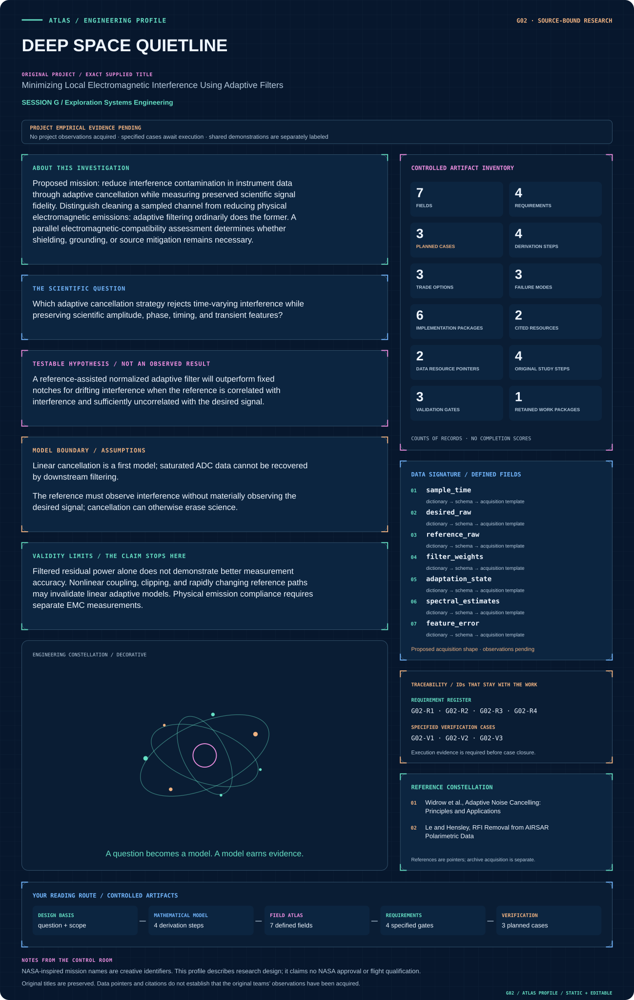
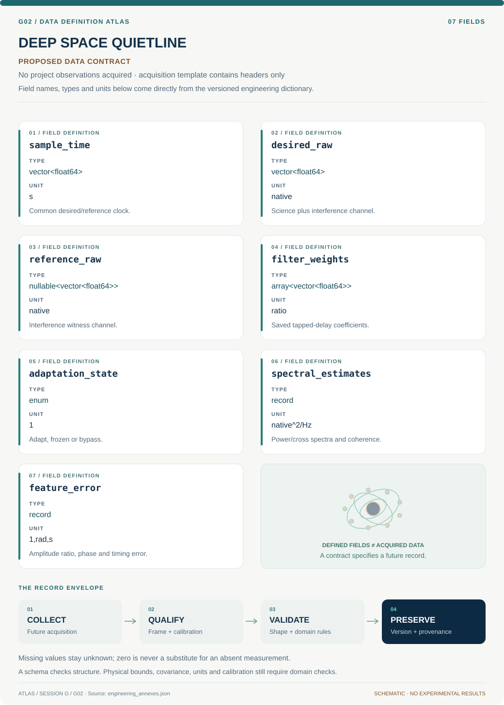

# G02 · DEEP SPACE QUIETLINE

**Original project:** Minimizing Local Electromagnetic Interference Using Adaptive Filters

**Session G:** Exploration Systems Engineering

**Document class:** engineering research design and analysis record · **Revision:** 4 · **Date:** 2026-10-02

**Evidence state:** design basis, mathematical formulation and verification plan documented. Project-specific empirical results remain to be acquired; executable shared model demonstrations have their own recorded checks.

[Session G](../README.md) · [All projects](../../../ENGINEERING_DOCUMENTATION.md) · [Session handbook](../../../handbooks/SESSION_G.md) · [← G01](../G01-artemis-bone-watch/README.md) · [G03 →](../G03-deep-space-beam-cartographer/README.md)

| Proposed requirements | Specified verification cases | Defined data fields | Cited resources |
| ---: | ---: | ---: | ---: |
| 4 | 3 | 7 | 2 |

[Explore the data blueprint](data/README.md) · [Open the figure gallery](figures/README.md) · [Download acquisition template](data/acquisition.csv) · [Browse the data atlas](../../../data/README.md)

---

## Mission profile



| Profile panel | Engineering signal | Open the evidence |
| --- | --- | --- |
| Mission identity | Minimizing Local Electromagnetic Interference Using Adaptive Filters | [Scientific objective](#purpose-and-scientific-objective) |
| Model cockpit | 4 governing expressions; 4 derivation steps; declared assumptions and validity envelope | [Mathematical formulation](#4-mathematical-model-and-derivation) |
| Data blueprint | 7 proposed fields with types, units and quality rules | [Field map & downloads](data/README.md) |
| Verification queue | 4 proposed requirements; 3 specified cases; project execution evidence pending | [Case definitions](#8-verification-and-validation-cases) |
| Figure wall | Architecture, field map, planned result description | [Open full gallery](figures/README.md) |
| Resource library | 2 cited primary resources with support statements | [Cited resources](#12-cited-technical-and-scientific-resources) |

### Model cockpit

**Analysis method:** Generate controlled mixtures from synthetic science signals and recorded benign interference references. Compare fixed notch, LMS/NLMS, and selected robust alternatives using the same training/test split. Add known calibration tones and scientific transients to quantify amplitude/phase distortion. Adapt only on validated states, freeze or bypass when reference coherence/quality fails, and retain both raw and corrected streams with filter provenance.

**Operating envelope:** Filtered residual power alone does not demonstrate better measurement accuracy. Nonlinear coupling, clipping, and rapidly changing reference paths may invalidate linear adaptive models. Physical emission compliance requires separate EMC measurements.

**Variables and conventions**

- Desired signal s, contamination v, reference vector r, filter length, adaptation step mu, regularizer epsilon, and leakage.
- Sampling rate, interference drift, coherence, convergence time, residual spectrum, science-feature distortion, and processing latency.

### Artifact wall



Reference quality governs adaptation before corrected data are scored against known science features. Residual suppression, leakage, clipping and provenance remain separate engineering outcomes.

**Scientific result to produce:** Raw and corrected time series, coherence spectrum, filter adaptation history, and injected-science amplitude/phase errors; physical emissions and data contamination occupy separate lanes.

### Investigation feed · planned work

The feed records proposed work packages. A row becomes executed evidence only with versioned inputs, outputs and a reviewed result.

| Sequence | Evidence state | Engineering work package |
| --- | --- | --- |
| 01 | Planned | Create stream_schema.json with native units, limits and clock mapping. |
| 02 | Planned | Implement aligned_ingest.py and reference_quality.py. |
| 03 | Planned | Build nlms.py with saved coefficient/state logs. |
| 04 | Planned | Create fault_policy.py for clipping/dropout/leakage fixtures. |
| 05 | Planned | Implement feature_preservation.py and matched notch baseline. |
| 06 | Planned | Publish heldout_interference.ipynb, raw/corrected hashes and feature-error tables. |

### Mission connections

Connections are reading routes based on actual shared resources, supplied sessions or included illustrations. They do not establish physical dependencies, team collaborations or validated results.

| Connected mission | Original investigation | Recorded connection basis |
| --- | --- | --- |
| [G01 · ARTEMIS BONE WATCH](../G01-artemis-bone-watch/README.md) | Ex Vivo Analysis of Multi-Sensory Device for Bone Strain Monitoring | Session G |
| [G03 · DEEP SPACE BEAM CARTOGRAPHER](../G03-deep-space-beam-cartographer/README.md) | Measuring Antenna Patterns for Ground Station | Session G |
| [G04 · ARTEMIS CARTILAGE MATRIX](../G04-artemis-cartilage-matrix/README.md) | Photocurable nanocomposites for customizable cartilage replacements | Session G |
| [G05 · ARES CREW RESOURCE VAULT](../G05-ares-crew-resource-vault/README.md) | Mars In-Situ Resource Utilization for Health Applications | Session G |
| [G06 · TERRA HUMIDITY HARVEST](../G06-terra-humidity-harvest/README.md) | Direct Air Capture Using Moisture Swing Chemistry | Session G |
| [G07 · HUBBLE SPECTRAL ANCHOR](../G07-hubble-spectral-anchor/README.md) | An Introduction to Systems Engineering: Building a Monochromator Mount | Session G |

[Machine-readable connection register and ranking rule](../../../registry/mission_connections.json)

### Reading playlist

| Route | Start here | Continue to |
| --- | --- | --- |
| Understand the idea | [Scientific objective](#purpose-and-scientific-objective) | [Design boundary](#1-design-basis-and-analysis-boundary) → [Mathematics](#4-mathematical-model-and-derivation) |
| Inspect the data | [Visual blueprint](data/README.md) | [Provenance](#5-data-specifications-and-provenance) → [Uncertainty](#6-uncertainty-sensitivity-and-identifiability) |
| Make a design decision | [Trade study](#7-engineering-trade-study) | [Failure modes](#10-failure-modes-and-interpretation-controls) → [Required outputs](#11-required-engineering-outputs) |
| Prepare execution | [Requirements](#2-requirements-and-verification-traceability) | [Verification](#8-verification-and-validation-cases) → [Implementation](#9-implementation-and-reproducible-work-packages) |

## Complete engineering dossier

The profile above is a browsing layer. The full design basis, equations, derivations, data contract, uncertainty, trades and controlled case definitions follow.

## Purpose and scientific objective

Proposed mission: reduce interference contamination in instrument data through adaptive cancellation while measuring preserved scientific signal fidelity. Distinguish cleaning a sampled channel from reducing physical electromagnetic emissions: adaptive filtering ordinarily does the former. A parallel electromagnetic-compatibility assessment determines whether shielding, grounding, or source mitigation remains necessary.

**Question:** Which adaptive cancellation strategy rejects time-varying interference while preserving scientific amplitude, phase, timing, and transient features?

**Testable hypothesis:** A reference-assisted normalized adaptive filter will outperform fixed notches for drifting interference when the reference is correlated with interference and sufficiently uncorrelated with the desired signal.

## 1. Design basis and analysis boundary

The cancellation system processes synchronized desired-channel and interference-reference streams while retaining raw data. Its boundary includes ADC saturation, reference leakage, adaptation, bypass and feature-preservation validation. Lower residual power is not sufficient evidence of improved scientific measurement because a contaminated reference can cancel the desired signal.

Begin with known synthetic science waveforms and benign interference records, then compare fixed notch and NLMS under identical bandwidth/train-test conditions. Validate coherence and reference quality before adaptation. A robust alternative is added only when nonstationary or nonlinear behavior defeats the linear model; saturated input cannot be reconstructed by this downstream filter.

## 2. Requirements and verification traceability

These are project design requirements or proposed analysis gates. A numerical target is not a NASA requirement unless its controlling source is explicitly identified. “TBD” identifies evidence required before a decision; it is not permission to assume a value. Verification evidence listed here is planned, unless a linked result explicitly records execution.

| ID | Requirement / gate | Engineering rationale | Verification method | Basis / required evidence |
| --- | --- | --- | --- | --- |
| G02-R1 | Store raw, reference and corrected streams with filter state/version and bypass flags. | Cancellation must be auditable and reversible. | Replay saved coefficients and compare samplewise output. | Processing provenance requirement. |
| G02-R2 | Proposed preservation target: calibration-tone amplitude change below 1% and phase change below 1 degree in protected science bands. | Noise suppression can erase science. | Inject known tones/transients and compare held-out features. | Proposed metrology targets, not instrument specs. |
| G02-R3 | Adaptation shall freeze or bypass when clipping, reference dropout or leakage validation fails. | Invalid reference estimates can damage data. | Script fault replay and inspect state transitions. | Fault-handling contract. |
| G02-R4 | Report residual interference and science-feature error separately, with common timing/band definitions. | A single SNR score hides distortion. | Matched baseline/cancellation feature tables. | Proposed comparison gate. |

## 3. Architecture and controlled interfaces

An acquisition adapter aligns desired d and reference r samples, records ADC limits and masks missing data. A reference-quality module estimates coherence and leakage evidence over declared windows. A tapped-delay filter computes interference prediction; adaptation and bypass logic use validated states with saved coefficients.

The feature scorer compares amplitude, phase, timing and transient area against known synthetic truth or independent calibration. Raw/corrected streams share absolute time and sampling rate. Spectral estimates specify window, overlap and normalization; coefficient updates run only on allowed samples, preventing dropouts from being converted into fictitious zeros.


Reference quality governs adaptation before corrected data are scored against known science features. Residual suppression, leakage, clipping and provenance remain separate engineering outcomes.

[Editable engineering diagram source](figures/architecture.mmd)

## 4. Mathematical model and derivation

### Governing equations

```text
d(n)=s(n)+v(n); r(n)=reference interference+possible signal leakage.
```

```text
e(n)=d(n)-w(n)^T r_vec(n).
```

```text
w(n+1)=w(n)+mu e(n)r_vec(n)/(epsilon+r_vec(n)^T r_vec(n)), a normalized-LMS update.
```

```text
C_dr(f)=|S_dr(f)|^2/[S_dd(f)S_rr(f)] defines magnitude-squared coherence for reference usefulness.
```

### Variables, units and conventions

- Desired signal s, contamination v, reference vector r, filter length, adaptation step mu, regularizer epsilon, and leakage.
- Sampling rate, interference drift, coherence, convergence time, residual spectrum, science-feature distortion, and processing latency.

### Assumptions and boundary conditions

- Linear cancellation is a first model; saturated ADC data cannot be recovered by downstream filtering.
- The reference must observe interference without materially observing the desired signal; cancellation can otherwise erase science.

### Derivation step 1

$$
d_n=s_n+v_n;\quad e_n=d_n-w_n^Tr_n
$$

The reference vector contains delayed samples. Linear cancellation estimates contamination but will also remove any science component correlated with r.

### Derivation step 2

$$
w_{n+1}=w_n+\mu e_nr_n/(\epsilon+r_n^Tr_n)
$$

NLMS scales update by reference energy. For the ideal standard setting, 0<mu<2 motivates stability screening; correlated/time-varying real paths still require validation.

### Derivation step 3

```text
S_{er}=S_{dr}-W(f)S_{rr}
```

At the stationary linear optimum, reference-correlated residual vanishes with W=S_dr/S_rr where identifiable. This minimizes mean-square residual, not guaranteed science distortion.

### Derivation step 4

$$
C_{dr}=|S_{dr}|^2/(S_{dd}S_{rr});\quad0\le C_{dr}\le1
$$

Coherence quantifies linear reference association. Desired-signal leakage can also yield high coherence, so this quantity alone cannot certify a safe reference.

### Inference or simulation procedure

Generate controlled mixtures from synthetic science signals and recorded benign interference references. Compare fixed notch, LMS/NLMS, and selected robust alternatives using the same training/test split. Add known calibration tones and scientific transients to quantify amplitude/phase distortion. Adapt only on validated states, freeze or bypass when reference coherence/quality fails, and retain both raw and corrected streams with filter provenance.

### Validity domain and fidelity limits

Filtered residual power alone does not demonstrate better measurement accuracy. Nonlinear coupling, clipping, and rapidly changing reference paths may invalidate linear adaptive models. Physical emission compliance requires separate EMC measurements.

## 5. Data specifications and provenance



**Proposed data contract · observations pending.** This visual inventory shows the record fields to acquire or derive. It contains no project measurements. [Open the data blueprint and downloads](data/README.md).

| Field | Type | Unit | Physical / statistical meaning | Quality and missing-data rule |
| --- | --- | --- | --- | --- |
| sample_time | vector<float64> | s | Common desired/reference clock. | Rate and alignment offset covariance required. |
| desired_raw | vector<float64> | native | Science plus interference channel. | ADC units/limits and clipping mask retained. |
| reference_raw | nullable<vector<float64>> | native | Interference witness channel. | Dropout mask; no silent zero fill. |
| filter_weights | array<vector<float64>> | ratio | Saved tapped-delay coefficients. | Ordering, length and update cadence required. |
| adaptation_state | enum | 1 | Adapt, frozen or bypass. | Reason and event time logged. |
| spectral_estimates | record | native^2/Hz | Power/cross spectra and coherence. | Window/normalization and degrees of freedom retained. |
| feature_error | record | 1,rad,s | Amplitude ratio, phase and timing error. | Truth/reference covariance and protected-band definition. |

[Machine-readable record schema](data/schema.json) · [Empty acquisition CSV](data/acquisition.csv) · [Field dictionary CSV](data/dictionary.csv)

The CSV above contains column headers only. Its schema defines future records and does not establish that original-team data or a particular archive product have been acquired. Frame, timing, calibration, covariance, selection and provenance details must accompany populated records.

### Stanford adaptive noise-cancellation paper

[Product, archive or reference](https://www-isl.stanford.edu/~widrow/papers/j1975adaptivenoise.pdf)

**Fields:** Reference cancellation framework, signal/noise assumptions, and failure modes.

**Access:** Public author-hosted paper; original laboratory recordings are not assumed downloadable.

**Role:** Algorithmic foundation.

### Le and Hensley, RFI Removal from AIRSAR Polarimetric Data

[Product, archive or reference](https://airsar.jpl.nasa.gov/documents/workshop2002/papers/T8.pdf)

**Fields:** Radar-interference setting and adaptive-filter application context.

**Access:** Public workshop paper; identify the dataset and raw-data availability independently.

**Role:** Space/remote-sensing instrumentation precedent.

## 6. Uncertainty, sensitivity and identifiability

Reference path drift, sample-clock mismatch and sensor noise affect coefficients and residuals. Leakage couples desired signal into the cancellation estimate and creates systematic bias, even with excellent convergence. Spectral/window uncertainty and correlated residuals limit simple confidence intervals; nonlinear mixing and saturation create structural failure.

Use held-out science transients and leakage levels, blocked by interference regime. Sweep filter length, mu and clock offset, retaining coefficient transients rather than scoring only converged sections. Compare preservation-error distributions to the proposed gates before choosing a cancellation setting; invalid reference periods remain bypassed and flagged.

## 7. Engineering trade study

| Alternative | Benefit | Cost / limitation | Decision rule |
| --- | --- | --- | --- |
| Fixed notch | Predictable protected-band response. | Poor for drifting/broadband interference. | Use when interference frequencies are stable and science exclusion is justified. |
| NLMS reference cancellation | Tracks linear path with modest cost. | Leakage and convergence transients. | Select after preservation and fault gates. |
| Robust/frozen adaptive policy | Limits corruption during anomalies. | Slower adaptation and more residual noise. | Prefer when quality uncertainty outweighs extra suppression. |

## 8. Verification and validation cases

| Case ID | Stimulus / condition | Expected result / criterion | Method | Evidence artifact |
| --- | --- | --- | --- | --- |
| G02-V1 | No interference/reference | With r=0 and initialized w=0, corrected stream equals d. | Zero-reference fixture with regularizer. | Cancellation identity. |
| G02-V2 | Known linear path | For v=a r and independent s, a correctly set weight removes v without changing s. | Analytic synthetic mixture before adaptation tests. | Linear model endpoint. |
| G02-V3 | Reference science leakage | Increasing leakage can reduce desired tone despite lower residual power; preservation gate detects failure. | Inject known s into r and replay adaptation/bypass. | Model warning; quantitative outcomes pending. |

**Execution status:** these cases are specified, not claimed as executed. Close a case only with the versioned inputs, output, uncertainty, reviewer and pass/fail rationale.

### Additional scientific validation gates

- Measure science amplitude/phase error, event-detection bias, timing error, convergence, and residual interference simultaneously.
- Test reference dropout, signal leakage, ADC clipping, and parameter sensitivity; harmful cancellation should trigger a documented fallback.
- Proposed gate: residual improvement is accepted only when science-feature errors remain within declared calibration tolerances on held-out cases.

## 9. Implementation and reproducible work packages

1. Create stream_schema.json with native units, limits and clock mapping.
2. Implement aligned_ingest.py and reference_quality.py.
3. Build nlms.py with saved coefficient/state logs.
4. Create fault_policy.py for clipping/dropout/leakage fixtures.
5. Implement feature_preservation.py and matched notch baseline.
6. Publish heldout_interference.ipynb, raw/corrected hashes and feature-error tables.

### Investigation sequence

1. Define which science features must be preserved and a proposed residual-interference target.
2. Characterize reference coherence, delays, saturation, and potential desired-signal leakage before selecting algorithms.
3. Evaluate stationary, drifting, intermittent, and correlated-noise cases with deterministic synthetic mixtures.
4. Implement transparent quality flags, raw-data retention, bypass behavior, and a calibrated processing uncertainty model.

### Resources and interfaces to expertise

- Signal-processing expertise, synchronized reference/data acquisition, calibrated waveform source, spectrum analysis, and EMC engineering support.

## 10. Failure modes and interpretation controls

| Failure mode | Effect on result | Detection / evidence | Design response |
| --- | --- | --- | --- |
| Desired leakage | Science cancellation. | Calibration-tone attenuation. | Reference redesign or freeze/bypass. |
| ADC clipping | Irrecoverable input distortion. | Clipping mask. | Reject interval; upstream range correction. |
| Clock misalignment | Poor cancellation/phase error. | Cross-correlation drift. | Align clocks and bound filter-delay interpretation. |

- The algorithm can suppress desired signals that correlate with its reference.
- Software cancellation can conceal poor physical EMC design and cannot repair front-end saturation.

## 11. Required engineering outputs

- Adaptive-filter benchmark, science-distortion budget, processing-quality rules, raw/corrected sample archive, and real-time concept demonstrator.

### Scientific result figures to produce during execution

Raw and corrected time series, coherence spectrum, filter adaptation history, and injected-science amplitude/phase errors; physical emissions and data contamination occupy separate lanes.

## 12. Cited technical and scientific resources

- [Widrow et al., Adaptive Noise Cancelling: Principles and Applications](https://www-isl.stanford.edu/~widrow/papers/j1975adaptivenoise.pdf) — Original reference-assisted adaptive-cancellation analysis.
- [Le and Hensley, RFI Removal from AIRSAR Polarimetric Data](https://airsar.jpl.nasa.gov/documents/workshop2002/papers/T8.pdf) — Original JPL radar-instrumentation application of adaptive interference filtering.

Framework and evidence rules: [engineering documentation standard](../../../engineering/ENGINEERING_STANDARD.md), [model assurance](../../../engineering/MODEL_ASSURANCE.md), [uncertainty procedure](../../../engineering/UNCERTAINTY_AND_DECISION_RULES.md), [data management](../../../engineering/DATA_MANAGEMENT.md). NASA-inspired names are creative identifiers; requirements and results are not NASA certification.
