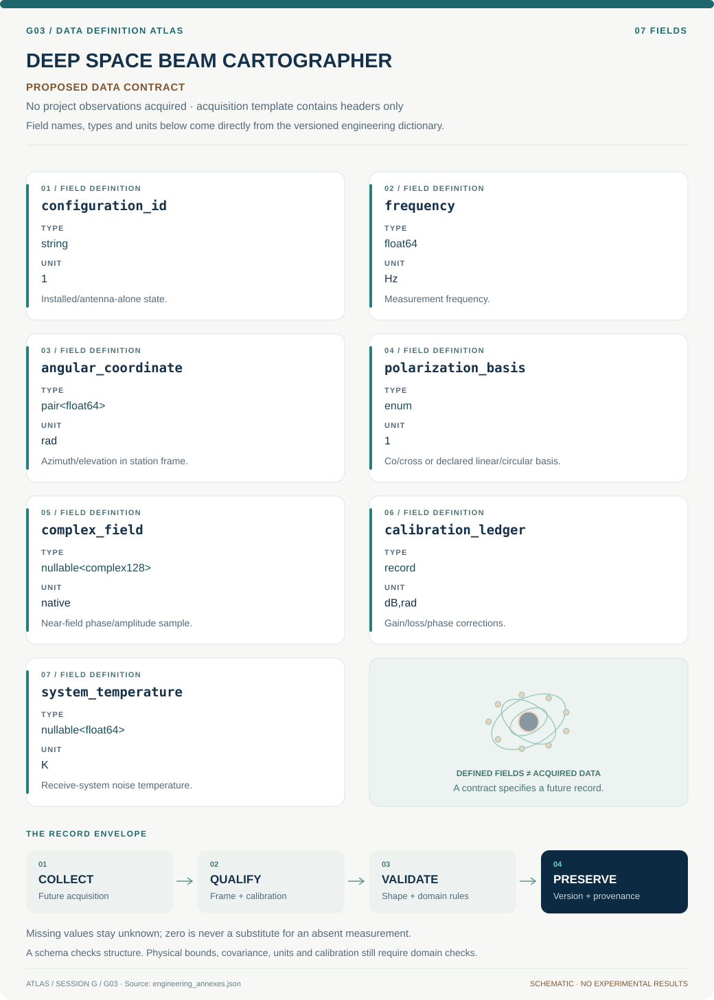

# G03 · DEEP SPACE BEAM CARTOGRAPHER

**Original project:** Measuring Antenna Patterns for Ground Station

**Session G:** Exploration Systems Engineering

**Document class:** engineering research design and analysis record · **Revision:** 3 · **Date:** 2026-10-02

**Evidence state:** design basis, mathematical formulation and verification plan documented. Project-specific empirical results remain to be acquired; executable shared model demonstrations have their own recorded checks.

[Session G](../README.md) · [All projects](../../../ENGINEERING_DOCUMENTATION.md) · [Session handbook](../../../handbooks/SESSION_G.md) · [← G02](../G02-deep-space-quietline/README.md) · [G04 →](../G04-artemis-cartilage-matrix/README.md)

| Proposed requirements | Specified verification cases | Defined data fields | Cited resources |
| ---: | ---: | ---: | ---: |
| 4 | 3 | 7 | 2 |

[Explore the data blueprint](data/README.md) · [Open the figure gallery](figures/README.md) · [Download acquisition template](data/acquisition.csv) · [Browse the data atlas](../../../data/README.md)

---

## Purpose and scientific objective

Proposed mission: produce a calibrated three-dimensional antenna pattern for an authorized ground station and translate uncertainty into pointing and link-performance limits. Treat installation, polarization, reflections, cable changes, and structural deformation as part of the measurement system. Compare far-field and near-field approaches according to aperture size and available facility geometry.

**Question:** How accurately can the installed antenna's gain, polarization, sidelobes, and boresight be measured across its operating band?

**Testable hypothesis:** A calibrated measurement with explicit reflection and alignment controls will reveal installation-dependent pattern differences significant to the link budget, even when the standalone antenna design is well understood.

## 1. Design basis and analysis boundary

The measurement boundary comprises an installed or antenna-alone configuration, calibrated transmit/receive chains, angular geometry and either a verified far-field range or phase-consistent near-field scan. The requested outputs are gain, polarization, beam pointing and sidelobe uncertainty across a declared band; receive gain alone is not system G/T.

Begin with a link-budget-driven accuracy/coverage requirement and reference calibration. Choose a far-field approach only when range/reflection conditions support it; choose near-field transformation only with complex sampling, probe correction and adequate scan extent. Power-only local scans remain limited diagnostic data rather than a complete far-field pattern.

## 2. Requirements and verification traceability

These are project design requirements or proposed analysis gates. A numerical target is not a NASA requirement unless its controlling source is explicitly identified. “TBD” identifies evidence required before a decision; it is not permission to assume a value. Verification evidence listed here is planned, unless a linked result explicitly records execution.

| ID | Requirement / gate | Engineering rationale | Verification method | Basis / required evidence |
| --- | --- | --- | --- | --- |
| G03-R1 | All pattern records shall specify frequency, coordinate frame, polarization basis and installed configuration. | Patterns cannot be combined across incompatible geometry/chains. | Schema and coordinate/polarization round-trip checks. | Antenna measurement contract. |
| G03-R2 | Near-field reconstruction shall retain complex field, spacing, extent and probe response. | Power-only data lack transform phase. | Reject missing phase/probe metadata for full pattern claims. | Existing JPL range constraints. |
| G03-R3 | Proposed initial pointing uncertainty target is 0.1 beamwidth; final gain/sidelobe tolerances are link-budget TBD. | Absolute arbitrary angle targets do not scale with aperture. | Propagate encoder/alignment uncertainty against measured beamwidth. | Proposed target, not ground-station capability. |
| G03-R4 | Gain and G/T shall retain calibration/cable loss and independently defined system temperature. | Receiver sensitivity includes more than antenna gain. | Reconstruct chain ledger and temperature boundary. | Radiometric/link definition. |

## 3. Architecture and controlled interfaces

A configuration registry defines antenna mount axes and co/cross polarization. Measurement adapters return calibrated complex samples or far-field power ratios with range, angle and timestamp. A chain ledger applies cable/receiver/reference-antenna corrections with shared covariance.

The near-field transform uses spatial coordinates in m, complex phase in rad and frequency-dependent wavelength; its angular-spectrum mapping excludes unsupported angles. The far-field branch applies free-space calibration and reflection assessment. A common pattern extractor reports beamwidth, sidelobes, boresight and covariance; a separate temperature adapter produces G/T when qualified.



Complex near-field and calibrated far-field branches share configuration and chain evidence, then produce supported pattern metrics. G/T remains a separate output requiring qualified noise temperature.

[Editable engineering diagram source](figures/architecture.mmd)

## 4. Mathematical model and derivation

### Governing equations

```text
R_ff approximately 2D^2/lambda is a conventional Fraunhofer-distance criterion; verify its adequacy for required pattern accuracy.
```

```text
P_r/P_t=G_t G_r(lambda/(4pi R))^2 L_pol L_misc in a far-field free-space calibration model.
```

```text
F(k_x,k_y)=double_integral E(x,y) exp[-i(k_x x+k_y y)]dxdy for a planar near-field angular-spectrum abstraction.
```

```text
G/T=G_dBi-10log10(T_sys/K), a receive-system figure of merit.
```

### Variables, units and conventions

- Frequency, wavelength lambda, largest aperture D, range R, azimuth/elevation, co/cross polarization, amplitude, and phase.
- Cable loss, calibration antenna gain, angular encoder error, reflections, near-field scan extent/spacing, and receiver system temperature.

### Assumptions and boundary conditions

- Reciprocity applies to the passive linear antenna under equivalent conditions; the complete transmitting and receiving chains can differ.
- Near-field transformation needs phase-consistent sampling and probe correction; a power-only local scan is not automatically a full far-field measurement.

### Derivation step 1

$$
R_{ff}\approx2D^2/\lambda;\quad\lambda=c/f
$$

The conventional Fraunhofer scale follows aperture path-phase variation. Its adequacy depends on required accuracy; it is a screening distance, not a guarantee against ground reflections.

### Derivation step 2

$$
P_r/P_t=G_tG_r(\lambda/(4\pi R))^2L_{pol}L_{misc}
$$

Friis calibration is dimensionless with linear gains/loss factors. Solve for unknown gain only after calibrated power, reference gain and polarization mismatch are specified.

### Derivation step 3

$$
F(k_x,k_y)=\iint E(x,y)e^{-i(k_xx+k_yy)}dxdy
$$

Phase-consistent planar samples map to angular spectrum, kx=k sin(theta) cos(phi). Spatial sampling and finite extent control aliasing and angular support; probe correction precedes interpretation.

### Derivation step 4

$$
G/T=G_{dBi}-10\log_{10}(T_{sys}/K)
$$

This dB/K figure combines gain and system noise temperature. Their errors can share chain calibration, requiring covariance rather than independent scalar addition.

### Inference or simulation procedure

Define required angular coverage and accuracy from the station link budget. Choose a verified far-field range or a near-field scan with adequate extent and sampling. Perform reference-antenna calibration and track cable/receiver drift. Separate antenna-alone patterns from installed-system observations, using reference measurements or justified reflection modeling. Propagate amplitude, phase, range, and pointing errors into beamwidth, sidelobe, gain, and link uncertainty.

### Validity domain and fidelity limits

Outdoor ground reflections and nearby structures can create patterns unlike free-space results. Limited near-field coverage and missing scan phases restrict angular fidelity; receive gain alone does not determine system G/T.

## 5. Data specifications and provenance



**Proposed data contract · observations pending.** This visual inventory shows the record fields to acquire or derive. It contains no project measurements. [Open the data blueprint and downloads](data/README.md).

| Field | Type | Unit | Physical / statistical meaning | Quality and missing-data rule |
| --- | --- | --- | --- | --- |
| configuration_id | string | 1 | Installed/antenna-alone state. | Mount, cabling and surroundings version required. |
| frequency | float64 | Hz | Measurement frequency. | Positive; bandwidth and wavelength convention. |
| angular_coordinate | pair<float64> | rad | Azimuth/elevation in station frame. | Axes/signs and encoder covariance. |
| polarization_basis | enum | 1 | Co/cross or declared linear/circular basis. | Basis transform version required. |
| complex_field | nullable<complex128> | native | Near-field phase/amplitude sample. | Phase reference required; power-only flagged. |
| calibration_ledger | record | dB,rad | Gain/loss/phase corrections. | Shared error terms and drift retained. |
| system_temperature | nullable<float64> | K | Receive-system noise temperature. | Measurement boundary required; absent means no G/T. |

[Machine-readable record schema](data/schema.json) · [Empty acquisition CSV](data/acquisition.csv) · [Field dictionary CSV](data/dictionary.csv)

The CSV above contains column headers only. Its schema defines future records and does not establish that original-team data or a particular archive product have been acquired. Frame, timing, calibration, covariance, selection and provenance details must accompany populated records.

### NASA JPL MESA antenna-range technical information

[Product, archive or reference](https://www.nasa.gov/jpl/mesa/antenna-range/)

**Fields:** Available range approaches, frequency coverage, near-field scan geometry, and coverage relationships.

**Access:** Public technical information; facility use and calibration datasets require separate arrangements.

**Role:** Measurement architecture reference.

### NASA JPL outdoor-range information

[Product, archive or reference](https://www.nasa.gov/jpl/mesa/facilities/outdoor-ranges/)

**Fields:** Far-field range configurations and ground-reflection considerations.

**Access:** Public facility description, not a dataset for the user's antenna.

**Role:** Environmental systematic-error reference.

## 6. Uncertainty, sensitivity and identifiability

Reference antenna gain, receiver linearity, cable drift, range and angular encoders create correlated errors across pattern samples. Outdoor multipath can shift sidelobes and boresight systematically. Near-field truncation, phase drift and probe correction create reconstruction discrepancy that cannot be represented by amplitude noise alone.

Compare repeated reference measurements, scan reversals and frequency consistency. Propagate complex covariance through transformation and fit beam parameters on supported angular regions. Assess near-field extent/spacing changes separately from chain calibration. Publish antenna-alone and installed-system results distinctly when reflection evidence cannot isolate the difference.

## 7. Engineering trade study

| Alternative | Benefit | Cost / limitation | Decision rule |
| --- | --- | --- | --- |
| Outdoor far field | Direct angular pattern measurement. | Range and reflections may dominate. | Use when geometry/reflection uncertainty meets link needs. |
| Planar near field | Compact and phase-resolved. | Finite coverage/probe correction. | Choose for supported angular sector with complex calibration. |
| Installed link observations | Captures operational surroundings. | Confounds antenna and receiver/propagation. | Use as system validation, not isolated free-space pattern. |

## 8. Verification and validation cases

| Case ID | Stimulus / condition | Expected result / criterion | Method | Evidence artifact |
| --- | --- | --- | --- | --- |
| G03-V1 | Free-space scaling | Doubling R reduces received power by factor four at fixed calibrated gains. | Synthetic Friis ledger and range check. | Inverse-square relation. |
| G03-V2 | Uniform rectangular aperture | Transform gives separable sinc field with known first nulls. | Complex-scan synthetic fixture with extent refinement. | Fourier aperture analytic pattern. |
| G03-V3 | Missing phase/system temperature | Power-only scan cannot enter full near-field transform; absent T forbids G/T output. | Data-contract integration fixture. | Information sufficiency, not measured pattern success. |

**Execution status:** these cases are specified, not claimed as executed. Close a case only with the versioned inputs, output, uncertainty, reviewer and pass/fail rationale.

### Additional scientific validation gates

- Repeat boresight and reference-antenna checks before/after scans; test cable-motion and thermal sensitivity.
- Compare independent principal-plane scans and, where practical, far-field versus transformed near-field predictions.
- Proposed gate: measured gain and pointing uncertainty fit the declared link-margin allocation; unmeasured angular regions remain flagged.

## 9. Implementation and reproducible work packages

1. Create antenna_configuration.yaml and angular_polarization_schema.json.
2. Build chain_calibration.py with gain/loss covariance.
3. Implement farfield_friis.py and reflection_assessment.ipynb.
4. Build complex_nearfield_transform.py with probe/extent masks.
5. Create pattern_metrics.py and rectangular-aperture fixtures.
6. Publish gain_pattern.parquet and optional gt_report.json only with qualified temperature metadata.

### Investigation sequence

1. Freeze station frequency bands, pointing needs, desired pattern accuracy, and authorized measurement environment.
2. Select far-field/near-field method and build a complete calibration/uncertainty chain.
3. Acquire or specify synchronized angular, amplitude, phase, and polarization records with configuration metadata.
4. Convert measured patterns into uncertainty-aware pointing-loss and link-margin envelopes.

### Resources and interfaces to expertise

- Antenna metrology expertise, calibrated reference antenna, phase-capable RF instrumentation, authorized range or chamber, and station geometry model.

## 10. Failure modes and interpretation controls

| Failure mode | Effect on result | Detection / evidence | Design response |
| --- | --- | --- | --- |
| Ground reflection unmodeled | False sidelobes/gain. | Range/frequency/height dependence. | Reflection control/model and separate installed result. |
| Phase reference drift | Distorted near-field transform. | Reference revisit phase discrepancy. | Common reference and drift correction. |
| Cable loss omitted | Biased absolute gain. | Chain-ledger mismatch. | Calibrated loss with uncertainty. |

- Multipath can masquerade as sidelobes or nulls.
- Insufficient near-field scan extent or phase accuracy can produce misleadingly smooth transformed patterns.

## 11. Required engineering outputs

- Calibrated pattern dataset, 3D beam atlas, polarization/pointing-error budget, and station link-performance report.

### Scientific result figures to produce during execution

3D co/cross-polarized gain surfaces, principal-plane cuts with uncertainty, and pointing-loss versus angular error; installed and free-space configurations are visibly distinct.

## 12. Cited technical and scientific resources

- [NASA JPL MESA Antenna Range Technical Data](https://www.nasa.gov/jpl/mesa/antenna-range/) — Official near-field/far-field approaches and scan-coverage constraints.
- [NASA JPL MESA Outdoor Ranges](https://www.nasa.gov/jpl/mesa/facilities/outdoor-ranges/) — Official discussion of outdoor measurement geometry and ground-reflection control.

Framework and evidence rules: [engineering documentation standard](../../../engineering/ENGINEERING_STANDARD.md), [model assurance](../../../engineering/MODEL_ASSURANCE.md), [uncertainty procedure](../../../engineering/UNCERTAINTY_AND_DECISION_RULES.md), [data management](../../../engineering/DATA_MANAGEMENT.md). NASA-inspired names are creative identifiers; requirements and results are not NASA certification.
