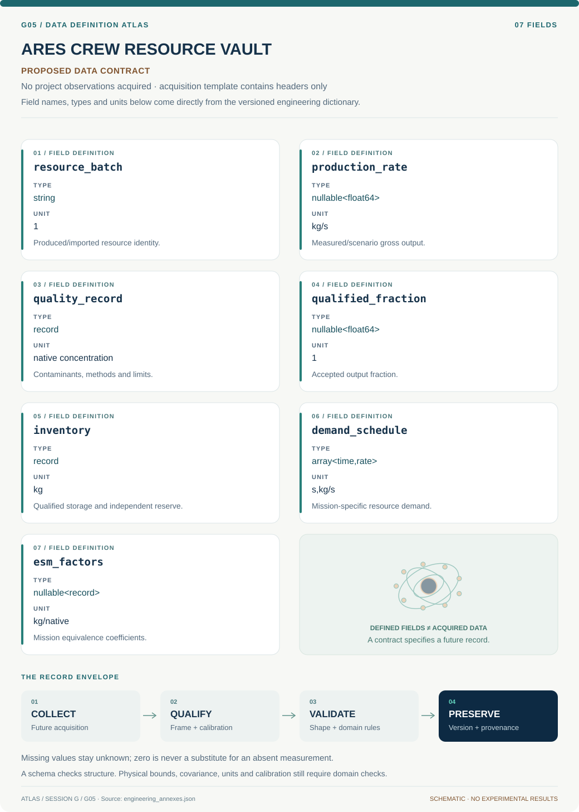

# G05 · ARES CREW RESOURCE VAULT

**Original project:** Mars In-Situ Resource Utilization for Health Applications

**Session G:** Exploration Systems Engineering

**Document class:** engineering research design and analysis record · **Revision:** 3 · **Date:** 2026-10-02

**Evidence state:** design basis, mathematical formulation and verification plan documented. Project-specific empirical results remain to be acquired; executable shared model demonstrations have their own recorded checks.

[Session G](../README.md) · [All projects](../../../ENGINEERING_DOCUMENTATION.md) · [Session handbook](../../../handbooks/SESSION_G.md) · [← G04](../G04-artemis-cartilage-matrix/README.md) · [G06 →](../G06-terra-humidity-harvest/README.md)

| Proposed requirements | Specified verification cases | Defined data fields | Cited resources |
| ---: | ---: | ---: | ---: |
| 4 | 3 | 7 | 3 |

[Explore the data blueprint](data/README.md) · [Open the figure gallery](figures/README.md) · [Download acquisition template](data/acquisition.csv) · [Browse the data atlas](../../../data/README.md)

---

## Purpose and scientific objective

Proposed mission: evaluate how locally sourced oxygen and water could support crew-health infrastructure on Mars while meeting verified environmental-health requirements. Separate extraction yield from a resource being fit for human use. MOXIE provides a real oxygen-production precedent; this dossier proposes integrated quality assurance, storage, continuity, and contamination accounting rather than a medical-treatment or pharmaceutical-production plan.

**Question:** When does ISRU reduce delivered mass while maintaining resource quality and continuity under equipment failures, variable atmosphere, and uncertain local water composition?

**Testable hypothesis:** Quality-aware reserve sizing and staged qualification will expose narrower feasible operating regions than yield-only optimization, but can still identify useful health-support architectures.

## 1. Design basis and analysis boundary

The resource system models extraction, production, qualification, storage and crew demand as distinct interfaces. A MOXIE-like oxygen demonstration informs a bounded technology baseline; continuous scaled production, trace-contaminant suitability and crew-system integration remain proposed. No site-specific Martian water composition or human-use purity threshold is assumed.

Begin with mass/quality ledgers and imported-only comparison, then add production outages, rejected batches and independent reserve scenarios. Applicable human-system requirements must be captured by revision and mission applicability. Quality percentage alone cannot qualify every contaminant, and health-system use is modeled as a demand boundary rather than treatment instructions.

## 2. Requirements and verification traceability

These are project design requirements or proposed analysis gates. A numerical target is not a NASA requirement unless its controlling source is explicitly identified. “TBD” identifies evidence required before a decision; it is not permission to assume a value. Verification evidence listed here is planned, unless a linked result explicitly records execution.

| ID | Requirement / gate | Engineering rationale | Verification method | Basis / required evidence |
| --- | --- | --- | --- | --- |
| G05-R1 | Only qualified resource mass shall enter crew-use storage. | Production quantity can hide quality rejection. | Batch-state ledger rejects unqualified transfer. | Quality-boundary requirement. |
| G05-R2 | Every contaminant comparison shall identify requirement revision, analytical limit and uncertainty. | Below detection is not necessarily below an applicable limit. | Audit standard/evidence matrix; unresolved limits remain TBD. | Existing NASA standard record; no invented threshold. |
| G05-R3 | Reserve sizing shall include declared outage and quality-rejection scenarios independently of mean production. | Average surplus cannot cover every failure. | Integrate demand through outage ensembles. | Mission-specific reserve requirement, numerical value TBD. |
| G05-R4 | Proposed numerical mass-closure target is 10^-6 of cumulative delivered/produced mass. | Resource loss accounting must be reproducible. | Production/storage/use/loss ledger. | Proposed computation tolerance. |

## 3. Architecture and controlled interfaces

An environment adapter supplies atmospheric/resource scenario and uncertainty. Production modules emit mass plus quality-status records, power and thermal loads. A qualification gate uses requirement-linked evidence and routes rejected/unassessed resource separately from qualified storage.

Storage tracks imported reserve and ISRU-derived inventories by batch, with leakage and availability. Crew demand uses mission time in seconds and kg/s schedules; independent reserve logic can bypass failed production. Equivalent-system-mass scoring accepts mission-specific power, volume, cooling and crew-time conversion factors, preserving native quantities when factors are unavailable.



Production and qualified availability are separated by an evidence gate. Imported reserve, coupled outage/rejection and mission-specific equivalence factors remain explicit; human-use quality is not inferred from gross oxygen output.

[Editable engineering diagram source](figures/architecture.mmd)

## 4. Mathematical model and derivation

### Governing equations

```text
2 CO2 -> 2 CO+O2 is the net oxygen-production stoichiometry for a MOXIE-like carbon-dioxide electrolysis concept.
```

```text
dot(m)_storage=dot(m)_qualified-production-dot(m)_crew-use-dot(m)_loss.
```

```text
M_reserve>=integral_0^T_outage demand(t)dt with outage distributions and contingency requirements.
```

```text
ESM=M_hardware+M_spares+k_P P+k_V V+k_C cooling+k_T crew_time, with mission-specific equivalent-mass factors.
```

### Variables, units and conventions

- Qualified oxygen/water production, contaminant concentration/detection limits, purity uncertainty, demand, storage losses, and outage duration.
- Power, thermal load, consumables, crew time, spare mass, local-resource uncertainty, and independent reserve inventory.

### Assumptions and boundary conditions

- A measured oxygen percentage alone does not establish all human-use contaminant requirements.
- Applicable NASA human-system requirements and mission-specific standards must be identified by revision; production technologies and clinical systems have distinct qualification processes.

### Derivation step 1

$$
2CO_2\rightarrow2CO+O_2;\quad n_{O_2}=n_{CO_2,processed}/2
$$

Stoichiometry sets an ideal molar ceiling, not actual output or crew suitability. Conversion efficiency and rejected product reduce qualified yield.

### Derivation step 2

$$
\dot M_q=\dot m_{prod}f_q-\dot m_{use}-\dot m_{loss}
$$

Qualified fraction f_q lies between zero and one; uncertain/unassessed batches cannot be assumed accepted. All mass rates are kg/s.

### Derivation step 3

$$
M_{reserve}\ge\int_0^{T_{out}}\dot m_{demand}(t)dt+M_{loss,out}
$$

Reserve depends on outage duration and storage losses. Demand/production failures can be correlated; specify joint scenarios before selecting a percentile.

### Derivation step 4

```text
ESM=M_h+M_s+k_PP+k_VV+k_CC+k_Tt_{crew}
```

Each conversion coefficient maps its native resource to kg equivalent under a stated mission. Without those coefficients, keep a vector trade rather than invent a scalar ranking.

### Inference or simulation procedure

Build a crew-demand and resource-flow model with separate extraction, purification/quality assessment, qualified storage, and use interfaces. Use published MOXIE performance as a bounded technology-demonstration baseline and treat scale-up as a proposal. Include Mars dust/perchlorate hazards in the quality evidence matrix. Simulate production outages and quality-rejection events, comparing imported-only, ISRU-assisted, and hybrid reserve architectures.

### Validity domain and fidelity limits

No site-specific Martian water or regolith composition is established here. Scale-up, continuous operation, trace-contaminant qualification, and integration with crew health systems remain unverified.

## 5. Data specifications and provenance



**Proposed data contract · observations pending.** This visual inventory shows the record fields to acquire or derive. It contains no project measurements. [Open the data blueprint and downloads](data/README.md).

| Field | Type | Unit | Physical / statistical meaning | Quality and missing-data rule |
| --- | --- | --- | --- | --- |
| resource_batch | string | 1 | Produced/imported resource identity. | Provenance and state required. |
| production_rate | nullable<float64> | kg/s | Measured/scenario gross output. | Demonstration versus scale-up labeled. |
| quality_record | record | native concentration | Contaminants, methods and limits. | Censoring and standard revision retained. |
| qualified_fraction | nullable<float64> | 1 | Accepted output fraction. | Unknown remains null; not automatically one. |
| inventory | record | kg | Qualified storage and independent reserve. | Batch ledger and leakage terms required. |
| demand_schedule | array<time,rate> | s,kg/s | Mission-specific resource demand. | Crew count/context and uncertainty recorded. |
| esm_factors | nullable<record> | kg/native | Mission equivalence coefficients. | Unknown factors prohibit complete scalar ESM. |

[Machine-readable record schema](data/schema.json) · [Empty acquisition CSV](data/acquisition.csv) · [Field dictionary CSV](data/dictionary.csv)

The CSV above contains column headers only. Its schema defines future records and does not establish that original-team data or a particular archive product have been acquired. Frame, timing, calibration, covariance, selection and provenance details must accompany populated records.

### MOXIE operations research

[Product, archive or reference](https://www.sciencedirect.com/science/article/pii/S0094576523002187)

**Fields:** Documented production operations, environmental variations, measured oxygen quantity/purity, and technology limitations.

**Access:** Public article page; exact numerical time series may require full text/supplements.

**Role:** Demonstrated oxygen-production baseline.

### NASA human-system standard record

[Product, archive or reference](https://standards.nasa.gov/node/237)

**Fields:** Applicable environmental-health and human-system requirements, document revision/date, and normative references.

**Access:** Official standard record; download and verify the revision applicable to the future mission.

**Role:** Qualification/requirements source rather than treatment advice.

### NASA Mars perchlorate research context

[Product, archive or reference](https://www.nasa.gov/general/detoxifying-mars/)

**Fields:** Perchlorate/chlorate hazard context and research objectives.

**Access:** Public NASA project description; it is not validated site-specific remediation performance.

**Role:** Contamination-risk inventory.

## 6. Uncertainty, sensitivity and identifiability

Mars environmental variation, feedstock contamination, scale-up efficiency and maintenance affect production. Qualification rejection can correlate with dusty conditions that also increase hardware outages. Storage leak and demand spikes alter reserves; the quality analytical detection limit is a distinct uncertainty from production mass.

Simulate joint outage/rejection scenarios and sensitivity to uncertain Mars water chemistry. Compare imported-only and hybrid architectures on shortfall probability and native mass/power resources. A favorable ESM result is conditional on mission factors and qualification evidence; publish cases where reserve dominates or ISRU offers no supported benefit.

## 7. Engineering trade study

| Alternative | Benefit | Cost / limitation | Decision rule |
| --- | --- | --- | --- |
| Imported-only qualified supplies | Known production boundary. | Large delivered mass. | Baseline for continuity and quality. |
| ISRU-dominant architecture | Potential mass reduction. | Qualification/outage dependence. | Select only with supported reserves and requirement evidence. |
| Hybrid independent reserve | Buffers outages and rejection. | Extra storage/spares. | Prefer if shortfall risk improves enough for mission trade. |

## 8. Verification and validation cases

| Case ID | Stimulus / condition | Expected result / criterion | Method | Evidence artifact |
| --- | --- | --- | --- | --- |
| G05-V1 | Ideal oxygen stoichiometry | Two mol processed CO2 yield at most one mol O2 before losses. | Molar-to-mass conversion fixture. | Atom conservation. |
| G05-V2 | Qualification rejection | f_q=0 increases no qualified inventory despite production. | Batch-routing integration fixture. | Quality gate. |
| G05-V3 | Constant outage demand | Reserve depletion equals demand times outage plus losses. | Analytic inventory trajectory. | Mass ledger; reliability results pending. |

**Execution status:** these cases are specified, not claimed as executed. Close a case only with the versioned inputs, output, uncertainty, reviewer and pass/fail rationale.

### Additional scientific validation gates

- Check stoichiometric, mass, energy, and reserve balances; test total production loss and repeated quality rejection.
- Reproduce documented technology operating points only within stated conditions; label scale-up performance as modeled.
- Proposed gate: candidate architecture meets declared demand/reserve constraints across uncertainty and has a verification method for every human-use quality requirement.

## 9. Implementation and reproducible work packages

1. Create resource_flow_schema.json and requirement_revision_matrix.csv.
2. Build moxie_baseline_adapter.py with measured versus proposed scale tags.
3. Implement qualified_inventory.py and batch rejection fixtures.
4. Create outage_quality_scenarios.yaml with dependency assumptions.
5. Build reserve_sizing.py and native_resource_trade.py.
6. Publish continuity_ensemble.parquet and conditional_esm.ipynb with unresolved limits/factors.

### Investigation sequence

1. Define proposed health-support resource functions and distinguish breathable supply, general water use, and medical-system interfaces.
2. Create a requirement-to-contaminant/quantity/continuity evidence matrix using current applicable standards.
3. Evaluate resource-flow and outage ensembles with quality rejection and reserve replenishment included.
4. Prioritize terrestrial simulant/system qualification studies and future site data needed to bound local-resource assumptions.

### Resources and interfaces to expertise

- ISRU, life-support, contamination-control, reliability, and aerospace human-systems expertise; reviewed standards; validated mass/energy simulation.

## 10. Failure modes and interpretation controls

| Failure mode | Effect on result | Detection / evidence | Design response |
| --- | --- | --- | --- |
| Unqualified batch counted | False resource availability. | Batch-state mismatch. | Hard qualification gate. |
| Mean-rate reserve sizing | Shortfalls during tails. | Outage ensemble depletion. | Independent reserve and joint scenarios. |
| ESM factors borrowed blindly | Misleading architecture ranking. | Factor provenance audit. | Mission-specific factors or vector trade. |

- Production quantity can conceal unqualified quality or unavailable continuity.
- Perchlorate-bearing dust and chemical byproducts can create health risks; future physical studies require qualified facilities and medical-system review.

## 11. Required engineering outputs

- Crew-resource architecture, contamination evidence matrix, reserve/reliability model, equivalent-mass trade study, and staged qualification roadmap.

### Scientific result figures to produce during execution

Resource flow from atmosphere/local water to quality assessment, qualified storage, crew use, and rejected stream; outage simulations display reserve risk and imported-mass tradeoffs.

## 12. Cited technical and scientific resources

- [18 Months of MOXIE operations on the surface of Mars](https://www.sciencedirect.com/science/article/pii/S0094576523002187) — Original operations report with quantity/purity monitoring and environmental performance context.
- [NASA Spaceflight Human-System Standard Volume 2](https://standards.nasa.gov/node/237) — Official active standard record for human factors, habitability, and environmental health.
- [NASA: Detoxifying Mars](https://www.nasa.gov/general/detoxifying-mars/) — Official perchlorate/chlorate hazard and exploratory research context.

Framework and evidence rules: [engineering documentation standard](../../../engineering/ENGINEERING_STANDARD.md), [model assurance](../../../engineering/MODEL_ASSURANCE.md), [uncertainty procedure](../../../engineering/UNCERTAINTY_AND_DECISION_RULES.md), [data management](../../../engineering/DATA_MANAGEMENT.md). NASA-inspired names are creative identifiers; requirements and results are not NASA certification.
