# G06 · TERRA HUMIDITY HARVEST

**Original project:** Direct Air Capture Using Moisture Swing Chemistry

**Session G:** Exploration Systems Engineering

**Document class:** engineering research design and analysis record · **Revision:** 4 · **Date:** 2026-10-02

**Evidence state:** design basis, mathematical formulation and verification plan documented. Project-specific empirical results remain to be acquired; executable shared model demonstrations have their own recorded checks.

[Session G](../README.md) · [All projects](../../../ENGINEERING_DOCUMENTATION.md) · [Session handbook](../../../handbooks/SESSION_G.md) · [← G05](../G05-ares-crew-resource-vault/README.md) · [G07 →](../G07-hubble-spectral-anchor/README.md)

| Proposed requirements | Specified verification cases | Defined data fields | Cited resources |
| ---: | ---: | ---: | ---: |
| 4 | 3 | 7 | 2 |

[Explore the data blueprint](data/README.md) · [Open the figure gallery](figures/README.md) · [Download acquisition template](data/acquisition.csv) · [Browse the data atlas](../../../data/README.md)

---

## Mission profile


| Profile panel | Engineering signal | Open the evidence |
| --- | --- | --- |
| Mission identity | Direct Air Capture Using Moisture Swing Chemistry | [Scientific objective](#purpose-and-scientific-objective) |
| Model cockpit | 4 governing expressions; 4 derivation steps; declared assumptions and validity envelope | [Mathematical formulation](#4-mathematical-model-and-derivation) |
| Data blueprint | 7 proposed fields with types, units and quality rules | [Field map & downloads](data/README.md) |
| Verification queue | 4 proposed requirements; 3 specified cases; project execution evidence pending | [Case definitions](#8-verification-and-validation-cases) |
| Figure wall | Architecture, field map, planned result description | [Open full gallery](figures/README.md) |
| Resource library | 2 cited primary resources with support statements | [Cited resources](#12-cited-technical-and-scientific-resources) |

### Model cockpit

**Analysis method:** Reconstruct published humidity-dependent loading and kinetics where numerical data are accessible. Fit coupled water/CO2 response surfaces with uncertainty, then embed them in a cycle mass/energy model driven by representative climate time series. Compare fixed and adaptive cycle scheduling, track regeneration water and fan/thermal work, and perform cradle-to-storage accounting with transparent boundary choices. Identify material properties that improve robust performance rather than only peak capacity.

**Operating envelope:** Bench-scale results do not establish large-contactor pressure drop, multiyear durability, or permanent removal. Figure digitization can support screening but is insufficient for a tightly optimized engineering design without raw data.

**Variables and conventions**

- CO2 partial pressure, water activity a_w, temperature, loading q in mol/kg, working capacity Delta q, and kinetic coefficient.
- Water uptake/recovery, cycle duration, pressure drop, fan power, drying duty, sorbent degradation, capture purity, and storage fate.

### Artifact wall



Loading and cycle mass feed utilities and a separate downstream-fate boundary. Net removal appears only after water/energy/emission and retention accounting, preserving the distinction between bench capture and durable climate benefit.

**Scientific result to produce:** Humidity/loading hysteresis curves, carbon/water Sankey accounting, climate-dependent net-removal map, and a fan/drying energy Pareto plot; unmeasured scale factors are hatched.

### Investigation feed · planned work

The feed records proposed work packages. A row becomes executed evidence only with versioned inputs, outputs and a reviewed result.

| Sequence | Evidence state | Engineering work package |
| --- | --- | --- |
| 01 | Planned | Create sorbent_data_registry.csv with digitization/domain flags. |
| 02 | Planned | Build coupled_loading.py and LDF analytic fixtures. |
| 03 | Planned | Implement cycle_controller.py and separate CO2/water ledgers. |
| 04 | Planned | Create contactor_energy.py with geometry-specific pressure drop. |
| 05 | Planned | Build downstream_carbon_fate.py and emissions_boundary.json. |
| 06 | Planned | Publish climate_holdout.ipynb and cycle_trade.parquet containing negative/unqualified outcomes. |

### Mission connections

Connections are reading routes based on actual shared resources, supplied sessions or included illustrations. They do not establish physical dependencies, team collaborations or validated results.

| Connected mission | Original investigation | Recorded connection basis |
| --- | --- | --- |
| [G05 · ARES CREW RESOURCE VAULT](../G05-ares-crew-resource-vault/README.md) | Mars In-Situ Resource Utilization for Health Applications | Session G |
| [G07 · HUBBLE SPECTRAL ANCHOR](../G07-hubble-spectral-anchor/README.md) | An Introduction to Systems Engineering: Building a Monochromator Mount | Session G |
| [G04 · ARTEMIS CARTILAGE MATRIX](../G04-artemis-cartilage-matrix/README.md) | Photocurable nanocomposites for customizable cartilage replacements | Session G |
| [G08 · ORION HEPATIC RECOVERY](../G08-orion-hepatic-recovery/README.md) | Mediated Liver Regeneration | Session G |
| [G03 · DEEP SPACE BEAM CARTOGRAPHER](../G03-deep-space-beam-cartographer/README.md) | Measuring Antenna Patterns for Ground Station | Session G |
| [G02 · DEEP SPACE QUIETLINE](../G02-deep-space-quietline/README.md) | Minimizing Local Electromagnetic Interference Using Adaptive Filters | Session G |

[Machine-readable connection register and ranking rule](../../../registry/mission_connections.json)

### Reading playlist

| Route | Start here | Continue to |
| --- | --- | --- |
| Understand the idea | [Scientific objective](#purpose-and-scientific-objective) | [Design boundary](#1-design-basis-and-analysis-boundary) → [Mathematics](#4-mathematical-model-and-derivation) |
| Inspect the data | [Visual blueprint](data/README.md) | [Provenance](#5-data-specifications-and-provenance) → [Uncertainty](#6-uncertainty-sensitivity-and-identifiability) |
| Make a design decision | [Trade study](#7-engineering-trade-study) | [Failure modes](#10-failure-modes-and-interpretation-controls) → [Required outputs](#11-required-engineering-outputs) |
| Prepare execution | [Requirements](#2-requirements-and-verification-traceability) | [Verification](#8-verification-and-validation-cases) → [Implementation](#9-implementation-and-reproducible-work-packages) |

## Complete engineering dossier

The profile above is a browsing layer. The full design basis, equations, derivations, data contract, uncertainty, trades and controlled case definitions follow.

## Purpose and scientific objective

Proposed mission: quantify moisture-swing carbon capture as a coupled carbon, water, transport, and energy cycle. Evaluate how humidity changes the equilibrium and rate of carbon-dioxide uptake in documented sorbents, then translate these properties into net removal under a realistic climate. A low-temperature release mechanism does not automatically mean low total energy or low water demand.

**Question:** Which sorbent and cycle concepts maximize net atmospheric CO2 removal after fan work, drying, water management, durability, and downstream carbon fate are counted?

**Testable hypothesis:** Humidity-aware cycle optimization will outperform a fixed schedule in some dry/wet environments, but regeneration water or drying energy may erase benefits elsewhere.

## 1. Design basis and analysis boundary

The moisture-swing capture model spans ambient-air intake, sorbent water/CO2 state, adsorption/regeneration, utilities and downstream carbon fate. Its boundary includes fan pressure drop, water management, drying duty and embodied/process emissions. Captured mass is reported separately from durable net removal; utilization without demonstrated retention is not counted automatically.

Begin with published humidity-dependent equilibrium and kinetics, retaining material-specific calibration. Embed a coupled response surface in a climate-driven cycle model, then compare fixed and adaptive schedules. Contactor scale-up, pressure drop and multiyear degradation remain uncertain rather than inferred from a favorable bench capacity.

## 2. Requirements and verification traceability

These are project design requirements or proposed analysis gates. A numerical target is not a NASA requirement unless its controlling source is explicitly identified. “TBD” identifies evidence required before a decision; it is not permission to assume a value. Verification evidence listed here is planned, unless a linked result explicitly records execution.

| ID | Requirement / gate | Engineering rationale | Verification method | Basis / required evidence |
| --- | --- | --- | --- | --- |
| G06-R1 | Every loading function shall identify sorbent, water activity, temperature and fitted domain. | Humidity changes both equilibrium and transport. | Check held-out loading/kinetic records and extrapolation flags. | Existing moisture-swing studies. |
| G06-R2 | Cycle ledgers shall conserve CO2 and water separately. | Regeneration recovery can otherwise be overstated. | Proposed closure residual below 10^-6 of throughput. | Proposed numerical target. |
| G06-R3 | Net-removal output shall state permanent fate, leakage and full process-emission boundary. | Capture is not equivalent to durable removal. | Carbon-fate ledger audit; unknown fate prevents a durable claim. | Accounting requirement. |
| G06-R4 | Proposed architecture gate: lower uncertainty bound of net durable removal is positive. | Gross working capacity can hide emissions. | Joint climate/utility/degradation ensemble. | Proposed screening criterion; no removal result claimed. |

## 3. Architecture and controlled interfaces

A material-data adapter stores CO2 loading in mol/kg and water uptake with their shared covariance. Climate input supplies temperature, humidity and atmospheric CO2; water activity uses a declared gas/surface equilibrium convention. A transport module integrates loading, while a cycle controller selects adsorption and regeneration states.

Contactor geometry supplies air flow and pressure drop to fan energy. Water/thermal modules track recovery and duty. A downstream-fate adapter records storage retention, leakage and emissions intensity. Outputs retain per-cycle captured mass, utilities and net-removal covariance; missing durability evidence yields an unavailable durable result.


Loading and cycle mass feed utilities and a separate downstream-fate boundary. Net removal appears only after water/energy/emission and retention accounting, preserving the distinction between bench capture and durable climate benefit.

[Editable engineering diagram source](figures/architecture.mmd)

## 4. Mathematical model and derivation

### Governing equations

```text
dq/dt=k_LDF[q_star(p_CO2,a_w,T)-q], an effective transport model with measured equilibrium q_star.
```

```text
Delta G=-RT ln K(a_w,T), where activity-dependent equilibrium parameters require experimental calibration.
```

```text
m_CO2,captured=M_sorbent Delta q M_CO2 per completed cycle.
```

```text
m_CO2,net=m_captured-m_process-emissions-m_leakage, with permanent storage/utilization fate explicitly specified.
```

### Variables, units and conventions

- CO2 partial pressure, water activity a_w, temperature, loading q in mol/kg, working capacity Delta q, and kinetic coefficient.
- Water uptake/recovery, cycle duration, pressure drop, fan power, drying duty, sorbent degradation, capture purity, and storage fate.

### Assumptions and boundary conditions

- A fitted loading function is material-specific; humidity can affect equilibrium and internal diffusion simultaneously.
- Captured CO2 is not counted as durable removal unless downstream fate and associated emissions are documented.

### Derivation step 1

$$
\dot q=k_{LDF}(q^*-q)
$$

k_LDF is s^-1 and q is mol/kg. At fixed conditions q(t)=q*+(q0-q*)exp(-kt), giving an analytic response and a fitting link between capacity and rate.

### Derivation step 2

$$
m_{cap}=M_s\Delta qM_{CO_2}
$$

Sorbent mass kg times mol/kg working capacity times kg/mol CO2 gives kg captured. Delta q must use actual cycle endpoints, not equilibrium extremes never reached.

### Derivation step 3

$$
E_{fan}=\int\Delta p\,Q_v/\eta_f\,dt
$$

Pa times m^3/s gives W. Pressure drop and fan efficiency must be scale-specific; drying/regeneration and water recovery add separate energy terms.

### Derivation step 4

$$
m_{net}=m_{stored}-m_{leak}-\sum_jE_jI_j-m_{embodied}
$$

Utility emission intensity I has kg CO2-equivalent/J. State reporting basis and allocation horizon; captured CO2 diverted to short-lived use is not necessarily m_stored.

### Inference or simulation procedure

Reconstruct published humidity-dependent loading and kinetics where numerical data are accessible. Fit coupled water/CO2 response surfaces with uncertainty, then embed them in a cycle mass/energy model driven by representative climate time series. Compare fixed and adaptive cycle scheduling, track regeneration water and fan/thermal work, and perform cradle-to-storage accounting with transparent boundary choices. Identify material properties that improve robust performance rather than only peak capacity.

### Validity domain and fidelity limits

Bench-scale results do not establish large-contactor pressure drop, multiyear durability, or permanent removal. Figure digitization can support screening but is insufficient for a tightly optimized engineering design without raw data.

## 5. Data specifications and provenance


**Proposed data contract · observations pending.** This visual inventory shows the record fields to acquire or derive. It contains no project measurements. [Open the data blueprint and downloads](data/README.md).

| Field | Type | Unit | Physical / statistical meaning | Quality and missing-data rule |
| --- | --- | --- | --- | --- |
| sorbent_id | string | 1 | Composition/structure and source version. | No cross-material parameter borrowing without flag. |
| climate_state | record | K,1,Pa | T, water activity and CO2 partial pressure. | Time zone/step and uncertainty required. |
| loading_data | nullable<record> | mol/kg | CO2 equilibrium/dynamic loading. | Water state, detection and covariance retained. |
| kinetic_rate | nullable<float64> | s^-1 | Effective LDF coefficient. | Positive; domain and uncertainty required. |
| airflow_pressure | record | m^3/s,Pa | Contactor flow and pressure drop. | Scale geometry and fan efficiency explicit. |
| water_ledger | record | kg | Intake, retained, recovered and lost water. | Cycle-state reference and closure check. |
| carbon_fate | nullable<record> | kg CO2 | Storage, leakage and permanence evidence. | Unknown prohibits durable-removal label. |

[Machine-readable record schema](data/schema.json) · [Empty acquisition CSV](data/acquisition.csv) · [Field dictionary CSV](data/dictionary.csv)

The CSV above contains column headers only. Its schema defines future records and does not establish that original-team data or a particular archive product have been acquired. Frame, timing, calibration, covariance, selection and provenance details must accompany populated records.

### Original moisture-swing sorbent study

[Product, archive or reference](https://pubs.acs.org/doi/abs/10.1021/Es201180v)

**Fields:** Isothermal humidity-dependent sorbent behavior and underlying chemistry context.

**Access:** Public abstract; full article/supplements may require institutional access. Raw data availability must be verified.

**Role:** Equilibrium/cycle precedent.

### Confinement-effects study

[Product, archive or reference](https://pubs.acs.org/doi/abs/10.1021/acs.estlett.3c00712)

**Fields:** Material-property comparisons, hydration/dehydration behavior, and multicycle supplemental characterization.

**Access:** Public abstract/supplement description; retrieve exact numerical data and license before reuse.

**Role:** Structure/transport hypothesis.

## 6. Uncertainty, sensitivity and identifiability

Equilibrium capacity, diffusion rate and water uptake are correlated material properties. Climate variability affects both uptake and regeneration cost. Scale-specific pressure drop, sorbent decay and emissions intensity can dominate net removal even if bench capacity is well measured; digitized curves add extraction uncertainty.

Fit capacity and kinetics jointly where time series support them, and profile their confounding when only endpoints exist. Run representative climate years and degradation scenarios with utility correlations. Compare scheduling rules on robust net-removal and water use rather than peak capacity; report negative or fate-unqualified scenarios as legitimate trade outcomes.

## 7. Engineering trade study

| Alternative | Benefit | Cost / limitation | Decision rule |
| --- | --- | --- | --- |
| Fixed-time cycles | Simple predictable operation. | Poor adaptation to humidity/climate. | Baseline with full utility ledger. |
| Humidity-adaptive cycles | Can exploit favorable conditions. | Forecast/control and incomplete-cycle risk. | Choose if held-out climate improves net results. |
| High-capacity structured sorbent | Potential smaller inventory. | Transport/durability/pressure-drop penalties. | Select through joint capacity-rate-energy trade, not peak q alone. |

## 8. Verification and validation cases

| Case ID | Stimulus / condition | Expected result / criterion | Method | Evidence artifact |
| --- | --- | --- | --- | --- |
| G06-V1 | LDF fixed state | Loading approaches q* exponentially without overshoot for positive k. | Exact-solution comparison. | Kinetic ODE. |
| G06-V2 | Zero working capacity | Delta q=0 gives zero captured mass even with utility emissions. | Cycle endpoint fixture. | Mass conversion. |
| G06-V3 | Zero retention/high emissions | No permanent stored mass or excess emissions prevents positive net removal. | Carbon-fate integration extremes. | Accounting identity; real net result pending. |

**Execution status:** these cases are specified, not claimed as executed. Close a case only with the versioned inputs, output, uncertainty, reviewer and pass/fail rationale.

### Additional scientific validation gates

- Verify carbon and water mass closure and energy bookkeeping through complete cycles.
- Compare fitted uptake/release predictions on withheld humidity/temperature conditions and cycle counts.
- Proposed gate: net removal remains positive under conservative energy/emissions/water scenarios; report reversal conditions and unsupported scale-up parameters.

## 9. Implementation and reproducible work packages

1. Create sorbent_data_registry.csv with digitization/domain flags.
2. Build coupled_loading.py and LDF analytic fixtures.
3. Implement cycle_controller.py and separate CO2/water ledgers.
4. Create contactor_energy.py with geometry-specific pressure drop.
5. Build downstream_carbon_fate.py and emissions_boundary.json.
6. Publish climate_holdout.ipynb and cycle_trade.parquet containing negative/unqualified outcomes.

### Investigation sequence

1. Define net-removal accounting boundary, intended climate, and downstream carbon-storage assumption.
2. Assemble sorbent property/equilibrium/kinetic tables with uncertainty and complete provenance.
3. Simulate coupled CO2/water cycles and optimize scheduling over climate variability.
4. Rank proposed contactor/material research by working capacity, durability, pressure drop, water recovery, and net removal.

### Resources and interfaces to expertise

- Sorption thermodynamics, transport and life-cycle expertise; uncertainty optimization software; qualified sorbent-characterization partnership.

## 10. Failure modes and interpretation controls

| Failure mode | Effect on result | Detection / evidence | Design response |
| --- | --- | --- | --- |
| Equilibrium endpoints assumed reached | Inflated cycle mass. | Dynamic versus equilibrium gap. | Integrate actual cycle kinetics. |
| Water energy omitted | False net benefit. | Utility completeness audit. | Separate drying/recovery ledger. |
| Capture called durable removal | Unsupported climate claim. | Missing fate/retention record. | Publish captured and qualified net metrics separately. |

- Gross capture can be mistaken for durable net removal.
- Sorbent aging, water availability, and contactor pressure drop may dominate favorable equilibrium chemistry.

## 11. Required engineering outputs

- Humidity-response model, cycle simulator, carbon/water/energy budget, climate-dependent performance atlas, and research-priority report.

### Scientific result figures to produce during execution

Humidity/loading hysteresis curves, carbon/water Sankey accounting, climate-dependent net-removal map, and a fan/drying energy Pareto plot; unmeasured scale factors are hatched.

## 12. Cited technical and scientific resources

- [Wang et al., Moisture Swing Sorbent for Carbon Dioxide Capture from Ambient Air](https://pubs.acs.org/doi/abs/10.1021/Es201180v) — Original humidity-driven capture/release research.
- [Confinement Effects on Moisture-Swing Direct Air Capture](https://pubs.acs.org/doi/abs/10.1021/acs.estlett.3c00712) — Original material-structure and hydration/transport investigation.

Framework and evidence rules: [engineering documentation standard](../../../engineering/ENGINEERING_STANDARD.md), [model assurance](../../../engineering/MODEL_ASSURANCE.md), [uncertainty procedure](../../../engineering/UNCERTAINTY_AND_DECISION_RULES.md), [data management](../../../engineering/DATA_MANAGEMENT.md). NASA-inspired names are creative identifiers; requirements and results are not NASA certification.
