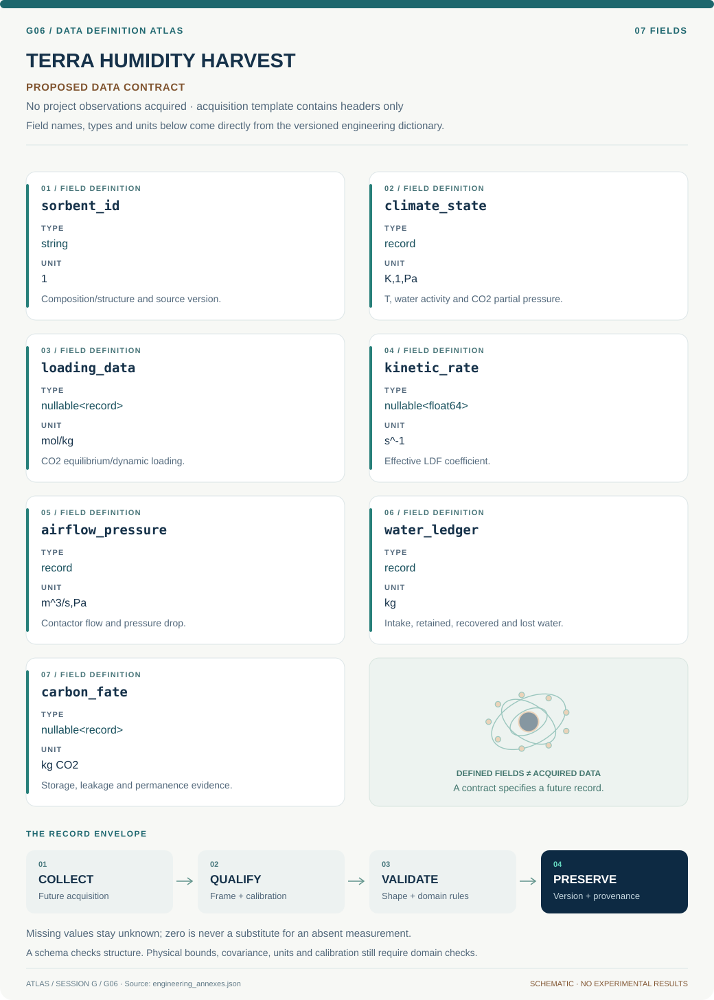

# G06 · Data blueprint

[TERRA HUMIDITY HARVEST](../README.md) · [Figure gallery](../figures/README.md) · [Data atlas](../../../../data/README.md)

**PROPOSED CONTRACT · 7 fields · no project observations acquired.** The acquisition CSV contains column headers only. The diagram is a visual record specification, not measured data.

| Download | What it contains |
| --- | --- |
| [Acquisition CSV](acquisition.csv) | Empty columns ready for controlled acquisition |
| [Field dictionary](dictionary.csv) | Names, source types, units, meanings and quality rules |
| [JSON Schema](schema.json) | Nullable record structure with unit and quality metadata |

## Field reference

| Field | Type | Unit | Meaning | Quality / missingness |
| --- | --- | --- | --- | --- |
| sorbent_id | string | 1 | Composition/structure and source version. | No cross-material parameter borrowing without flag. |
| climate_state | record | K,1,Pa | T, water activity and CO2 partial pressure. | Time zone/step and uncertainty required. |
| loading_data | nullable<record> | mol/kg | CO2 equilibrium/dynamic loading. | Water state, detection and covariance retained. |
| kinetic_rate | nullable<float64> | s^-1 | Effective LDF coefficient. | Positive; domain and uncertainty required. |
| airflow_pressure | record | m^3/s,Pa | Contactor flow and pressure drop. | Scale geometry and fan efficiency explicit. |
| water_ledger | record | kg | Intake, retained, recovered and lost water. | Cycle-state reference and closure check. |
| carbon_fate | nullable<record> | kg CO2 | Storage, leakage and permanence evidence. | Unknown prohibits durable-removal label. |

## Acquisition and provenance

Null means missing or unknown; record its cause. Preserve product identifier, retrieval timestamp, source hash, calibration, coordinate and time frame, covariance basis, selection rules and every transformation. JSON Schema checks structure; physical bounds and the quality rules above require domain validation.

- [Original moisture-swing sorbent study](https://pubs.acs.org/doi/abs/10.1021/Es201180v) — archive or acquisition resource; inclusion here does not assert that its data have been retrieved.
- [Confinement-effects study](https://pubs.acs.org/doi/abs/10.1021/acs.estlett.3c00712) — archive or acquisition resource; inclusion here does not assert that its data have been retrieved.

[Controlled data-management procedure](../../../../engineering/DATA_MANAGEMENT.md)
