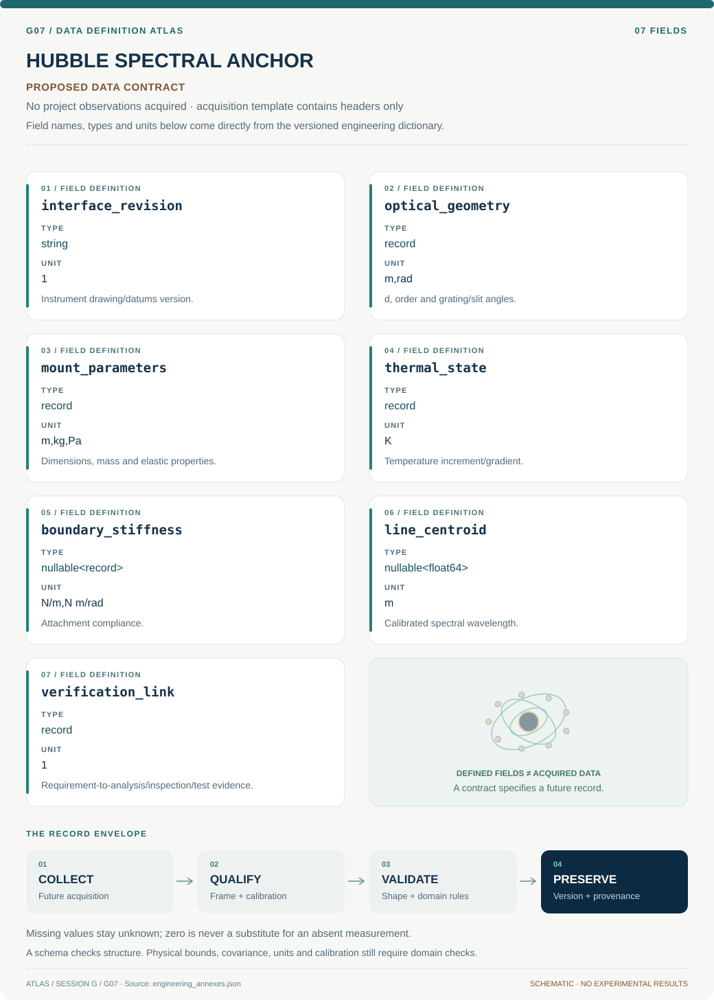

# G07 · HUBBLE SPECTRAL ANCHOR

**Original project:** An Introduction to Systems Engineering: Building a Monochromator Mount

**Session G:** Exploration Systems Engineering

**Document class:** engineering research design and analysis record · **Revision:** 3 · **Date:** 2026-10-02

**Evidence state:** design basis, mathematical formulation and verification plan documented. Project-specific empirical results remain to be acquired; executable shared model demonstrations have their own recorded checks.

[Session G](../README.md) · [All projects](../../../ENGINEERING_DOCUMENTATION.md) · [Session handbook](../../../handbooks/SESSION_G.md) · [← G06](../G06-terra-humidity-harvest/README.md) · [G08 →](../G08-orion-hepatic-recovery/README.md)

| Proposed requirements | Specified verification cases | Defined data fields | Cited resources |
| ---: | ---: | ---: | ---: |
| 4 | 3 | 7 | 2 |

[Explore the data blueprint](data/README.md) · [Open the figure gallery](figures/README.md) · [Download acquisition template](data/acquisition.csv) · [Browse the data atlas](../../../data/README.md)

---

## Purpose and scientific objective

Proposed mission: turn a monochromator mount into a complete systems-engineering demonstrator with measurable optical alignment, structural, thermal, accessibility, and maintainability requirements. The mount is successful when it supports the instrument's wavelength and throughput budget under its intended environment. CAD appearance alone is insufficient; requirements, interfaces, tolerances, and verification evidence define the product.

**Question:** Which mount architecture maintains optical performance with the smallest sensitivity to thermal drift, assembly variation, handling, and vibration?

**Testable hypothesis:** A kinematic or flexure-informed constraint strategy will reduce alignment sensitivity relative to an overconstrained mount, subject to stiffness, fabrication, and serviceability tradeoffs.

## 1. Design basis and analysis boundary

The mount design begins with the actual monochromator optical layout and interface drawings, currently required inputs rather than assumed dimensions. Its boundary includes datums, adjustment constraints, structural stiffness, thermal expansion and assembly repeatability. Spectral centroid/throughput are the performance outputs; a laboratory mount is not automatically flight qualified.

Begin with a requirements/interface tree and small-angle optical sensitivities, then parametric CAD and linear structural/thermal models. Add contact slip, preload variation and hysteresis when linear models cannot explain repeatability. The design choice compares rigidity, kinematic determinacy and alignment access using a wavelength error budget tied to the instrument's declared resolution.

## 2. Requirements and verification traceability

These are project design requirements or proposed analysis gates. A numerical target is not a NASA requirement unless its controlling source is explicitly identified. “TBD” identifies evidence required before a decision; it is not permission to assume a value. Verification evidence listed here is planned, unless a linked result explicitly records execution.

| ID | Requirement / gate | Engineering rationale | Verification method | Basis / required evidence |
| --- | --- | --- | --- | --- |
| G07-R1 | The build package shall identify optical/mechanical datums, loads and constrained degrees of freedom. | Overconstraint can distort alignment and assembly repeatability. | Drawing review and constraint count. | Systems-engineering/interface contract. |
| G07-R2 | Proposed mount allocation: wavelength drift below one quarter of instrument resolution over the declared temperature/load envelope. | A spectral budget must precede material selection. | Propagate tolerances and compare calibration-line centroid. | Proposed allocation; instrument resolution/envelope TBD. |
| G07-R3 | Every eigenfrequency claim shall identify mass, boundary conditions and attachment stiffness. | Fixed-boundary models can overstate rigidity. | Compare modal model with a declared fixture test. | Structural verification requirement; values TBD. |
| G07-R4 | Adjustment repeatability shall be measured independently from resolution of the adjuster. | Fine screw pitch does not guarantee repeatable alignment. | Repeated return-to-setting calibration lines and hysteresis logs. | Metrology requirement; acceptance derived from R2. |

## 3. Architecture and controlled interfaces

A configuration registry maps mechanical datums to optical axis, grating and slit frames. CAD supplies dimensions/material coefficients with tolerances; structural models return translations and rotations at optical interfaces. Thermal loads use K increments and material expansion coefficients in K^-1.

An optical sensitivity adapter converts mechanical motion into incidence/diffraction angle and wavelength changes using a declared grating sign convention. Tolerance covariance includes common temperature and assembly shifts. A verification matrix links drawing inspection, model checks, modal observation and spectral calibration; missing interface/load information blocks final dimensions rather than being invented.



Mechanical/thermal motion becomes wavelength error through declared optical frames. The budget connects CAD choices to calibration evidence while leaving missing interfaces, loads and qualification requirements explicit.

[Editable engineering diagram source](figures/architecture.mmd)

## 4. Mathematical model and derivation

### Governing equations

```text
m lambda=d(sin alpha+sin beta), the reflection-grating relation for a declared sign convention.
```

```text
delta lambda approximately (d/m)[cos alpha delta alpha+cos beta delta beta]+(lambda/d)delta d.
```

```text
K u=f and M u_ddot+C u_dot+K u=f(t) for static/dynamic mount behavior.
```

```text
delta L=alpha_T L delta T; sigma_lambda^2=J Sigma_p J^T for first-order tolerance propagation.
```

### Variables, units and conventions

- Mount material, constraints, mass, stiffness, natural frequency, thermal expansion, and fastener/interface preload uncertainty.
- Grating/slit angles, optical axis height, alignment degrees of freedom, adjustment resolution, spectral line centroid, and throughput.

### Assumptions and boundary conditions

- The actual monochromator geometry and interface drawing are needed before selecting final dimensions.
- Linear tolerance/structural models are valid only for small departures; contact slip and assembly hysteresis need separate assessment.

### Derivation step 1

$$
m\lambda=d(\sin\alpha+\sin\beta)
$$

Order m is dimensionless, d and lambda are lengths. Both angles use the chosen reflection convention; another convention changes signs and must not be mixed.

### Derivation step 2

$$
\delta\lambda={d\over m}(\cos\alpha\delta\alpha+\cos\beta\delta\beta)+{\lambda\over d}\delta d
$$

Differentiate the grating relation. Angular errors are radians; groove-spacing change and mount-induced angular change are separate pathways.

### Derivation step 3

$$
Ku=f;\quad \det(K-\omega_n^2M)=0
$$

Static displacement and undamped modes use consistent fixture constraints. Rotational DOFs require compatible generalized force units and mass/inertia entries.

### Derivation step 4

$$
\delta L=\alpha_TL\Delta T;\quad\sigma_\lambda^2=J\Sigma_pJ^T
$$

Thermal length change has m units; joint parameter covariance gives wavelength variance. Common expansion and angle errors can reinforce or cancel, so retain correlations.

### Inference or simulation procedure

Build a science-to-performance-to-mount requirement tree and identify mechanical/optical interfaces. Compare candidate architectures in a parametric CAD model with structural and thermal sensitivities. Propagate alignment errors into wavelength/throughput effects, then define calibration-line and mechanical inspection tests. Use a configuration-controlled build package and a verification matrix that links each requirement to analysis, inspection, demonstration, or test.

### Validity domain and fidelity limits

Instrument-specific interfaces and loads have not been supplied. A laboratory mount is not flight-qualified without launch, material, contamination, and environmental requirements; this dossier does not imply such qualification.

## 5. Data specifications and provenance



**Proposed data contract · observations pending.** This visual inventory shows the record fields to acquire or derive. It contains no project measurements. [Open the data blueprint and downloads](data/README.md).

| Field | Type | Unit | Physical / statistical meaning | Quality and missing-data rule |
| --- | --- | --- | --- | --- |
| interface_revision | string | 1 | Instrument drawing/datums version. | Required before final CAD dimensions. |
| optical_geometry | record | m,rad | d, order and grating/slit angles. | Sign/frame convention and units required. |
| mount_parameters | record | m,kg,Pa | Dimensions, mass and elastic properties. | Material source and tolerance covariance. |
| thermal_state | record | K | Temperature increment/gradient. | Reference temperature and field uncertainty. |
| boundary_stiffness | nullable<record> | N/m,N m/rad | Attachment compliance. | Unknown never replaced ideal fixed without flag. |
| line_centroid | nullable<float64> | m | Calibrated spectral wavelength. | Line source/resolution and fit error retained. |
| verification_link | record | 1 | Requirement-to-analysis/inspection/test evidence. | Pending evidence explicitly TBD. |

[Machine-readable record schema](data/schema.json) · [Empty acquisition CSV](data/acquisition.csv) · [Field dictionary CSV](data/dictionary.csv)

The CSV above contains column headers only. Its schema defines future records and does not establish that original-team data or a particular archive product have been acquired. Frame, timing, calibration, covariance, selection and provenance details must accompany populated records.

### NASA Systems Engineering Handbook

[Product, archive or reference](https://www.nasa.gov/reference/systems-engineering-handbook/)

**Fields:** Requirements, interfaces, trade studies, verification, validation, and configuration concepts.

**Access:** Public official handbook; not a source of this instrument's dimensions or acceptance limits.

**Role:** Lifecycle and evidence framework.

### NASA photonic validation handbook

[Product, archive or reference](https://nepp.nasa.gov/docuploads/0D2C2285-A001-4F95-BC3BDA2EE6A282C6/photonic_validation_methods.pdf)

**Fields:** Spectral-response measurement/calibration concepts and monochromator measurement context.

**Access:** Public handbook; select appropriate techniques after identifying the actual instrument.

**Role:** Optical verification context.

## 6. Uncertainty, sensitivity and identifiability

Material expansion, grating spacing, attachment compliance, preload and datum tolerances interact. Uniform temperature can induce correlated motions; gradients cause bending absent from a scalar expansion estimate. Contact slip and assembly hysteresis create model discrepancy that fine CAD precision cannot eliminate.

Rank wavelength sensitivities and allocate tolerance to the dominant angular interfaces before tightening every dimension. Monte Carlo assembly/thermal analysis should preserve common shifts. Compare repeated line centroids and return-to-setting cycles to the model envelope; a discrepancy prompts contact/constraint review rather than arbitrary adjustment of optical coefficients.

## 7. Engineering trade study

| Alternative | Benefit | Cost / limitation | Decision rule |
| --- | --- | --- | --- |
| Rigid bolted mount | High nominal stiffness. | Overconstraint and thermal stress. | Choose when interface compliance/thermal drift meet allocation. |
| Kinematic support | Repeatable constrained alignment. | Lower stiffness or preload sensitivity. | Prefer if datum reproducibility dominates. |
| Flexure adjustment | Low backlash and controlled motion. | Range/stress and thermal coupling. | Use within analyzed travel and stiffness envelope. |

## 8. Verification and validation cases

| Case ID | Stimulus / condition | Expected result / criterion | Method | Evidence artifact |
| --- | --- | --- | --- | --- |
| G07-V1 | Grating differential | Finite small-angle perturbations converge to analytic delta lambda. | Compare exact relation and Jacobian. | First-order derivation. |
| G07-V2 | Uniform free expansion | Unconstrained homogeneous length changes alpha L Delta T. | Thermal FE analytic fixture. | Expansion identity. |
| G07-V3 | Assembly return | Repeated calibrated line centroids stay within R2-derived budget or expose hysteresis. | Return-to-setting sequence with independent centroid fitting. | Proposed verification; no built-mount performance claimed. |

**Execution status:** these cases are specified, not claimed as executed. Close a case only with the versioned inputs, output, uncertainty, reviewer and pass/fail rationale.

### Additional scientific validation gates

- Use calibration-line centroid and throughput repeatability before/after reassembly and thermal variation.
- Compare structural resonance and static displacement against independent measurements or validated reference analysis.
- Proposed gate: all performance allocations trace to tests/analyses with uncertainty and pass/fail logic; missing instrument information remains an open interface item.

## 9. Implementation and reproducible work packages

1. Create mount_requirements.csv and interface_frames.json.
2. Build parametric_mount CAD model only after supplied drawing inputs.
3. Implement grating_sensitivity.py and exact-angle fixtures.
4. Create static_thermal_modal_model.json with attachment assumptions.
5. Build tolerance_budget.ipynb and calibration_line_fit.py.
6. Publish build_package_manifest.json and verification_matrix.csv with pending tests clearly labeled.

### Investigation sequence

1. Obtain or explicitly parameterize missing interface dimensions and environmental requirements.
2. Write proposed alignment, drift, stiffness, accessibility, and reproducibility requirements with rationale.
3. Develop architecture trades and a parametric Fusion-compatible CAD/build specification; fit no dimensions to invented hardware.
4. Demonstrate verification on supplied or simulated optical/mechanical data and document evidence gaps before fabrication.

### Resources and interfaces to expertise

- Optomechanics expertise, Autodesk Fusion or equivalent parametric CAD, finite-element/ray-tracing capability, calibrated optical reference, and NASA-style verification matrix.

## 10. Failure modes and interpretation controls

| Failure mode | Effect on result | Detection / evidence | Design response |
| --- | --- | --- | --- |
| Datums undefined | CAD and optical axes disagree. | Interface transformation audit. | Controlled drawing and frame map. |
| Ideal fixed support assumed | Overpredicted eigenfrequency. | Fixture-compliance sensitivity. | Measured/bounded boundary stiffness. |
| Adjustment resolution mistaken repeatability | Unexpected spectral drift. | Return-to-setting hysteresis. | Flexure/kinematic trade and empirical calibration. |

- Overconstraint can trade nominal stiffness for thermal misalignment and poor repeatability.
- Unspecified loads or dimensions make a detailed-looking CAD model scientifically misleading.

## 11. Required engineering outputs

- Requirement/interface tree, parametric mount model, tolerance and thermal budget, engineering drawings specification, and complete verification matrix.

### Scientific result figures to produce during execution

A generic mount exploded schematic connects adjustment freedoms to optical errors; a tolerance waterfall and verification matrix show how mechanical choices affect wavelength/throughput.

## 12. Cited technical and scientific resources

- [NASA Systems Engineering Handbook](https://www.nasa.gov/reference/systems-engineering-handbook/) — Official lifecycle guidance for requirements, interfaces, realization, and verification.
- [NASA Photonic Validation Methods Handbook](https://nepp.nasa.gov/docuploads/0D2C2285-A001-4F95-BC3BDA2EE6A282C6/photonic_validation_methods.pdf) — Official spectral-response and monochromator calibration context.

Framework and evidence rules: [engineering documentation standard](../../../engineering/ENGINEERING_STANDARD.md), [model assurance](../../../engineering/MODEL_ASSURANCE.md), [uncertainty procedure](../../../engineering/UNCERTAINTY_AND_DECISION_RULES.md), [data management](../../../engineering/DATA_MANAGEMENT.md). NASA-inspired names are creative identifiers; requirements and results are not NASA certification.
