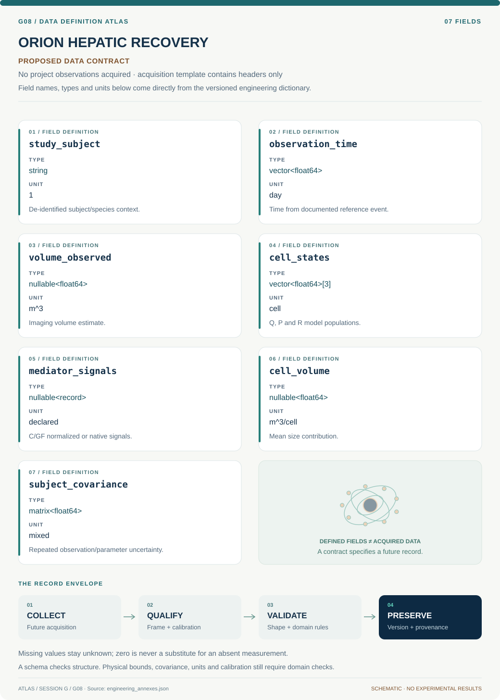

# G08 · ORION HEPATIC RECOVERY

**Original project:** Mediated Liver Regeneration

**Session G:** Exploration Systems Engineering

**Document class:** engineering research design and analysis record · **Revision:** 3 · **Date:** 2026-10-02

**Evidence state:** design basis, mathematical formulation and verification plan documented. Project-specific empirical results remain to be acquired; executable shared model demonstrations have their own recorded checks.

[Session G](../README.md) · [All projects](../../../ENGINEERING_DOCUMENTATION.md) · [Session handbook](../../../handbooks/SESSION_G.md) · [← G07](../G07-hubble-spectral-anchor/README.md) · [H01 →](../../H/H01-voyager-storywalk/README.md)

| Proposed requirements | Specified verification cases | Defined data fields | Cited resources |
| ---: | ---: | ---: | ---: |
| 4 | 3 | 7 | 2 |

[Explore the data blueprint](data/README.md) · [Open the figure gallery](figures/README.md) · [Download acquisition template](data/acquisition.csv) · [Browse the data atlas](../../../data/README.md)

---

## Purpose and scientific objective

Proposed mission: model how signaling, metabolic demand, tissue mechanics, and cell-state transitions may mediate liver regeneration. The mediator is unspecified in the original title, so the dossier retains several mechanistic candidates rather than inventing a treatment. Focus on published-data reanalysis and hypothesis discrimination; any experimental or clinical extension belongs to qualified institutional research.

**Question:** Which aspects of observed regeneration can distinguish mediator-driven cell proliferation from hypertrophy, altered perfusion, and simple volume recovery?

**Testable hypothesis:** A cell-state model constrained by both structural volume and independent functional observations will discriminate mechanisms better than a volume-only growth curve, although sparse human data may remain nonidentifying.

## 1. Design basis and analysis boundary

The analysis system compares nonclinical published or de-identified regeneration time series with reduced cell-state models. Its boundary includes quiescent, primed and replicating populations, latent mediator signals, cell size and vascular/nonparenchymal volume. Volume recovery alone is neither proof of proliferation nor restored liver function; no intervention, dosing or surgery is specified.

Begin by reproducing a published baseline with species and timescale provenance. Compare volume-only, cell-state and perfusion/mechanics-augmented alternatives, adding complexity only if independent observables identify it. Rodent-to-human transfer is a hypothesis assessed through prediction, not a universal temporal scaling rule.

## 2. Requirements and verification traceability

These are project design requirements or proposed analysis gates. A numerical target is not a NASA requirement unless its controlling source is explicitly identified. “TBD” identifies evidence required before a decision; it is not permission to assume a value. Verification evidence listed here is planned, unless a linked result explicitly records execution.

| ID | Requirement / gate | Engineering rationale | Verification method | Basis / required evidence |
| --- | --- | --- | --- | --- |
| G08-R1 | All cell-state simulations shall preserve nonnegative populations and documented division/loss bookkeeping. | A sign error can falsely regenerate mass. | ODE boundary and total-population checks. | Corrected reduced-model contract. |
| G08-R2 | Volume observations shall distinguish cell number/size and nonparenchymal/vascular contributions or flag their confounding. | Volume alone cannot identify mediator mechanism. | Compare observation mappings and sensitivity rank. | Biological identifiability requirement. |
| G08-R3 | Every mediator parameter shall carry measured, literature-assumed or latent status. | Unmeasured signals must not appear as observations. | Audit likelihood and source tables. | Existing human-pilot limitations. |
| G08-R4 | Proposed model gate: added mediator terms improve withheld-time/subject prediction with calibrated uncertainty. | Flexible latent pathways can overfit sparse pilots. | Profile likelihood and subject/time holdout. | Proposed criterion; no clinical predictor claim. |

## 3. Architecture and controlled interfaces

A provenance adapter stores species, study group, observation times and de-identification status. A signal module supplies C and GF as measured records or explicitly latent trajectories. The positive-state ODE maps these signals to Q/P/R and records transition/division/loss rates.

An observation module maps total cells, mean cell volume and vascular/nonparenchymal terms to imaging volume; separate function/perfusion observations remain separate likelihoods. A hierarchical fitter shares justified rates while retaining subject heterogeneity. Prediction exports carry time units, parameter-identifiability flags and missing-observable states, preventing a volume fit from being presented as functional recovery.



Division bookkeeping and the volume observation model are separate modules. Latent mediators and alternative volume contributions expose the limits of mechanism inference and leave functional/clinical recovery outside the claim.

[Editable engineering diagram source](figures/architecture.mmd)

## 4. Mathematical model and derivation

### Governing equations

```text
dQ/dt=-k_p C Q+k_r P+2k_div R-k_loss Q.
```

```text
dP/dt=k_p C Q-(k_g GF+k_r)P; dR/dt=k_g GF P-k_div R.
```

```text
N=Q+P+R; dN/dt=k_div R-k_loss Q under the stated state-transition bookkeeping.
```

```text
V(t)=N(t)v_cell(t)+V_nonparenchymal(t)+V_vascular(t), separating cell number from measured tissue volume.
```

### Variables, units and conventions

- Quiescent Q, primed P, replicating R cell populations; cytokine signal C; growth-factor signal GF; transition/division/loss rates.
- Metabolic load per cell, average cell volume, extracellular matrix state, perfusion, imaging error, and subject-level heterogeneity.

### Assumptions and boundary conditions

- The ODEs are a proposed reduced model inspired by published cell-state work, not a validated clinical predictor.
- Volume recovery alone does not prove restored liver function; signaling variables are latent unless independently measured.

### Derivation step 1

$$
\dot Q=-k_pCQ+k_rP+2k_{div}R-k_{loss}Q
$$

Priming leaves Q, reversal returns P, and division of R creates two quiescent daughters. Each rate-product has cells/time; mediator normalization determines k_p units.

### Derivation step 2

$$
\dot P=k_pCQ-(k_gGF+k_r)P;\quad\dot R=k_gGFP-k_{div}R
$$

Transitions conserve cells until division or loss. Nonnegative rates/signals make the vector field inward at zero population boundaries.

### Derivation step 3

$$
N=Q+P+R;\quad\dot N=k_{div}R-k_{loss}Q
$$

Sum the equations: priming, reversal and progression cancel; one additional cell arises per replicating division event. This corrects accidental double counting.

### Derivation step 4

$$
V=N\bar v_{cell}+V_{nonpar}+V_{vascular}
$$

Volume units are m^3. Differential changes can arise from cell number, hypertrophy or vascular changes; one scalar V cannot uniquely recover all terms.

### Inference or simulation procedure

Reproduce a published baseline model and document species, observation times, and parameter provenance. Fit a hierarchy of volume-only, cell-state, and mechanics/perfusion-augmented alternatives to available de-identified data. Use profile likelihood, sensitivity analysis, and posterior predictive checks to identify parameters that data can actually constrain. Compare mediator hypotheses by expected observable differences and propose non-operational follow-up measurements, without interventions, dosing, or surgical procedures.

### Validity domain and fidelity limits

Published human pilot samples can be small, with sparse mediator measurements. Rodent-to-human timescale transfer is a modeling hypothesis, not a universal scaling law; disease and surgery populations may differ substantially.

## 5. Data specifications and provenance



**Proposed data contract · observations pending.** This visual inventory shows the record fields to acquire or derive. It contains no project measurements. [Open the data blueprint and downloads](data/README.md).

| Field | Type | Unit | Physical / statistical meaning | Quality and missing-data rule |
| --- | --- | --- | --- | --- |
| study_subject | string | 1 | De-identified subject/species context. | Group and source provenance required. |
| observation_time | vector<float64> | day | Time from documented reference event. | No inferred clinical procedure details. |
| volume_observed | nullable<float64> | m^3 | Imaging volume estimate. | Segmentation covariance and reference required. |
| cell_states | vector<float64>[3] | cell | Q, P and R model populations. | Nonnegative; modeled versus measured labeled. |
| mediator_signals | nullable<record> | declared | C/GF normalized or native signals. | Measured/latent status and unit mapping mandatory. |
| cell_volume | nullable<float64> | m^3/cell | Mean size contribution. | Unknown not fixed silently. |
| subject_covariance | matrix<float64> | mixed | Repeated observation/parameter uncertainty. | Positive semidefinite with ordered units. |

[Machine-readable record schema](data/schema.json) · [Empty acquisition CSV](data/acquisition.csv) · [Field dictionary CSV](data/dictionary.csv)

The CSV above contains column headers only. Its schema defines future records and does not establish that original-team data or a particular archive product have been acquired. Frame, timing, calibration, covariance, selection and provenance details must accompany populated records.

### Original liver-regeneration model

[Product, archive or reference](https://pmc.ncbi.nlm.nih.gov/articles/PMC2712210/)

**Fields:** Quiescent/primed/replicating framework, signaling/metabolic-load assumptions, and published parameters.

**Access:** Public article; reproduce model equations with attribution and verify any reused parameter units.

**Role:** Mechanistic baseline.

### Human live-donor model study

[Product, archive or reference](https://pmc.ncbi.nlm.nih.gov/articles/PMC6289189/)

**Fields:** Small pilot subject-volume data, parameter transfer, fit/verification partition, and unmeasured mediator limitations.

**Access:** Public article; raw clinical records are not assumed accessible. Use published de-identified aggregates only.

**Role:** Human translation and uncertainty benchmark.

## 6. Uncertainty, sensitivity and identifiability

Sparse volume observations confound division, hypertrophy, perfusion and loss. Mediator rates can trade against latent signal amplitudes, leaving only rate-signal products identifiable. Study selection, imaging segmentation and disease/species context create shared systematic uncertainty; mechanistic plausibility cannot substitute for independent measurements.

Profile rate-signal products and observation-model alternatives, using sensitivity rank and posterior predictive checks. Withhold subjects or late times rather than randomly splitting repeated observations. Generate alternate-model synthetic data to test interval coverage. Publish unresolved parameter combinations and measurements that would distinguish mechanisms without prescribing biological interventions.

## 7. Engineering trade study

| Alternative | Benefit | Cost / limitation | Decision rule |
| --- | --- | --- | --- |
| Volume-only phenomenology | Few parameters and transparent prediction. | No mediator mechanism identification. | Baseline for sparse imaging data. |
| Cell-state model | Explicit division bookkeeping. | Latent signals/rates confounded. | Use when independent cellular evidence supports states. |
| Perfusion/size-augmented model | Separates nonproliferative volume recovery. | More observations needed. | Add only if identifiable and holdout improves. |

## 8. Verification and validation cases

| Case ID | Stimulus / condition | Expected result / criterion | Method | Evidence artifact |
| --- | --- | --- | --- | --- |
| G08-V1 | No signals/division/loss | With transition rates disabled, populations and volume remain constant. | Exact ODE/observation fixture. | Bookkeeping limit. |
| G08-V2 | Single replicating cohort | With only division active, R decays and Q gains twice lost R; N gains one per event. | Compare R0 exp(-k_div t) and Q0+2R0(1-exp(-kt)). | Analytic division solution. |
| G08-V3 | Volume-only confounding | Equal volumes can arise from different N and cell size; fitter flags the ridge. | Synthetic alternate observation mapping. | Identifiability algebra; clinical outcomes unclaimed. |

**Execution status:** these cases are specified, not claimed as executed. Close a case only with the versioned inputs, output, uncertainty, reviewer and pass/fail rationale.

### Additional scientific validation gates

- Check nonnegative populations, division bookkeeping, equilibrium behavior, and numerical time-step convergence.
- Use leave-one-subject-out prediction where data volume permits; report calibration and wide intervals when sample size is limited.
- Proposed gate: mechanistic claims require independent mediator/function evidence; a good volume fit alone is insufficient.

## 9. Implementation and reproducible work packages

1. Create regeneration_data_registry.csv with species/time/source context.
2. Implement positive_cell_state_ode.py and division fixtures.
3. Build volume_observation.py with size/vascular terms.
4. Create mediator_status.json and hierarchical_likelihood.py.
5. Produce identifiability_profiles.ipynb and alternate-model coverage cases.
6. Publish nonclinical_predictions.parquet and unresolved_measurements.md without intervention guidance.

### Investigation sequence

1. Clarify mediator candidates in the research specification while preserving the original broad topic.
2. Reproduce baseline equations and data fits with explicit initial conditions and units.
3. Compare mechanistic alternatives using identifiable parameter combinations and withheld subjects/time points.
4. Rank future observational measurements by information gain about mechanisms and functional recovery; seek institutional review before any biological extension.

### Resources and interfaces to expertise

- Liver physiology, biomedical modeling, biostatistics expertise, reproducible ODE inference software, and appropriately approved clinical-data collaboration.

## 10. Failure modes and interpretation controls

| Failure mode | Effect on result | Detection / evidence | Design response |
| --- | --- | --- | --- |
| Division double counted | False rapid population growth. | Total-N equation audit. | Conservative state transitions. |
| Latent mediator treated measured | Overconfident causal mechanism. | Likelihood provenance mismatch. | Explicit latent status and profiles. |
| Volume equated function | Unsupported recovery claim. | Evidence-category review. | Separate functional/perfusion endpoints. |

- A model fit can conceal nonunique mechanisms and unsupported treatment implications.
- Regenerative signaling also intersects disease processes; computational hypotheses must not be presented as safe clinical interventions.

## 11. Required engineering outputs

- Attributed baseline reproduction, mechanism-comparison model, identifiability atlas, and prospective measurement-priority specification.

### Scientific result figures to produce during execution

Cell-state/signaling diagram, observed volume with competing model intervals, and parameter-identifiability heatmap; structural and functional recovery occupy separate output panels.

## 12. Cited technical and scientific resources

- [A Model of Liver Regeneration](https://pmc.ncbi.nlm.nih.gov/articles/PMC2712210/) — Original cell-state/metabolic-load mechanistic model.
- [Mathematical Model of Liver Regeneration in Human Live Donors](https://pmc.ncbi.nlm.nih.gov/articles/PMC6289189/) — Original small human pilot and explicit limitations from unmeasured biochemical mediators.

Framework and evidence rules: [engineering documentation standard](../../../engineering/ENGINEERING_STANDARD.md), [model assurance](../../../engineering/MODEL_ASSURANCE.md), [uncertainty procedure](../../../engineering/UNCERTAINTY_AND_DECISION_RULES.md), [data management](../../../engineering/DATA_MANAGEMENT.md). NASA-inspired names are creative identifiers; requirements and results are not NASA certification.
