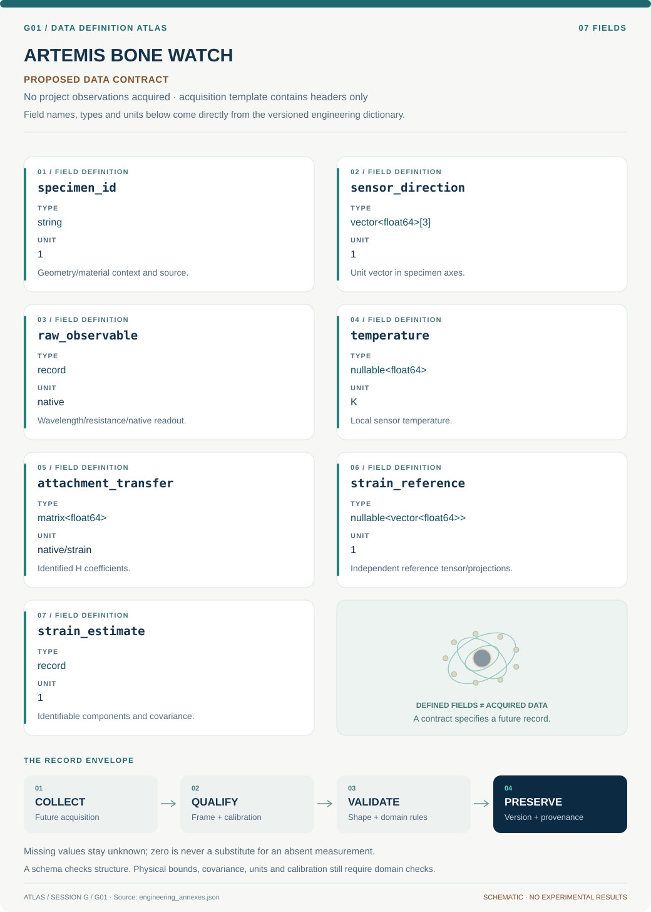
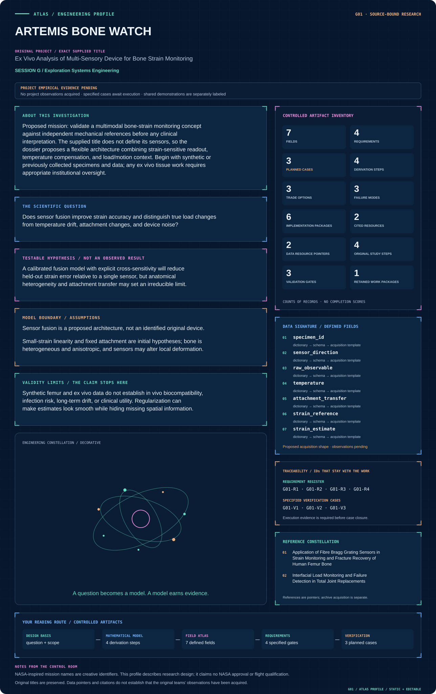

# Session G · Exploration Systems Engineering

[Continuous handbook](../../handbooks/SESSION_G.md) · [All sessions](../README.md) · [Data atlas](../../data/README.md)

**8 projects · 56 defined fields · 32 proposed requirements · 24 specified cases.** All projects retain their supplied order. Data maps describe proposed acquisition, while included numerical plots carry their own evidence labels.

| ID | Mission profile & engineering record | Original investigation | Explore |
| --- | --- | --- | --- |
| G01 | [ARTEMIS BONE WATCH](G01-artemis-bone-watch/README.md) | Ex Vivo Analysis of Multi-Sensory Device for Bone Strain Monitoring | [Profile](G01-artemis-bone-watch/figures/mission-profile.svg) · [Data](G01-artemis-bone-watch/data/README.md) · [Figures](G01-artemis-bone-watch/figures/README.md) |
| G02 | [DEEP SPACE QUIETLINE](G02-deep-space-quietline/README.md) | Minimizing Local Electromagnetic Interference Using Adaptive Filters | [Profile](G02-deep-space-quietline/figures/mission-profile.svg) · [Data](G02-deep-space-quietline/data/README.md) · [Figures](G02-deep-space-quietline/figures/README.md) |
| G03 | [DEEP SPACE BEAM CARTOGRAPHER](G03-deep-space-beam-cartographer/README.md) | Measuring Antenna Patterns for Ground Station | [Profile](G03-deep-space-beam-cartographer/figures/mission-profile.svg) · [Data](G03-deep-space-beam-cartographer/data/README.md) · [Figures](G03-deep-space-beam-cartographer/figures/README.md) |
| G04 | [ARTEMIS CARTILAGE MATRIX](G04-artemis-cartilage-matrix/README.md) | Photocurable nanocomposites for customizable cartilage replacements | [Profile](G04-artemis-cartilage-matrix/figures/mission-profile.svg) · [Data](G04-artemis-cartilage-matrix/data/README.md) · [Figures](G04-artemis-cartilage-matrix/figures/README.md) |
| G05 | [ARES CREW RESOURCE VAULT](G05-ares-crew-resource-vault/README.md) | Mars In-Situ Resource Utilization for Health Applications | [Profile](G05-ares-crew-resource-vault/figures/mission-profile.svg) · [Data](G05-ares-crew-resource-vault/data/README.md) · [Figures](G05-ares-crew-resource-vault/figures/README.md) |
| G06 | [TERRA HUMIDITY HARVEST](G06-terra-humidity-harvest/README.md) | Direct Air Capture Using Moisture Swing Chemistry | [Profile](G06-terra-humidity-harvest/figures/mission-profile.svg) · [Data](G06-terra-humidity-harvest/data/README.md) · [Figures](G06-terra-humidity-harvest/figures/README.md) |
| G07 | [HUBBLE SPECTRAL ANCHOR](G07-hubble-spectral-anchor/README.md) | An Introduction to Systems Engineering: Building a Monochromator Mount | [Profile](G07-hubble-spectral-anchor/figures/mission-profile.svg) · [Data](G07-hubble-spectral-anchor/data/README.md) · [Figures](G07-hubble-spectral-anchor/figures/README.md) |
| G08 | [ORION HEPATIC RECOVERY](G08-orion-hepatic-recovery/README.md) | Mediated Liver Regeneration | [Profile](G08-orion-hepatic-recovery/figures/mission-profile.svg) · [Data](G08-orion-hepatic-recovery/data/README.md) · [Figures](G08-orion-hepatic-recovery/figures/README.md) |

## Visual field guide

A visual specification for [G01 · ARTEMIS BONE WATCH](G01-artemis-bone-watch/README.md). Project-specific observations remain pending. Every project above has its own data map and engineering architecture.

## Mission profile spotlight

[Enter G01 engineering dossier](G01-artemis-bone-watch/README.md) · [Mission control: every profile and reading path](../../MISSION_CONTROL.md)
