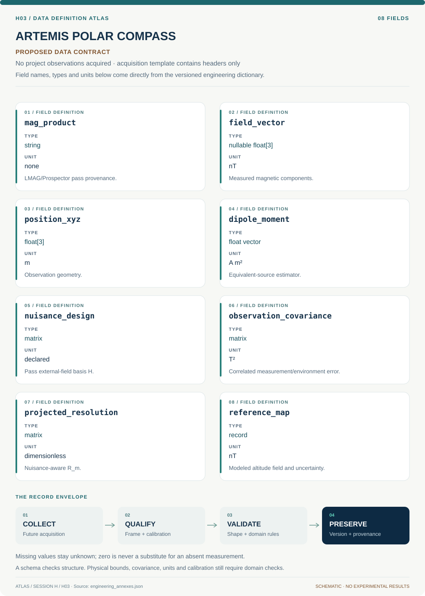
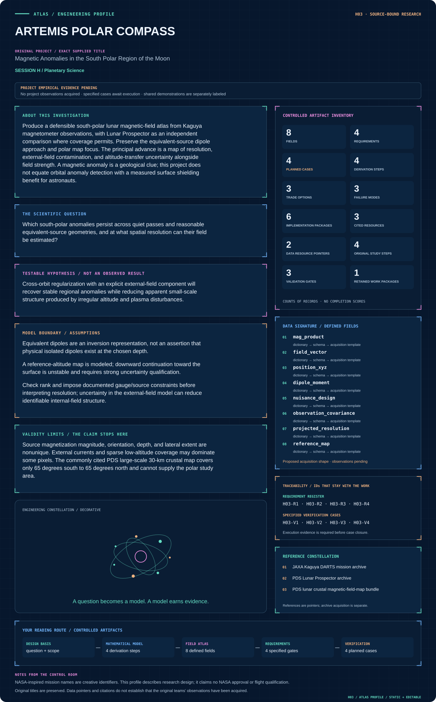

# H03 · Figure gallery

[ARTEMIS POLAR COMPASS](../README.md) · [Data blueprint](../data/README.md) · [Data diagnostic gallery](../../../../data/figures/README.md)

## Engineering architecture

The diagram makes external-field nuisance projection part of source estimation and resolution. It supports an altitude-specific polar magnetic atlas with identifiable-mode masks, while excluding unsupported surface shielding and nonpolar-map substitution.

[SVG](architecture.svg) · [Editable Mermaid source](architecture.mmd)

## Data blueprint

**Proposed contract · observations pending.** Every field, type, unit and meaning comes from the controlled dictionary. [Open SVG](data-map.svg) · [Download dictionary](../data/dictionary.csv)

## Mission profile

The scientific question, hypothesis, model boundary and document metadata are drawn from controlled sources. Proposed work remains distinguished from acquired evidence. [Open SVG](mission-profile.svg)

## Planned scientific result

Matched-altitude polar maps of field components, posterior spread, sampled orbit tracks, and resolution length; unsampled regions are visibly masked.

This final scientific result remains an execution deliverable; the design diagrams do not establish an empirical finding.
