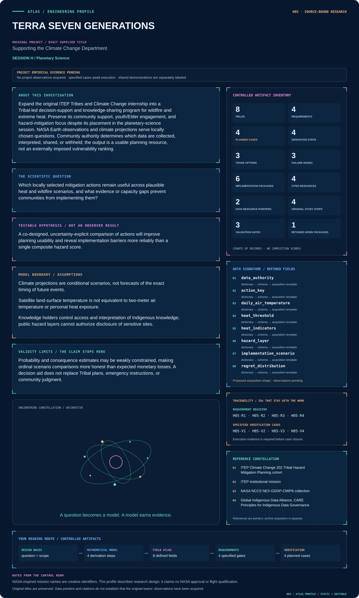
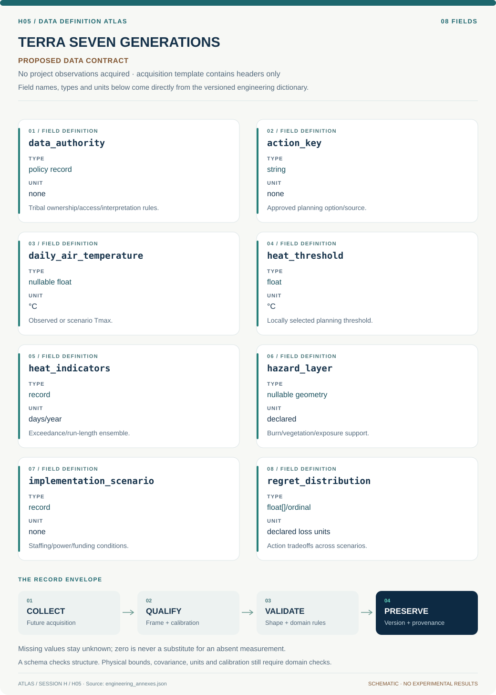

# H05 · TERRA SEVEN GENERATIONS

**Original project:** Supporting the Climate Change Department

**Session H:** Planetary Science

**Document class:** engineering research design and analysis record · **Revision:** 4 · **Date:** 2026-10-02

**Evidence state:** design basis, mathematical formulation and verification plan documented. Project-specific empirical results remain to be acquired; executable shared model demonstrations have their own recorded checks.

[Session H](../README.md) · [All projects](../../../ENGINEERING_DOCUMENTATION.md) · [Session handbook](../../../handbooks/SESSION_H.md) · [← H04](../H04-stardust-carbon-atlas/README.md) · [H06 →](../H06-mars-odyssey-ridgework/README.md)

| Proposed requirements | Specified verification cases | Defined data fields | Cited resources |
| ---: | ---: | ---: | ---: |
| 4 | 4 | 8 | 4 |

[Explore the data blueprint](data/README.md) · [Open the figure gallery](figures/README.md) · [Download acquisition template](data/acquisition.csv) · [Browse the data atlas](../../../data/README.md)

---

## Mission profile



| Profile panel | Engineering signal | Open the evidence |
| --- | --- | --- |
| Mission identity | Supporting the Climate Change Department | [Scientific objective](#purpose-and-scientific-objective) |
| Model cockpit | 3 governing expressions; 4 derivation steps; declared assumptions and validity envelope | [Mathematical formulation](#4-mathematical-model-and-derivation) |
| Data blueprint | 8 proposed fields with types, units and quality rules | [Field map & downloads](data/README.md) |
| Verification queue | 4 proposed requirements; 4 specified cases; project execution evidence pending | [Case definitions](#8-verification-and-validation-cases) |
| Figure wall | Architecture, field map, planned result description | [Open full gallery](figures/README.md) |
| Resource library | 4 cited primary resources with support statements | [Cited resources](#12-cited-technical-and-scientific-resources) |

### Model cockpit

**Analysis method:** Begin with a listening and governance agreement defining the decisions, authorized participants, data ownership, and permitted public outputs. Assemble a source-checked catalog of wildfire and heat actions from ITEP resources and participating communities' approved plans. Calculate locally meaningful heat indicators from station observations and NASA NEX-GDDP-CMIP6 scenarios, using an ensemble and validating historical performance. Combine remotely observed burn or vegetation patterns with locally reviewed exposure information; refrain from converting coarse projections directly into parcel-level risk. Compare actions using community-selected criteria such as reliability, cost, maintenance, cultural compatibility, and access. Stress-test implementation under scenarios for staffing, power outages, funding delay, and climate severity. Facilitate youth/Elder review and document where quantitative metrics fail to represent community priorities.

**Operating envelope:** Probability and consequence estimates may be weakly constrained, making ordinal scenario comparisons more honest than expected monetary losses. A decision aid does not replace Tribal plans, emergency instructions, or community judgment.

**Variables and conventions**

- H and C are heat-exceedance days and maximum run length per year; thresholds are chosen locally with technical support.
- s indexes climate and implementation scenarios; a indexes feasible actions; h is a hazard event; E denotes exposed assets.
- V is consequence per exposed asset under each action and scenario; totals use declared commensurate units. Cultural significance is recorded separately unless the community elects a weighting scheme.

### Artifact wall



The diagram preserves Tribal authority and community climate decisions as the system boundary. It joins supported heat/wildfire evidence with implementation feasibility, without imposing vulnerability rankings, disclosing protected knowledge or substituting planetary context.

**Scientific result to produce:** An accessible action-by-scenario matrix showing robustness, maintenance needs, evidence gaps, and community-defined priorities; sensitive assets remain in approved local materials only.

### Investigation feed · planned work

The feed records proposed work packages. A row becomes executed evidence only with versioned inputs, outputs and a reviewed result.

| Sequence | Evidence state | Engineering work package |
| --- | --- | --- |
| 01 | Planned | Establish Tribal listening/governance and youth/Elder review agreements. |
| 02 | Planned | Create approved action/resource and protected-knowledge access registries. |
| 03 | Planned | Freeze station/NEX/Earth-observation product versions, units and calendars. |
| 04 | Planned | Implement historical heat validation and supported hazard/exposure indicators. |
| 05 | Planned | Build staffing/power/funding/climate action stress tests and ordinal/loss alternatives. |
| 06 | Planned | Release only Tribal-approved planning artifacts with metric and scenario limitations. |

### Mission connections

Connections are reading routes based on actual shared resources, supplied sessions or included illustrations. They do not establish physical dependencies, team collaborations or validated results.

| Connected mission | Original investigation | Recorded connection basis |
| --- | --- | --- |
| [B17 · AQUARIUS LIFELINE — Inland Fisheries Resilience](../../B/B17-aquarius-lifeline-inland-fisheries-resilience/README.md) | Off the Hook: Assessing the Vulnerability of Inland Subsistence Fisheries to Climate Change | [Global Indigenous Data Alliance, CARE Principles for Indigenous Data Governance](https://www.gida-global.org/careprinciples) |
| [B10 · LANDSAT EQUITY — Community Canopy Mission](../../B/B10-landsat-equity-community-canopy-mission/README.md) | Using Remote Sensing to Determine Vegetation Change and Impacts to Communities | [Global Indigenous Data Alliance, CARE Principles for Indigenous Data Governance](https://www.gida-global.org/careprinciples) |
| [H04 · STARDUST CARBON ATLAS](../H04-stardust-carbon-atlas/README.md) | Exploring Carbon-bearing Matter in an Antarctic Micrometeorite | Session H |
| [H06 · MARS ODYSSEY RIDGEWORK](../H06-mars-odyssey-ridgework/README.md) | Variability of Martian Wrinkle Ridges | Session H |
| [H03 · ARTEMIS POLAR COMPASS](../H03-artemis-polar-compass/README.md) | Magnetic Anomalies in the South Polar Region of the Moon | Session H |
| [H07 · KEPLER CO ECHO](../H07-kepler-co-echo/README.md) | Increasing CO Gas Detections in Protoplanetary Disks | Session H |

[Machine-readable connection register and ranking rule](../../../registry/mission_connections.json)

### Reading playlist

| Route | Start here | Continue to |
| --- | --- | --- |
| Understand the idea | [Scientific objective](#purpose-and-scientific-objective) | [Design boundary](#1-design-basis-and-analysis-boundary) → [Mathematics](#4-mathematical-model-and-derivation) |
| Inspect the data | [Visual blueprint](data/README.md) | [Provenance](#5-data-specifications-and-provenance) → [Uncertainty](#6-uncertainty-sensitivity-and-identifiability) |
| Make a design decision | [Trade study](#7-engineering-trade-study) | [Failure modes](#10-failure-modes-and-interpretation-controls) → [Required outputs](#11-required-engineering-outputs) |
| Prepare execution | [Requirements](#2-requirements-and-verification-traceability) | [Verification](#8-verification-and-validation-cases) → [Implementation](#9-implementation-and-reproducible-work-packages) |

## Complete engineering dossier

The profile above is a browsing layer. The full design basis, equations, derivations, data contract, uncertainty, trades and controlled case definitions follow.

## Purpose and scientific objective

Expand the original ITEP Tribes and Climate Change internship into a Tribal-led decision-support and knowledge-sharing program for wildfire and extreme heat. Preserve its community support, youth/Elder engagement, and hazard-mitigation focus despite its placement in the planetary-science session. NASA Earth observations and climate projections serve locally chosen questions. Community authority determines which data are collected, interpreted, shared, or withheld; the output is a usable planning resource, not an externally imposed vulnerability ranking.

**Question:** Which locally selected mitigation actions remain useful across plausible heat and wildfire scenarios, and what evidence or capacity gaps prevent communities from implementing them?

**Testable hypothesis:** A co-designed, uncertainty-explicit comparison of actions will improve planning usability and reveal implementation barriers more reliably than a single composite hazard score.

## 1. Design basis and analysis boundary

The design remains a Tribal-led ITEP climate-support program for wildfire and extreme heat, with youth/Elder engagement and locally chosen planning questions. Its boundary is a governed action/resource catalog, climate-indicator analysis and implementation stress tests. The session's planetary label does not change this community climate purpose or authorize collection of protected knowledge.

Begin with a listening/governance agreement and approved existing plans, then validate local heat indicators and compare feasible actions under climate/implementation scenarios. NASA projections and public Earth observations are technical inputs, while Tribal authority defines access, interpretation and release. Climate ensembles are conditional scenarios, not exact-event forecasts; quantitative loss is used only where the community accepts commensurate consequences.

## 2. Requirements and verification traceability

These are project design requirements or proposed analysis gates. A numerical target is not a NASA requirement unless its controlling source is explicitly identified. “TBD” identifies evidence required before a decision; it is not permission to assume a value. Verification evidence listed here is planned, unless a linked result explicitly records execution.

| ID | Requirement / gate | Engineering rationale | Verification method | Basis / required evidence |
| --- | --- | --- | --- | --- |
| H05-R1 | Document Tribal authority, permitted purpose, knowledge-holder access, interpretation rights and public-output rules before linking local knowledge. | Public hazard maps do not authorize sensitive-site disclosure. | Governance and export-policy audit. | ITEP mission; CARE and local standards. |
| H05-R2 | Heat indicators shall use locally selected thresholds and observed air-temperature validation; satellite surface temperature remains a separate field. | Surface radiance is not personal/two-metre heat exposure. | Threshold/measurement lineage review. | Existing climate-data distinctions. |
| H05-R3 | Each climate run shall retain model/scenario/version/calendar and historical bias assessment; coarse projections shall not become parcel-level risk. | Scenario/calendar support limits precision. | Product/scale and calendar checks. | NEX-GDDP-CMIP6 metadata. |
| H05-R4 | Action comparisons shall include staffing, power, funding and maintenance stress scenarios with community-selected criteria. | Implementation failure can dominate nominal benefit. | Independent scenario/regret replay. | ITEP planning context; proposed design. |

## 3. Architecture and controlled interfaces

A governance registry stores data authority, access tiers and approved youth/Elder review paths. The action catalog links locally approved plans and ITEP resources to feasible actions, costs and maintenance requirements. Protected knowledge remains in a controlled layer whose absence from public outputs is explicitly acknowledged.

The climate adapter converts documented daily variables/calendar conventions and joins station observations for historical evaluation. Heat indicators and burn/vegetation layers retain their spatial support separately. A scenario engine combines climate severity with staffing/power/funding assumptions, then emits ordinal or commensurate loss/regret comparisons. Publication passes through Tribal review, and missing consequence evidence cannot be replaced by imposed monetary cultural values.


The diagram preserves Tribal authority and community climate decisions as the system boundary. It joins supported heat/wildfire evidence with implementation feasibility, without imposing vulnerability rankings, disclosing protected knowledge or substituting planetary context.

[Editable engineering diagram source](figures/architecture.mmd)

## 4. Mathematical model and derivation

### Governing equations

$$
H_y(T_*)=\sum_{d\in y}\mathbf 1(T_{\max,d}>T_*),\quad C_y=\max\{\mathrm{consecutive\ exceedance\ days}\}
$$

$$
L(a,s)=\sum_j P(h_j\mid s)\,E_j\,V_j(a,s)
$$

$$
\mathrm{Regret}(a,s)=L(a,s)-\min_{a\prime\in\mathcal A}L(a\prime,s)
$$

### Variables, units and conventions

- H and C are heat-exceedance days and maximum run length per year; thresholds are chosen locally with technical support.
- s indexes climate and implementation scenarios; a indexes feasible actions; h is a hazard event; E denotes exposed assets.
- V is consequence per exposed asset under each action and scenario; totals use declared commensurate units. Cultural significance is recorded separately unless the community elects a weighting scheme.

### Assumptions and boundary conditions

- Climate projections are conditional scenarios, not forecasts of the exact timing of future events.
- Satellite land-surface temperature is not equivalent to two-meter air temperature or personal heat exposure.
- Knowledge holders control access and interpretation of Indigenous knowledge; public hazard layers cannot authorize disclosure of sensitive sites.

### Derivation step 1

```text
T_C=T_K-273.15; H_y(T*)=sum_d I(Tmax,d>T*).
```

Air-temperature units and strict exceedance rule are explicit. Native-calendar day counts and missing-day coverage are recorded before intermodel comparisons.

### Derivation step 2

```text
C_y=max_run_length{Tmax,d>T*}.
```

Consecutive days require uninterrupted valid dates; missing observations split or bound runs under a declared rule rather than being treated as cool days.

### Derivation step 3

```text
L(a,s)=sum_j P(h_j|s) E_j V_j(a,s).
```

Exposed asset counts times consequence/asset yield declared loss units. Overlapping hazards require joint-event accounting; cultural significance remains separate unless Tribal choice specifies a weighting.

### Derivation step 4

```text
Regret(a,s)=L(a,s)-min_(a' in A)L(a',s).
```

Regret compares feasible actions within the same scenario. Robust selection may minimize worst-case regret, without pretending scenario frequencies are validated probabilities.

### Inference or simulation procedure

Begin with a listening and governance agreement defining the decisions, authorized participants, data ownership, and permitted public outputs. Assemble a source-checked catalog of wildfire and heat actions from ITEP resources and participating communities' approved plans. Calculate locally meaningful heat indicators from station observations and NASA NEX-GDDP-CMIP6 scenarios, using an ensemble and validating historical performance. Combine remotely observed burn or vegetation patterns with locally reviewed exposure information; refrain from converting coarse projections directly into parcel-level risk. Compare actions using community-selected criteria such as reliability, cost, maintenance, cultural compatibility, and access. Stress-test implementation under scenarios for staffing, power outages, funding delay, and climate severity. Facilitate youth/Elder review and document where quantitative metrics fail to represent community priorities.

### Validity domain and fidelity limits

Probability and consequence estimates may be weakly constrained, making ordinal scenario comparisons more honest than expected monetary losses. A decision aid does not replace Tribal plans, emergency instructions, or community judgment.

## 5. Data specifications and provenance



**Proposed data contract · observations pending.** This visual inventory shows the record fields to acquire or derive. It contains no project measurements. [Open the data blueprint and downloads](data/README.md).

| Field | Type | Unit | Physical / statistical meaning | Quality and missing-data rule |
| --- | --- | --- | --- | --- |
| data_authority | policy record | none | Tribal ownership/access/interpretation rules. | Local standards and revocation retained. |
| action_key | string | none | Approved planning option/source. | Feasibility and review status required. |
| daily_air_temperature | nullable float | °C | Observed or scenario Tmax. | Measurement type/calendar explicit. |
| heat_threshold | float | °C | Locally selected planning threshold. | Approval/rationale and version saved. |
| heat_indicators | record | days/year | Exceedance/run-length ensemble. | Missing-day and native-calendar support retained. |
| hazard_layer | nullable geometry | declared | Burn/vegetation/exposure support. | Scale and sensitive-site restrictions saved. |
| implementation_scenario | record | none | Staffing/power/funding conditions. | Assumptions not labeled measured. |
| regret_distribution | float[]/ordinal | declared loss units | Action tradeoffs across scenarios. | Weights/consequence uncertainty and approval explicit. |

[Machine-readable record schema](data/schema.json) · [Empty acquisition CSV](data/acquisition.csv) · [Field dictionary CSV](data/dictionary.csv)

The CSV above contains column headers only. Its schema defines future records and does not establish that original-team data or a particular archive product have been acquired. Frame, timing, calibration, covariance, selection and provenance details must accompany populated records.

### ITEP Tribal Hazard Mitigation Planning cohort account

[Product, archive or reference](https://itep.nau.edu/wp-content/uploads/2024/07/tribes_ntnlTHMPC.pdf)

**Fields:** Planning modules, engagement methods, wildfire/extreme-heat support resources

**Access:** Public account; participating Tribal planning documents require their own access decisions.

**Role:** Original program continuity and action-resource design.

### NASA NEX-GDDP-CMIP6

[Product, archive or reference](https://www.nccs.nasa.gov/data-collections/nex-gddp-cmip6/)

**Fields:** Downscaled daily temperature and other climate variables, models, scenarios and provenance

**Access:** Public service; choose product versions and calendars explicitly and retain documented limitations.

**Role:** Scenario stress testing, supplemented by local observations.

## 6. Uncertainty, sensitivity and identifiability

Projection model spread, local station coverage and downscaling discrepancy affect heat indicators. Validate historical distributions and hot-spell timing metrics, compare calendar/missingness treatments and retain ensemble dependence. Satellite surface temperature and coarse wildfire proxies cannot substitute for locally validated air exposure or parcel hazard probability.

Consequence and implementation estimates may be weakly identified, while cultural priorities cannot be inferred from asset counts. Use ordinal comparisons when commensurate losses are unsupported, and show rank reversals across approved staffing/funding/climate scenarios. Youth/Elder review identifies omissions and meaning that metrics fail to represent. Data sovereignty is an operational constraint on analysis and publication, not an uncertainty to average away.

## 7. Engineering trade study

| Alternative | Benefit | Cost / limitation | Decision rule |
| --- | --- | --- | --- |
| Approved action/resource catalog | Immediately reviewable planning support. | Does not quantify future hazard. | Required starting deliverable. |
| Validated heat-indicator ensemble | Connects observations and conditional climate stress. | Downscaling/calendar limits local precision. | Use at supported community/regional scale. |
| Community scenario/regret comparison | Includes implementation and local priorities. | Loss probabilities/weights may be uncertain. | Prefer ordinal robustness where monetization is unsupported. |

## 8. Verification and validation cases

| Case ID | Stimulus / condition | Expected result / criterion | Method | Evidence artifact |
| --- | --- | --- | --- | --- |
| H05-V1 | Temperature conversion | 35°C. | Condition/fixture: Scenario temperature 308.15 K. Verification procedure: Exact unit-adapter fixture.. | Exact unit-adapter fixture. |
| H05-V2 | Heat sequence | H=2 days and C=2 consecutive days. | Condition/fixture: Tmax=[35,36,37,34]°C with threshold 35°C. Verification procedure: Exact indicator calculation.. | Exact indicator calculation. |
| H05-V3 | Regret identity | Regret=0; all other regrets are nonnegative. | Condition/fixture: Action is the least-loss feasible choice in a scenario. Verification procedure: Independent action-ledger calculation.. | Independent action-ledger calculation. |
| H05-V4 | Protected knowledge export | Public export is blocked or approved aggregate substituted. | Condition/fixture: Synthetic sensitive-site layer lacks public permission. Verification procedure: Policy integration test.. | Policy integration test. |

**Execution status:** these cases are specified, not claimed as executed. Close a case only with the versioned inputs, output, uncertainty, reviewer and pass/fail rationale.

### Additional scientific validation gates

- Compare historical heat indicators with relevant stations and report seasonal bias, threshold sensitivity, and missingness.
- Conduct community-defined usability tasks and document whether proposed actions fit staffing and maintenance capacity.
- Audit every public map against the sharing agreement; report model disagreement and avoid presenting an ensemble mean as certainty.

## 9. Implementation and reproducible work packages

1. Establish Tribal listening/governance and youth/Elder review agreements.
2. Create approved action/resource and protected-knowledge access registries.
3. Freeze station/NEX/Earth-observation product versions, units and calendars.
4. Implement historical heat validation and supported hazard/exposure indicators.
5. Build staffing/power/funding/climate action stress tests and ordinal/loss alternatives.
6. Release only Tribal-approved planning artifacts with metric and scenario limitations.

### Investigation sequence

1. Agree on governance and a community-selected pilot decision.
2. Compile an annotated action library and identify evidence gaps.
3. Build historical indicator checks and scenario comparisons.
4. Hold interpretation workshops, revise language and criteria, and return locally controlled outputs.

### Resources and interfaces to expertise

- ITEP collaboration, compensated community participants and knowledge holders, climate analyst, accessible mapping tools, local planning staff.

## 10. Failure modes and interpretation controls

| Failure mode | Effect on result | Detection / evidence | Design response |
| --- | --- | --- | --- |
| Planetary analogy replaces purpose | Community support scope lost. | Context/partner review. | Preserve wildfire/heat and ITEP continuity. |
| Coarse model parcel risk | False local precision. | Scale/validation audit. | Supported aggregation and uncertainty. |
| Knowledge released without authority | Violation of sovereignty/trust. | Export-policy and review gate. | Tribal-controlled access and publication. |

- Extractive engagement, disclosure of sensitive cultural locations, misleading fine-scale precision, and recommendations unsupported by local capacity.

## 11. Required engineering outputs

- A locally governed action-resource library, climate scenario notebook, accessible workshop materials, and a prioritized implementation-gap register.

### Scientific result figures to produce during execution

An accessible action-by-scenario matrix showing robustness, maintenance needs, evidence gaps, and community-defined priorities; sensitive assets remain in approved local materials only.

## 12. Cited technical and scientific resources

- [ITEP Climate Change 202 Tribal Hazard Mitigation Planning cohort](https://itep.nau.edu/wp-content/uploads/2024/07/tribes_ntnlTHMPC.pdf) — Program's planning, engagement, and hazard focus.
- [ITEP institutional mission](https://itep.nau.edu/) — Listening to Tribal priorities and strengthening capacity and sovereignty.
- [NASA NCCS NEX-GDDP-CMIP6 collection](https://www.nccs.nasa.gov/data-collections/nex-gddp-cmip6/) — Climate scenario data access; not local hazard validation.
- [Global Indigenous Data Alliance, CARE Principles for Indigenous Data Governance](https://www.gida-global.org/careprinciples) — Primary framework supporting Indigenous authority, benefit and ethics; local Tribal standards govern actual access, interpretation and sharing.

Framework and evidence rules: [engineering documentation standard](../../../engineering/ENGINEERING_STANDARD.md), [model assurance](../../../engineering/MODEL_ASSURANCE.md), [uncertainty procedure](../../../engineering/UNCERTAINTY_AND_DECISION_RULES.md), [data management](../../../engineering/DATA_MANAGEMENT.md). NASA-inspired names are creative identifiers; requirements and results are not NASA certification.
