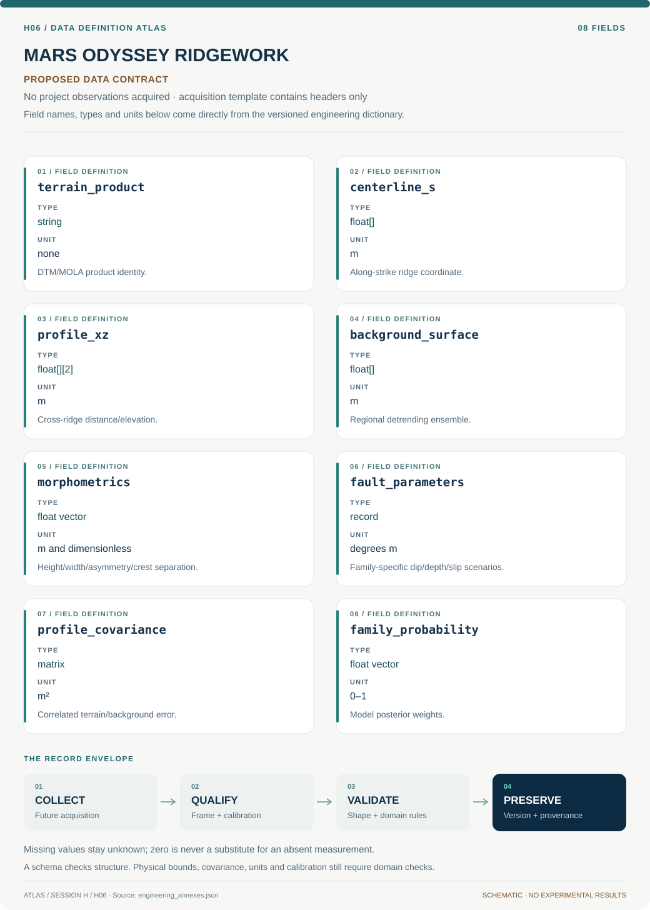

# H06 · MARS ODYSSEY RIDGEWORK

**Original project:** Variability of Martian Wrinkle Ridges

**Session H:** Planetary Science

**Document class:** engineering research design and analysis record · **Revision:** 3 · **Date:** 2026-10-02

**Evidence state:** design basis, mathematical formulation and verification plan documented. Project-specific empirical results remain to be acquired; executable shared model demonstrations have their own recorded checks.

[Session H](../README.md) · [All projects](../../../ENGINEERING_DOCUMENTATION.md) · [Session handbook](../../../handbooks/SESSION_H.md) · [← H05](../H05-terra-seven-generations/README.md) · [H07 →](../H07-kepler-co-echo/README.md)

| Proposed requirements | Specified verification cases | Defined data fields | Cited resources |
| ---: | ---: | ---: | ---: |
| 4 | 4 | 8 | 4 |

[Explore the data blueprint](data/README.md) · [Open the figure gallery](figures/README.md) · [Download acquisition template](data/acquisition.csv) · [Browse the data atlas](../../../data/README.md)

---

## Purpose and scientific objective

Turn along-strike wrinkle-ridge variability in Solis and Lunae plana into a test of competing fault architectures and mechanical layering. Preserve the original topographic classification goal while coupling descriptive shapes to physical forward models. Published tectonic studies show that multiple structural elements can reproduce complex ridge profiles; the proposed analysis therefore reports model families and nonuniqueness rather than treating a cluster label as a uniquely identified subsurface fault.

**Question:** Does the observed variation within individual ridges require changes in thrust/backthrust geometry, or can sampling, erosion, and surface layering explain it?

**Testable hypothesis:** A model with spatially correlated fault geometry will predict withheld ridge segments better than independent profile fits, while some apparent classes will disappear after measurement uncertainty is included.

## 1. Design basis and analysis boundary

The ridge system analyzes along-strike variability in Solis and Lunae plana using verified HiRISE DTMs where available and actual-resolution MOLA context elsewhere. It links descriptive cross-ridge shape to competing thrust/backthrust and trishear model families. A cluster label describes morphology and cannot uniquely identify a deep fault architecture.

Begin with datum-consistent centerlines, local-normal profiles and continuous morphometrics, then uncertainty-aware clustering and physical forward-model comparison. Published tectonic studies motivate multiple structural alternatives. Regional tilt, erosion and impact modification remain explicit competing relief sources, and model-derived shortening is not a global contraction estimate without representative geology and chronology.

## 2. Requirements and verification traceability

These are project design requirements or proposed analysis gates. A numerical target is not a NASA requirement unless its controlling source is explicitly identified. “TBD” identifies evidence required before a decision; it is not permission to assume a value. Verification evidence listed here is planned, unless a linked result explicitly records execution.

| ID | Requirement / gate | Engineering rationale | Verification method | Basis / required evidence |
| --- | --- | --- | --- | --- |
| H06-R1 | Every profile shall retain terrain product/resolution/datum, centerline location and local-normal definition. | Oblique sections bias widths and asymmetry. | Geometry/product audit. | HiRISE/MOLA documentation. |
| H06-R2 | Keep morphology continuous and report cluster stability instead of requiring a fixed three-class solution. | Noisy profiles can create arbitrary categories. | Bootstrap clustering and metric review. | Original classification context; proposed improvement. |
| H06-R3 | DTM, detrending and along-strike covariance shall enter model comparison; whole ridges/contiguous segments are held out. | Adjacent profiles are correlated. | Covariance/split audit. | Existing hierarchical model. |
| H06-R4 | Report fault-family posterior and depth/slip tradeoffs; no unique deep detachment or global contraction claim from surface shape alone. | Inverse morphology is nonunique. | Profile-likelihood and claim review. | Primary tectonic context. |

## 3. Architecture and controlled interfaces

A terrain adapter preserves metre elevations, datum and uncertainty; centerlines define local tangents and normals in projected coordinates. Profiles store cross-ridge x and along-strike s with sampling spacing compatible with product resolution. A regional-surface module produces alternative tilt/background ensembles.

The morphology branch emits height, width, asymmetry and crest-separation distributions with cluster stability. The physical branch evaluates distinct elastic/kinematic fault families and along-strike parameter priors. A comparator uses terrain/background covariance and model priors, while reserved ridge segments assess transfer. Missing stereo coverage blocks high-resolution claims; interpolation of MOLA cannot manufacture narrow ridge detail.



The diagram ties profile geometry and correlated terrain error to distinct fault-model families. Continuous morphology and whole-ridge validation remain separate from nonunique deep architecture and unsupported global contraction estimates.

[Editable engineering diagram source](figures/architecture.mmd)

## 4. Mathematical model and derivation

### Governing equations

$$
z_{ij}=z_{0,ij}+\mathcal F(x_{ij};\theta_j,M)+e_{ij}
$$

$$
\theta(s)\sim\mathrm{GP}[\bar\theta,k(s,s\prime)],\quad k=\sigma_\theta^2\exp[-|s-s\prime|/\ell]
$$

$$
p(M,\theta\mid\mathbf z)\propto p(\mathbf z\mid M,\theta,\mathbf C_z)\,p(\theta\mid M)\,p(M)
$$

### Variables, units and conventions

- z and cross-ridge coordinate x are meters; s is along-strike distance; j denotes a profile.
- theta contains fault dip, depth, slip, and layering parameters in declared units; M labels thrust, backthrust, or trishear model families.
- C_z includes correlated DTM uncertainty and detrending uncertainty; ell is the physical along-strike correlation length.

### Assumptions and boundary conditions

- Cross-ridge profiles are approximately perpendicular to local strike; curved ridges require locally defined normals.
- Topography includes erosion, impact modification, and regional tilt in addition to tectonic displacement.
- Elastic dislocation and kinematic trishear models are competing approximations, not interchangeable descriptions of the same physics.

### Derivation step 1

```text
t(s)=d centerline/ds; n(s)=(-t_y,t_x)/||t||; profile(s,x)=centerline(s)+x n(s).
```

Local-normal extraction preserves perpendicular geometry for curved ridges; coordinates and distances are metres.

### Derivation step 2

```text
z(x,s)=z0(x,s)+F_M(x;theta(s))+epsilon.
```

Regional tilt z0 and tectonic displacement F share metre units. In a linear dislocation screen, F=sum_q K_q(x;dip,depth) slip_q with dimensionless vertical-response kernels.

### Derivation step 3

```text
Cov(theta(s),theta(s'))=sigma_theta² exp(-|s-s'|/ell).
```

Along-strike length ell is metres, while each parameter block has its own units and covariance. Mixed dip/slip/depth blocks require explicit scaling.

### Derivation step 4

```text
p(M,theta|z) proportional p(z|M,theta,C_z)p(theta|M)p(M).
```

C_z includes DTM and background/detrending terms. Competing model priors remain explicit, and posterior predictive fit does not establish a uniquely physical mechanism.

### Inference or simulation procedure

Select complete ridges with documented topographic coverage, then establish a centerline and extract many perpendicular profiles at spacing compatible with DTM resolution. Record height, width, asymmetry, crest separation, local slope, and uncertainty. Benchmark the original k-means approach with uncertainty-aware mixture clustering and bootstrap stability, retaining continuous morphology rather than forcing three classes. Fit thrust/backthrust and trishear forward models, allowing along-strike changes through a hierarchical prior. Use geologically motivated bounds that are stated before fitting. Examine whether inferred discontinuities align with mapped intersections or stratigraphic changes, and compare alternative regional detrending and erosion treatments. Reserve entire ridges or long contiguous segments for predictive tests to prevent neighboring profiles leaking into train and test sets.

### Validity domain and fidelity limits

Surface shape alone rarely constrains deep detachment depth uniquely. Model-derived shortening cannot become a global thermal-contraction estimate without representative sampling, age constraints, and uncertainty in nontectonic relief.

## 5. Data specifications and provenance



**Proposed data contract · observations pending.** This visual inventory shows the record fields to acquire or derive. It contains no project measurements. [Open the data blueprint and downloads](data/README.md).

| Field | Type | Unit | Physical / statistical meaning | Quality and missing-data rule |
| --- | --- | --- | --- | --- |
| terrain_product | string | none | DTM/MOLA product identity. | Resolution/datum/coverage retained. |
| centerline_s | float[] | m | Along-strike ridge coordinate. | Local tangent and segment IDs saved. |
| profile_xz | float[][2] | m | Cross-ridge distance/elevation. | Normal orientation and spacing recorded. |
| background_surface | float[] | m | Regional detrending ensemble. | Not treated as exact terrain. |
| morphometrics | float vector | m and dimensionless | Height/width/asymmetry/crest separation. | Joint measurement covariance retained. |
| fault_parameters | record | degrees m | Family-specific dip/depth/slip scenarios. | Units/bounds and source rationale required. |
| profile_covariance | matrix | m² | Correlated terrain/background error. | Along-strike/shared datum terms included. |
| family_probability | float vector | 0–1 | Model posterior weights. | p(M) and prior sensitivity saved. |

[Machine-readable record schema](data/schema.json) · [Empty acquisition CSV](data/acquisition.csv) · [Field dictionary CSV](data/dictionary.csv)

The CSV above contains column headers only. Its schema defines future records and does not establish that original-team data or a particular archive product have been acquired. Frame, timing, calibration, covariance, selection and provenance details must accompany populated records.

### HiRISE DTM archive

[Product, archive or reference](https://hirise.lpl.arizona.edu/dtm/)

**Fields:** Elevation grids, orthorectified images, stereo provenance and product coverage

**Access:** Public; only a subset of stereo pairs have released DTMs and site-specific coverage must be verified.

**Role:** High-resolution ridge profiles where available.

### The tectonic architecture of wrinkle ridges on Mars

[Product, archive or reference](https://www.sciencedirect.com/science/article/abs/pii/S0019103520303110)

**Fields:** Fault-architecture methods and published research-data pointer

**Access:** Publication metadata/abstract public; associated data require inspection before claiming exact reproduction.

**Role:** Physical baseline and model-family comparison.

### PDS MOLA topography products

[Product, archive or reference](https://pds-geosciences.wustl.edu/missions/mgs/mola.html)

**Fields:** Altimetry profiles and derived global elevation grids

**Access:** Public; use regional coverage at its actual resolution, without interpolating it into false high-resolution structure.

**Role:** Regional ridge context and baseline terrain where stereo coverage is absent.

## 6. Uncertainty, sensitivity and identifiability

DTM vertical errors, centerline normals and regional detrending correlate neighboring profiles. Repeat extraction under centerline/background ensembles and retain their covariance. Impact and erosion relief can resemble fault complexity; compare masked/altered segments separately. Cluster uncertainty is not evidence of discrete geology, so morphology distributions remain available even when classes are unstable.

Fault depth, dip, slip and mechanical layering can compensate in surface relief. Profile these combinations, compare model families with explicit priors and reserve entire ridges or long segments. Along-strike correlation length is poorly identified when coverage is short; test fixed plausible scales. Chronology and representative sampling are independent requirements before any regional/global shortening interpretation.

## 7. Engineering trade study

| Alternative | Benefit | Cost / limitation | Decision rule |
| --- | --- | --- | --- |
| Continuous morphometric atlas | Transparent shape and uncertainty. | Does not infer subsurface mechanism. | Required baseline product. |
| Elastic thrust/backthrust families | Physically structured displacement alternatives. | Deep geometry and layering remain nonunique. | Use for supported fault screening. |
| Kinematic trishear families | Represents distributed folding alternatives. | Different approximation and parameter tradeoffs. | Compare separately through held-out morphology. |

## 8. Verification and validation cases

| Case ID | Stimulus / condition | Expected result / criterion | Method | Evidence artifact |
| --- | --- | --- | --- | --- |
| H06-V1 | Flat terrain | Height and slope are zero after consistent detrending. | Condition/fixture: z is constant with no ridge signal. Verification procedure: Analytic profile fixture.. | Analytic profile fixture. |
| H06-V2 | Profile-normal geometry | Extracted cross profiles run along y and are perpendicular. | Condition/fixture: Straight centerline parallel to x axis. Verification procedure: Vector dot-product check.. | Vector dot-product check. |
| H06-V3 | Along-strike covariance limits | Covariance approaches zero at large separation. | Condition/fixture: s=s' gives covariance sigma²; large separation relative to ell. Verification procedure: Analytic kernel sweep.. | Analytic kernel sweep. |
| H06-V4 | Ridge holdout | Report shape prediction coverage and family-rank sensitivity. | Condition/fixture: Reserve full ridges or long contiguous segments. Verification procedure: Spatial model comparison.. | Spatial model comparison. |

**Execution status:** these cases are specified, not claimed as executed. Close a case only with the versioned inputs, output, uncertainty, reviewer and pass/fail rationale.

### Additional scientific validation gates

- Recover known fault families from synthetic profiles degraded to actual DTM resolution and noise.
- Report withheld-profile elevation RMSE, interval coverage, and inferred-parameter sensitivity.
- Compare independent analysts' centerlines and profile orientations; test whether conclusions survive alternative regional baselines.

## 9. Implementation and reproducible work packages

1. Freeze actual terrain coverage and regional ridge/stratigraphic inventories.
2. Implement centerline-normal extraction and datum/background ensembles.
3. Build continuous morphometric and bootstrap-cluster artifacts.
4. Implement separately documented elastic and trishear forward families.
5. Fit covariance-aware along-strike models and ridge/segment holdouts.
6. Release morphology/fault-family evidence with depth, erosion and contraction limits.

### Investigation sequence

1. Freeze region definitions, ridge inclusion criteria, coordinate conventions, and DTM products.
2. Quantify morphology with uncertainty and establish cluster stability.
3. Fit physical model ensembles and evaluate blocked prediction.
4. Release a ridge atlas separating observed shape, inferred structure, and unresolved alternatives.

### Resources and interfaces to expertise

- QGIS/GDAL, planetary coordinate expertise, hierarchical modeling, dislocation or trishear solver, tectonics mentor.

## 10. Failure modes and interpretation controls

| Failure mode | Effect on result | Detection / evidence | Design response |
| --- | --- | --- | --- |
| Oblique profile | Biased width/asymmetry. | Normal/strike angle audit. | Local-normal extraction. |
| Neighbor leakage | Inflated predictive fit. | Segment/ridge split inspection. | Contiguous holdouts. |
| Cluster equals fault type | Unsupported architecture assignment. | Compare physical alternatives and uncertainty. | Retain descriptive labels and posterior families. |

- Coverage-biased ridge selection, ambiguous detrending, overconfident model selection, and excessive profile density falsely inflating sample size.

## 11. Required engineering outputs

- A reproducible profile catalog, morphology continuum, structural-model comparison, and along-strike uncertainty atlas.

### Scientific result figures to produce during execution

Along-strike curtain of measured profiles above competing fault cross-sections, with cluster probabilities and credible intervals; inferred faults use dashed lines.

## 12. Cited technical and scientific resources

- [HiRISE Digital Terrain Models](https://hirise.lpl.arizona.edu/dtm/) — Public high-resolution topographic product discovery.
- [HiRISE DTM methodology](https://hirise.lpl.arizona.edu/dtm/about.php) — Stereo generation, spatial sampling, and precision context.
- [The tectonic architecture of wrinkle ridges on Mars](https://www.sciencedirect.com/science/article/abs/pii/S0019103520303110) — Multiple fault architectures and extensive profile modeling.
- [Morphometry and kinematics correlation of wrinkle ridges on Mars: Insights from Trishear modelling](https://doi.org/10.1016/j.icarus.2024.116330) — Alternative kinematic interpretation and mechanical layering.

Framework and evidence rules: [engineering documentation standard](../../../engineering/ENGINEERING_STANDARD.md), [model assurance](../../../engineering/MODEL_ASSURANCE.md), [uncertainty procedure](../../../engineering/UNCERTAINTY_AND_DECISION_RULES.md), [data management](../../../engineering/DATA_MANAGEMENT.md). NASA-inspired names are creative identifiers; requirements and results are not NASA certification.
