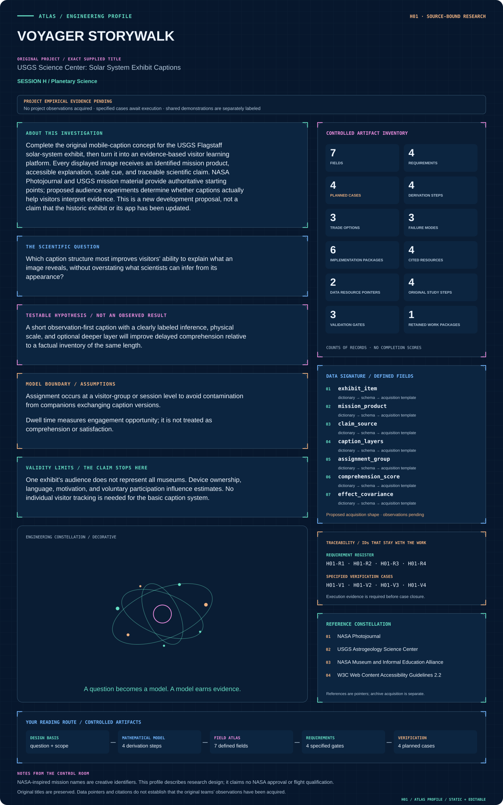

# Session H · Planetary Science

[Continuous handbook](../../handbooks/SESSION_H.md) · [All sessions](../README.md) · [Data atlas](../../data/README.md)

**9 projects · 71 defined fields · 36 proposed requirements · 36 specified cases.** All projects retain their supplied order. Data maps describe proposed acquisition, while included numerical plots carry their own evidence labels.

| ID | Mission profile & engineering record | Original investigation | Explore |
| --- | --- | --- | --- |
| H01 | [VOYAGER STORYWALK](H01-voyager-storywalk/README.md) | USGS Science Center: Solar System Exhibit Captions | [Profile](H01-voyager-storywalk/figures/mission-profile.svg) · [Data](H01-voyager-storywalk/data/README.md) · [Figures](H01-voyager-storywalk/figures/README.md) |
| H02 | [OSIRIS PHOTONFORGE](H02-osiris-photonforge/README.md) | Calibration of Images from the OSIRIS-REx Camera Suite | [Profile](H02-osiris-photonforge/figures/mission-profile.svg) · [Data](H02-osiris-photonforge/data/README.md) · [Figures](H02-osiris-photonforge/figures/README.md) |
| H03 | [ARTEMIS POLAR COMPASS](H03-artemis-polar-compass/README.md) | Magnetic Anomalies in the South Polar Region of the Moon | [Profile](H03-artemis-polar-compass/figures/mission-profile.svg) · [Data](H03-artemis-polar-compass/data/README.md) · [Figures](H03-artemis-polar-compass/figures/README.md) |
| H04 | [STARDUST CARBON ATLAS](H04-stardust-carbon-atlas/README.md) | Exploring Carbon-bearing Matter in an Antarctic Micrometeorite | [Profile](H04-stardust-carbon-atlas/figures/mission-profile.svg) · [Data](H04-stardust-carbon-atlas/data/README.md) · [Figures](H04-stardust-carbon-atlas/figures/README.md) |
| H05 | [TERRA SEVEN GENERATIONS](H05-terra-seven-generations/README.md) | Supporting the Climate Change Department | [Profile](H05-terra-seven-generations/figures/mission-profile.svg) · [Data](H05-terra-seven-generations/data/README.md) · [Figures](H05-terra-seven-generations/figures/README.md) |
| H06 | [MARS ODYSSEY RIDGEWORK](H06-mars-odyssey-ridgework/README.md) | Variability of Martian Wrinkle Ridges | [Profile](H06-mars-odyssey-ridgework/figures/mission-profile.svg) · [Data](H06-mars-odyssey-ridgework/data/README.md) · [Figures](H06-mars-odyssey-ridgework/figures/README.md) |
| H07 | [KEPLER CO ECHO](H07-kepler-co-echo/README.md) | Increasing CO Gas Detections in Protoplanetary Disks | [Profile](H07-kepler-co-echo/figures/mission-profile.svg) · [Data](H07-kepler-co-echo/data/README.md) · [Figures](H07-kepler-co-echo/figures/README.md) |
| H08 | [GENESIS RIM CHRONICLE](H08-genesis-rim-chronicle/README.md) | Investigating the Origin of Fine-Grained Rims in Mighei-like Carbonaceous Chondrites | [Profile](H08-genesis-rim-chronicle/figures/mission-profile.svg) · [Data](H08-genesis-rim-chronicle/data/README.md) · [Figures](H08-genesis-rim-chronicle/figures/README.md) |
| H09 | [PERSEVERANCE LAKE ARCHIVE](H09-perseverance-lake-archive/README.md) | Trends in Mineralogy and Grain Size Distribution Across Paleolake Basins on Mars | [Profile](H09-perseverance-lake-archive/figures/mission-profile.svg) · [Data](H09-perseverance-lake-archive/data/README.md) · [Figures](H09-perseverance-lake-archive/figures/README.md) |

## Visual field guide

### H09 · PERSEVERANCE LAKE ARCHIVE

Synthetic spectral-mixture estimator distributions under the same known band-noise level. Separated endmembers give narrow noise-driven fraction estimates; near-identical endmembers give a broad unconstrained distribution with unphysical values preserved as an identifiability diagnostic. Central 95% noise-realization intervals are descriptive simulation intervals, not posteriors or uncertainty bounds for measured Mars mineral abundance.

## Mission profile spotlight

[Enter H01 engineering dossier](H01-voyager-storywalk/README.md) · [Mission control: every profile and reading path](../../MISSION_CONTROL.md)
