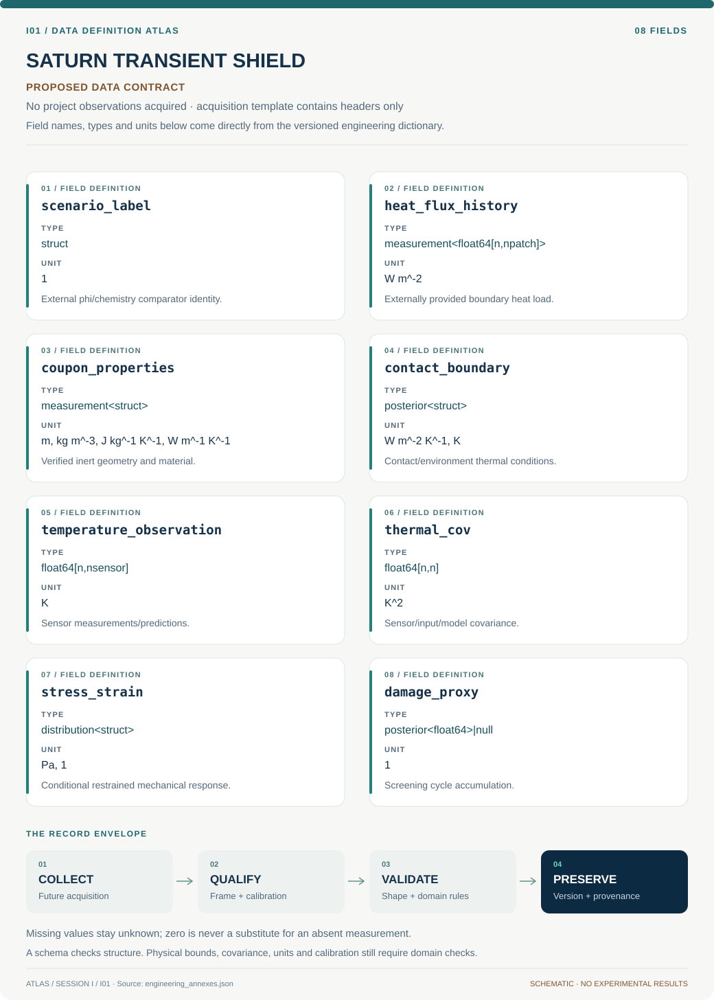

# I01 · Figure gallery

[SATURN TRANSIENT SHIELD](../README.md) · [Data blueprint](../data/README.md) · [Data diagnostic gallery](../../../../data/figures/README.md)

## Engineering architecture

Externally supplied heat, rather than a combustion schedule, drives an inert thermal model; mechanical damage remains gated by applicable material evidence.

[SVG](architecture.svg) · [Editable Mermaid source](architecture.mmd)

## Data blueprint

**Proposed contract · observations pending.** Every field, type, unit and meaning comes from the controlled dictionary. [Open SVG](data-map.svg) · [Download dictionary](../data/dictionary.csv)

## Planned scientific result

A dimensionless heat-duration versus contact-conductance map colored by damage proxy, with separate uncertainty contours and clearly labeled synthetic cases.

This final scientific result remains an execution deliverable; the design diagrams do not establish an empirical finding.
