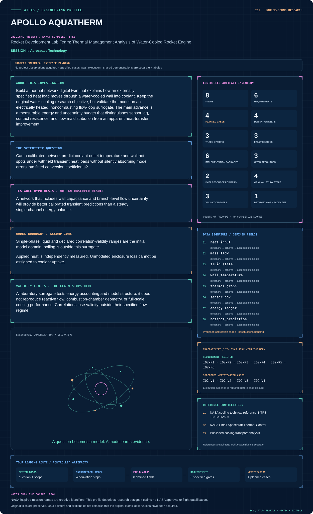
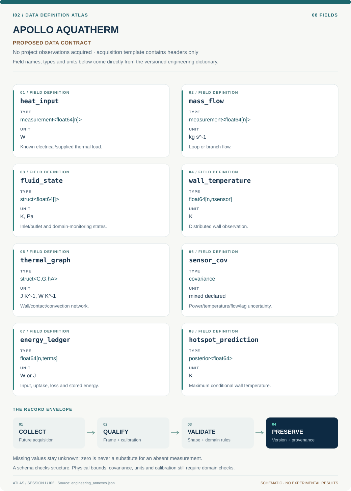

# I02 · APOLLO AQUATHERM

**Original project:** Rocket Development Lab Team: Thermal Management Analysis of Water-Cooled Rocket Engine

**Session I:** Aerospace Technology

**Document class:** engineering research design and analysis record · **Revision:** 4 · **Date:** 2026-10-02

**Evidence state:** design basis, mathematical formulation and verification plan documented. Project-specific empirical results remain to be acquired; executable shared model demonstrations have their own recorded checks.

[Session I](../README.md) · [All projects](../../../ENGINEERING_DOCUMENTATION.md) · [Session handbook](../../../handbooks/SESSION_I.md) · [← I01](../I01-saturn-transient-shield/README.md) · [I03 →](../I03-saturn-channel-atlas/README.md)

| Proposed requirements | Specified verification cases | Defined data fields | Cited resources |
| ---: | ---: | ---: | ---: |
| 6 | 4 | 8 | 3 |

[Explore the data blueprint](data/README.md) · [Open the figure gallery](figures/README.md) · [Download acquisition template](data/acquisition.csv) · [Browse the data atlas](../../../data/README.md)

---

## Mission profile



| Profile panel | Engineering signal | Open the evidence |
| --- | --- | --- |
| Mission identity | Rocket Development Lab Team: Thermal Management Analysis of Water-Cooled Rocket Engine | [Scientific objective](#purpose-and-scientific-objective) |
| Model cockpit | 4 governing expressions; 4 derivation steps; declared assumptions and validity envelope | [Mathematical formulation](#4-mathematical-model-and-derivation) |
| Data blueprint | 8 proposed fields with types, units and quality rules | [Field map & downloads](data/README.md) |
| Verification queue | 6 proposed requirements; 4 specified cases; project execution evidence pending | [Case definitions](#8-verification-and-validation-cases) |
| Figure wall | Architecture, field map, planned result description | [Open full gallery](figures/README.md) |
| Resource library | 3 cited primary resources with support statements | [Cited resources](#12-cited-technical-and-scientific-resources) |

### Model cockpit

**Analysis method:** Represent the wall as a small thermal graph coupled to an advection network. Calibrate loss conductance using heater-off cooling and use separate instrument calibration for inlet/outlet thermometry. Infer contact resistance and convection only after checking parameter identifiability; add distributed wall sensors where competing parameter combinations make different predictions. Propagate property uncertainty and sensor response functions through transient simulations. Use a reduced-order emulator for rapid what-if analysis, with interpolation restricted to the validated dimensionless envelope. Report hot-spot uncertainty rather than only bulk coolant temperature.

**Operating envelope:** A laboratory surrogate tests energy accounting and model structure; it does not reproduce reactive flow, combustion-chamber geometry, or full-scale cooling performance. Correlations lose validity outside their specified flow regime.

**Variables and conventions**

- T in K; thermal capacitance C in J K^-1; conductance G in W K^-1; heat load Q in W.
- h in W m^-2 K^-1; wetted area A in m^2; coolant mass flow mdot in kg s^-1; cp in J kg^-1 K^-1.
- u in m s^-1; hydraulic diameter Dh in m; dynamic viscosity mu in Pa s; fluid conductivity kf in W m^-1 K^-1.
- Re and Nu are dimensionless; stored energy U in J and heat-loss uncertainty must be retained.

### Artifact wall



Wall storage, coolant enthalpy and ambient loss are accounted separately; surrogate validation is restricted to independently characterized single-phase states.

**Scientific result to produce:** A heat-flow diagram showing input, coolant uptake, storage, and loss beside held-out measured/predicted temperature traces with uncertainty bands.

### Investigation feed · planned work

The feed records proposed work packages. A row becomes executed evidence only with versioned inputs, outputs and a reviewed result.

| Sequence | Evidence state | Engineering work package |
| --- | --- | --- |
| 01 | Planned | Verify inert loop/thermal graph and independently set single-phase limits. |
| 02 | Planned | Calibrate electrical power, flow and temperature/lag interfaces. |
| 03 | Planned | Implement conservative wall/advection enthalpy model. |
| 04 | Planned | Fit ambient losses before contact/convection where identifiable. |
| 05 | Planned | Run withheld load/flow cases and spatial hotspot checks. |
| 06 | Planned | Release energy ledgers, parameter covariance and emulator domain masks. |

### Mission connections

Connections are reading routes based on actual shared resources, supplied sessions or included illustrations. They do not establish physical dependencies, team collaborations or validated results.

| Connected mission | Original investigation | Recorded connection basis |
| --- | --- | --- |
| [I01 · SATURN TRANSIENT SHIELD](../I01-saturn-transient-shield/README.md) | Rocket Development Lab Team: The Effects of Equivalence Ratio during shutdown of a rocket engine on hardware longevity | Session I; [NASA cooling technical reference, NTRS 19810012596](https://ntrs.nasa.gov/api/citations/19810012596/downloads/19810012596.pdf); [Published cooling/transport analysis](https://ntrs.nasa.gov/citations/19810012596) |
| [I03 · SATURN CHANNEL ATLAS](../I03-saturn-channel-atlas/README.md) | Rocket Development Lab Team: Cooling Channel Geometry Analysis for a Regeneratively Cooled Rocket Engine | Session I; [NASA cooling technical reference, NTRS 19810012596](https://ntrs.nasa.gov/api/citations/19810012596/downloads/19810012596.pdf); [Published cooling/transport analysis](https://ntrs.nasa.gov/citations/19810012596) |
| [E06 · APOLLO THERMALIS](../../E/E06-apollo-thermalis/README.md) | Study of Thermal Heat Transfer Within a High-Altitude Balloon Payload | [NASA Small Spacecraft Thermal Control](https://www.nasa.gov/smallsat-institute/sst-soa/thermal-control/) |
| [I04 · ORION SENTINEL CORE](../I04-orion-sentinel-core/README.md) | EagleSat Team: On-board Computer Subsystem | Session I |
| [I05 · PIONEER AERODRIFT](../I05-pioneer-aerodrift/README.md) | Pico Balloon Platform for Atmospheric Exploration | Session I |
| [I06 · SATURN LOADPATH](../I06-saturn-loadpath/README.md) | Designing and Exploring the Structure of Launch Vehicles to Create Optimal Theoretical and Small-Scale Experimental Models | Session I |

[Machine-readable connection register and ranking rule](../../../registry/mission_connections.json)

### Reading playlist

| Route | Start here | Continue to |
| --- | --- | --- |
| Understand the idea | [Scientific objective](#purpose-and-scientific-objective) | [Design boundary](#1-design-basis-and-analysis-boundary) → [Mathematics](#4-mathematical-model-and-derivation) |
| Inspect the data | [Visual blueprint](data/README.md) | [Provenance](#5-data-specifications-and-provenance) → [Uncertainty](#6-uncertainty-sensitivity-and-identifiability) |
| Make a design decision | [Trade study](#7-engineering-trade-study) | [Failure modes](#10-failure-modes-and-interpretation-controls) → [Required outputs](#11-required-engineering-outputs) |
| Prepare execution | [Requirements](#2-requirements-and-verification-traceability) | [Verification](#8-verification-and-validation-cases) → [Implementation](#9-implementation-and-reproducible-work-packages) |

## Complete engineering dossier

The profile above is a browsing layer. The full design basis, equations, derivations, data contract, uncertainty, trades and controlled case definitions follow.

## Purpose and scientific objective

Build a thermal-network digital twin that explains how an externally specified heat load moves through a water-cooled wall into coolant. Keep the original water-cooling research objective, but validate the model on an electrically heated, noncombusting flow-loop surrogate. The main advance is a measurable energy and uncertainty budget that distinguishes sensor lag, contact resistance, and flow maldistribution from an apparent heat-transfer improvement.

**Question:** Can a calibrated network predict coolant outlet temperature and wall hot spots under withheld transient heat loads without silently absorbing model errors into fitted convection coefficients?

**Testable hypothesis:** A network that includes wall capacitance and branch-level flow uncertainty will provide better calibrated transient predictions than a steady single-channel energy balance.

## 1. Design basis and analysis boundary

The water-cooling twin follows externally specified heat through an inert heated wall, contact paths and a single-phase liquid loop. The primary products are coolant enthalpy rise, distributed wall temperatures and an energy residual with uncertainty. Published cooling analysis provides terminology and regime context; no reactive chamber, engine geometry or operational schedule is assumed.

Begin with a thermal graph and plug-flow advection, then distributed wall/fluid states and calibrated loss/sensor dynamics. Validation uses a noncombusting electrically heated flow-loop surrogate with independently measured power. Flow range, material limits, passage dimensions and hardware are TBD until verified. Boiling, reactive fluids and engine loading are outside the initial validated domain and cannot be inferred from successful surrogate closure.

## 2. Requirements and verification traceability

These are project design requirements or proposed analysis gates. A numerical target is not a NASA requirement unless its controlling source is explicitly identified. “TBD” identifies evidence required before a decision; it is not permission to assume a value. Verification evidence listed here is planned, unless a linked result explicitly records execution.

| ID | Requirement / gate | Engineering rationale | Verification method | Basis / required evidence |
| --- | --- | --- | --- | --- |
| I02-R1 | Applied electrical or supplied thermal power shall be independently measured and carry covariance. | Fitted h cannot compensate for unknown input energy. | Power-meter/calibration and heat-load ledger audit. | Proposed energy-input contract. |
| I02-R2 | Synthetic transient energy closure shall remain within 1% of integrated input, a proposed target. | Storage and heat loss affect apparent cooling. | Conservative graph/advection integration fixtures. | Proposed numerical target. |
| I02-R3 | Single-phase applicability shall be verified from measured fluid state and independently set facility limits. | A single-phase correlation cannot describe boiling. | Domain flags and validated-state envelope. | Proposed noncombusting surrogate gate. |
| I02-R4 | Outlet-temperature and wall-hotspot predictions shall be validated on withheld heat/flow histories. | Bulk temperature agreement can hide local errors. | Separate sensor/location/time holdouts. | Proposed prediction requirement. |
| I02-R5 | Contact, loss and convection parameters shall have identifiability diagnostics before calibration is accepted. | Multiple conductances can fit one trace. | Sensitivity rank and posterior correlation report. | Proposed calibration criterion. |
| I02-R6 | Sensor lag and differential thermometer offsets shall propagate into energy balance. | Small outlet-inlet differences amplify bias. | Calibrated dynamic/offset injection. | Proposed metrology requirement. |

## 3. Architecture and controlled interfaces

A thermal-load interface provides watts versus time and spatial distribution. The wall graph stores capacitance and pairwise conductance; the liquid network carries mass flow and temperature-dependent enthalpy. A loss model links wall to ambient with independent heater-off evidence. The acquisition adapter supplies power, inlet/outlet/wall temperatures, flow and timestamp covariance.

A sensor operator predicts measured rather than instantaneous temperatures. Parameter inference distinguishes contact and convection from enclosure losses, then an energy accountant integrates stored energy and advected enthalpy. A reduced-order emulator receives only scenarios inside the validated Re/Nu/property envelope. Missing sensors or flow uncertainty therefore widen hotspot and energy-residual intervals instead of appearing as a heat-transfer improvement.


Wall storage, coolant enthalpy and ambient loss are accounted separately; surrogate validation is restricted to independently characterized single-phase states.

[Editable engineering diagram source](figures/architecture.mmd)

## 4. Mathematical model and derivation

### Governing equations

$$
C_i\dot T_i=Q_i+\sum_jG_{ij}(T_j-T_i)-h_iA_i(T_i-T_{f,i})
$$

$$
\dot m_i c_p(T_{f,i+1}-T_{f,i})=h_iA_i(T_i-T_{f,i})
$$

$$
Q_{\rm in}-\dot m c_p(T_{\rm out}-T_{\rm in})-Q_{\rm loss}=dU/dt
$$

$$
\mathrm{Re}=\rho uD_h/\mu;\quad \mathrm{Nu}=hD_h/k_f
$$

### Variables, units and conventions

- T in K; thermal capacitance C in J K^-1; conductance G in W K^-1; heat load Q in W.
- h in W m^-2 K^-1; wetted area A in m^2; coolant mass flow mdot in kg s^-1; cp in J kg^-1 K^-1.
- u in m s^-1; hydraulic diameter Dh in m; dynamic viscosity mu in Pa s; fluid conductivity kf in W m^-1 K^-1.
- Re and Nu are dimensionless; stored energy U in J and heat-loss uncertainty must be retained.

### Assumptions and boundary conditions

- Single-phase liquid and declared correlation-validity ranges are the initial model domain; boiling is outside this surrogate.
- Applied heat is independently measured. Unmodeled enclosure loss cannot be assigned to coolant uptake.

### Derivation step 1

$$
C_i\dot T_i=Q_i+\sum_jG_{ij}(T_j-T_i)-h_iA_i(T_i-T_{f,i})
$$

Each term is watts; antisymmetric internal conductance exchanges cancel in the summed wall energy balance.

### Derivation step 2

$$
\dot m[h_f(T_{out})-h_f(T_{in})]=Q_{coolant}
$$

Use fluid enthalpy when cp varies appreciably. Constant cp reduces to mass flow times cp times temperature rise.

### Derivation step 3

```text
Q_{in}-Q_{coolant}-Q_{loss}=dU/dt
```

During a transient, coolant uptake alone is not input power. Integrate this equation to distinguish storage from missing heat.

### Derivation step 4

$$
Re=\rho uD_h/\mu,\quad Nu=hD_h/k_f
$$

Dimensionless groups classify the measured single-phase correlation domain. Correlation validity and developing-flow effects accompany any inferred h.

### Inference or simulation procedure

Represent the wall as a small thermal graph coupled to an advection network. Calibrate loss conductance using heater-off cooling and use separate instrument calibration for inlet/outlet thermometry. Infer contact resistance and convection only after checking parameter identifiability; add distributed wall sensors where competing parameter combinations make different predictions. Propagate property uncertainty and sensor response functions through transient simulations. Use a reduced-order emulator for rapid what-if analysis, with interpolation restricted to the validated dimensionless envelope. Report hot-spot uncertainty rather than only bulk coolant temperature.

### Validity domain and fidelity limits

A laboratory surrogate tests energy accounting and model structure; it does not reproduce reactive flow, combustion-chamber geometry, or full-scale cooling performance. Correlations lose validity outside their specified flow regime.

## 5. Data specifications and provenance



**Proposed data contract · observations pending.** This visual inventory shows the record fields to acquire or derive. It contains no project measurements. [Open the data blueprint and downloads](data/README.md).

| Field | Type | Unit | Physical / statistical meaning | Quality and missing-data rule |
| --- | --- | --- | --- | --- |
| heat_input | measurement<float64[n]> | W | Known electrical/supplied thermal load. | Meter/reference and spatial allocation documented. |
| mass_flow | measurement<float64[n]> | kg s^-1 | Loop or branch flow. | Positive accepted range; missing flow blocks heat-rate estimate. |
| fluid_state | struct<float64[]> | K, Pa | Inlet/outlet and domain-monitoring states. | Single-phase status and fluid-property source. |
| wall_temperature | float64[n,nsensor] | K | Distributed wall observation. | Location/lag/calibration required. |
| thermal_graph | struct<C,G,hA> | J K^-1, W K^-1 | Wall/contact/convection network. | Conservative internal links and verified geometry. |
| sensor_cov | covariance | mixed declared | Power/temperature/flow/lag uncertainty. | Shared thermometer offset retained. |
| energy_ledger | float64[n,terms] | W or J | Input, uptake, loss and stored energy. | Instantaneous power and cumulative energy separate. |
| hotspot_prediction | posterior<float64> | K | Maximum conditional wall temperature. | Sensor coverage and model discrepancy attached. |

[Machine-readable record schema](data/schema.json) · [Empty acquisition CSV](data/acquisition.csv) · [Field dictionary CSV](data/dictionary.csv)

The CSV above contains column headers only. Its schema defines future records and does not establish that original-team data or a particular archive product have been acquired. Frame, timing, calibration, covariance, selection and provenance details must accompany populated records.

### NASA cooling technical reference

[Product, archive or reference](https://ntrs.nasa.gov/api/citations/19810012596/downloads/19810012596.pdf)

**Fields:** Correlation definitions, heat-transfer framework, assumptions

**Access:** Public reference; identify the exact applicable regime before using a correlation.

**Role:** Physics comparator and terminology.

### Proposed inert thermal-loop dataset

[Product, archive or reference](https://www.nasa.gov/smallsat-institute/sst-soa/thermal-control/)

**Fields:** Time, applied electrical power, inlet/outlet temperature, wall temperature, mass flow, ambient temperature, calibration covariance

**Access:** No dataset has been collected here. Publish planned schema and instrument certificates with future records.

**Role:** Known-power energy closure and parameter identification.

## 6. Uncertainty, sensitivity and identifiability

Differential thermometer offset can dominate coolant enthalpy uncertainty when temperature rise is small. Flow-meter gain, cp variation and timing misalignment contribute correlated error. Independently calibrate sensors and synchronize streams; propagate their covariance into the integrated energy residual rather than comparing nominal input and uptake alone.

Contact resistance, convection coefficient and ambient loss are difficult to separate from bulk outlet temperature. Use heater-off loss calibration and multiple wall sensors to distinguish their sensitivities. Evaluate parameter rank across flow/load scenarios, then hold out transient shapes. Maldistributed branch flow creates hotspots with small bulk changes; an emulator must preserve that uncertainty and avoid extrapolation outside the validated regime.

## 7. Engineering trade study

| Alternative | Benefit | Cost / limitation | Decision rule |
| --- | --- | --- | --- |
| Lumped thermal graph | Fast fitting and energy transparency. | Limited spatial hotspot resolution. | Use baseline with enough independent sensors. |
| Conjugate distributed model | Resolves wall/fluid gradients. | Higher input/property and mesh uncertainty. | Adopt when hotspot predictions need spatial detail. |
| Reduced-order emulator | Rapid scenario sweeps. | Cannot repair inaccurate parent physics. | Use only within a verified dimensionless envelope. |

## 8. Verification and validation cases

| Case ID | Stimulus / condition | Expected result / criterion | Method | Evidence artifact |
| --- | --- | --- | --- | --- |
| I02-V1 | Steady insulated limit | Input equals coolant enthalpy rise after storage tends to zero. | Known single-node steady fixture. | Energy conservation. |
| I02-V2 | Heater-off cooling | Stored energy falls through independently modeled ambient/coolant paths. | Analytic linear cooling comparator. | Thermal-network decay. |
| I02-V3 | Internal conductance cancellation | Summed network energy excludes internal pairwise exchanges. | Two-node unequal-temperature fixture. | Conservative graph identity. |
| I02-V4 | Withheld inert transient | Outlet and hotspot coverage plus energy residual are reported with frozen parameters. | Known-power single-phase surrogate holdout. | Proposed noncombusting validation. |

**Execution status:** these cases are specified, not claimed as executed. Close a case only with the versioned inputs, output, uncertainty, reviewer and pass/fail rationale.

### Additional scientific validation gates

- Verify lumped-network limits against analytic first-order cooling and compare a refined conduction mesh.
- Require energy imbalance to be statistically consistent with the combined measurement and storage-energy uncertainty.
- Evaluate withheld wall hot-spot and outlet-temperature errors separately; report 90% interval coverage and sensitivity to correlation choice.

## 9. Implementation and reproducible work packages

1. Verify inert loop/thermal graph and independently set single-phase limits.
2. Calibrate electrical power, flow and temperature/lag interfaces.
3. Implement conservative wall/advection enthalpy model.
4. Fit ambient losses before contact/convection where identifiable.
5. Run withheld load/flow cases and spatial hotspot checks.
6. Release energy ledgers, parameter covariance and emulator domain masks.

### Investigation sequence

1. Create a node map, uncertainty allocation, and sensor-placement study before collecting measurements.
2. Calibrate thermometers together and quantify electrical power uncertainty and parasitic enclosure losses.
3. Collect institutionally supervised noncombusting transients that vary one identifiable heat-transfer factor at a time.
4. Reserve entire heat-waveform families for prediction and release model states with unit-checked metadata.

### Resources and interfaces to expertise

- Thermal-network code, water-property reference, calibrated flow and temperature measurement, an approved inert heating loop, and thermal laboratory supervision.

## 10. Failure modes and interpretation controls

| Failure mode | Effect on result | Detection / evidence | Design response |
| --- | --- | --- | --- |
| Loss assigned to cooling | Overstated coolant performance. | Unclosed integrated energy residual. | Calibrate ambient losses separately. |
| Sensor lag fit as heat storage | Wrong capacitance/convection. | Independent response mismatch. | Include calibrated sensor transfer. |
| Branch maldistribution hidden | Unpredicted local wall peak. | Distributed sensor/branch-flow residual. | Add branch states and report hotspot uncertainty. |

- Correlated thermometer drift can masquerade as excellent energy closure. An unmeasured flow split can hide a local wall hot spot.

## 11. Required engineering outputs

- Network model, sensor-selection report, energy-budget dashboard, synthetic demonstration records, and surrogate-validation protocol.

### Scientific result figures to produce during execution

A heat-flow diagram showing input, coolant uptake, storage, and loss beside held-out measured/predicted temperature traces with uncertainty bands.

## 12. Cited technical and scientific resources

- [NASA cooling technical reference, NTRS 19810012596](https://ntrs.nasa.gov/api/citations/19810012596/downloads/19810012596.pdf) — Heat-transfer analysis context.
- [NASA Small Spacecraft Thermal Control](https://www.nasa.gov/smallsat-institute/sst-soa/thermal-control/) — Thermal modeling, heat-balance and verification context; spacecraft practice is a methodological analogy.
- [Published cooling/transport analysis](https://ntrs.nasa.gov/citations/19810012596) — Independent thermal-analysis context; correlation applicability must be checked for the inert loop.

Framework and evidence rules: [engineering documentation standard](../../../engineering/ENGINEERING_STANDARD.md), [model assurance](../../../engineering/MODEL_ASSURANCE.md), [uncertainty procedure](../../../engineering/UNCERTAINTY_AND_DECISION_RULES.md), [data management](../../../engineering/DATA_MANAGEMENT.md). NASA-inspired names are creative identifiers; requirements and results are not NASA certification.
