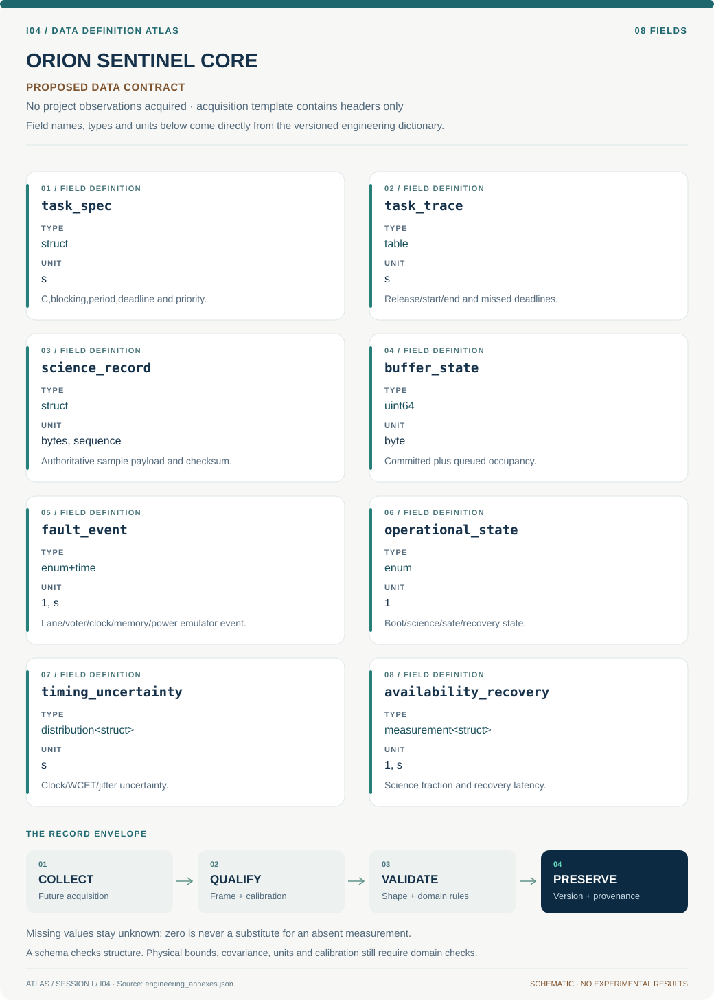

# I04 · Figure gallery

[ORION SENTINEL CORE](../README.md) · [Data blueprint](../data/README.md) · [Data diagnostic gallery](../../../../data/figures/README.md)

## Engineering architecture

Scheduling, committed scientific records and shared-fault recovery are connected through explicit timing and storage boundaries rather than a nominal redundancy claim.

[SVG](architecture.svg) · [Editable Mermaid source](architecture.mmd)

## Data blueprint

**Proposed contract · observations pending.** Every field, type, unit and meaning comes from the controlled dictionary. [Open SVG](data-map.svg) · [Download dictionary](../data/dictionary.csv)

## Planned scientific result

An FPGA/soft-core architecture linked to a timeline of injected fault, detection, safe-state entry, recovery, and science-record continuity.

This final scientific result remains an execution deliverable; the design diagrams do not establish an empirical finding.
