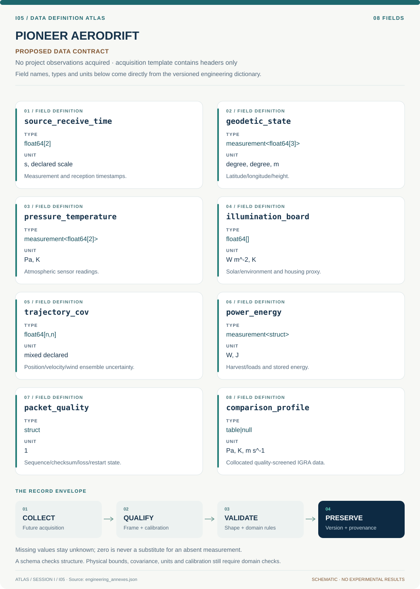
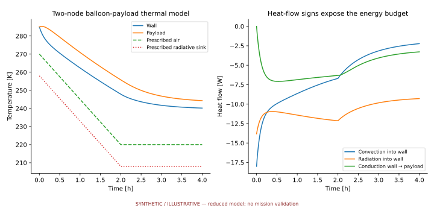

# I05 · PIONEER AERODRIFT

**Original project:** Pico Balloon Platform for Atmospheric Exploration

**Session I:** Aerospace Technology

**Document class:** engineering research design and analysis record · **Revision:** 3 · **Date:** 2026-10-02

**Evidence state:** design basis, mathematical formulation and verification plan documented. Project-specific empirical results remain to be acquired; executable shared model demonstrations have their own recorded checks.

[Session I](../README.md) · [All projects](../../../ENGINEERING_DOCUMENTATION.md) · [Session handbook](../../../handbooks/SESSION_I.md) · [← I04](../I04-orion-sentinel-core/README.md) · [I06 →](../I06-saturn-loadpath/README.md)

| Proposed requirements | Specified verification cases | Defined data fields | Cited resources |
| ---: | ---: | ---: | ---: |
| 6 | 4 | 8 | 2 |

[Explore the data blueprint](data/README.md) · [Open the figure gallery](figures/README.md) · [Download acquisition template](data/acquisition.csv) · [Browse the data atlas](../../../data/README.md)

---

## Purpose and scientific objective

Turn the pico-balloon concept into a quantitatively honest atmospheric-sampling experiment. Study Earth drift, sensor bias, and energy availability first, then use a separate feasibility ledger for a Venus analog. The original symposium linked long-duration pico-balloon tracking to planetary atmospheric exploration; this dossier treats that link as an engineering research question. Terrestrial longevity, navigation, or chemistry performance does not establish survival or life detection at Venus.

**Question:** How much atmospheric information can a small drifting sensor recover after accounting for solar heating, pressure response, telemetry gaps, and trajectory uncertainty?

**Testable hypothesis:** A calibrated drifting platform can constrain selected wind and thermal features when trajectory ensembles and sensor response are included; raw tracker measurements alone will overstate profile precision.

## 1. Design basis and analysis boundary

The pico-balloon model is an Earth atmospheric sampling and energy-accounting study before any planetary analogy. Inputs are trajectory, sensor response, illumination, pressure/temperature, energy and packet provenance. Outputs describe what a drifting path can infer with uncertainty. NOAA IGRA profiles are independent comparisons only within declared space/time proximity; they are not distant-track truth.

Begin with synthetic tracks and calibrated chamber sensors, then wind-field ensembles and telemetry replay. Earth deployment requirements are supplied separately before any real flight; hardware buoyancy/envelope and operating limits remain TBD. A Venus extension is an explicit feasibility ledger for composition, temperature, pressure, materials, illumination and communications, not evidence that terrestrial survival or chemical signals establish habitability/life.

## 2. Requirements and verification traceability

These are project design requirements or proposed analysis gates. A numerical target is not a NASA requirement unless its controlling source is explicitly identified. “TBD” identifies evidence required before a decision; it is not permission to assume a value. Verification evidence listed here is planned, unless a linked result explicitly records execution.

| ID | Requirement / gate | Engineering rationale | Verification method | Basis / required evidence |
| --- | --- | --- | --- | --- |
| I05-R1 | Each atmospheric sample shall retain source time, geodetic position/altitude covariance and calibration ID. | A moving biased sensor does not measure a stationary profile. | Track/sample schema and coordinate audit. | Proposed sampling contract. |
| I05-R2 | Temperature/pressure lag and illumination bias shall be calibrated with independent chamber references. | Solar heating and response can imitate atmospheric gradients. | Supervised reference/illumination holdouts. | Proposed metrology gate. |
| I05-R3 | Energy accounting shall close to 1% in noiseless synthetic replay, a proposed numerical target. | Packet and sensing duty choices affect available energy. | Power integral and state-bound fixture. | Proposed conservation target. |
| I05-R4 | Trajectory comparisons shall use declared space/time proximity criteria fixed before seeing residuals. | A radiosonde can sample a different air mass. | Collocation manifest and sensitivity audit. | IGRA spatial/time context. |
| I05-R5 | Telemetry loss shall preserve missing observations and actual source timestamps. | Reception order can distort trajectory/gradients. | Delay/gap replay fixtures. | Proposed data-integrity requirement. |
| I05-R6 | Planetary feasibility shall remain a separate environment/material/communications analysis. | Earth demonstrated behavior does not transfer directly. | Earth-versus-Venus requirement ledger. | Proposed domain separation. |

## 3. Architecture and controlled interfaces

A telemetry adapter emits GNSS position/time, pressure, sensor/board temperature, power state and packet quality. A coordinate module handles geodetic height and Earth-fixed wind coordinates with covariance. A sensor operator includes first-order lag plus illumination and housing thermal bias. A wind assimilator advances a trajectory ensemble with slip uncertainty.

An energy engine integrates harvesting and component consumption under source-time duty states. Packet replay changes delivery while preserving the physical path and expected sample manifest. A collocation module compares supported trajectory segments with quality-screened IGRA soundings. The Venus ledger receives environment ranges and material evidence through a separate interface, with unverified compatibility explicitly TBD.

A drifting trajectory and calibrated sensor response generate source-timed samples; energy and packet loss determine which atmospheric comparisons are supported.

[Editable engineering diagram source](figures/architecture.mmd)

## 4. Mathematical model and derivation

### Governing equations

$$
\dot{\boldsymbol x}=\boldsymbol u(\boldsymbol x,t)+\boldsymbol v_{\rm slip}
$$

$$
\tau_s\dot y+y=X+b_{\rm solar}+\epsilon
$$

$$
\dot E=P_{\rm harvest}-P_{\rm sensors}-P_{\rm radio}-P_{\rm idle}
$$

$$
F_b=(\rho_a-\rho_g)Vg-m_{\rm suspended}g
$$

### Variables, units and conventions

- Position x in m in a declared Earth-fixed or geodetic frame; wind u and slip v in m s^-1; time t in s.
- True variable X and measured y retain their physical units, such as K or Pa; response time taus in s and solar bias is sensor specific.
- Energy E in J; component power in W; air/lifting-gas densities in kg m^-3; volume V in m^3; force Fb in N.
- Trajectory covariance, sample altitude uncertainty, and telemetry completeness are required fields, not optional annotations.

### Assumptions and boundary conditions

- The platform samples along a drifting path rather than a fixed vertical column.
- Buoyancy and thermal relations are introductory envelopes; actual envelope mechanics, leakage, and Venus acid/temperature compatibility need dedicated evidence.

### Derivation step 1

$$
\dot{\mathbf x}=\mathbf u(\mathbf x,t)+\mathbf v_{slip}
$$

Wind and platform slip combine in a common frame; position alone cannot separate them without additional assumptions.

### Derivation step 2

$$
\tau_s\dot y+y=X+b_{solar}
$$

A first-order sensor maps true atmospheric variable to observation. Corrected inversion amplifies high-frequency noise, so uncertainty must accompany deconvolution.

### Derivation step 3

$$
E(t)=E_0+\int(P_{harvest}-P_{sensor}-P_{radio}-P_{idle})dt
$$

Stored available energy is distinct from cumulative consumed energy. Apply measured capacity/state limits and record unserved loads.

### Derivation step 4

$$
F_b=[(\rho_a-\rho_g)V-m_{suspended}]g
$$

This force envelope uses densities and volume at local thermodynamic state; envelope elasticity/leakage are additional model inputs.

### Inference or simulation procedure

Build a synthetic telemetry generator and assimilate a wind field into a trajectory ensemble. Calibrate temperature and pressure sensors against reference instruments in a supervised environmental chamber, including illumination and response lag. Compare recovered atmospheric gradients with independent radiosonde soundings only where separation in time and space is small enough for a meaningful test. Infer missing-data effects by replaying complete simulated tracks through realistic packet-loss patterns. Treat a Venus extension as a requirements trade covering atmospheric composition, thermal environment, envelope compatibility, solar geometry, communications, and planetary protection; avoid interpreting an uncalibrated chemical response as evidence of life.

### Validity domain and fidelity limits

A pico-balloon cannot independently determine a three-dimensional wind field from position alone. IGRA station profiles are comparison data, not ground truth for distant trajectories. NASA heavy-lift balloon practice is useful context rather than a pico-platform specification.

## 5. Data specifications and provenance

**Proposed data contract · observations pending.** This visual inventory shows the record fields to acquire or derive. It contains no project measurements. [Open the data blueprint and downloads](data/README.md).

| Field | Type | Unit | Physical / statistical meaning | Quality and missing-data rule |
| --- | --- | --- | --- | --- |
| source_receive_time | float64[2] | s, declared scale | Measurement and reception timestamps. | Delay/order never overwrites source time. |
| geodetic_state | measurement<float64[3]> | degree, degree, m | Latitude/longitude/height. | Ellipsoid/altitude datum and covariance. |
| pressure_temperature | measurement<float64[2]> | Pa, K | Atmospheric sensor readings. | Lag/bias calibration version and missing flags. |
| illumination_board | float64[] | W m^-2, K | Solar/environment and housing proxy. | Sensor-specific bias model documented. |
| trajectory_cov | float64[n,n] | mixed declared | Position/velocity/wind ensemble uncertainty. | Shared navigation and wind errors retained. |
| power_energy | measurement<struct> | W, J | Harvest/loads and stored energy. | Capacity and cumulative consumption distinguished. |
| packet_quality | struct | 1 | Sequence/checksum/loss/restart state. | Missing samples absent, not repeated last value. |
| comparison_profile | table&#124;null | Pa, K, m s^-1 | Collocated quality-screened IGRA data. | Station history and space/time support recorded. |

[Machine-readable record schema](data/schema.json) · [Empty acquisition CSV](data/acquisition.csv) · [Field dictionary CSV](data/dictionary.csv)

The CSV above contains column headers only. Its schema defines future records and does not establish that original-team data or a particular archive product have been acquired. Frame, timing, calibration, covariance, selection and provenance details must accompany populated records.

### NOAA Integrated Global Radiosonde Archive

[Product, archive or reference](https://www.ncei.noaa.gov/products/weather-balloon/integrated-global-radiosonde-archive)

**Fields:** Pressure, temperature, geopotential height, humidity, wind, timestamps and station metadata

**Access:** Public soundings; select stations and quality flags, record instrument and location changes.

**Role:** Independent terrestrial atmospheric comparison.

### Proposed pico-platform telemetry

[Product, archive or reference](https://www.nasa.gov/scientificballoons/overview/)

**Fields:** GNSS time/position, pressure, sensor and board temperature, energy state, packet quality, calibration ID

**Access:** No flight data are supplied. Begin with clearly labeled synthetic and chamber records.

**Role:** Sampling and energy-model evaluation.

## 6. Uncertainty, sensitivity and identifiability

Solar bias and sensor lag covary with apparent vertical or horizontal atmospheric gradients. Navigation height uncertainty couples pressure and temperature to inferred altitude. Calibrate illumination and response independently, then propagate trajectory ensembles through the sensor model instead of correcting each value with a fixed offset.

Wind-field error, slip and telemetry gaps affect which air mass is sampled. Use synthetic complete tracks with controlled missingness to quantify inferential loss, and compare radiosondes only in supported collocations. Harvesting, capacity and temperature-dependent electronics uncertainty influence duration/data completeness. Venus compatibility would introduce entirely different material/thermal/chemical uncertainty and cannot be estimated from Earth residuals alone.

## 7. Engineering trade study

| Alternative | Benefit | Cost / limitation | Decision rule |
| --- | --- | --- | --- |
| Synthetic track/telemetry study | Known truth for timing/gap effects. | No hardware/environment validation. | Use first reproducibility tier. |
| Calibrated Earth chamber/field sampling | Measures sensor and trajectory errors. | Collocation and drift limits. | Proceed only with verified platform/environment requirements. |
| Venus feasibility ledger | Makes planetary differences explicit. | Major material/communications unknowns. | Use requirement gaps rather than extrapolated mission claims. |

## 8. Verification and validation cases

| Case ID | Stimulus / condition | Expected result / criterion | Method | Evidence artifact |
| --- | --- | --- | --- | --- |
| I05-V1 | Constant atmosphere | A lagged sensor approaches X+b exponentially with timescale tau. | Analytic step-response fixture. | First-order sensor solution. |
| I05-V2 | Uniform wind/zero slip | Position follows x0+ut. | Coordinate-aware trajectory fixture. | Advection limit. |
| I05-V3 | Zero net power | Stored energy remains constant, with consumption/harvest ledgers still populated. | Balanced-power replay. | Energy conservation. |
| I05-V4 | Delayed/missing packets | Recovered path keeps original times and explicitly missing samples. | Synthetic track through packet-loss/reorder patterns. | Proposed transport integrity. |

**Execution status:** these cases are specified, not claimed as executed. Close a case only with the versioned inputs, output, uncertainty, reviewer and pass/fail rationale.

### Additional scientific validation gates

- Use withheld chamber transients to test sensor lag and bias correction.
- Report trajectory ensemble coverage, radiosonde matchup errors, missing-data bias, and useful sample fraction.
- Run an independent power-budget reconciliation; explain every unexplained state-of-charge discrepancy before a flight claim.

## 9. Implementation and reproducible work packages

1. Create synthetic track/power/sample and calibration manifests.
2. Implement geodetic/Earth-fixed covariance adapters.
3. Calibrate sensor lag/illumination on independent chamber references.
4. Build wind/slip trajectory and energy ensemble model.
5. Replay telemetry gaps/delays and collocate supported IGRA segments.
6. Publish sampling-error/energy budgets and separate planetary feasibility gaps.

### Investigation sequence

1. Choose a measurable atmospheric variable and define spatial/temporal comparison tolerances.
2. Calibrate response and illumination bias; simulate complete diurnal energy and communications cases.
3. Produce a flight-readiness package for the responsible institution to review airspace, radio, recovery, and environmental constraints.
4. Analyze Earth validation independently from the conditional Venus feasibility ledger.

### Resources and interfaces to expertise

- Unit-aware trajectory model, reference atmospheric profiles, calibrated sensors, environmental chamber access, and an authorized balloon-program mentor.

## 10. Failure modes and interpretation controls

| Failure mode | Effect on result | Detection / evidence | Design response |
| --- | --- | --- | --- |
| Solar warming called gradient | False atmospheric structure. | Residual follows illumination/board state. | Calibrated sensor thermal model. |
| Reception time used as sample time | Wrong drift speed/location. | Source-receive comparison. | Preserve source timestamp and clock uncertainty. |
| Distant sounding treated truth | Misleading accuracy estimate. | Collocation criteria fail. | Report unsupported comparison or widen representativeness uncertainty. |

- Solar heating, icing, envelope leakage, radio gaps, and spatial mismatch can imitate atmospheric signals. Flight authorization and spectrum review belong to the operating institution.

## 11. Required engineering outputs

- Synthetic telemetry bundle, sensor-transfer model, trajectory uncertainty atlas, Earth sampling trade study, and evidence-tagged Venus requirements ledger.

### Scientific result figures to produce during execution

A drifting-track map with uncertainty tubes above a solar-energy timeline and calibrated atmospheric samples; Venus assumptions appear in a separate feasibility panel.

### Included shared numerical starting point

[Executable formulation, parameters, tabular outputs, provenance and verification](../../../models/README.md). This shared demonstration has a narrower domain than the project model above. Its own caption and methods identify synthetic parameters or the separately retrieved public catalog; it is not a completed result of the original project.

## 12. Cited technical and scientific resources

- [NOAA Integrated Global Radiosonde Archive](https://www.ncei.noaa.gov/products/weather-balloon/integrated-global-radiosonde-archive) — Public sounding variables, metadata and quality limitations.
- [NASA Scientific Balloons Overview](https://www.nasa.gov/scientificballoons/overview/) — Scientific balloon use and program context; does not establish pico-platform capabilities.

Framework and evidence rules: [engineering documentation standard](../../../engineering/ENGINEERING_STANDARD.md), [model assurance](../../../engineering/MODEL_ASSURANCE.md), [uncertainty procedure](../../../engineering/UNCERTAINTY_AND_DECISION_RULES.md), [data management](../../../engineering/DATA_MANAGEMENT.md). NASA-inspired names are creative identifiers; requirements and results are not NASA certification.
