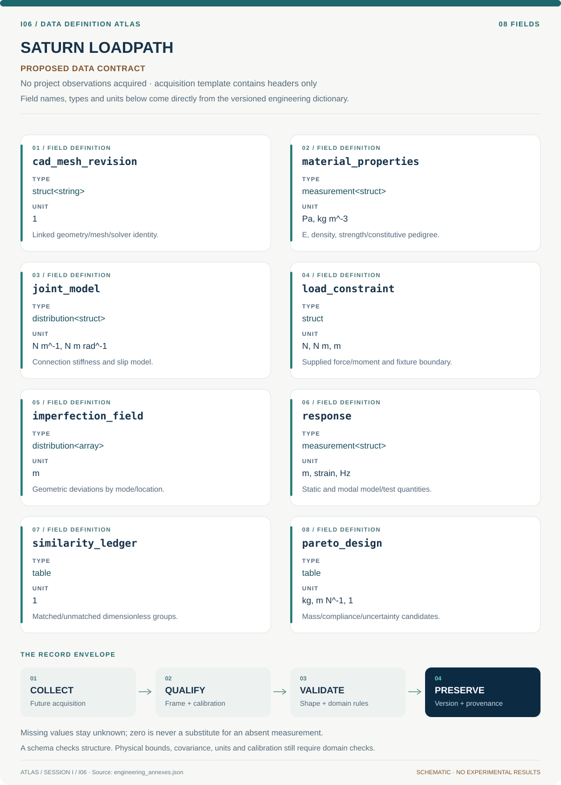

# I06 · Figure gallery

[SATURN LOADPATH](../README.md) · [Data blueprint](../data/README.md) · [Data diagnostic gallery](../../../../data/figures/README.md)

## Engineering architecture

Configuration-linked analysis and measured inert boundaries support only those structural trends whose similarity groups and uncertainty are documented.

[SVG](architecture.svg) · [Editable Mermaid source](architecture.mmd)

## Data blueprint

**Proposed contract · observations pending.** Every field, type, unit and meaning comes from the controlled dictionary. [Open SVG](data-map.svg) · [Download dictionary](../data/dictionary.csv)

## Planned scientific result

A load-path schematic next to finite-element modes and a similarity-group table, with measured and predicted subscale compliance distinctly labeled.

This final scientific result remains an execution deliverable; the design diagrams do not establish an empirical finding.
