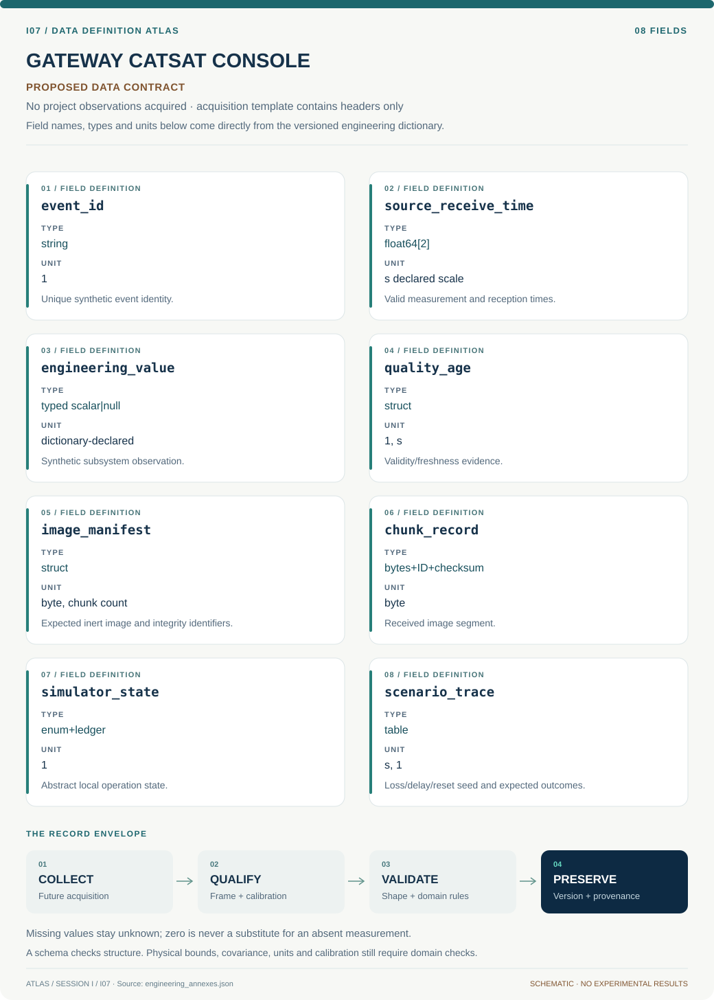

# I07 · Data blueprint

[GATEWAY CATSAT CONSOLE](../README.md) · [Figure gallery](../figures/README.md) · [Data atlas](../../../../data/README.md)

**PROPOSED CONTRACT · 8 fields · no project observations acquired.** The acquisition CSV contains column headers only. The diagram is a visual record specification, not measured data.

| Download | What it contains |
| --- | --- |
| [Acquisition CSV](acquisition.csv) | Empty columns ready for controlled acquisition |
| [Field dictionary](dictionary.csv) | Names, source types, units, meanings and quality rules |
| [JSON Schema](schema.json) | Nullable record structure with unit and quality metadata |

## Field reference

| Field | Type | Unit | Meaning | Quality / missingness |
| --- | --- | --- | --- | --- |
| event_id | string | 1 | Unique synthetic event identity. | Duplicate IDs must have identical payload or conflict state. |
| source_receive_time | float64[2] | s declared scale | Valid measurement and reception times. | Clock uncertainty and restart generation attached. |
| engineering_value | typed scalar&#124;null | dictionary-declared | Synthetic subsystem observation. | Null/invalid/stale separate; no last-value freshness assumption. |
| quality_age | struct | 1, s | Validity/freshness evidence. | Per-field rule and uncertainty interval. |
| image_manifest | struct | byte, chunk count | Expected inert image and integrity identifiers. | Trusted scenario version; never inferred from socket closure. |
| chunk_record | bytes+ID+checksum | byte | Received image segment. | Unique valid chunks only; conflicts flagged. |
| simulator_state | enum+ledger | 1 | Abstract local operation state. | No real command or radio fields. |
| scenario_trace | table | s, 1 | Loss/delay/reset seed and expected outcomes. | Replay deterministic and independently scored. |

## Acquisition and provenance

Null means missing or unknown; record its cause. Preserve product identifier, retrieval timestamp, source hash, calibration, coordinate and time frame, covariance basis, selection rules and every transformation. JSON Schema checks structure; physical bounds and the quality rules above require domain validation.

- [University of Arizona CatSat operations concept](https://catsat.arizona.edu/operations/concept) — archive or acquisition resource; inclusion here does not assert that its data have been retrieved.
- [Proposed isolated telemetry replay dataset](https://ammos.nasa.gov/openmct/) — archive or acquisition resource; inclusion here does not assert that its data have been retrieved.

[Controlled data-management procedure](../../../../engineering/DATA_MANAGEMENT.md)
