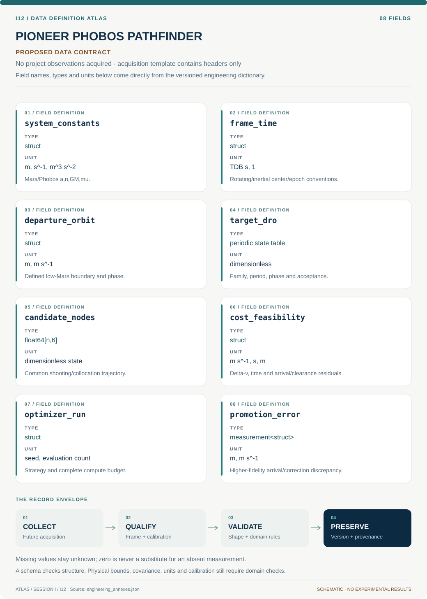

# I12 · Data blueprint

[PIONEER PHOBOS PATHFINDER](../README.md) · [Figure gallery](../figures/README.md) · [Data atlas](../../../../data/README.md)

**PROPOSED CONTRACT · 8 fields · no project observations acquired.** The acquisition CSV contains column headers only. The diagram is a visual record specification, not measured data.

| Download | What it contains |
| --- | --- |
| [Acquisition CSV](acquisition.csv) | Empty columns ready for controlled acquisition |
| [Field dictionary](dictionary.csv) | Names, source types, units, meanings and quality rules |
| [JSON Schema](schema.json) | Nullable record structure with unit and quality metadata |

## Field reference

| Field | Type | Unit | Meaning | Quality / missingness |
| --- | --- | --- | --- | --- |
| system_constants | struct | m, s^-1, m^3 s^-2 | Mars/Phobos a,n,GM,mu. | Source/query and circular approximation. |
| frame_time | struct | TDB s, 1 | Rotating/inertial center/epoch conventions. | Transforms include velocity derivative. |
| departure_orbit | struct | m, m s^-1 | Defined low-Mars boundary and phase. | Collision/atmosphere/clearance assumptions explicit. |
| target_dro | periodic state table | dimensionless | Family, period, phase and acceptance. | Return residual and continuation provenance. |
| candidate_nodes | float64[n,6] | dimensionless state | Common shooting/collocation trajectory. | Continuity/coast/impulse types attached. |
| cost_feasibility | struct | m s^-1, s, m | Delta-v, time and arrival/clearance residuals. | Independent checker; failed candidates retained. |
| optimizer_run | struct | seed, evaluation count | Strategy and complete compute budget. | Local refinement counts included. |
| promotion_error | measurement<struct> | m, m s^-1 | Higher-fidelity arrival/correction discrepancy. | Force model, constants and numerical covariance. |

## Acquisition and provenance

Null means missing or unknown; record its cause. Preserve product identifier, retrieval timestamp, source hash, calibration, coordinate and time frame, covariance basis, selection rules and every transformation. JSON Schema checks structure; physical bounds and the quality rules above require domain validation.

- [JPL Horizons Mars/Phobos reference states](https://ssd.jpl.nasa.gov/horizons/manual.html) — archive or acquisition resource; inclusion here does not assert that its data have been retrieved.
- [NASA mission-design-tool reference](https://www.nasa.gov/smallsat-institute/space-mission-design-tools/) — archive or acquisition resource; inclusion here does not assert that its data have been retrieved.
- [Proposed trajectory benchmark manifest](https://naif.jpl.nasa.gov/naif/tutorials.html) — archive or acquisition resource; inclusion here does not assert that its data have been retrieved.

[Controlled data-management procedure](../../../../engineering/DATA_MANAGEMENT.md)

## Included evidence to explore

Synthetic two-body conservation and refinement diagnostics from immutable model outputs. Panel A scales relative specific-energy error to parts per million and reports angular-momentum conservation for the stored 400-step-per-period run. Panel B compares three recorded maximum-energy errors with a second-order reference anchored to the coarsest run. This is an integration check, not trajectory prediction validation.

[Data atlas: tables, model definitions and provenance](../../../../data/README.md). Shared reduced-model evidence has a narrower domain than this project contract.
