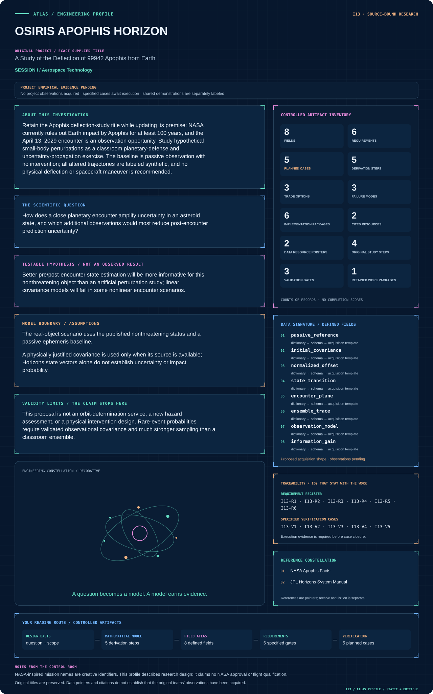
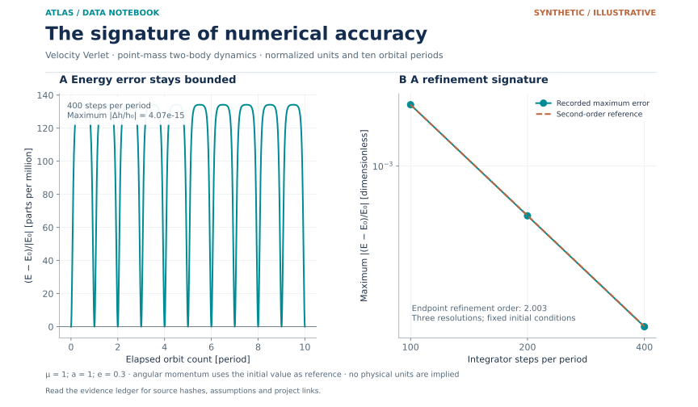
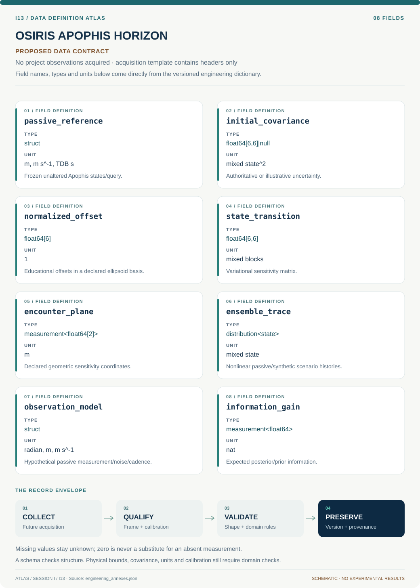

# I13 · OSIRIS APOPHIS HORIZON

**Original project:** A Study of the Deflection of 99942 Apophis from Earth

**Session I:** Aerospace Technology

**Document class:** engineering research design and analysis record · **Revision:** 4 · **Date:** 2026-10-02

**Evidence state:** design basis, mathematical formulation and verification plan documented. Project-specific empirical results remain to be acquired; executable shared model demonstrations have their own recorded checks.

[Session I](../README.md) · [All projects](../../../ENGINEERING_DOCUMENTATION.md) · [Session handbook](../../../handbooks/SESSION_I.md) · [← I12](../I12-pioneer-phobos-pathfinder/README.md)

| Proposed requirements | Specified verification cases | Defined data fields | Cited resources |
| ---: | ---: | ---: | ---: |
| 6 | 5 | 8 | 2 |

[Explore the data blueprint](data/README.md) · [Open the figure gallery](figures/README.md) · [Download acquisition template](data/acquisition.csv) · [Browse the data atlas](../../../data/README.md)

---

## Mission profile



| Profile panel | Engineering signal | Open the evidence |
| --- | --- | --- |
| Mission identity | A Study of the Deflection of 99942 Apophis from Earth | [Scientific objective](#purpose-and-scientific-objective) |
| Model cockpit | 4 governing expressions; 5 derivation steps; declared assumptions and validity envelope | [Mathematical formulation](#4-mathematical-model-and-derivation) |
| Data blueprint | 8 proposed fields with types, units and quality rules | [Field map & downloads](data/README.md) |
| Verification queue | 6 proposed requirements; 5 specified cases; project execution evidence pending | [Case definitions](#8-verification-and-validation-cases) |
| Figure wall | Architecture, field map, planned result description; included shared illustration | [Open full gallery](figures/README.md) |
| Resource library | 2 cited primary resources with support statements | [Cited resources](#12-cited-technical-and-scientific-resources) |

### Model cockpit

**Analysis method:** Retrieve and freeze a passive reference ephemeris, source metadata, time conventions and force model. Reproduce the unperturbed close-approach geometry before any sensitivity analysis. Propagate synthetic initial-state ensembles through the encounter and compare full nonlinear Monte Carlo distributions with the linear covariance approximation. Compute encounter-plane residuals and show when ellipsoidal uncertainty becomes misleading. In a distinct educational sandbox, apply normalized generic state offsets solely to illustrate sensitivity; do not conflate those cases with current Apophis risk. Compare synthetic optical, radar, and passive spacecraft observation schedules by expected information gain using stated noise models. Present the correct historical-to-current premise prominently in every public visual.

**Operating envelope:** This proposal is not an orbit-determination service, a new hazard assessment, or a physical intervention design. Rare-event probabilities require validated observational covariance and much stronger sampling than a classroom ensemble.

**Variables and conventions**

- State x contains position in m and velocity in m s^-1; time in s with declared TDB/UTC handling.
- Phi is the state transition matrix with block units consistent with the position/velocity state; covariance P has corresponding mixed units.
- Process covariance Q represents explicitly justified unmodeled-force uncertainty, not an arbitrary tuning term.
- b contains encounter-plane coordinates in m; Hb is their Jacobian; EIG is expected information gain in nats.
- Synthetic perturbations are dimensionless offsets scaled by a declared illustrative uncertainty ellipsoid; no impactor or maneuver parameters are specified.

### Artifact wall



Synthetic two-body conservation and refinement diagnostics from immutable model outputs. Panel A scales relative specific-energy error to parts per million and reports angular-momentum conservation for the stored 400-step-per-period run. Panel B compares three recorded maximum-energy errors with a second-order reference anchored to the coarsest run. This is an integration check, not trajectory prediction validation.

[Exact inputs, transformations and output hashes](../../../data/figures/14_orbit_conservation_and_refinement.provenance.json)

**Scientific result to produce:** An unperturbed encounter trajectory with labeled synthetic uncertainty ensembles, linear-versus-nonlinear comparison, and observation information-gain bars; the nonthreatening premise appears on the figure.

### Investigation feed · planned work

The feed records proposed work packages. A row becomes executed evidence only with versioned inputs, outputs and a reviewed result.

| Sequence | Evidence state | Engineering work package |
| --- | --- | --- |
| 01 | Planned | Freeze passive reference, force/time/frame metadata and safe premise. |
| 02 | Planned | Create sourced/illustrative covariance types and output gates. |
| 03 | Planned | Implement variational propagation and event-plane derivatives. |
| 04 | Planned | Build finite-difference and linear-dynamics sensitivity fixtures. |
| 05 | Planned | Compare nonlinear ensembles over normalized offset scales. |
| 06 | Planned | Evaluate explicitly hypothetical passive observation information with correlated noise and publish capability/uncertainty limitations. |

### Mission connections

Connections are reading routes based on actual shared resources, supplied sessions or included illustrations. They do not establish physical dependencies, team collaborations or validated results.

| Connected mission | Original investigation | Recorded connection basis |
| --- | --- | --- |
| [I12 · PIONEER PHOBOS PATHFINDER](../I12-pioneer-phobos-pathfinder/README.md) | Heuristic Optimization Applied to Orbital Transfers Between Low-Planetary Orbits and Distant Retrograde Orbits | Session I; [JPL Horizons System Manual](https://ssd.jpl.nasa.gov/horizons/manual.html) |
| [I08 · VOYAGER FRAMEFORGE](../I08-voyager-frameforge/README.md) | Julia 1.2 Ephemeris and Gravitational Modeling Development | Session I; [JPL Horizons System Manual](https://ssd.jpl.nasa.gov/horizons/manual.html) |
| [I11 · HUBBLE SKYVAULT](../I11-hubble-skyvault/README.md) | Measurements of the Sky | Session I |
| [I10 · GEMINI POINTLOCK](../I10-gemini-pointlock/README.md) | Spacecraft Attitude Control Implementation and Development | Session I |
| [I09 · OSIRIS REGOLITH LEAPER](../I09-osiris-regolith-leaper/README.md) | Simulation and Evaluation of a Mechanical Hopping Mechanism for Robotic Small Body Surface Exploration | Session I |
| [I07 · GATEWAY CATSAT CONSOLE](../I07-gateway-catsat-console/README.md) | CatSat Groundstation Command and Control | Session I |

[Machine-readable connection register and ranking rule](../../../registry/mission_connections.json)

### Reading playlist

| Route | Start here | Continue to |
| --- | --- | --- |
| Understand the idea | [Scientific objective](#purpose-and-scientific-objective) | [Design boundary](#1-design-basis-and-analysis-boundary) → [Mathematics](#4-mathematical-model-and-derivation) |
| Inspect the data | [Visual blueprint](data/README.md) | [Provenance](#5-data-specifications-and-provenance) → [Uncertainty](#6-uncertainty-sensitivity-and-identifiability) |
| Make a design decision | [Trade study](#7-engineering-trade-study) | [Failure modes](#10-failure-modes-and-interpretation-controls) → [Required outputs](#11-required-engineering-outputs) |
| Prepare execution | [Requirements](#2-requirements-and-verification-traceability) | [Verification](#8-verification-and-validation-cases) → [Implementation](#9-implementation-and-reproducible-work-packages) |

## Complete engineering dossier

The profile above is a browsing layer. The full design basis, equations, derivations, data contract, uncertainty, trades and controlled case definitions follow.

## Purpose and scientific objective

Retain the Apophis deflection-study title while updating its premise: NASA currently rules out Earth impact by Apophis for at least 100 years, and the April 13, 2029 encounter is an observation opportunity. Study hypothetical small-body perturbations as a classroom planetary-defense and uncertainty-propagation exercise. The baseline is passive observation with no intervention; all altered trajectories are labeled synthetic, and no physical deflection or spacecraft maneuver is recommended.

**Question:** How does a close planetary encounter amplify uncertainty in an asteroid state, and which additional observations would most reduce post-encounter prediction uncertainty?

**Testable hypothesis:** Better pre/post-encounter state estimation will be more informative for this nonthreatening object than an artificial perturbation study; linear covariance models will fail in some nonlinear encounter scenarios.

## 1. Design basis and analysis boundary

The Apophis annex is a passive close-encounter sensitivity and observation-information study. NASA currently states no Earth-impact risk for at least 100 years and a safe April 13, 2029 encounter. The baseline uses a frozen unaltered reference ephemeris. Educational normalized state offsets are synthetic uncertainty illustrations, with no impactor, maneuver or physical deflection recommendation.

Begin with passive geometry reproduction, then variational equations and nonlinear ensembles, then synthetic optical/radar/passive-spacecraft observation models. An authoritative covariance is used only when its source and convention exist; Horizons vectors alone do not supply it. Otherwise ensembles are explicitly illustrative and cannot yield a new hazard probability. The main product identifies when linear uncertainty fails and which assumed observations reduce it.

## 2. Requirements and verification traceability

These are project design requirements or proposed analysis gates. A numerical target is not a NASA requirement unless its controlling source is explicitly identified. “TBD” identifies evidence required before a decision; it is not permission to assume a value. Verification evidence listed here is planned, unless a linked result explicitly records execution.

| ID | Requirement / gate | Engineering rationale | Verification method | Basis / required evidence |
| --- | --- | --- | --- | --- |
| I13-R1 | Every public output shall state the safe Apophis premise and distinguish passive reference from synthetic offsets. | Historical title must not imply a current threat. | Figure/report metadata and scenario-state audit. | Verified NASA Apophis facts. |
| I13-R2 | State/ephemeris comparisons shall match center, frame, epoch/time scale and geometric correction. | Convention errors can imitate close-encounter sensitivity. | Matched reference/query round trip. | Horizons primary conventions. |
| I13-R3 | Covariance shall be source-supported or explicitly illustrative; no impact probability shall be inferred from illustrative ensembles. | A state vector does not establish hazard uncertainty. | Covariance pedigree and output-type gate. | Proposed evidence contract. |
| I13-R4 | Variational sensitivities shall agree with central finite differences to 0.1% where linearization is conditioned, a proposed target. | Bad Jacobians corrupt encounter covariance. | Offset-size and step-refinement checks. | Proposed numerical target. |
| I13-R5 | Linear and nonlinear encounter distributions shall be compared over increasing normalized uncertainty scales. | Close approaches can distort ellipsoids. | Monte Carlo versus STM mean/covariance diagnostics. | Proposed nonlinearity requirement. |
| I13-R6 | Information-gain rankings shall report assumed observation noise, cadence and independence. | Synthetic sensor models do not establish real scheduling capability. | Observation model/holdout and noise sensitivity. | Proposed passive-design requirement. |

## 3. Architecture and controlled interfaces

A passive ephemeris manifest stores the complete reference query and force-model metadata. A state/covariance adapter carries mixed position/velocity units, epoch and pedigree. The propagator advances baseline and variational equations; an event finder locates close approach and a declared encounter-plane mapping. Synthetic offset generators are normalized by a documented uncertainty scale and have a separate scenario state.

A nonlinear ensemble engine uses the same force/time/frame conventions. Observation adapters generate hypothetical angles, ranges or passive spacecraft measurements with assumed noise and visibility. An information module updates covariance/posteriors and computes expected gain. Output gates retain the safe premise and prohibit illustrative ensembles from being labeled a current risk assessment.



The unaltered safe reference is distinct from illustrative offsets; event-aware uncertainty and assumed passive measurements support an educational information study.

[Editable engineering diagram source](figures/architecture.mmd)

## 4. Mathematical model and derivation

### Governing equations

$$
\dot{\boldsymbol x}=\boldsymbol f(\boldsymbol x,t);\quad \dot{\boldsymbol\Phi}=\boldsymbol A\boldsymbol\Phi;\quad \boldsymbol A=\partial\boldsymbol f/\partial\boldsymbol x
$$

$$
\boldsymbol P(t)=\boldsymbol\Phi\boldsymbol P_0\boldsymbol\Phi^T+\boldsymbol Q(t)
$$

$$
\delta\boldsymbol b\approx\boldsymbol H_b\boldsymbol\Phi\delta\boldsymbol x_0
$$

$$
\mathrm{EIG}=\mathrm{E}[\mathrm{KL}(p(\boldsymbol x|y)\parallel p(\boldsymbol x))]
$$

### Variables, units and conventions

- State x contains position in m and velocity in m s^-1; time in s with declared TDB/UTC handling.
- Phi is the state transition matrix with block units consistent with the position/velocity state; covariance P has corresponding mixed units.
- Process covariance Q represents explicitly justified unmodeled-force uncertainty, not an arbitrary tuning term.
- b contains encounter-plane coordinates in m; Hb is their Jacobian; EIG is expected information gain in nats.
- Synthetic perturbations are dimensionless offsets scaled by a declared illustrative uncertainty ellipsoid; no impactor or maneuver parameters are specified.

### Assumptions and boundary conditions

- The real-object scenario uses the published nonthreatening status and a passive ephemeris baseline.
- A physically justified covariance is used only when its source is available; Horizons state vectors alone do not establish uncertainty or impact probability.

### Derivation step 1

$$
\dot x=f(x,t),\quad\dot\Phi=A\Phi,\quad A=\partial f/\partial x,\quad\Phi(t_0)=I
$$

The state transition matrix maps initial perturbations into later mixed-unit position/velocity changes; scaled coordinates improve conditioning.

### Derivation step 2

$$
P(t)=\Phi P_0\Phi^T+Q(t)
$$

Q represents independently justified unmodeled-force accumulation, not an arbitrary fit knob. Source covariance and illustrative covariance remain different types.

### Derivation step 3

$$
\delta b\approx H_b\Phi\delta x_0
$$

Encounter-plane mapping includes uncertainty in event time and plane convention; fixed-time projection alone can miss closest-approach sensitivity.

### Derivation step 4

```text
P_{post}^{-1}=P_{prior}^{-1}+H_y^TR^{-1}H_y
```

The inverse form requires a positive-definite prior on independent coordinates and positive-definite R for independent observation components after correlation is modeled. Perfectly redundant observations make R singular: deduplicate or use a justified rank-revealing whitening/supported generalized-inverse formulation before the update. The conditional passive linear-Gaussian model does not create information from duplicate rows.

### Derivation step 5

$$
EIG=\tfrac12\log\det(P_{prior}P_{post}^{-1})
$$

For the linear-Gaussian same-state comparison this dimensionless determinant ratio gives nats. Nonlinear/multimodal posteriors require explicit expected KL estimation.

### Inference or simulation procedure

Retrieve and freeze a passive reference ephemeris, source metadata, time conventions and force model. Reproduce the unperturbed close-approach geometry before any sensitivity analysis. Propagate synthetic initial-state ensembles through the encounter and compare full nonlinear Monte Carlo distributions with the linear covariance approximation. Compute encounter-plane residuals and show when ellipsoidal uncertainty becomes misleading. In a distinct educational sandbox, apply normalized generic state offsets solely to illustrate sensitivity; do not conflate those cases with current Apophis risk. Compare synthetic optical, radar, and passive spacecraft observation schedules by expected information gain using stated noise models. Present the correct historical-to-current premise prominently in every public visual.

### Validity domain and fidelity limits

This proposal is not an orbit-determination service, a new hazard assessment, or a physical intervention design. Rare-event probabilities require validated observational covariance and much stronger sampling than a classroom ensemble.

## 5. Data specifications and provenance



**Proposed data contract · observations pending.** This visual inventory shows the record fields to acquire or derive. It contains no project measurements. [Open the data blueprint and downloads](data/README.md).

| Field | Type | Unit | Physical / statistical meaning | Quality and missing-data rule |
| --- | --- | --- | --- | --- |
| passive_reference | struct | m, m s^-1, TDB s | Frozen unaltered Apophis states/query. | NASA safe premise and source checksum attached. |
| initial_covariance | float64[6,6]&#124;null | mixed state^2 | Authoritative or illustrative uncertainty. | Pedigree/type mandatory; null if absent. |
| normalized_offset | float64[6] | 1 | Educational offsets in a declared ellipsoid basis. | Synthetic only; no intervention parameters. |
| state_transition | float64[6,6] | mixed blocks | Variational sensitivity matrix. | Scale convention and derivative convergence. |
| encounter_plane | measurement<float64[2]> | m | Declared geometric sensitivity coordinates. | Plane/event-time convention and covariance. |
| ensemble_trace | distribution<state> | mixed state | Nonlinear passive/synthetic scenario histories. | Seed, force model and scenario type retained. |
| observation_model | struct | radian, m, m s^-1 | Hypothetical passive measurement/noise/cadence. | Assumed versus verified capability explicit. |
| information_gain | measurement<float64> | nat | Expected posterior/prior information. | State support/noise model and numerical uncertainty. |

[Machine-readable record schema](data/schema.json) · [Empty acquisition CSV](data/acquisition.csv) · [Field dictionary CSV](data/dictionary.csv)

The CSV above contains column headers only. Its schema defines future records and does not establish that original-team data or a particular archive product have been acquired. Frame, timing, calibration, covariance, selection and provenance details must accompany populated records.

### NASA Apophis facts

[Product, archive or reference](https://science.nasa.gov/solar-system/asteroids/apophis-facts/)

**Fields:** Published safe-encounter premise, date, science-observation context

**Access:** Public NASA source checked October 2, 2026; recheck before future hazard statements.

**Role:** Current factual premise and correction of the historical proposal.

### JPL Horizons passive reference ephemeris

[Product, archive or reference](https://ssd.jpl.nasa.gov/horizons/manual.html)

**Fields:** Epoch, state vectors, frame/center and retrieval metadata

**Access:** Public query route. If authoritative covariance is unavailable, label the ensemble illustrative and avoid impact-probability claims.

**Role:** Passive trajectory reference and convention check.

## 6. Uncertainty, sensitivity and identifiability

Initial-state covariance and unmodeled forces determine ensemble meaning. Close-encounter event timing, gravitational parameters and frame/time conventions can amplify errors. Compare STM and full nonlinear ensembles as normalized spread increases, inspecting skewness/multimodality rather than only a covariance ellipse. Physical covariance is never inferred by assigning arbitrary dispersion to reference vectors.

Observation rankings depend on noise correlations, visibility and assumed cadence. Evaluate repeated measurements with shared biases rather than treating every sample independent. Use sensitivity to realistic model alternatives to identify robust information gains. An illustrative ranking explains a method; it does not provide actual spacecraft tasking, a new orbit solution or an impact-probability claim.

## 7. Engineering trade study

| Alternative | Benefit | Cost / limitation | Decision rule |
| --- | --- | --- | --- |
| Linear STM covariance | Fast interpretable sensitivities. | Fails under nonlinear distortion. | Use where finite-difference/ensemble checks pass. |
| Nonlinear Monte Carlo | Captures distorted distributions. | Cost and tail-sampling limits. | Use comparison without rare-event hazard claims. |
| Passive observation information study | Ranks modeled uncertainty reduction. | Assumed instrument/cadence covariance. | Report sensitivity and capability gaps rather than operational recommendations. |

## 8. Verification and validation cases

| Case ID | Stimulus / condition | Expected result / criterion | Method | Evidence artifact |
| --- | --- | --- | --- | --- |
| I13-V1 | Zero normalized offset | Synthetic propagation equals passive baseline. | Identical-state integration fixture. | Deterministic propagation identity. |
| I13-V2 | STM identity at initial epoch | Phi is identity and propagated covariance starts at P0. | Initial-condition fixture. | Variational boundary condition. |
| I13-V3 | Linear constant dynamics | STM covariance matches nonlinear ensemble moments within Monte Carlo uncertainty. | Analytic linear-state benchmark. | Covariance propagation identity. |
| I13-V4 | Correlated duplicate observation | A perfectly redundant modeled observation does not double independent information. | Shared-bias/correlation fixture with deduplication or rank-revealing whitening before any inverse update; compare with the single independent observation. | Observation covariance contract. |
| I13-V5 | Encounter nonlinearity holdout | Linear approximation error is reported for unused offset scales/directions. | Independent seeded ensemble comparison. | Proposed sensitivity-domain validation. |

**Execution status:** these cases are specified, not claimed as executed. Close a case only with the versioned inputs, output, uncertainty, reviewer and pass/fail rationale.

### Additional scientific validation gates

- Verify state-transition sensitivities against finite differences across multiple step sizes.
- Check passive ephemeris residuals and report force/time/frame discrepancies before interpreting encounter sensitivity.
- Assess Monte Carlo interval coverage in independent synthetic experiments; show covariance failure regimes and avoid unsupported tail probabilities.

## 9. Implementation and reproducible work packages

1. Freeze passive reference, force/time/frame metadata and safe premise.
2. Create sourced/illustrative covariance types and output gates.
3. Implement variational propagation and event-plane derivatives.
4. Build finite-difference and linear-dynamics sensitivity fixtures.
5. Compare nonlinear ensembles over normalized offset scales.
6. Evaluate explicitly hypothetical passive observation information with correlated noise and publish capability/uncertainty limitations.

### Investigation sequence

1. Document the historical premise and the current no-impact-for-at-least-100-years finding in the project introduction.
2. Freeze the passive ephemeris and verify encounter geometry with independently configured propagation.
3. Compare linear and nonlinear uncertainty evolution in explicitly synthetic ensembles.
4. Evaluate information gain from illustrative observation schedules and publish limitations alongside the plots.

### Resources and interfaces to expertise

- Unit-aware astrodynamics propagator, saved ephemerides, synthetic observation generator, uncertainty sampler, and orbit-determination mentor.

## 10. Failure modes and interpretation controls

| Failure mode | Effect on result | Detection / evidence | Design response |
| --- | --- | --- | --- |
| Historical risk premise retained | Misleading public threat claim. | Safe-premise metadata absent. | Display verified safe encounter context. |
| Illustrative scatter called impact probability | Unsupported hazard assessment. | Covariance pedigree/type violation. | Gate risk outputs and label educational ensembles. |
| Fixed-time encounter projection | Wrong sensitivity/uncertainty shape. | Event-time finite-difference mismatch. | Differentiate full event/plane mapping. |

- Outdated danger language can mislead readers. Invented covariance, nonlinear encounter mapping, and inadequate tail sampling can produce false risk precision.

## 11. Required engineering outputs

- Updated premise note, passive encounter atlas, linear/nonlinear sensitivity notebook specification, illustrative observation-priority study, and public uncertainty explanation.

### Scientific result figures to produce during execution

An unperturbed encounter trajectory with labeled synthetic uncertainty ensembles, linear-versus-nonlinear comparison, and observation information-gain bars; the nonthreatening premise appears on the figure.

### Data diagnostic


Synthetic two-body conservation and refinement diagnostics from immutable model outputs. Panel A scales relative specific-energy error to parts per million and reports angular-momentum conservation for the stored 400-step-per-period run. Panel B compares three recorded maximum-energy errors with a second-order reference anchored to the coarsest run. This is an integration check, not trajectory prediction validation.

[Inputs, downloadable figure and provenance](../../../data/figures/README.md)

## 12. Cited technical and scientific resources

- [NASA Apophis Facts](https://science.nasa.gov/solar-system/asteroids/apophis-facts/) — Safe April 13, 2029 encounter and no Earth-impact risk for at least 100 years.
- [JPL Horizons System Manual](https://ssd.jpl.nasa.gov/horizons/manual.html) — Passive ephemeris query conventions and output limitations.

Framework and evidence rules: [engineering documentation standard](../../../engineering/ENGINEERING_STANDARD.md), [model assurance](../../../engineering/MODEL_ASSURANCE.md), [uncertainty procedure](../../../engineering/UNCERTAINTY_AND_DECISION_RULES.md), [data management](../../../engineering/DATA_MANAGEMENT.md). NASA-inspired names are creative identifiers; requirements and results are not NASA certification.
