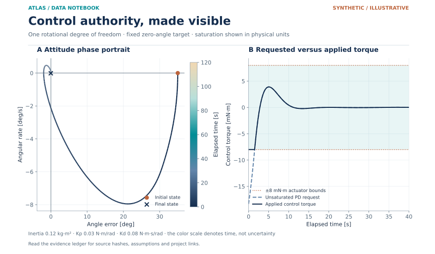

# Session I · Aerospace Technology

[Continuous handbook](../../handbooks/SESSION_I.md) · [All sessions](../README.md) · [Data atlas](../../data/README.md)

**13 projects · 104 defined fields · 77 proposed requirements · 53 specified cases.** All projects retain their supplied order. Data maps describe proposed acquisition, while included numerical plots carry their own evidence labels.

| ID | Mission name & engineering record | Original investigation | Explore |
| --- | --- | --- | --- |
| I01 | [SATURN TRANSIENT SHIELD](I01-saturn-transient-shield/README.md) | Rocket Development Lab Team: The Effects of Equivalence Ratio during shutdown of a rocket engine on hardware longevity | [Data](I01-saturn-transient-shield/data/README.md) · [Figures](I01-saturn-transient-shield/figures/README.md) |
| I02 | [APOLLO AQUATHERM](I02-apollo-aquatherm/README.md) | Rocket Development Lab Team: Thermal Management Analysis of Water-Cooled Rocket Engine | [Data](I02-apollo-aquatherm/data/README.md) · [Figures](I02-apollo-aquatherm/figures/README.md) |
| I03 | [SATURN CHANNEL ATLAS](I03-saturn-channel-atlas/README.md) | Rocket Development Lab Team: Cooling Channel Geometry Analysis for a Regeneratively Cooled Rocket Engine | [Data](I03-saturn-channel-atlas/data/README.md) · [Figures](I03-saturn-channel-atlas/figures/README.md) |
| I04 | [ORION SENTINEL CORE](I04-orion-sentinel-core/README.md) | EagleSat Team: On-board Computer Subsystem | [Data](I04-orion-sentinel-core/data/README.md) · [Figures](I04-orion-sentinel-core/figures/README.md) |
| I05 | [PIONEER AERODRIFT](I05-pioneer-aerodrift/README.md) | Pico Balloon Platform for Atmospheric Exploration | [Data](I05-pioneer-aerodrift/data/README.md) · [Figures](I05-pioneer-aerodrift/figures/README.md) |
| I06 | [SATURN LOADPATH](I06-saturn-loadpath/README.md) | Designing and Exploring the Structure of Launch Vehicles to Create Optimal Theoretical and Small-Scale Experimental Models | [Data](I06-saturn-loadpath/data/README.md) · [Figures](I06-saturn-loadpath/figures/README.md) |
| I07 | [GATEWAY CATSAT CONSOLE](I07-gateway-catsat-console/README.md) | CatSat Groundstation Command and Control | [Data](I07-gateway-catsat-console/data/README.md) · [Figures](I07-gateway-catsat-console/figures/README.md) |
| I08 | [VOYAGER FRAMEFORGE](I08-voyager-frameforge/README.md) | Julia 1.2 Ephemeris and Gravitational Modeling Development | [Data](I08-voyager-frameforge/data/README.md) · [Figures](I08-voyager-frameforge/figures/README.md) |
| I09 | [OSIRIS REGOLITH LEAPER](I09-osiris-regolith-leaper/README.md) | Simulation and Evaluation of a Mechanical Hopping Mechanism for Robotic Small Body Surface Exploration | [Data](I09-osiris-regolith-leaper/data/README.md) · [Figures](I09-osiris-regolith-leaper/figures/README.md) |
| I10 | [GEMINI POINTLOCK](I10-gemini-pointlock/README.md) | Spacecraft Attitude Control Implementation and Development | [Data](I10-gemini-pointlock/data/README.md) · [Figures](I10-gemini-pointlock/figures/README.md) |
| I11 | [HUBBLE SKYVAULT](I11-hubble-skyvault/README.md) | Measurements of the Sky | [Data](I11-hubble-skyvault/data/README.md) · [Figures](I11-hubble-skyvault/figures/README.md) |
| I12 | [PIONEER PHOBOS PATHFINDER](I12-pioneer-phobos-pathfinder/README.md) | Heuristic Optimization Applied to Orbital Transfers Between Low-Planetary Orbits and Distant Retrograde Orbits | [Data](I12-pioneer-phobos-pathfinder/data/README.md) · [Figures](I12-pioneer-phobos-pathfinder/figures/README.md) |
| I13 | [OSIRIS APOPHIS HORIZON](I13-osiris-apophis-horizon/README.md) | A Study of the Deflection of 99942 Apophis from Earth | [Data](I13-osiris-apophis-horizon/data/README.md) · [Figures](I13-osiris-apophis-horizon/figures/README.md) |

## Visual field guide

### I08 · VOYAGER FRAMEFORGE

Synthetic two-body conservation and refinement diagnostics from immutable model outputs. Panel A scales relative specific-energy error to parts per million and reports angular-momentum conservation for the stored 400-step-per-period run. Panel B compares three recorded maximum-energy errors with a second-order reference anchored to the coarsest run. This is an integration check, not trajectory prediction validation.

### I10 · GEMINI POINTLOCK

Synthetic one-axis PD attitude response and actuator authority. The phase portrait is colored by elapsed model time. Requested torque is reconstructed from the recorded states and sidecar gains; the applied torque is clipped to ±8 mN·m. The right panel focuses on the first 40 seconds, while the phase portrait uses the full 120-second record.

### I12 · PIONEER PHOBOS PATHFINDER

Synthetic two-body conservation and refinement diagnostics from immutable model outputs. Panel A scales relative specific-energy error to parts per million and reports angular-momentum conservation for the stored 400-step-per-period run. Panel B compares three recorded maximum-energy errors with a second-order reference anchored to the coarsest run. This is an integration check, not trajectory prediction validation.

### I13 · OSIRIS APOPHIS HORIZON

Synthetic two-body conservation and refinement diagnostics from immutable model outputs. Panel A scales relative specific-energy error to parts per million and reports angular-momentum conservation for the stored 400-step-per-period run. Panel B compares three recorded maximum-energy errors with a second-order reference anchored to the coarsest run. This is an integration check, not trajectory prediction validation.
